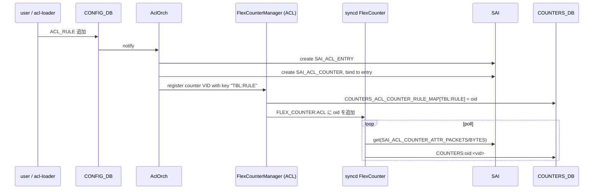
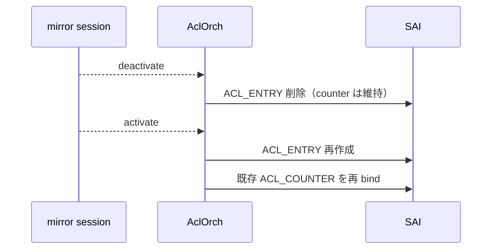

!!! warning "裏取りステータス: HLD-only"
    `AclOrch` の `m_acl_fc_mgr (FlexCounterManager)`、`COUNTERS_ACL_COUNTER_RULE_MAP` のキー命名、`counterpoll acl interval` の現行 CLI 文法、ミラー rule 再生成時の counter 維持ロジック、YANG `sonic-flex-counter` への ACL group 追加状況は実コードでの裏取り未済。

# ACL カウンタの flex counter 化（`ACL_COUNTER` + `COUNTERS_ACL_COUNTER_RULE_MAP`）

## 概要

ACL ルールごとの packet / byte counter は当初 **orchagent が 10 秒固定間隔で polling** していた[^1]。orchagent はシングルスレッドであり、ルール数が増えると counter 取得だけで長時間 main loop を専有し、他タスクの応答が遅延する。port / PG / queue / watermark 等で既に使われている **flex counter インフラ**（syncd 内で polling 専用スレッドを持ち、polling 間隔も `counterpoll` CLI で制御可能）を ACL counter にも適用するのが本 HLD の主旨[^1]。

要件[^1]:

- 大量 ACL rule を入れた状態で **orchagent の queue を空ける**（polling を syncd へ移譲）
- ユーザ設定 + `counterpoll` CLI で **enable/disable**
- polling interval を **1〜1000 秒** で変更可能

## 動作仕様

### SAI レベル

ACL counter は **`SAI_OBJECT_TYPE_ACL_COUNTER`** という独立オブジェクトで、`SAI_OBJECT_TYPE_ACL_ENTRY` に bind される[^1]:

| SAI 属性 | 用途 |
|----------|------|
| `SAI_ACL_COUNTER_ATTR_PACKETS` | packet 数 |
| `SAI_ACL_COUNTER_ATTR_BYTES` | byte 数 |

ACL rule 自体が動的に生成・削除されるため、flex counter manager は **動的 register / de-register** に対応する必要がある。

### orchagent

`AclOrch` に **`FlexCounterManager m_acl_fc_mgr;`** を持つ。`StatsMode::READ`、初期 polling 間隔 10 秒、default enable[^1]:

```c++
FlexCounterManager m_acl_fc_mgr;
// 初期化: ACL group, READ mode, 10s 間隔, enabled
```

`flex_counter_manager.h` には ACL 用の counter type を新設する[^1]:

```c++
CounterType::ACL_COUNTER
```

### COUNTERS_DB

#### counter 値テーブル

`COUNTERS:oid:<acl_counter_vid>` に packet / byte 値が積まれる[^1]:

```text
127.0.0.1:6379[2]> hgetall COUNTERS:oid:0x100000000037a
1) "SAI_ACL_COUNTER_ATTR_PACKETS"  2) "100"
3) "SAI_ACL_COUNTER_ATTR_BYTES"    4) "102400"
```

#### ACL_RULE → counter VID マッピング

flex counter は OID で値を持つだけなので、CLI から「ACL_TABLE × ACL_RULE 名」で引くために専用マップを置く[^1]:

```text
COUNTERS_ACL_COUNTER_RULE_MAP
  key   = "<ACL_TABLE_NAME>:<ACL_RULE_NAME>"   # 例: "L3_TABLE:RULE0"
  value = ACL counter の VID                  # 例: "oid:0x100000000037a"
```

### CLI

#### `aclshow`

`aclshow` は `CONFIG_DB.ACL_RULE` を起点に、`COUNTERS_ACL_COUNTER_RULE_MAP` で VID を引き、`COUNTERS:oid:<vid>` から packet/byte を取得する[^1]:

```text
admin@sonic:~$ aclshow -a
RULE NAME     TABLE NAME      PRIO    PACKETS COUNT    BYTES COUNT
RULE_1        DATAACL         9999              101            100
...
```

例外処理[^1]:

- map に entry が無い → `N/A`（counter 無し / orchagent が rule を作っていない / map がまだ書かれていない）
- map に VID はあるが `COUNTERS_DB` に値が無い → `N/A`（polling 無効、または syncd がまだ書いていない）

#### `sonic-clear acl`

`sonic-clear acl` で counter をクリアする[^1]。実装は **`/home/admin` 配下にダンプを書き**、次回 `aclshow` 実行時に「ダンプとの差分」を表示する。これにより **ユーザごとの独立した clear 状態** を保つ（他 counter group と共通の方式）。

#### `counterpoll acl`

```bash
counterpoll acl enable
counterpoll acl disable      # ASIC 上の counter object は維持される
counterpoll acl interval <ms>
```

### `CONFIG_DB.FLEX_COUNTER_TABLE`

```json
{
  "FLEX_COUNTER_TABLE": {
    "ACL": {
      "FLEX_COUNTER_STATUS": "enable",
      "POLL_INTERVAL": "10000"
    }
  }
}
```

### YANG

`sonic-flex-counter` に ACL group が追加される[^1]:

```yang
container ACL {
    /* ACL_FLEX_COUNTER_GROUP */
    leaf FLEX_COUNTER_STATUS {
        type flex_status;
    }
}
```

HLD 当時 **YANG に `POLL_INTERVAL` フィールドは未定義**[^1]。

### create / delete フロー



エラー時は best-effort で **rollback**（作成済みオブジェクト削除 + `m_toSync` から該当タスクを除去）し、syslog にログを残す[^1]。

### mirror rule の特別扱い

mirror rule は **mirror session が deactivate されると ACL rule 側も削除される**。素直に counter も削除すると **session 再 activate 時に counter が 0 リセットされる** ため、ユーザ視点で値が飛ぶ。HLD の解は[^1]:

- **counter は削除しない**。session deactivate 時には ACL rule (entry) からの bind だけ外す
- session 再 activate で entry を作り直し、**同じ counter object を再 attach** する



これで session のフラップ間で counter 値が保たれる。

### syncd

`syncd/FlexCounter.cpp` に **ACL group のサポート** を追加する[^1]。既存 group と同様、別スレッドで間隔ベース polling する。

## 設定

### 関連する CONFIG_DB

| Table | Key | 説明 |
|-------|-----|------|
| `FLEX_COUNTER_TABLE` | `ACL` | ACL counter group の `FLEX_COUNTER_STATUS` / `POLL_INTERVAL` |

### 関連する COUNTERS_DB

| Table | Key | 説明 |
|-------|-----|------|
| `COUNTERS:oid:<vid>` | (hash) | `SAI_ACL_COUNTER_ATTR_PACKETS/BYTES` 値 |
| `COUNTERS_ACL_COUNTER_RULE_MAP` | `<table>:<rule>` | ACL counter の VID マッピング |

### 関連する CLI

| Command | 用途 |
|---------|------|
| `counterpoll acl enable` | ACL counter polling を有効化 |
| `counterpoll acl disable` | polling 無効化（ASIC の counter 自体は残る） |
| `counterpoll acl interval <ms>` | polling 間隔（1〜1000 秒）を変更 |
| `aclshow [-a]` | rule ごとの packet / byte 表示 |
| `sonic-clear acl` | counter クリア（ユーザごとの dump 差分方式） |

### 設定例

```bash
counterpoll acl enable
counterpoll acl interval 5000
aclshow -a
sonic-clear acl
```

## 制限事項

- HLD 本文に `Restrictions/Limitations: N/A`[^1] と明記されているが、関連する Open Items として:
    - **default で enabled** にするかは未決定（`init_cfg.json` で disable し minigraph 由来時のみ enable する案あり）[^1]
    - mirror session deactivation 時の counter 維持は **「polling は続いているが意味のある増分は無い」** 状態（PORT/QUEUE の admin-down と同じトレードオフ）[^1]
    - flex counter インフラは **OID 単位で polling on/off + 値保持** を分離できない[^1]
- counter 削除なしの設計で **動的 ACL rule の規模が大きいほど COUNTERS_DB の VID 残量が増える**

## 干渉する機能

- **`AclOrch`**: `m_acl_fc_mgr` を持ち、register/de-register を担う
- **`syncd FlexCounter`**: ACL group 追加で polling 対象が増える
- **`mirror session 管理`**: counter を残す特別扱いを誘発
- **`counterpoll` CLI**: ACL group が CLI に追加される
- **warm boot / fast boot**: 起動時に counter polling は **遅延** する[^1]

## トラブルシューティング

- `aclshow` で `N/A` が出る → `redis-cli -n 2 hgetall COUNTERS_ACL_COUNTER_RULE_MAP` で map 有無を確認
- counter が更新されない → `counterpoll show` で ACL group の status と interval を確認、`FLEX_COUNTER_TABLE|ACL` の `FLEX_COUNTER_STATUS=enable` か確認
- mirror flap で counter がリセット → 「counter detach 方式」が正しく実装されているか syslog の orchagent ログを確認

## 引用元

[^1]: `sonic-net/SONiC` `doc/acl/ACL-Flex-Counters.md` @ `49bab5b5ff0e924f1ea52b3d9db0dfa4191a7c06`

<!-- concerns hint:
- AclOrch::m_acl_fc_mgr の現行 master 実装存在確認
- COUNTERS_ACL_COUNTER_RULE_MAP のキー名と区切り文字確認
- counterpoll acl interval の単位（HLD 内で sec / ms が混在）の現行 CLI 実装確認
- mirror deactivate 時の counter detach ロジック実装確認
- sonic-flex-counter YANG の ACL container 取り込み状況
-->
