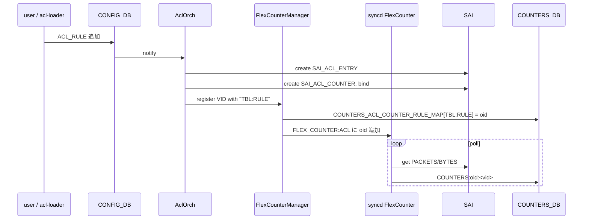
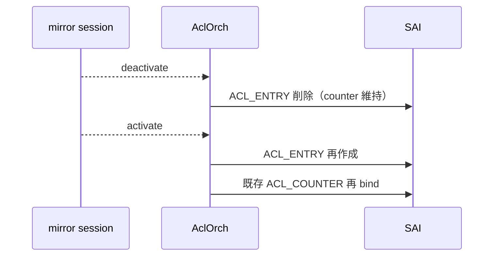

<!-- topics-tip -->
!!! tip "Topics で読み物として読む"
    この HLD は実装詳細を含みます。機能の概念・設定・運用を読み物として読みたい場合は [Topics 07 章: ACL / CoPP / Mirror](../topics/07-acl-copp-mirror/index.md) を参照。
<!-- /topics-tip -->

!!! success "裏取りステータス: code-verified（命名差分あり）"
    現行 master で実装を確認: `sonic-swss/orchagent/aclorch.cpp` に `COUNTERS_ACL_COUNTER_RULE_MAP` 定義 (L45)、`ACL_COUNTER_DEFAULT_POLLING_INTERVAL_MS=10000`, `ACL_COUNTER_FLEX_COUNTER_GROUP` 経由の登録 (L4209)、SAI ACL counter 属性マッピング (L517-518)、CRM 連動 (L1940/L1982)。`sonic-utilities/counterpoll/main.py` に `counterpoll acl` グループと `acl interval/enable/disable` (L361-)、`sonic-utilities/scripts/aclshow` も存在。`sonic-buildimage/src/sonic-yang-models/yang-models/sonic-flex_counter.yang` L363 に `container ACL`（コメントで `ACL_STAT_COUNTER_FLEX_COUNTER_GROUP` を明示）。**HLD で言及される `m_acl_fc_mgr` メンバ名は実装上は generic な `m_flex_counter_manager`** (verified at: 2026-05-09)。

# ACL カウンタの flex counter 化（`ACL_COUNTER` + `COUNTERS_ACL_COUNTER_RULE_MAP`）

## これは何か（一行で）

[ACL](../reference/glossary.md#term-acl) ルール per packet/byte counter の polling を **[orchagent](../reference/glossary.md#term-orchagent) から [syncd](../reference/glossary.md#term-syncd) の flex counter へ移譲** し、polling 間隔を `counterpoll` CLI で制御できるようにする[^1]。

## なぜ移譲したか

ACL counter は当初 orchagent が 10 秒固定間隔で polling していた。orchagent はシングルスレッドなので、ルール数が増えると main loop を counter 取得で長時間専有し、他タスクの応答が遅延する。**port / PG / queue / watermark で既に使われている flex counter インフラ** に乗せれば polling は syncd の専用スレッドが担う[^1]。

要件[^1]:

- 大量 ACL rule で **orchagent の queue を空ける**
- ユーザ設定 + `counterpoll` CLI で **enable/disable**
- polling interval を **1〜30 秒（1000〜30000 ms）** で変更可能（HLD 原文は「1〜1000 秒」だが現行実装は 1〜30 秒）

## SAI レベル

ACL counter は `SAI_OBJECT_TYPE_ACL_COUNTER` という独立オブジェクトで、`SAI_OBJECT_TYPE_ACL_ENTRY` に bind される[^1]:

| [SAI](../reference/glossary.md#term-sai) 属性 | 用途 |
|----------|------|
| `SAI_ACL_COUNTER_ATTR_PACKETS` | packet 数 |
| `SAI_ACL_COUNTER_ATTR_BYTES` | byte 数 |

ACL rule が動的に生成・削除されるため、flex counter manager は **動的 register / de-register** に対応する。

## orchagent

`AclOrch` に `FlexCounterManager`（[HLD](../reference/glossary.md#term-hld) では `m_acl_fc_mgr`、実装は generic な `m_flex_counter_manager`）を持つ。`StatsMode::READ`、初期 polling 間隔 10 秒、default enable[^1]。`flex_counter_manager.h` に `CounterType::ACL_COUNTER` を新設[^1]。

## COUNTERS_DB

**counter 値**は OID 単位:

```text
127.0.0.1:6379[2]> hgetall COUNTERS:oid:0x100000000037a
1) "SAI_ACL_COUNTER_ATTR_PACKETS"  2) "100"
3) "SAI_ACL_COUNTER_ATTR_BYTES"    4) "102400"
```

CLI から「テーブル名×ルール名」で引くために専用マップを置く[^1]:

```text
COUNTERS_ACL_COUNTER_RULE_MAP
  key   = "<ACL_TABLE_NAME>:<ACL_RULE_NAME>"   # 例: "L3_TABLE:RULE0"
  value = ACL counter の VID                  # 例: "oid:0x100000000037a"
```

## create / delete フロー



エラー時は best-effort で **rollback**（作成済みオブジェクト削除 + `m_toSync` から該当タスクを除去）して syslog にログ[^1]。

## mirror rule の特別扱い

mirror session が deactivate されると ACL rule 側も削除される。そのまま counter も削除すると **session 再 activate 時に counter が 0 にリセット** されるため、ユーザ視点で値が飛ぶ。解[^1]:

- **counter は削除しない**。session deactivate 時には ACL entry からの bind だけ外す
- session 再 activate で entry を作り直し、**同じ counter object を再 attach**



session フラップ間で counter 値が保たれる。

## CLI

| Command | 用途 |
|---------|------|
| `counterpoll acl enable` | ACL counter polling を有効化 |
| `counterpoll acl disable` | polling 無効化（[ASIC](../reference/glossary.md#term-asic) の counter 自体は残る） |
| `counterpoll acl interval <ms>` | polling 間隔（1〜30 秒 / 1000〜30000 ms）を変更 |
| `aclshow [-a]` | rule ごとの packet / byte 表示 |
| `sonic-clear acl` | counter クリア（ユーザごとの dump 差分方式） |

`aclshow` の例外処理[^1]:

- map に entry なし → `N/A`（counter 未作成 / map 未書込）
- map に VID あるが [COUNTERS_DB](../reference/glossary.md#term-counters_db) に値なし → `N/A`（polling 無効 / syncd 未書込）

`sonic-clear acl` は `/home/admin` 配下にダンプを書き、次回 `aclshow` 実行時にダンプ差分を表示する **ユーザごとの clear 状態** 方式（他 counter group と共通）[^1]。

```text
admin@sonic:~$ aclshow -a
RULE NAME     TABLE NAME      PRIO    PACKETS COUNT    BYTES COUNT
RULE_1        DATAACL         9999              101            100
```

## 設定

### CONFIG_DB

```json
{
  "FLEX_COUNTER_TABLE": {
    "ACL": { "FLEX_COUNTER_STATUS": "enable", "POLL_INTERVAL": "10000" }
  }
}
```

### COUNTERS_DB

| Table | Key | 説明 |
|-------|-----|------|
| `COUNTERS:oid:<vid>` | hash | `SAI_ACL_COUNTER_ATTR_PACKETS/BYTES` |
| `COUNTERS_ACL_COUNTER_RULE_MAP` | `<table>:<rule>` | ACL counter VID マップ |

### YANG

`sonic-flex-counter` に ACL group が追加される[^1]:

```yang
container ACL {
    leaf FLEX_COUNTER_STATUS { type flex_status; }
}
```

HLD 当時 **[YANG](../reference/glossary.md#term-yang) に `POLL_INTERVAL` 未定義**[^1]。

### syncd

`syncd/FlexCounter.cpp` に ACL group のサポートを追加[^1]。既存 group と同様、別スレッドで間隔ベース polling。

## 設定例

```bash
counterpoll acl enable
counterpoll acl interval 5000
aclshow -a
sonic-clear acl
```

## 制限事項

- HLD 本文に `Restrictions/Limitations: N/A`[^1] と明記。ただし Open Items として:
    - **default で enabled** にするか未決定（`init_cfg.json` で disable → minigraph 由来時のみ enable する案）[^1]
    - mirror deactivation 時の counter 維持は「polling は続くが意味のある増分は無い」状態（PORT/QUEUE admin-down と同じトレードオフ）[^1]
    - flex counter インフラは **OID 単位で polling on/off + 値保持** を分離できない[^1]
- counter 削除なし設計で、動的 ACL rule 規模が大きいほど COUNTERS_DB の VID 残量が増える

## 干渉する機能

- **`AclOrch`**: `FlexCounterManager` を持ち register/de-register を担う
- **`syncd FlexCounter`**: ACL group 追加で polling 対象が増える
- **mirror session 管理**: counter を残す特別扱いを誘発
- **`counterpoll` CLI**: ACL group が追加
- **warm boot / fast boot**: 起動時に counter polling が遅延する[^1]

## トラブルシューティング

- `aclshow` で `N/A` → `redis-cli -n 2 hgetall COUNTERS_ACL_COUNTER_RULE_MAP` で map 有無を確認
- counter が更新されない → `counterpoll show` で ACL group の status と interval、`FLEX_COUNTER_TABLE|ACL` の status を確認
- mirror flap で counter リセット → 「counter detach 方式」が正しく動いているか syslog で確認

確認コマンド例:

```bash
# ACL counter / map / poll status をまとめて確認
aclshow -a
counterpoll show | grep -i acl
redis-cli -n 2 hgetall COUNTERS_ACL_COUNTER_RULE_MAP
redis-cli -n 4 hgetall 'FLEX_COUNTER_TABLE|ACL'
```

## 関連ページ

- [ACL in SONiC](./acl-in-sonic.md)
- [Show ACL Status Enhancements](./enhancements-on-show-acl-commands.md)
- [SONiC Port Mirroring HLD](./sonic-port-mirroring-hld.md)

## 引用元

[^1]: `sonic-net/SONiC` `doc/acl/ACL-Flex-Counters.md` @ `49bab5b5ff0e924f1ea52b3d9db0dfa4191a7c06`

<!-- concerns hint:
- AclOrch::m_acl_fc_mgr の現行 master 実装存在確認
- COUNTERS_ACL_COUNTER_RULE_MAP のキー名と区切り文字確認
- counterpoll acl interval の単位（HLD 内で sec / ms が混在）の現行 CLI 実装確認
- mirror deactivate 時の counter detach ロジック実装確認
- sonic-flex-counter YANG の ACL container 取り込み状況
-->

<!-- topics-back-ref -->
## 関連 Topics

- [Topics: ACL / CoPP / Mirror / Packet Action](../topics/07-acl-copp-mirror/index.md)

<!-- /topics-back-ref -->

<!-- glossary-links-injected: c006405759d8 -->
