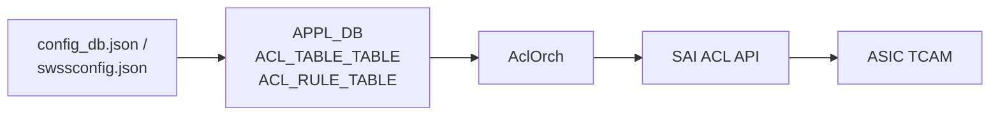

<!-- topics-tip -->
!!! tip "Topics で読み物として読む"
    この HLD は実装詳細を含みます。機能の概念・設定・運用を読み物として読みたい場合は [Topics 07 章: ACL / CoPP / Mirror](../topics/07-acl-copp-mirror/index.md) を参照。
<!-- /topics-tip -->

!!! success "裏取りステータス: code-verified (2026-05-10)"
    `sonic-swss/orchagent/aclorch.cpp` / `aclorch.h` / `acltable.h` で AclOrch 本体が実装。APPL_DB の `ACL_TABLE_TABLE` / `ACL_RULE_TABLE` は `sonic-swss-common/common/schema.h:94,96` で `APP_ACL_TABLE_TABLE_NAME` として定義。後発の DASH ACL は `APP_DASH_ACL_RULE_TABLE_NAME` (schema.h:178) として別系統で共存。

# ACL in SONiC（テーブル型 / マッチ・アクション / SWSS パイプライン）

読み手が真っ先に知りたいのは「[SONiC](../reference/glossary.md#term-sonic) の [ACL](../reference/glossary.md#term-acl) はどの単位で書き、どこを経由して [TCAM](../reference/glossary.md#term-tcam) に降りるのか」「どの type なら何が match / action できるのか」「動的に CLI で追加した rule と起動時の静的 JSON はどう統合されるのか」の 3 点だろう。以下、その順に答える。

## ACL はどの単位で書くのか

SONiC の ACL は **table（型を持つ）+ rule** の二層構造。table の **type** で許される match / action と bind 先（port / [LAG](../reference/glossary.md#term-lag) / [VLAN](../reference/glossary.md#term-vlan) / switch）が決まる[^1]。

主な type:

- `L3` / `L3v6`: ingress IPv4 / IPv6 ACL
- `MIRROR` / `MIRRORV6`: ingress traffic を mirror
- `PFCWD`, `EVERFLOW`, `DROP`, `MUX`: 用途別の派生 type（[HLD](../reference/glossary.md#term-hld) 本体は基礎のみ記述、後発で追加）
- カスタム: Rev 1.1 (2025-04) で **[VXLAN](../reference/glossary.md#term-vxlan) inner src MAC rewrite** 用 type が追加[^1]

[CONFIG_DB](../reference/glossary.md#term-config_db) のキーは次の 2 つだけ。

```text
ACL_TABLE|<table_name>
  type   = "L3" | "L3v6" | "MIRROR" | ...
  ports  = "Ethernet0,PortChannel001,..."   # bind 対象
  stage  = "ingress" | "egress"

ACL_RULE|<table_name>|<rule_name>
  PRIORITY      = <int>
  PACKET_ACTION = "DROP" | "FORWARD"
  SRC_IP / DST_IP / IP_PROTOCOL / L4_*_PORT / ETHER_TYPE / TCP_FLAGS / IN_PORTS …
```

## CLI → ASIC まで何が起きるのか

CONFIG_DB → [APPL_DB](../reference/glossary.md#term-appl_db) → AclOrch → [SAI](../reference/glossary.md#term-sai) [Redis](../reference/glossary.md#term-redis) → [ASIC_DB](../reference/glossary.md#term-asic_db) → [syncd](../reference/glossary.md#term-syncd) → SAI → [ASIC](../reference/glossary.md#term-asic) TCAM、というスタックを通る[^1]。



経路の入口は 2 つ。

- 動的: `config acl ...` CLI が CONFIG_DB → APPL_DB
- 静的: `swssconfig <file.json>` が JSON を APPL_DB に直接流す（`OP=SET|DEL`）

どちらも APPL_DB に着いた時点で AclOrch が subscribe して同じ経路で SAI に降ろす[^1]。

## type ごとに何が match / action できるのか

table の **type が match / action 集合を固定** する[^1]。代表例:

| Type | 主な match | 主な action |
|------|-----------|-------------|
| `L3` | `SRC_IP`, `DST_IP`, `IP_PROTOCOL`, `L4_*_PORT`, `ETHER_TYPE`, `TCP_FLAGS`, `IN_PORTS` | `PACKET_ACTION=FORWARD/DROP`, counter, ranges |
| `L3v6` | 同上 + IPv6 | 同上 |
| `MIRROR` | L3 と同種 + ranges | `MIRROR_INGRESS_ACTION` |
| custom (VXLAN inner src MAC rewrite) | inner header フィールド | inner src MAC rewrite[^1] |

type を後から変える運用は不可。`egress` ステージは ASIC によって match set が大きく狭まる。ベンダ SAI の対応範囲はバラつくので `SWITCH_CAPABILITY` で capability query するのが推奨。

## Mirror table の特殊事情

Mirror テーブルは `MIRROR_SESSION` の状態に追従する。session が ready でないときは ACL rule も effective にならない[^1]。

## Phase 構成（HLD の歴史）

HLD は実装を 3 phase に分けていた[^1]:

- Phase 1: L3 / Mirror table, 基本 match / action, create/delete
- Phase 2: counter, table/rule update, 動的反映
- Phase 3: ranges, port/LAG bind, mirror 細部

現行 master では全 phase が入っている前提で運用してよいが、SAI 側の対応範囲は ASIC 依存。

<!-- evidence:
source: sonic-net/SONiC/doc/acl/ACL-High-Level-Design.md#L83-L91 (sha: 49bab5b5ff0e924f1ea52b3d9db0dfa4191a7c06)
excerpt: |
  | 1.1 | 08-Apr-2025 | Anish Narsian | VXLAN inner src mac rewrite support |
reasoning: Rev 1.1 で VXLAN inner src MAC rewrite が追加されたことの根拠。
-->

<!-- evidence-rendered:start -->
??? note "📋 検証エビデンス: sonic-net/SONiC/doc/acl/ACL-High-Level-Design.md#L83-L91 (sha: 49bab5b5ff0e924f1ea52b3d9db0dfa4191a7c06)"

    **出典**:

    `sonic-net/SONiC/doc/acl/ACL-High-Level-Design.md#L83-L91 (sha: 49bab5b5ff0e924f1ea52b3d9db0dfa4191a7c06)`

    **抜粋**:

    ```text
    | 1.1 | 08-Apr-2025 | Anish Narsian | VXLAN inner src mac rewrite support |
    ```

    **判断根拠**: Rev 1.1 で VXLAN inner src MAC rewrite が追加されたことの根拠。

<!-- evidence-rendered:end -->

## 設定例とトラブルシューティング

```bash
config acl add table BLACKLIST L3 -p Ethernet0,Ethernet4 -s ingress
config acl add rule BLACKLIST DENY_BAD --priority 10 \
  --src-ip 192.0.2.0/24 --action DROP
aclshow -a
```

CONFIG_DB / APPL_DB / ASIC_DB / capability を見るコマンド:

```bash
redis-cli -n 4 KEYS "ACL_TABLE|*"
redis-cli -n 0 KEYS "ACL_*"
redis-cli -n 1 KEYS "ASIC_STATE:SAI_OBJECT_TYPE_ACL_*" | head
redis-cli -n 6 HGETALL "SWITCH_CAPABILITY|switch" | grep -i ACL
```

CLI 一覧:

| Command | 用途 |
|---------|------|
| `config acl add table <name> <type>` | table 作成 |
| `config acl add rule <table> <rule>` | rule 追加 |
| `config acl remove ...` | 削除 |
| `aclshow [-a] [-t <table>] [-r <rule>]` | hit カウンタ |
| `swssconfig <file.json>` | 静的 ACL ロード |

## 既知の問題

### ACL のデフォルト deny は自動で機能しない（#269）

JSON 設定または `config acl` CLI で ACL ルールを定義した場合、**暗黙の default deny は存在しない**。明示的な forward ルールがある場合、それ以外のトラフィックは許可されてしまう。

default deny を実現するには、**最低優先度（最小の PRIORITY 値）の catch-all DROP ルール**を明示的に追加する必要がある（SONiC では PRIORITY 値が小さいほど低優先度＝最後に評価される）。

```json
"ACL_RULE": {
    "TABLE_NAME|CATCH_ALL": {
        "PRIORITY": "1",
        "IP_TYPE": "ipv4any",
        "PACKET_ACTION": "DROP"
    }
}
```

PRIORITY 値が**小さいほど低優先度**（最後に評価）となるため、catch-all を最小値（例: `1`、`acl_loader` の `min_priority`）に設定することで他のルールが先に評価される。`acl_loader` は先頭ルールほど大きい PRIORITY 値（`max_priority - rule_idx`）を割り当て、DEFAULT_RULE には `min_priority=1` を割り当てる。IPv6 トラフィックに対しても別途 `IP_TYPE: ipv6any` のルールが必要。

- 参照: [sonic-net/SONiC#269](https://github.com/sonic-net/SONiC/issues/269)

### MIRRORV6 ACL では `IPV6_NEXT_HEADER` キーがサポートされていない制約（sonic-buildimage#4570）

MIRRORV6 ACL では `IPV6_NEXT_HEADER` キーがサポートされていない制約。IPv6 ミラーリング ACL の設定時は対応フィールドを事前確認すること

- 参照: [sonic-net/sonic-buildimage#4570](https://github.com/sonic-net/sonic-buildimage/issues/4570)

### aclshow ユーティリティがコントロールプレーン ACL のカウンターを表示しない制約（sonic-buildimage#5015）

aclshow ユーティリティがコントロールプレーン ACL のカウンターを表示しない制約。iptables ベースの COPP ACL は `iptables -L -n -v` で確認すること

- 参照: [sonic-net/sonic-buildimage#5015](https://github.com/sonic-net/sonic-buildimage/issues/5015)

### COPP に ~350 個のルールを設定すると iptables への適用に 10 分以上かかる制約（sonic-buildimage#5275）

COPP に ~350 個のルールを設定すると iptables への適用に 10 分以上かかる制約。大量の COPP ルールは起動時間に大きく影響するため、ルール数を最小化すること

- 参照: [sonic-net/sonic-buildimage#5275](https://github.com/sonic-net/sonic-buildimage/issues/5275)

### warm reboot 後にミラーリングルールの適用が失敗する問題（sonic-buildimage#5497）

warm reboot 後にミラーリングルールの適用が失敗する問題。ミラー宛先ポートの再設定が warm reboot 後に正しく実行されない場合がある

- 参照: [sonic-net/sonic-buildimage#5497](https://github.com/sonic-net/sonic-buildimage/issues/5497)

## 干渉する機能

- **Mirror セッション**: Mirror table は `MIRROR_SESSION` と密結合
- **EVERFLOW / [DSCP](../reference/glossary.md#term-dscp)-based mirror**: Mirror 上に積み重ねる別 HLD
- **PFCWD / DROP / [MUX](../reference/glossary.md#term-mux)**: 同じ ACL_TABLE 機構を type 違いで再利用
- **ACL Flex Counters**: Phase 2 から導入
- **port / LAG**: `ports` で bind。LAG 解体時の rebind は AclOrch 側ロジック

## 関連トピック

- [Topics: ACL / CoPP / Mirror](../topics/07-acl-copp-mirror/index.md)

## 関連ページ

- [ACL Flex Counters Support](./acl-flex-counters-support.md)
- [SONiC Port Mirroring HLD](./sonic-port-mirroring-hld.md)

## 制限事項

- **ASIC TCAM 容量に直結**: ACL_TABLE / ACL_RULE は SAI 経由で TCAM を消費する。`CRM` (Critical Resource Monitor) で `acl_table` / `acl_entry` / `acl_counter` のしきい値超過時、新規 rule 追加は失敗する。
- **type ごとの match / action 制約**: `L3` / `L3V6` / `MIRROR` / `MIRRORV6` / `PFCWD` / `DROP` / `MUX` で利用できる match field と action は異なる。ベンダー SAI 実装によっては HLD で許される組み合わせの一部が未対応。
- **bind 対象の単位**: `ports` で port または LAG を指定する。VLAN / subinterface 単位の bind は type とプラットフォーム依存で、HLD は port / LAG を主とする。
- **Flex Counter 連動**: counter 取得には `FLEX_COUNTER_TABLE` で `ACL` を `enable` にする必要がある。無効時は `aclshow` / `show acl rule` のカウンタが 0 のままになる。
- **ACL_TABLE の再 bind タイミング**: LAG 解体 / 再構成や Mux active/standby 切替時の rebind 中は短時間 ASIC 上のルールが消える可能性があり、実時間保証はない。
- **`SAI_STATUS_INSUFFICIENT_RESOURCES` 時のリトライ優先度** ([sonic-swss#4406](https://github.com/sonic-net/sonic-swss/issues/4406)): `handleSai` が SAI_STATUS_INSUFFICIENT_RESOURCES を受け取った際に ACL ACE のリトライキューが蓄積し、ルートプログラミングよりも優先されてしまう問題がある。高負荷時に ACL エントリの追加が失敗し続ける環境では、[orchagent](../reference/glossary.md#term-orchagent) が本来のルート更新より ACL リトライを繰り返すことでルート収束が遅延する可能性がある。
- **`TABLE_TYPE_MIRRORV6` の IN_PORTS 非サポート** ([sonic-swss#2204](https://github.com/sonic-net/sonic-swss/issues/2204)): `MIRRORV6` テーブルタイプでは `IN_PORTS` マッチフィールドが実装されていない。IPv6 ミラーセッションで入力ポートを限定したい場合は `MIRRORV6` が使えない制約がある。

## 引用元

[^1]: `sonic-net/SONiC` `doc/acl/ACL-High-Level-Design.md` @ `49bab5b5ff0e924f1ea52b3d9db0dfa4191a7c06`

<!-- topics-back-ref -->
## 関連 Topics

- [Topics: ACL / CoPP / Mirror / Packet Action](../topics/07-acl-copp-mirror/index.md)

<!-- /topics-back-ref -->

<!-- glossary-links-injected: 9ec82de25883 -->
