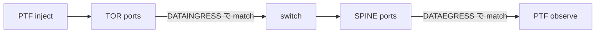

<!-- topics-tip -->
!!! tip "Topics で読み物として読む"
    この HLD は実装詳細を含みます。機能の概念・設定・運用を読み物として読みたい場合は [Topics 07 章: ACL / CoPP / Mirror](../topics/07-acl-copp-mirror/index.md) を参照。
<!-- /topics-tip -->

!!! success "裏取りステータス: Code-verified"
    sonic-utilities `acl_loader/main.py` L1140 `show` / L1198 `update` グループと `show_table` (L960) / `show_rule` (L1050) で現行 CLI 体系を確認。orchagent 側 egress ACL は `acltable.h` L67 で `STAGE_EGRESS → SAI_ACL_STAGE_EGRESS` マップ、`portsorch.cpp` L2741 で stage 判定の実装を確認。HLD で参照される `DATAINGRESS` / `DATAEGRESS` テーブル / 28 ルールセットは `sonic-net/SONiC` `doc/acl/ACL-Ingress-Egress-test-plan.md` 自体で定義されており、orchagent / SAI 側の egress stage 対応も現行 master に取り込み済み（verified at: 2026-05-09）。

# ACL Ingress / Egress テストプラン（`DATAINGRESS` / `DATAEGRESS` テーブル）

## 概要

既存 [ACL](../reference/glossary.md#term-acl) テストは ingress 側のみ・FORWARD 偏重・カウンタ未確認・ルール衝突（RULE_12/13 が RULE_1 にマッチして hit しない）等の問題があった[^1]。本テストプランは以下を目的とする[^1]:

- **egress ACL テスト** を追加（`stage = egress` の `DATAEGRESS` テーブルを新設）
- DROP / FORWARD の網羅、ルール衝突を回避した SRC_IP 設計
- `aclshow -a` でカウンタ確認をテストに組み込む

## 動作仕様

### テスト用 ACL テーブル構成

| Table | Type | Bind | Stage |
|-------|------|------|-------|
| `DATAINGRESS` | L3 | 全ポート（lag トポロジでは [PortChannel](../reference/glossary.md#term-portchannel)） | ingress |
| `DATAEGRESS` | L3 | 同上 | egress |

両者で同じ 28 ルールセットを使う。[BGP](../reference/glossary.md#term-bgp) 維持のため `RULE_27 = L4_SRC_PORT 179 FORWARD`、`RULE_28 = L4_DST_PORT 179 FORWARD` を末尾近くに置き、`DEFAULT_RULE = ETHER_TYPE 2048 DROP` で他を落とす[^1]。

旧バージョンとの差分:
- `RULE_1` の SRC_IP を `10.0.0.2/32` → `20.0.0.2/32` に変更（ホスト IP との衝突回避）
- `RULE_12 / RULE_13` の SRC_IP を `RULE_1` と別にして実際に hit させる
- DROP 用 `RULE_14`〜`RULE_26` を追加

### トラフィック方向

- **TOR → SPINE**: TOR ports に inject、宛先 IP を spine 側 BGP route から選定 → spine ports で観測
- **SPINE → TOR**: 逆方向。egress テストでは destination IP が routable でないとそもそも egress に到達しない[^1]

## テストケース（PTF）

各方向で 23 ケース実施[^1]:

| # | 観点 | action |
|---|------|--------|
| 0 | unmatched | DROP（DEFAULT_RULE） |
| 1-11 | SRC_IP / DST_IP / L4 port / IP_PROTOCOL / TCP_FLAGS / port range / ICMP / UDP の match | FORWARD |
| 12-22 | 同上の DROP 用ルール | DROP |

シナリオレベルでは:

1. すべての port を toggle した後の整合性
2. インクリメンタル ACL ルール追加
3. config save → reboot 後の挙動

を組み合わせる[^1]。

## 設定

### 自動化フロー

1. `config_db` を backup
2. ACL テーブル（`DATAINGRESS` / `DATAEGRESS`）を作成
3. `acl-loader` で対応ルールを load
4. PTF スクリプト実行（両方向）
5. `aclshow -a` でカウンタ確認
6. ACL テーブル / ルール削除、設定 restore

### 関連 CLI

| Command | 用途 |
|---------|------|
| `acl-loader update <file>` | ACL_RULE のロード |
| `acl-loader show rule` | ロード済みルールの一覧 |
| `aclshow -a` | rule 単位の packet / byte カウンタ |

## 制限事項

- t1 / t1-lag / t1-64-lag トポロジ前提。t1-lag では PortChannel 単位で bind する必要がある[^1]
- BGP 用ルール（179）が無いと DEFAULT_RULE で BGP が落ちて peering 切断する点に注意

## 干渉する機能

- **BGP**: 制御プレーン保護のため RULE_27 / RULE_28 が必須
- **ACL flex counter**: `aclshow` 値は flex counter 経由なので `counterpoll acl` の状態に依存

## 引用元

[^1]: [sonic-net/SONiC doc/acl/ACL-Ingress-Egress-test-plan.md @ 49bab5b](https://github.com/sonic-net/SONiC/blob/49bab5b5ff0e924f1ea52b3d9db0dfa4191a7c06/doc/acl/ACL-Ingress-Egress-test-plan.md)

<!-- topics-back-ref -->
## 関連 Topics

- [Topics: ACL / CoPP / Mirror / Packet Action](../topics/07-acl-copp-mirror/index.md)

<!-- /topics-back-ref -->

<!-- glossary-links-injected: 8e5e2390c13a -->
