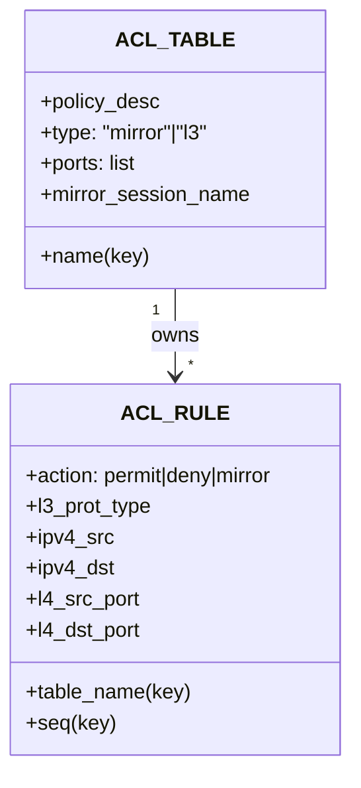
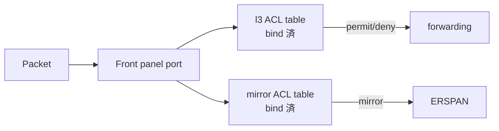
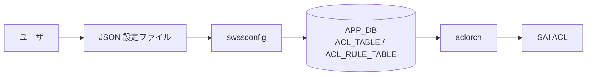

<!-- topics-tip -->
!!! tip "Topics で読み物として読む"
    この HLD は実装詳細を含む。機能の概念・設定・運用を読み物として読みたい場合は [Topics 07 章: ACL / CoPP / Mirror](../topics/07-acl-copp-mirror/index.md) を参照。
<!-- /topics-tip -->

!!! success "裏取りステータス: code-verified（基本構成のみ）"
    現行 master の `sonic-swss/orchagent/aclorch.cpp` で **byte counter** (`SAI_ACL_COUNTER_ATTR_ENABLE_BYTE_COUNT` 周辺、aclorch.cpp:517)、**IPv6 ルックアップ拡張** (`SAI_ACL_IP_TYPE_IPV6ANY` / `..._NON_IPV6` / `MATCH_INNER_ETHER_TYPE` 等、aclorch.cpp:84,508-509)、**LAG bind** (`SAI_ACL_BIND_POINT_TYPE_LAG`、aclorch.cpp:106,3733)、**MCLAG/portchannel リダイレクト** が実装されていることを確認済み。本ページは初期 HLD ベースで、後続の追加機能（DASH-ACL / flex counter / show acl 拡張等）は別ページ参照（verified at: 2026-05-09）。

# ACL の基本設計（ACL_TABLE / ACL_RULE スキーマ）

## 概要

[SONiC](../reference/glossary.md#term-sonic) の data plane [ACL](../reference/glossary.md#term-acl) の **初期設計** を定義する文書。ハードウェア（[SAI](../reference/glossary.md#term-sai)）に降ろすための ACL テーブル / ルールの **APP_DB スキーマ** と、それを操作する `swssconfig` ベースの設定フローを規定している[^1]。

要件は **Must Have (M)** と **Should Have (S)** に分かれており、リリース必須機能は[^1]:

- データプレーン ACL のサポート
- ACL テーブルが **predefined type**（`l3` / `mirror` 等）を持ち、type ごとに使える match と action が決まる
- フロントパネル物理ポートへの bind
- 同一ポートに **複数の ACL テーブルを bind 可能**（permit/deny の `l3` テーブルと mirror テーブルの併用が想定例）
- match: src/dst IP, IP protocol, TCP/UDP port, **port range**
- action: permit/deny, **erspan mirror**
- ルール毎の **packet counter**（byte counter は Should Have）

スケール目標は **`l3` テーブルで 1K rule、`mirror` テーブルで 256 rule**[^1]。

## 動作仕様

### `ACL_TABLE` スキーマ

ACL テーブル定義[^1]:

```text
key            = ACL_TABLE:name              ; name は unique
policy_desc    = 1*255VCHAR                  ; 説明文
type           = "mirror" | "l3"             ; テーブル種別
ports          = port_name のリスト          ; bind 先ポート（空も可）
mirror_session_name = name                   ; mirror 用にのみ意味を持つ
```

`type` がそのテーブルで使える match field と action のセットを規定する。例えば `mirror` テーブルでは action は **mirror のみ** 利用可能[^1]。

### `ACL_RULE` スキーマ

```text
key: ACL_RULE_TABLE:table_name:seq

action       = "permit" | "deny"            ; mirror table type なら mirror も
l2_prot_type = "ipv4"                       ; HLD 当初は v4 のみ
l3_prot_type = "icmp" | "tcp" | "udp" | "any"
ipv4_src     = ipv4_prefix | "any"
ipv4_dst     = ipv4_prefix | "any"
l4_src_port  = port_num | [port_num_L - port_num_H]
l4_dst_port  = port_num | [port_num_L - port_num_H]
```

注意点[^1]:

- `seq` は **同一 ACL ポリシ内でユニーク** な数値。**適用順序を決定する** キーとなる。
- `l2_prot_type` で IPv4/IPv6 を切り替える設計だが、初期版は **v4 only**。
- L4 ポートは **単一値または範囲指定**。範囲は `port_num_L < port_num_H` の制約。



### サポートされる操作

[HLD](../reference/glossary.md#term-hld) の Supported operations[^1]:

- ACL テーブルを **type 指定** で作成
- ACL ルールを作成し ACL テーブルに紐付け
- ACL テーブルをポートに **attach / detach**
- ACL ルールの削除

これだけが初期スコープ。[LAG](../reference/glossary.md#term-lag) への bind や port 削除時の自動 unbind はリリース時点では **対象外**[^1]。

### ポート連携

- ACL テーブルの bind は **物理ポート（front panel port）のみ**。LAG への bind は初期版では非対応[^1]。
- **port の oper status up/down は ACL bind に影響しない**。port が down でも binding は維持される[^1]。
- **port を削除した場合は unbind が必要**だが、初期リリースでは未実装[^1]。



同じポートに **`l3` と `mirror` の 2 つのテーブルを同時に bind** できる。両者の action は競合しない（一方は permit/deny、他方は mirror）前提で運用する[^1]。

### スケール

仕様目標[^1]:

| テーブル種別 | スケール |
|--------------|---------|
| `l3` ACL | 1K rules |
| mirror ACL | 256 rules |

これはハードウェア依存の上限ではなく、**機能として担保される下限** という位置付け。

### 設定の流れ

`swssconfig` で APP_DB に流し込む方式[^1]:



**`swssconfig` には 2 つのモード**[^1]:

| モード | 振る舞い |
|--------|---------|
| `full` | 既存の ACL ルールとテーブルを **すべて削除** し、新規構成で完全置換 |
| `partial` | 既存に対する **差分** として新構成を適用 |

ステージングと本番反映の使い分けや、incremental update の運用に対応する設計。

<!-- evidence:
source: sonic-net/SONiC/doc/acl/acl.md#L103-L107 (sha: 49bab5b5ff0e924f1ea52b3d9db0dfa4191a7c06)
excerpt: |
  User generate json based configuration file based on the schema defined above, and then use the swssconfig to configure the ACl table and rules.
  swssconfig should have two configuration mode, full and partial. In full configuration mode, all existing acl rules and table are removed and replaced by the new configuration. In partial configuration mode, new configuration are delta to current configuration.
reasoning: 設定フローと full / partial モードの根拠。
-->

<!-- evidence-rendered:start -->
??? note "📋 検証エビデンス: sonic-net/SONiC/doc/acl/acl.md#L103-L107 (sha: 49bab5b5ff0e924f1ea52b3d9db0dfa4191a7c06)"

    **出典**:

    `sonic-net/SONiC/doc/acl/acl.md#L103-L107 (sha: 49bab5b5ff0e924f1ea52b3d9db0dfa4191a7c06)`

    **抜粋**:

    ```text
    User generate json based configuration file based on the schema defined above, and then use the swssconfig to configure the ACl table and rules.
    swssconfig should have two configuration mode, full and partial. In full configuration mode, all existing acl rules and table are removed and replaced by the new configuration. In partial configuration mode, new configuration are delta to current configuration.
    ```

    **判断根拠**: 設定フローと full / partial モードの根拠。

<!-- evidence-rendered:end -->

### カウンタ

- ルール毎の **packet counter は Must Have**（必須機能）。
- ルール毎の **byte counter は Should Have**（できれば実装）[^1]。

具体的なカウンタの保存テーブル名や CLI は本 HLD には記述がない（後続の watermark / flex counter 系 HLD と組み合わせて実装される）。

## 設定

### 関連する CONFIG_DB

| Table | Key | 主要フィールド |
|-------|-----|---------------|
| `ACL_TABLE` | `<name>` | `policy_desc`, `type`, `ports`, `mirror_session_name` |
| `ACL_RULE` | `<table_name>:<seq>` | `action`, `l2_prot_type`, `l3_prot_type`, `ipv4_src`, `ipv4_dst`, `l4_src_port`, `l4_dst_port` |

注: HLD では実際のキー名として `ACL_RULE_TABLE` も登場する[^1]が、ここは APP_DB 側の表記揺れ（`ACL_TABLE` / `ACL_RULE_TABLE`）として整理されているため、最終実装では `aclorch` のソースを参照する必要がある（裏取り課題）。

### 関連する CLI

HLD の段階では **`config acl` 系 CLI は定義されていない**。設定は `swssconfig` + JSON ファイルで投入する想定[^1]。後続の [sonic-utilities](../reference/glossary.md#term-sonic-utilities) では `config acl` / `show acl` 系コマンドが追加されているが、それらは別 HLD・別実装の範疇。

### 設定例（HLD ベース）

```json
{
  "ACL_TABLE:DATAACL": {
    "policy_desc": "Data plane ACL",
    "type": "l3",
    "ports": "Ethernet0,Ethernet4"
  },
  "ACL_RULE_TABLE:DATAACL:10": {
    "action": "permit",
    "l3_prot_type": "tcp",
    "ipv4_src": "10.0.0.0/24",
    "ipv4_dst": "10.0.1.0/24",
    "l4_dst_port": "[8000-8999]"
  }
}
```

実際の CLI 構文は `config acl` 系コマンドや `aclshow` などの後続実装のドキュメントを参照する必要がある。

## 制限事項

HLD 段階で明示されている制限[^1]:

- **type は `l3` と `mirror` のみ**（初期版）。
- **`l2_prot_type` は `ipv4` のみ**（IPv6 は当時未対応）。
- bind 対象は **フロントパネル物理ポートのみ**。**LAG bind は初期版では未対応**。
- **同一ポートに bind した複数テーブル間で action が競合しない** ことが前提（`l3`+`mirror` の組み合わせを想定）。競合する組み合わせの挙動は HLD では定義されていない。
- ポート削除時の **自動 unbind は初期版では未実装**。
- byte counter は **Should Have** 扱いで、必須ではない。

これらの多くは後続の HLD / 実装で拡張されている可能性が高く、本ページは **基盤要件と APP_DB スキーマの起点** として読むのが妥当。

## 干渉する機能

- **mirror_session**: `mirror` ACL テーブルは `mirror_session_name` を介して mirror セッション設定と連動する。`MIRROR_SESSION` テーブルが先に存在する必要がある。
- **port 設定（PORT, PORTCHANNEL）**: `ports` フィールドは物理ポート名で参照する。port 削除時に自動 unbind しないため、stale な binding が残る可能性がある[^1]。
- **`swssconfig` の full/partial モード**: 運用上、本番系で `full` を打つと一瞬全 ACL が無効化される時間窓ができる。partial モードや stage 環境での試験を推奨。
- **後続機能**: ACL flex counter、egress mirroring、egress ACL bug fix、ACL action capability check など、本 HLD 以降の HLD 群がこのスキーマを拡張している。

## トラブルシューティング

- ルールが反映されない: `seq` 値が同一テーブル内で重複していないか、`type` で許される action のみ使っているかを確認。
- mirror が動かない: `mirror_session_name` で参照する `MIRROR_SESSION` の存在と、対象テーブルの `type` が `mirror` であることを確認[^1]。
- 同一ポートで複数テーブルが効かない: HLD 上は併用 OK だが、競合する action（例: 両方とも permit/deny を出す）の組み合わせは未定義。`l3`+`mirror` の組み合わせから始めるのが安全[^1]。
- ポート削除後にバインドが残る: 初期リリースでは自動 unbind 未実装。手動で `swssconfig` partial モードで削除する必要[^1]。

確認コマンド例:

```bash
# ACL テーブル / ルール / バインドと MIRROR_SESSION を一望
redis-cli -n 4 keys 'ACL_TABLE|*'
redis-cli -n 4 keys 'ACL_RULE|*'
redis-cli -n 4 hgetall 'MIRROR_SESSION|<name>'
show acl table
show acl rule
```

## 引用元

[^1]: `sonic-net/SONiC` `doc/acl/acl.md` @ `49bab5b5ff0e924f1ea52b3d9db0dfa4191a7c06`

## 関連ページ
- [CLI: config acl](../reference/cli/config-acl.md)
- [CLI: show acl](../reference/cli/show-acl.md)
- [CONFIG_DB: ACL_TABLE](../reference/config-db/acl-table.md)
- [CONFIG_DB: ACL_RULE](../reference/config-db/acl-rule.md)

<!-- topics-back-ref -->
## 関連 Topics

- [Topics: ACL / CoPP / Mirror / Packet Action](../topics/07-acl-copp-mirror/index.md)

<!-- /topics-back-ref -->

<!-- glossary-links-injected: 8ba32e5aa69d -->
