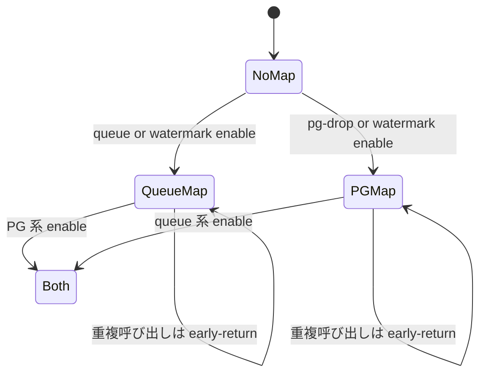
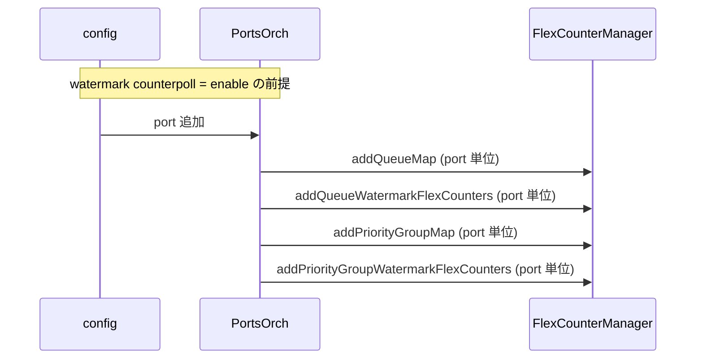

<!-- topics-tip -->
!!! tip "Topics で読み物として読む"
    この HLD は実装詳細を含む。機能の概念・設定・運用を読み物として読みたい場合は [Topics 08 章: QoS / Buffer / PFC](../topics/08-qos-buffer/index.md) を参照。
<!-- /topics-tip -->

!!! success "裏取りステータス: code-verified"
    sonic-swss `orchagent/portsorch.h` L213 `generateQueueMap` / L223 `generatePriorityGroupMap` 分離、L518 `m_isQueueMapGenerated` / L532 `m_isPriorityGroupMapGenerated` キャッシュフラグ、L519 / L533 の Per-Port ヘルパを確認。`portsorch.cpp` L8391 `generateQueueMap` 本体（L8393 でキャッシュフラグ判定）、L8533 `addQueueFlexCounters` / L8574 `addQueueFlexCountersPerPort` / L8618 `addQueueWatermarkFlexCounters` / L8658 `addQueueWatermarkFlexCountersPerPort` の細分化を確認（verified at: 2026-05-09）。

# flexcounter の queue/PG map 生成と watermark 有効化の整合

## 概要

[SONiC](../reference/glossary.md#term-sonic) の flex counter には **queue counter / PG-drop counter / watermark counter (queue / PG / buffer-pool)** が並列に存在する。これらは `counterpoll` CLI で個別に enable / disable される。一方、各 counter は **`COUNTERS_DB.COUNTERS_QUEUE_*_MAP`** や **`COUNTERS_DB.COUNTERS_PG_*_MAP`** といった「OID とポート / queue index / PG index の対応マップ」を必要とする。

本 [HLD](../reference/glossary.md#term-hld) は **「watermark を有効化したのに queue map が生成されない」** などの整合性バグを直すための修正設計を定める[^1]。

問題の整理（修正前の挙動）[^1]:

- queue map は **queue counter polling enable のときだけ** 生成される
- PG map は **PG watermark polling enable のときだけ** 生成される

これにより以下の不整合が起きる:

| 設定 | 期待 | 実際 |
|------|------|------|
| watermark のみ enable | PG/queue 両 watermark が動く | **queue watermark が動かない**（queue map 未生成） |
| pg-drop のみ enable | pg-drop が動く | **pg-drop が動かない**（PG map 未生成）。**pg-watermark stat も追加されない** |
| queue のみ enable | queue counter のみ動く | queue counter は動くが **queue-watermark stat も追加される** |

## 動作仕様

### 6.1 要件

flexcounter は以下の条件で map を生成する[^1]:

- **queue map**: queue counter または watermark の **どちらかが初めて enable** になったとき
- **PG map**: pg-drop または watermark の **どちらかが初めて enable** になったとき

### 6.2 関係する map と counter

`COUNTERS_DB` の queue map (queue または watermark で生成すべき)[^1]:

```text
COUNTERS_QUEUE_NAME_MAP
COUNTERS_QUEUE_INDEX_MAP
COUNTERS_QUEUE_PORT_MAP
COUNTERS_QUEUE_TYPE_MAP
```

`COUNTERS_DB` の PG map (pg-drop または watermark で生成すべき)[^1]:

```text
COUNTERS_PG_NAME_MAP
COUNTERS_PG_PORT_MAP
COUNTERS_PG_INDEX_MAP
```

### 6.3 期待されるエントリ

| `counterpoll` 操作 | `FLEX_COUNTER_DB` 側 | `COUNTERS_DB` 側 |
|------|------|------|
| **queue enable のみ** | `QUEUE_STAT_COUNTER:oid:...` | queue map 生成、watermark 系 stat 無し |
| **pg-drop enable のみ** | `PG_DROP_STAT_COUNTER:oid:...` | PG map 生成、watermark 系 stat 無し |
| **watermark enable のみ** | `PG_WATERMARK_STAT_COUNTER`, `QUEUE_WATERMARK_STAT_COUNTER`, `BUFFER_POOL_WATERMARK_STAT_COUNTER` | queue map / PG map / buffer pool watermark 共に生成 |

### 6.4 関数分割の方針

flexcounter の map 生成と stat 登録を **別関数に切り出す**[^1]:

- queue 系
    - `generateQueueMap` ... map のみ
    - `addQueueFlexCounters` ... queue counter polling 用の stat 登録
    - `addQueueWatermarkFlexCounters` ... queue watermark 用の stat 登録
- PG 系
    - `generatePriorityGroupMap` ... map のみ
    - `addPriorityGroupDropFlexCounters` ... pg-drop polling 用の stat 登録
    - `addPriorityGroupWatermarkFlexCounters` ... pg-watermark 用の stat 登録

### 6.5 disable 時の挙動

**現在の実装は counterpoll disable 時に flex counter table から stat を削除しない** 設計[^1]。本 HLD はこの挙動を維持し、enable 側のロジックのみ整える。

### 修正フロー詳細

#### 7.1 旧フロー

修正前は `counterpoll` のキー入力に対し以下の単純対応のみ存在した[^1]:

```c++
else if (key == QUEUE_KEY) {
    gPortsOrch->generateQueueMap();          // 内部で queue map 作成
}                                            // と queue-watermark stat 追加が混在
else if (key == PG_WATERMARK_KEY) {
    gPortsOrch->generatePriorityGroupMap();  // 内部で PG map 作成
}                                            // と PG-watermark stat 追加が混在
```

そのため `pg-drop` や（純粋な）`watermark` のキーには反応せず、map / stat の食い違いが生じた。

#### 7.2 修正後フロー

key ごとに **map 生成 + 個別 stat 追加関数** を呼び出す[^1]:

```c++
else if (key == QUEUE_KEY) {
    gPortsOrch->generateQueueMap();
    gPortsOrch->addQueueFlexCounters();
}
else if (key == QUEUE_WATERMARK) {
    gPortsOrch->generateQueueMap();
    gPortsOrch->addQueueWatermarkFlexCounters();
}
else if (key == PG_DROP_KEY) {
    gPortsOrch->generatePriorityGroupMap();
    gPortsOrch->addPriorityGroupDropFlexCounters();
}
else if (key == PG_WATERMARK_KEY) {
    gPortsOrch->generatePriorityGroupMap();
    gPortsOrch->addPriorityGroupWatermarkFlexCounters();
}
```

各 `generate*Map` は **キャッシュフラグ** で一度だけ実行する[^1]:

```c++
if (m_isPriorityGroupMapGenerated) {
    return;
}
```

これにより「queue を enable した後に watermark を enable しても map は再生成されない」「両 stat が独立して登録される」を保証する。

### map 生成ステートマシン



#### 7.3 watermark enable 時のポート追加

watermark counterpoll が **enabled の状態で port が追加** されたら、その port の watermark stat も追加する[^1]:



## 設定

### 関連する CONFIG_DB

| Table | Key | 説明 |
|-------|-----|------|
| `FLEX_COUNTER_TABLE` | `QUEUE` / `QUEUE_WATERMARK` / `PG_DROP` / `PG_WATERMARK` / `BUFFER_POOL_WATERMARK` | 各 counter group の `FLEX_COUNTER_STATUS` / `POLL_INTERVAL` |

### 関連する COUNTERS_DB

| Table | 説明 |
|-------|------|
| `COUNTERS_QUEUE_NAME_MAP` / `COUNTERS_QUEUE_INDEX_MAP` / `COUNTERS_QUEUE_PORT_MAP` / `COUNTERS_QUEUE_TYPE_MAP` | queue 系 OID マップ（queue or watermark で生成） |
| `COUNTERS_PG_NAME_MAP` / `COUNTERS_PG_PORT_MAP` / `COUNTERS_PG_INDEX_MAP` | PG 系 OID マップ（pg-drop or watermark で生成） |

### 関連する CLI

| Command | 用途 |
|---------|------|
| `counterpoll queue enable/disable/interval` | queue counter polling |
| `counterpoll watermark enable/disable/interval` | watermark counter polling（PG / queue / buffer pool 全部一括） |
| `counterpoll pg-drop enable/disable/interval` | PG drop counter polling |

### 設定例

```bash
# 全 counter polling を無効から始め
counterpoll queue disable
counterpoll watermark disable
counterpoll pg-drop disable

# watermark のみ enable する場合（修正後は queue map / PG map 共に生成される）
counterpoll watermark enable
```

## 制限事項

- **disable 時に flex counter table から stat を削除しない** 既存挙動は本 HLD の範囲外。disable 後も `FLEX_COUNTER_DB` に entry が残る[^1]
- map のキャッシュフラグはプロセス（`PortsOrch`）寿命の範囲。プロセス再起動時は **再生成される前提**
- HLD のサンプルコードは概念的で、実コード上の関数名 / シグネチャと細部が異なる可能性

## 干渉する機能

- **`PortsOrch`**: map 生成と stat 登録の主体。本 HLD で関数群が分離される
- **`flexcounter` ([orchagent](../reference/glossary.md#term-orchagent) 内 / [syncd](../reference/glossary.md#term-syncd) 内)**: counter polling 本体
- **`counterpoll` CLI**: ユーザ操作の起点
- **`BufferOrch` / buffer pool watermark**: watermark enable 時に同時に生成される group の 1 つ
- **port の dynamic add**: watermark enable 状態での新規 port 追加経路に依存

## トラブルシューティング

- watermark enable しても **`COUNTERS_DB.COUNTERS_QUEUE_*_MAP` が無い** → 修正前バージョンの可能性。`generateQueueMap` が watermark key で呼ばれているか syslog を確認
- queue counter は動くが queue-watermark stat が出ない → `counterpoll show` で watermark group の状態を確認
- 一旦 disable した後に enable し直すと stat が二重に出る → `FLEX_COUNTER_DB` の残存 entry が原因の可能性

確認コマンド例:

```bash
# watermark counter poll 状態と queue map / flex counter キーを確認
counterpoll show
redis-cli -n 2 keys 'COUNTERS_QUEUE_*_MAP'
redis-cli -n 5 keys 'FLEX_COUNTER_TABLE|QUEUE_WATERMARK*'
show priority-group watermark headroom
```

## 参考リンク

- [CLI: show priority-group](../reference/cli/show-priority-group.md)
- [CLI: show buffer-pool](../reference/cli/show-buffer-pool.md)
- [YANG: sonic-buffer-pool](../reference/yang/sonic-buffer-pool.md)
- [Topics: QoS / Buffer](../topics/08-qos-buffer/index.md)

## 引用元

[^1]: `sonic-net/SONiC` `doc/buffer-watermark/align_watermark_flow_with_port_configuration_HLD.md` @ `49bab5b5ff0e924f1ea52b3d9db0dfa4191a7c06`

<!-- concerns hint:
- PortsOrch::generateQueueMap / generatePriorityGroupMap の現行 master 関数構成確認
- addQueueFlexCounters / addQueueWatermarkFlexCounters / addPriorityGroupDropFlexCounters / addPriorityGroupWatermarkFlexCounters の存在確認
- m_isPriorityGroupMapGenerated 等のキャッシュフラグの実装確認
- port 動的追加時に watermark stats が自動追加されるパスの実装確認
- counterpoll disable 時に FLEX_COUNTER_DB から entry を削除しない挙動が現行 master でも維持されているか確認
-->

<!-- topics-back-ref -->
## 関連 Topics

- [Topics: QoS / Buffer / PFC / Watermark](../topics/08-qos-buffer/index.md)

<!-- /topics-back-ref -->


<!-- augmented-links: v1 -->

<!-- glossary-links-injected: 8ba32e5aa69d -->
