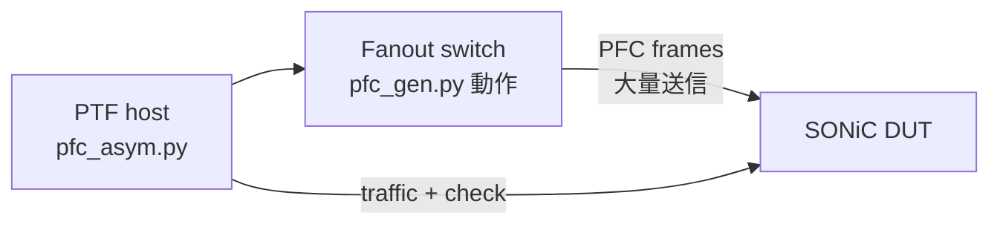

<!-- topics-tip -->
!!! tip "Topics で読み物として読む"
    この HLD は実装詳細を含みます。機能の概念・設定・運用を読み物として読みたい場合は [Topics 08 章: QoS / Buffer / PFC](../topics/08-qos-buffer/index.md) を参照。
<!-- /topics-tip -->

!!! success "裏取りステータス: code-verified (2026-05-11)"
    Asymmetric PFC 本体機能の swss 取り込みを `sonic-swss/orchagent/portsorch.cpp` L2519-L2573 `PortsOrch::setPortPfcAsym()` で確認した（`SAI_PORT_ATTR_PRIORITY_FLOW_CONTROL_MODE` に `SEPARATE` / `COMBINED` を切り替える経路、CONFIG_DB.PORT.pfc_asym のパースは L5407-L5434）。本テストプランは機能 HLD ではなく **テスト仕様**であり、`sonic-mgmt` 配下のテストスクリプト一致は確認スコープ外（ローカル `.cache` に sonic-mgmt が含まれていないため）。

# Asymmetric PFC テストプラン（PTF + sonic-mgmt fixtures）

## 概要

Asymmetric [PFC](../reference/glossary.md#term-pfc) は [SONiC](../reference/glossary.md#term-sonic) 機能だが、本ドキュメントはその **機能テスト計画** を扱う。既存の PTF テスト（`sonic-mgmt/ansible/roles/test/files/saitests/pfc_asym.py`）を再構成し、`sonic-mgmt` の pytest fixtures から呼び出して、SONiC DUT と Fanout 上の PFC パケットジェネレータ (`pfc_gen.py`) を組み合わせて検証する[^1]。

対象テストベッド: **T0-x** 系列（全 T0 構成）。SONiC DUT は **RPC image** が必須[^1]。

## 動作仕様

### テスト構成



`pfc_gen.py` は Fanout 上で動かす PFC パケット送信器。`pfc_asym.py` (PTF) はトラフィック注入とドロップ／受け入れの確認を担当する[^1]。

### 既存 PTF コードのリファクタ

`pfc_asym.py` には以下の改修が必要[^1]:

1. **送信速度向上**: `threading.Thread` を `multiprocessing.Process` に置換（GIL 回避）。L83 周辺。
2. **[ARP](../reference/glossary.md#term-arp) responder 設定生成の冗長削除**: L56 のループで毎回ファイル生成しているのを 1 回だけにする。

### 新規 pytest test suite

`tests/pfc_asym/pfc_asym.py` を新規追加[^1]。グローバル定数:

```python
PFC_GEN_FILE      = "pfc_gen.py"
PFC_FRAMES_NUMBER = 1000000   # 送信 pause frame 数
PFC_QUEUE_INDEX   = 0xff      # 非ゼロ pause time を載せる priority マスク
```

### Pytest fixtures

| Fixture | 役割 |
|---------|------|
| `deploy_pfc_gen` (scope=module, autouse) | `pfc_gen.py` を Fanout に配備 |
| `setup` | DUT と Fanout の前処理 |
| `pfc_storm_template` | PFC ストーム用テンプレ生成 |
| `pfc_storm_runner` | PFC ストーム実行 |
| `enable_pfc_asym` | DUT で Asymmetric PFC を有効化 |
| `flush_neighbors` | テスト間で ARP/ND テーブルクリア |

### `pfc_gen.py` の Fanout 配備

プラットフォームごとに配備手順が違う[^1]:

#### Mellanox

Fanout デプロイ ansible playbook (`fanout.yml`) の `pfcwd_config` タグに含まれており、自動配備される。

```bash
ansible-playbook -i lab fanout.yml -l ${FANOUT} --become --tags pfcwd_config -vvvv
```

#### Arista

手動コピーが必要[^1]:

1. `/mnt/flash/` がなければ作成
2. `pfc_gen.py` を `/mnt/flash/pfc_gen.py` に配置

#### 新プラットフォーム追加

新たな Fanout SKU 対応では `roles/test/files/helpers/pfc_gen.py` の配置パスとデプロイ手順を `deploy_pfc_gen` fixture に追加する[^1]。

<!-- evidence:
source: sonic-net/SONiC/doc/pfc_asym/PFC_Asymmetric_Test_HLD.md#L96-L120 (sha: 49bab5b5ff0e924f1ea52b3d9db0dfa4191a7c06)
excerpt: |
  deploy_pfc_gen (scope="module", autouse=True)
  To simulate that neighbors are overloaded (send many PFC frames) there is used PFC packets generator which is running on Fanout switch.
  File location - roles/test/files/helpers/pfc_gen.py
reasoning: pfc_gen.py の役割と配備 fixture の根拠。
-->

<!-- evidence-rendered:start -->
??? note "📋 検証エビデンス: sonic-net/SONiC/doc/pfc_asym/PFC_Asymmetric_Test_HLD.md#L96-L120 (sha: 49bab5b5ff0e924f1ea52b3d9db0dfa4191a7c06)"

    **出典**:

    `sonic-net/SONiC/doc/pfc_asym/PFC_Asymmetric_Test_HLD.md#L96-L120 (sha: 49bab5b5ff0e924f1ea52b3d9db0dfa4191a7c06)`

    **抜粋**:

    ```text
    deploy_pfc_gen (scope="module", autouse=True)
    To simulate that neighbors are overloaded (send many PFC frames) there is used PFC packets generator which is running on Fanout switch.
    File location - roles/test/files/helpers/pfc_gen.py
    ```

    **判断根拠**: pfc_gen.py の役割と配備 fixture の根拠。

<!-- evidence-rendered:end -->

### PTF テストケース実行

`tests/ptf_runner.py` モジュールを使って既存 PTF テストケースをラップする[^1]。

## 設定

### 関連する CONFIG_DB / CLI / YANG

該当なし（テスト計画文書）。

### 設定例（テスト実行）

```bash
# sonic-mgmt 側
cd sonic-mgmt/tests
pytest pfc_asym/pfc_asym.py --topology=t0
```

具体的な引数は [sonic-mgmt](../reference/glossary.md#term-sonic-mgmt) の標準 testbed パラメタに従う。

## 制限事項

- **T0 トポロジ専用**: [HLD](../reference/glossary.md#term-hld) は T0-x 系列を対象としており、T1 等の他トポロジは別途検討が必要[^1]。
- **RPC image 必須**: 通常リリースイメージでは動作しない[^1]。
- **Fanout 構成依存**: Mellanox / Arista それぞれの Fanout で `pfc_gen.py` 配備手順が違う。新ベンダ Fanout では拡張作業が必要。

## 干渉する機能

- **PFC watchdog**: 同じ PFC ストームで誤発火する可能性。テスト中は PFC-WD を無効化または計算外にする想定。
- **PFC Asymmetric 機能本体**: 機能 HLD は別文書（[`PFC-Asymmetric.md`](https://github.com/sonic-net/SONiC/blob/master/doc/pfc_asym/PFC-Asymmetric.md) など）で扱われる。本ページはそのテスト計画。
- **ARP responder**: PTF テスト中の ARP 応答に依存。`flush_neighbors` fixture で各テストケース前にリセット。

## トラブルシューティング

- ストーム送信レートが期待値に届かない: `multiprocessing` 化が反映されているか、Fanout 側 CPU の制約を確認[^1]。
- `pfc_gen.py` が Fanout で見つからない: `deploy_pfc_gen` fixture のプラットフォーム別ロジック、対象 Fanout の OS / パスを確認。
- ARP responder の応答が無い: 設定ファイルの 1 回生成パッチが当たっているか、ARP responder プロセスのログを確認。

確認コマンド例:

```bash
# Asymmetric PFC mode と PFC カウンタを確認
show pfc asymmetric
redis-cli -n 4 hget 'PORT|Ethernet0' pfc_asym
pfcstat
docker exec swss supervisorctl status | grep orchagent
```

## 裏取り済み実装位置 (2026-05-11)

- Asymmetric PFC mode set: `sonic-swss/orchagent/portsorch.cpp` L2519-L2573 `setPortPfcAsym()`（`SAI_PORT_ATTR_PRIORITY_FLOW_CONTROL_MODE` を `SEPARATE`/`COMBINED` で [SAI](../reference/glossary.md#term-sai) に書き込む）
- [CONFIG_DB](../reference/glossary.md#term-config_db).PORT.pfc_asym パース＆適用: 同 `portsorch.cpp` L5407-L5434（mode の妥当性チェックと `setPortPfcAsym()` 呼び出し、unsupported 時のスキップログ）
- 初期 attribute セット: 同 `portsorch.cpp` L1347-L1361（`SAI_PORT_ATTR_PRIORITY_FLOW_CONTROL` への XOFF 値書き込み）
- Port 構造体: `sonic-swss/orchagent/port/portcnt.h` L89 `pfc_asym` メンバ

> `sonic-mgmt` ツリーは本ローカルキャッシュにクローンされていないため、テストスクリプト本体の一致確認は別バッチで実施する。

## 引用元

[^1]: `sonic-net/SONiC` `doc/pfc_asym/PFC_Asymmetric_Test_HLD.md` @ `49bab5b5ff0e924f1ea52b3d9db0dfa4191a7c06`

<!-- topics-back-ref -->
## 関連 Topics

- [Topics: QoS / Buffer / PFC / Watermark](../topics/08-qos-buffer/index.md)

<!-- /topics-back-ref -->

<!-- glossary-links-injected: 8ba32e5aa69d -->
