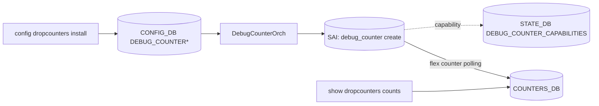

<!-- topics-tip -->
!!! tip "Topics で読み物として読む"
    この HLD は実装詳細を含みます。機能の概念・設定・運用を読み物として読みたい場合は [Topics 07 章: ACL / CoPP / Mirror](../topics/07-acl-copp-mirror/index.md) を参照。
<!-- /topics-tip -->

!!! success "裏取りステータス: Code-verified（基本構成のみ）"
    現行 master の `sonic-swss/orchagent/debugcounterorch.cpp` で `DebugCounterOrch` クラスと `STATE_DEBUG_COUNTER_CAPABILITIES` テーブル登録 (debugcounterorch.cpp:31) を確認。`sonic-utilities` 側に `config dropcounters install/...` (config/main.py:8163-)、`show dropcounters persistent_drops` (show/dropcounters.py) が存在し、v1.1 の persistent drop monitoring まで取り込み済み。`sonic-yang-models/yang-models/sonic-debug-counter.yang` も存在。詳細属性は元 HLD 参照（verified at: 2026-05-09）。

# 設定可能な Drop Counter（DEBUG_COUNTER と SAI debug counter）

## 概要

[SAI](../reference/glossary.md#term-sai) **debug counter** を活用し、ユーザがドロップ理由（drop reason）の組み合わせを動的に定義してカウントできるようにする機能[^1]。`STAT_IF_IN_DISCARDS` のような単一カウンタを「期待ドロップ」と「異常ドロップ」に切り分けるフィルタ用途や、即時デバッグ・常設アラートの 4 用途を想定する。

v1.1（2024-09）で **persistent drop counter monitoring** が追加された[^1]。

## 動作仕様

### CONFIG_DB

```text
DEBUG_COUNTER|<name>
    type   = "PORT_INGRESS_DROPS" | "PORT_EGRESS_DROPS" | "SWITCH_INGRESS_DROPS" | "SWITCH_EGRESS_DROPS"
    desc   = "<description>"   ; OPTIONAL
    group  = "<reason group>"  ; OPTIONAL

DEBUG_COUNTER_DROP_REASON|<name>:<reason>
    (presence = drop reason の有効化)
```

`<reason>` の例: `SMAC_EQUALS_DMAC` / `IP_HEADER_ERROR` / `L3_ANY` 等（プラットフォーム依存）。

### STATE_DB / Capability Discovery

```text
DEBUG_COUNTER_CAPABILITIES|<type>
    count           = uint     ; 残スロット
    reasons         = csv      ; サポートする drop reason 列挙
```

ユーザは `show dropcounters capabilities` で何が使えるかを事前に確認できる。

### COUNTERS_DB

各 debug counter のカウント値はライブで `COUNTERS:oid:*` に流れる（`flexcounter` ベース）。

### モジュールフロー



### v1.1 拡張: persistent drop counter

v1.1 で persistent drop counter monitoring が追加され、特定 drop reason のドロップが継続発生したときにアラート可能なモニタが定義される（具体的なテーブル名・ロジックは [HLD](../reference/glossary.md#term-hld) 当該節を参照）[^1]。

## 設定

### 関連する CONFIG_DB

| Table | 説明 |
|-------|------|
| `DEBUG_COUNTER` | counter 自体（型と説明） |
| `DEBUG_COUNTER_DROP_REASON` | counter にひも付ける drop reason 集合 |

### 関連する CLI

```text
show dropcounters capabilities
config dropcounters install <name> <type> <reasons-csv> [-d <desc>] [-g <group>]
config dropcounters add-reasons <name> <reasons-csv>
config dropcounters remove-reasons <name> <reasons-csv>
config dropcounters delete <name>
show dropcounters configuration [-g <group>]
show dropcounters counts [-g <group>] [-t <type>]
sonic-clear dropcounters
```

### 関連する YANG

HLD に [YANG](../reference/glossary.md#term-yang) モデルの記述は無い。

### 設定例

```bash
show dropcounters capabilities
sudo config dropcounters install EXPECTED_DROPS PORT_INGRESS_DROPS \
    SMAC_EQUALS_DMAC,IP_HEADER_ERROR -d "expected drops"
show dropcounters counts
```

## 制限事項

- カウンタ数・サポート reason はプラットフォーム依存（`DEBUG_COUNTER_CAPABILITIES` で公開）。
- [ASIC](../reference/glossary.md#term-asic) ASIC が SAI debug counter API を実装していない場合は機能しない。
- v1.1 の persistent monitoring 拡張は最近の追加で、現行 master の取り込み状況は別途裏取り。
- 詳細フロー / SAI 属性マッピング / Open Questions は HLD `doc/drop_counters/drop_counters_HLD.md` を参照。

## 干渉する機能

- **STAT_IF_IN_DISCARDS / STAT_IF_OUT_DISCARDS**: 既存集約カウンタ。debug counter で「期待ドロップ」を計上し、両者の差分で異常を検知する用途。
- **[CRM](../reference/glossary.md#term-crm)**: debug counter のスロット消費は CRM の resource 監視に乗らない（HLD で明記なし、要確認）。
- **Watermark / [PFC](../reference/glossary.md#term-pfc)**: 別系統のカウンタ。drop counter とは独立。

## トラブルシューティング

- `install` が失敗する → `show dropcounters capabilities` で残スロットと reason サポートを確認。
- counts が増えない → 該当 reason に該当する drop が起きていない／ASIC が当該 reason を SAI で公開していない可能性。
- `show dropcounters configuration` が空 → [CONFIG_DB](../reference/glossary.md#term-config_db) の `DEBUG_COUNTER` テーブルに entry があるかを `redis-cli -n 4 keys 'DEBUG_COUNTER|*'` で確認。

確認コマンド例:

```bash
# drop counter capabilities, 設定, 値をひととおり確認
show dropcounters capabilities
show dropcounters configuration
show dropcounters counts
redis-cli -n 4 keys 'DEBUG_COUNTER|*'
redis-cli -n 4 keys 'DEBUG_COUNTER_DROP_REASON|*'
```

## 引用元

[^1]: `sonic-net/SONiC` `doc/drop_counters/drop_counters_HLD.md` @ `49bab5b5ff0e924f1ea52b3d9db0dfa4191a7c06`

<!-- topics-back-ref -->
## 関連 Topics

- [Topics: ACL / CoPP / Mirror / Packet Action](../topics/07-acl-copp-mirror/index.md)

<!-- /topics-back-ref -->

<!-- glossary-links-injected: c006405759d8 -->
