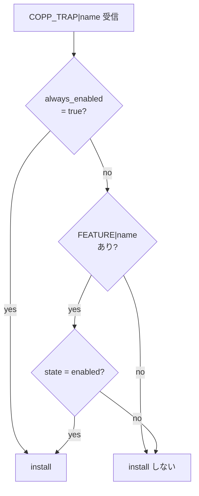

<!-- topics-tip -->
!!! tip "Topics で読み物として読む"
    この HLD は実装詳細を含みます。機能の概念・設定・運用を読み物として読みたい場合は [Topics 07 章: ACL / CoPP / Mirror](../topics/07-acl-copp-mirror/index.md) を参照。
<!-- /topics-tip -->

!!! success "裏取りステータス: code-verified（基本構成のみ）"
    現行 master の `sonic-swss/cfgmgr/coppmgr.cpp` に `always_enabled` フラグ判定 (line 88, 365)、CFG_FEATURE_TABLE 監視 (line 300)、trap 状態保持と差分処理 (543-619) を確認。`sonic-utilities/tests/copp_test.py`、`sonic-swss/tests/mock_tests/copp_ut.cpp` のテストハーネスも存在。Test plan の主要 4 ルールは coppmgr.cpp で網羅されている（verified at: 2026-05-09）。

# CoPP Manager 再設計テストプラン（feature テーブル整合性 + `always_enabled`）

## 概要

`CoppMgr` は [CONFIG_DB](../reference/glossary.md#term-config_db) の `COPP_TRAP` と `FEATURE` を観測し、各 trap ([BGP](../reference/glossary.md#term-bgp) / [ARP](../reference/glossary.md#term-arp) / [LACP](../reference/glossary.md#term-lacp) / UDLD / IP2ME 等) を [SAI](../reference/glossary.md#term-sai) hostif trap として **install / uninstall** する。旧設計では「`FEATURE` に entry が無い → デフォルトで install する」フォールバックを持っていたため、sflow のように **entry が削除された feature の trap が install されたままになる** バグが発生していた[^1]。

再設計では以下のルールに整理し、本テストプランはその振る舞いを ptf32 / ptf64 / t1 / t2 トポロジで検証する[^1]:

- feature が disabled または `FEATURE` に存在しない → install しない
- ただし `COPP_TRAP|<name>` に **`always_enabled: true`** がある trap は `FEATURE` を参照せず常に install する
- feature が enabled で対応 trap が `COPP_TRAP` にあれば install する
- feature が disabled でも `always_enabled: true` なら install する

`arp` / `lacp` / `udld` / `ip2me` はデフォルト構成で `always_enabled: true` であり、`FEATURE` に該当エントリを持たない[^1]。

## 動作仕様

### 判定フロー



<!-- evidence:
source: sonic-net/SONiC/doc/copp/Copp_Manager_Redesign_test_plan.md#L10-L30 (sha: 49bab5b5ff0e924f1ea52b3d9db0dfa4191a7c06)
excerpt: |
  + If the feature is disabled or does not have an entry in te features table, don't install the trap.
  + If the trap name does not exist in the features table, but the trap has a field which called "always_enabled" and it's value is "true", install the trap.
  + If there is a feature in the features table that is enabled, install the associated trap.
  + If there is a feature which is in state 'disabled', but the associated trap has "always_enabled": "true" field, install the trap.
reasoning: HLD 本文 4 ルールをそのまま判定フローに転写
-->

<!-- evidence-rendered:start -->
??? note "📋 検証エビデンス: sonic-net/SONiC/doc/copp/Copp_Manager_Redesign_test_plan.md#L10-L30 (sha: 49bab5b5ff0e924f1ea52b3d9db0dfa4191a7c06)"

    **出典**:

    `sonic-net/SONiC/doc/copp/Copp_Manager_Redesign_test_plan.md#L10-L30 (sha: 49bab5b5ff0e924f1ea52b3d9db0dfa4191a7c06)`

    **抜粋**:

    ```text
    + If the feature is disabled or does not have an entry in te features table, don't install the trap.
    + If the trap name does not exist in the features table, but the trap has a field which called "always_enabled" and it's value is "true", install the trap.
    + If there is a feature in the features table that is enabled, install the associated trap.
    + If there is a feature which is in state 'disabled', but the associated trap has "always_enabled": "true" field, install the trap.
    ```

    **判断根拠**: HLD 本文 4 ルールをそのまま判定フローに転写

<!-- evidence-rendered:end -->

### `COPP_TRAP` のサンプル（`/etc/sonic/copp_cfg.json`）

```json
"COPP_TRAP": {
  "bgp":   { "trap_ids": "bgp,bgpv6",                 "trap_group": "queue4_group1" },
  "arp":   { "trap_ids": "arp_req,arp_resp,neigh_discovery", "trap_group": "queue4_group2", "always_enabled": "true" },
  "udld":  { "trap_ids": "udld",  "trap_group": "queue4_group3", "always_enabled": "true" },
  "ip2me": { "trap_ids": "ip2me", "trap_group": "queue1_group1", "always_enabled": "true" },
  "lacp":  { "trap_ids": "lacp",  "trap_group": "queue4_group1", "always_enabled": "true" }
}
```

`bgp` は `always_enabled` を持たないので `FEATURE|bgp` の状態で install/uninstall が決まる[^1]。

## テストケース

| # | 観点 | 操作 | 期待 |
|---|------|------|------|
| 1 | デフォルト構成 | 何もせず traffic 送出 | arp / lacp / udld / ip2me の 4 trap が install されている |
| 2 | trap 追加 | `bgp` に `always_enabled: true` を `config load` で投入 | bgp trap が install される |
| 3 | feature 削除で uninstall | `bgp` の `always_enabled` を false にし、`redis-cli -n 4 hdel "FEATURE|bgp" ...` で entry ごと削除 | bgp trap が uninstall される |
| 4 | feature disable で uninstall | `config feature state bgp enabled` → install 確認後 `disabled` | bgp trap が install → uninstall |
| 5 | reboot 横断保持 | `always_enabled: true` を save 後 reboot / fast-reboot / warm-reboot | trap が install されたまま |

### トラフィック検証の閾値[^1]

- trap install 中: `rx_pps` ∈ `[PPS_LIMIT_MIN, PPS_LIMIT_MAX]`
- trap 未 install: `rx_pps < PPS_LIMIT_MIN`
- 削除した trap でも別 trap（例: BGP → IP2ME）で trap される可能性があるため `rx_pps == 0` は要求しない

## 設定

### 関連する CONFIG_DB

| Table | Key | 説明 |
|-------|-----|------|
| `COPP_TRAP` | `<trap-name>` | `trap_ids` / `trap_group` / `always_enabled` |
| `FEATURE` | `<feature-name>` | `state` 等。entry 削除も挙動の trigger |

### 関連する CLI

| Command | 用途 |
|---------|------|
| `config feature state <name> enabled\|disabled` | feature の state を切り替え |
| `config load <copp.json> -y` | COPP_TRAP の上書き |
| `redis-cli -n 4 hdel "FEATURE|<name>" ...` | feature entry の削除（テスト用） |

## 制限事項

- スケール / 性能テストは本プラン対象外[^1]
- Vendor [ASIC](../reference/glossary.md#term-asic) によっては default で install される invisible な trap があるため、テスト前に当該 trap を抜く必要がある（例: bgp 動作確認時に ip2me を抜く）[^1]

## 干渉する機能

- **fast-reboot / warm-reboot**: `always_enabled` 状態が `config save` を通じて保持される必要がある
- **sflow**: 本 redesign の発端となった例。`FEATURE|sflow` の delete でも trap が消えなければならない

## トラブルシューティング

- `redis-cli -n 4 hgetall "COPP_TRAP|<name>"` で `always_enabled` の有無を確認
- `redis-cli -n 4 hgetall "FEATURE|<name>"` で feature の state 確認
- `aclshow` 相当の trap 表示は CLI 化されていない可能性があり、SAI hostif trap の状態は SAI debug 経由で確認

確認コマンド例:

```bash
# COPP redesign: COPP_TRAP / FEATURE 状態を一覧
redis-cli -n 4 keys 'COPP_TRAP|*'
redis-cli -n 4 hgetall 'COPP_TRAP|sflow'
redis-cli -n 4 hgetall 'FEATURE|sflow'
show copp configuration
```

## 引用元

[^1]: [sonic-net/SONiC doc/copp/Copp_Manager_Redesign_test_plan.md @ 49bab5b](https://github.com/sonic-net/SONiC/blob/49bab5b5ff0e924f1ea52b3d9db0dfa4191a7c06/doc/copp/Copp_Manager_Redesign_test_plan.md)

<!-- topics-back-ref -->
## 関連 Topics

- [Topics: ACL / CoPP / Mirror / Packet Action](../topics/07-acl-copp-mirror/index.md)

<!-- /topics-back-ref -->

<!-- glossary-links-injected: c006405759d8 -->
