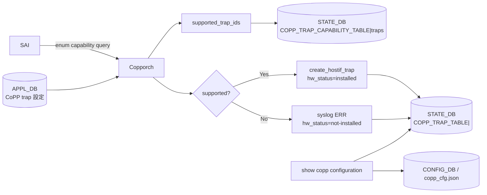

<!-- topics-tip -->
!!! tip "Topics で読み物として読む"
    この HLD は実装詳細を含みます。機能の概念・設定・運用を読み物として読みたい場合は [Topics 07 章: ACL / CoPP / Mirror](../topics/07-acl-copp-mirror/index.md) を参照。
<!-- /topics-tip -->

!!! success "裏取りステータス: Code-verified"
    現行 master の `sonic-swss/orchagent/copporch.cpp:99` で `neighbor_miss → SAI_HOSTIF_TRAP_TYPE_NEIGHBOR_MISS` マップ、line 106 の `default_supported_trap_ids`、line 199 の `STATE_COPP_TRAP_CAPABILITY_TABLE_NAME`、line 222-235 の `updateTrapOperStatus` (`hw_status` 公開)、line 239-287 の `query_objecttype_implementation`/`enum_values_capability` クエリ、`sonic-buildimage/files/image_config/copp/copp_cfg.j2:66,135` の `queue1_group3` / `neighbor_miss` 追加、`sonic-utilities/show/copp.py:189-206` の `show copp configuration` CLI を確認済み（verified at: 2026-05-09）。

# CoPP Neighbor Miss trap と enum capability query（`show copp configuration`）

## これは何か（一行で）

[CoPP](../reference/glossary.md#term-copp) に **`neighbor_miss` trap**（[ARP](../reference/glossary.md#term-arp)/ND 未解決 IP パケット用）を追加し、[SAI](../reference/glossary.md#term-sai) **enum capability query** で対応 trap を事前判定、`hw_status` を [STATE_DB](../reference/glossary.md#term-state_db) に出して `show copp configuration` で見える化する 4 点セットの改善[^1]。

## なぜ必要か

- **ARP 解決前の IP トラフィックが CPU に殺到** → IP2ME など重要 trap を巻き添えにする問題があった
- SAI が知らない trap を投げて [orchagent](../reference/glossary.md#term-orchagent) が落ちる事象を **enum capability query で根絶**
- 「自分の [ASIC](../reference/glossary.md#term-asic) は [BGP](../reference/glossary.md#term-bgp) trap を install できているか？」が CLI で見えなかった → `hw_status` 列で公開

## 全体構造



## 動作: Init と Config

**Init** 時の Copporch[^1]:

1. `sai_query_attribute_enum_values_capability(SAI_HOSTIF_TRAP_ATTR_TRAP_TYPE)` で対応値を取得
2. 結果を `supported_trap_ids` に保持
3. query 自体が非対応の SAI は **`default_supported_trap_ids`** にフォールバック（後方互換）
4. `supported_trap_ids` を `STATE_DB.COPP_TRAP_CAPABILITY_TABLE|traps` に出版

**Config** 時（[APPL_DB](../reference/glossary.md#term-appl_db) から CoPP trap 設定が来た時）:

1. `supported_trap_ids` に含まれるか確認
2. 含まれる → SAI に `create_hostif_trap` で投入し `hw_status=installed`
3. 含まれない → syslog `ERR`、`hw_status=not-installed`（試行せず）

これで「BGP 機能無効な T0 で BGP trap だけ未 install」のような状態が CLI で判別可能。

## Neighbor miss trap デフォルト

`copp_cfg.j2` に追加[^1]:

```json
"queue1_group3": {
  "trap_action": "trap",   "trap_priority": "1",
  "queue": "1",            "meter_type": "packets",
  "mode": "sr_tcm",        "cir": "200",
  "cbs": "200",            "red_action": "drop"
},
"neighbor_miss": {
  "trap_ids": "neighbor_miss",
  "trap_group": "queue1_group3",
  "always_enabled": "true"
}
```

`always_enabled=true` なので feature flag に関わらず常時有効。CIR/CBS=200 pps、`red_action=drop`。

## STATE_DB スキーマ

```yaml
COPP_TRAP_CAPABILITY_TABLE|traps
    trap_ids : "stp,lacp,eapol,lldp,...,neighbor_miss,...,bgp,bgpv6,bfd,..."

COPP_TRAP_TABLE|<trap_name>
    state     : "ok" | ...
    hw_status : "installed" | "not-installed"
```

`hw_status` 列が今回の追加。`COPP_TRAP_CAPABILITY_TABLE` はテーブル新設[^1]。

## SAI API

新規 SAI API は無し。既存 API のみで実装[^1]:

| API | 属性 | 値 |
|-----|------|---|
| `sai_query_attribute_enum_values_capability` | `SAI_HOSTIF_TRAP_ATTR_TRAP_TYPE` | （列挙値取得） |
| `create_hostif_trap_fn` / `remove_hostif_trap_fn` | `SAI_HOSTIF_TRAP_ATTR_TRAP_TYPE` | `SAI_HOSTIF_TRAP_TYPE_NEIGHBOR_MISS` |

## CLI

新設 `show copp configuration`:

```bash
show copp configuration
        └── detailed [--trapid <trapid> | --group <group>]
```

サマリ出力[^1]:

```text
TrapId           Trap Group     Action  CBS   CIR  Meter Type  Mode    HW Status
---------------  -------------  ------  ----  ---  ----------  ------  -------------
arp_req          queue4_group2  copy    600   600  packets     sr_tcm  installed
bgp              queue4_group1  trap   6000  6000  packets     sr_tcm  not-installed
neighbor_miss    queue1_group3  trap    200   200  packets     sr_tcm  installed
```

詳細:

```bash
show copp configuration detailed --trapid neighbor_miss
show copp configuration detailed --group queue1_group3
```

## 設定

### CONFIG_DB

既存 `COPP_TRAP` / `COPP_GROUP` を使う。スキーマ変更なし（追加 default は `copp_cfg.j2` テンプレ側）。

### YANG

`sonic-copp` を再利用（変更なし）[^1]。

### Warm/fast boot

影響なし[^1]。

## 制限事項

- `SAI_HOSTIF_TRAP_TYPE_NEIGHBOR_MISS` の対応は **ベンダー依存**。未実装 ASIC では `hw_status=not-installed`
- `default_supported_trap_ids` は古い SAI 向けフォールバック。新 trap を default に入れ忘れると未 install になる可能性
- [HLD](../reference/glossary.md#term-hld) デフォルト（CIR/CBS=200、queue=1）はデバイス・トラフィックに合わせて調整余地あり
- **DHCP_L2 / DHCPv6_L2 トラップが COPP マップに未対応** ([sonic-swss#1684](https://github.com/sonic-net/sonic-swss/issues/1684)): SAI では `SAI_HOSTIF_TRAP_TYPE_DHCP_L2` / `SAI_HOSTIF_TRAP_TYPE_DHCPV6_L2` が追加されているが（[opencomputeproject/SAI#1118](https://github.com/opencomputeproject/SAI/pull/1118)）、[SONiC](../reference/glossary.md#term-sonic) の COPP トラップ ID マップにはこれらの L2 DHCP トラップが追加されていない。DHCP relay が L2 ブロードキャスト（DHCP Discover 等）を正しくトラップできない場合はこの制限が原因である可能性がある。
- **SAI mandatory trap が未実装の場合がある** ([sonic-swss#559](https://github.com/sonic-net/sonic-swss/issues/559)): SAI 仕様で mandatory とされているトラップ種別（例: `SAI_HOSTIF_TRAP_TYPE_STP`、`SAI_HOSTIF_TRAP_TYPE_OSPF`）でも、BCM SAI 等のベンダー実装で未サポートのものがある。`syncd` ログに `SAI_STATUS_NOT_IMPLEMENTED` が記録される場合はプラットフォームのベンダー SAI が該当トラップを実装していないことを意味する。SAI spec の mandatory は「標準上の要件」であり「全 ASIC ベンダーが実装済み」を保証しない。

## 干渉する機能

- **`Copporch`**: 主要変更箇所
- **既存 trap (arp_req / bgp / lldp ...)**: 全 trap が `hw_status` を新規に持つ
- **`copp_cfg.j2`**: 新 group / trap 追加。既存設定との merge に注意
- **既存スクリプト**: `show` 系出力を parse しているもの（互換性確認）

## トラブルシューティング

- ARP 解決前 IP トラフィックで CPU 高負荷 → `show copp configuration` で `neighbor_miss` の `hw_status=installed` を確認
- ある trap が `not-installed` のまま → `STATE_DB.COPP_TRAP_CAPABILITY_TABLE|traps.trap_ids` に該当 trap があるか確認
- 設定したのに ASIC に反映されない → syslog の `Copporch` ERR を確認

確認コマンド例:

```bash
# neighbor_miss trap と hw_status / capability を確認
show copp configuration | grep -A2 neighbor_miss
redis-cli -n 6 hgetall 'COPP_TRAP_CAPABILITY_TABLE|traps'
redis-cli -n 6 hgetall 'COPP_TRAP_TABLE|neighbor_miss'
docker logs swss 2>&1 | grep -i copporch | tail
```

## 関連ページ

- [ACL Support in SONiC](./acl-support-in-sonic.md)
- [CoPP Manager Redesign Test Plan](./copp-manager-redesign-test-plan.md)

## 引用元

[^1]: `sonic-net/SONiC` `doc/copp/Copp_Neighbor_Miss_Trap_And_Enhancements.md` @ `49bab5b5ff0e924f1ea52b3d9db0dfa4191a7c06`

<!-- concerns hint:
- Copporch の SAI enum capability query (sai_query_attribute_enum_values_capability) 実装
- supported_trap_ids / default_supported_trap_ids の管理コード
- STATE_DB COPP_TRAP_CAPABILITY_TABLE と COPP_TRAP_TABLE.hw_status の最終スキーマ
- copp_cfg.j2 への queue1_group3 / neighbor_miss 追加の master 反映
- show copp configuration CLI の sonic-utilities 取り込み
- SAI_HOSTIF_TRAP_TYPE_NEIGHBOR_MISS のベンダー実装状況
-->

<!-- topics-back-ref -->
## 関連 Topics

- [Topics: ACL / CoPP / Mirror / Packet Action](../topics/07-acl-copp-mirror/index.md)

<!-- /topics-back-ref -->

<!-- glossary-links-injected: ec18b66e3507 -->
