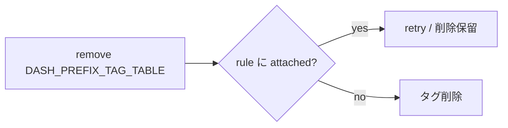
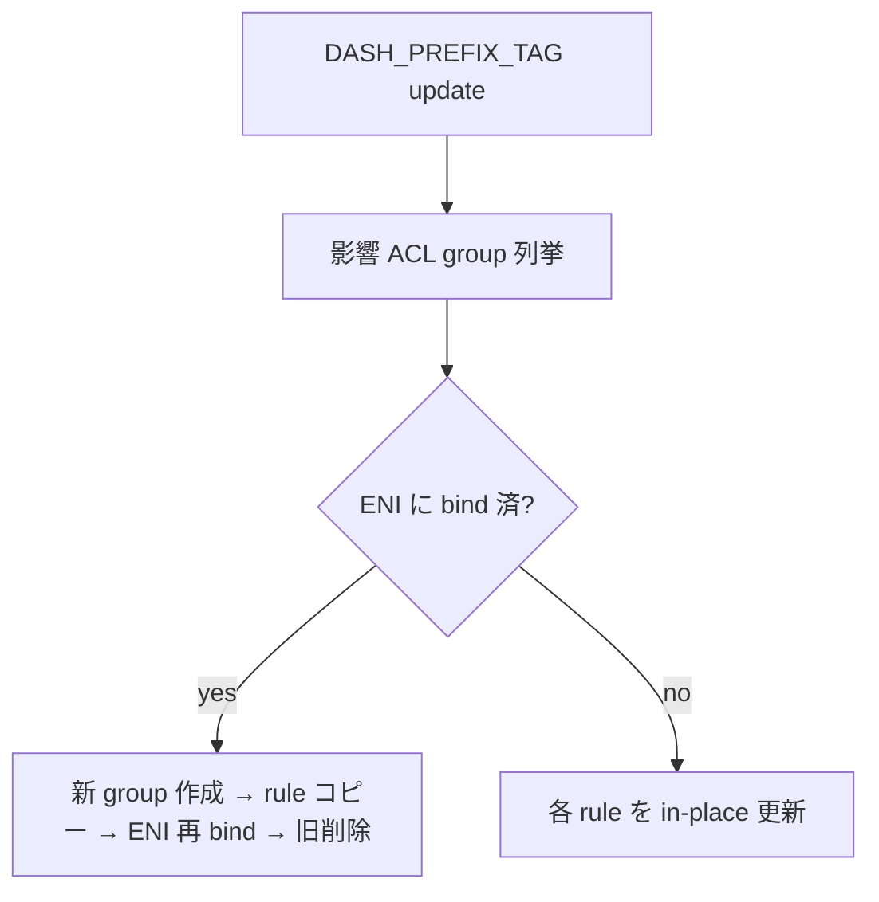
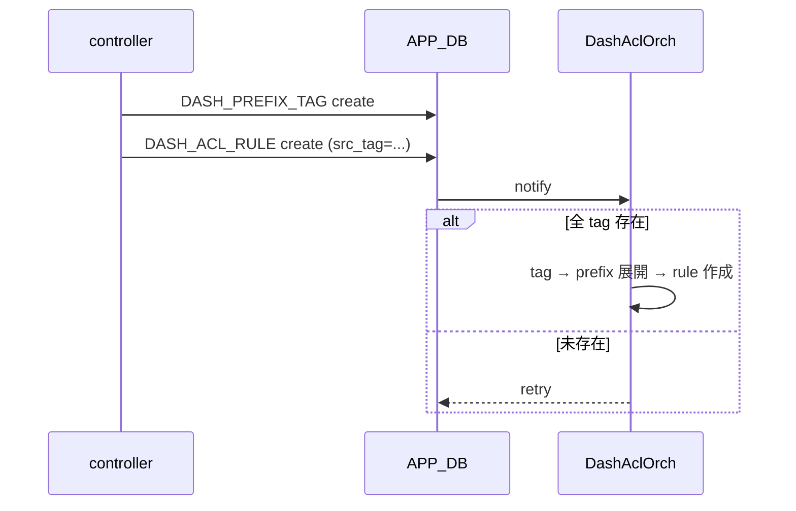

<!-- topics-tip -->
!!! tip "Topics で読み物として読む"
    この HLD は実装詳細を含みます。機能の概念・設定・運用を読み物として読みたい場合は [Topics 07 章: ACL / CoPP / Mirror](../topics/07-acl-copp-mirror/index.md) を参照。
<!-- /topics-tip -->

!!! success "裏取りステータス: Code-verified（Stage 1 のみ）"
    `sonic-swss-common/common/schema.h` L183 で `APP_DASH_PREFIX_TAG_TABLE_NAME = "DASH_PREFIX_TAG_TABLE"` を確認。`sonic-swss/orchagent/dash/dashaclorch.cpp` L111-112 で `APP_DASH_PREFIX_TAG_TABLE_NAME` の SET/DEL を `taskUpdateDashPrefixTag` / `taskRemoveDashPrefixTag` が処理、L283-310 で tag CRUD ハンドラを確認。`tests/dash/test_dash_acl.py` L186-194/L511 で `PrefixTag` proto による tag CRUD テストを確認（verified at: 2026-05-09）。Stage 2（SAI API でタグを ASIC へ）は本 HLD の対象外。

# DASH ACL タグ（`DASH_PREFIX_TAG_TABLE` と `DASH_ACL_RULE_TABLE` 拡張）

## なぜ必要か

[DASH](../reference/glossary.md#term-dash) (Disaggregated APIs for [SONiC](../reference/glossary.md#term-sonic) Hosts) の [ACL](../reference/glossary.md#term-acl) では、**サービスタグ** が「あるサービスに属する IP プレフィックス群」を表す抽象として使われる。タグメンバが変わってもタグ自体の更新だけで済み、これを参照する ACL ルールは無変更でよい。プレフィックスを各ルールに複製する必要が無くなり、メモリ効率も上がる[^1]。

実装は **2 段階**[^1]:

| Stage | 内容 |
|-------|------|
| Stage 1 | **SWSS 内のソフト展開のみ**。ルール作成時にタグをプレフィックス列に展開（[SAI](../reference/glossary.md#term-sai) 変更なし） |
| Stage 2 | **SAI API 経由でタグを [ASIC](../reference/glossary.md#term-asic) へ**（本 [HLD](../reference/glossary.md#term-hld) 対象外） |

本 HLD は **Stage 1** を定義する。

要件 (Stage 1)[^1]:

- [orchagent](../reference/glossary.md#term-orchagent) で ACL タグ設定をサポート
- 1 プレフィックスは **複数タグに所属可**
- タグからプレフィックス追加 / 削除は **いつでも**
- ルール生成時に **タグ → プレフィックス列に展開**

スケール目標[^1]: 総タグ 4k、タグあたり最大プレフィックス 24k、ACL ルールあたり最大タグ 4k。

## スキーマ

### `APP_DB.DASH_PREFIX_TAG_TABLE`（新規）[^1]

```text
DASH_PREFIX_TAG_TABLE:<tag_name>
    "ip_version": "ipv4" | "ipv6"
    "prefix_list": "<prefix1>,<prefix2>,..."
```

- `tag_name` は unique
- `prefix_list` は空も許される（マッチするパケットなしを意味）

### `APP_DB.DASH_ACL_RULE_TABLE` 拡張[^1]

```text
DASH_ACL_RULE_TABLE:<group_id>:<rule_num>
    "priority":    INT32       ; 小さいほど優先
    "action":      "allow" | "deny"
    "terminating": "true" | "false"
    "protocol":    INT list                       OPTIONAL
    "src_tag":     tag 名リスト ',' 区切り        OPTIONAL
    "dst_tag":     tag 名リスト ',' 区切り        OPTIONAL
    "src_addr":    prefix リスト ',' 区切り        OPTIONAL
    "dst_addr":    prefix リスト ',' 区切り        OPTIONAL
    "src_port":    port range リスト              OPTIONAL
    "dst_port":    port range リスト              OPTIONAL
```

制約: **同種の tag と prefix を同一ルールに同時設定しない**（`src_tag + src_addr` 不可、`src_tag + dst_addr` のような **異種混在は OK**）[^1]。

## `DashAclOrch` の責務

`APP_DB.DASH_PREFIX_TAG_TABLE` と `DASH_ACL_RULE_TABLE` を購読し、タグ / ルールの CRUD と **タグ → プレフィックス展開** を処理する[^1]。

### タグのライフサイクル

- **add tag**: 設定の妥当性検証 → 保存
- **remove tag**: ACL ルールから参照中なら **削除拒否 (retry)**



- **update tag (prefix_list 変更)**: 影響を受けるルールが **[ENI](../reference/glossary.md#term-eni) に bind 済 group** に属するなら「コピー → 新 group bind → 旧 group 削除」、未 bind なら **in-place 更新**[^1]:



### ACL rule のライフサイクル

- **create**: 参照する全 tag が `DASH_PREFIX_TAG_TABLE` に存在 → タグをプレフィックス列に展開して rule 作成。未存在 tag があれば **`retry` を返し延期**
- **remove / update**: 所属 ACL group が ENI に bind 済なら **エラー拒否**。未 bind の group のみ変更可[^1]



### 展開例

```text
DASH_PREFIX_TAG_TABLE:Tag1  prefix_list = 1.1.1.0/24,1.1.2.0/24
DASH_PREFIX_TAG_TABLE:Tag2  prefix_list = 2.2.2.0/24
DASH_PREFIX_TAG_TABLE:Tag3  prefix_list = 3.3.3.0/24

DASH_ACL_RULE_TABLE:AclGroup1:AclRule1
    src_tag = "Tag1,Tag2"   # tag 参照
    dst_tag = "Tag3"
# DashAclOrch 内部展開後:
#   src_tag → 1.1.1.0/24,1.1.2.0/24,2.2.2.0/24
#   dst_tag → 3.3.3.0/24
```

## 設定

| 種別 | 名前 | 説明 |
|------|------|------|
| APP_DB | `DASH_PREFIX_TAG_TABLE` | tag 単位の prefix 集合 |
| APP_DB | `DASH_ACL_RULE_TABLE` | `src_tag` / `dst_tag` を新たに受理 |

CLI / [YANG](../reference/glossary.md#term-yang) 拡張・`CONFIG_DB` 変更は **無し**。コントローラが APP_DB に直接書き込む設計[^1]。

```text
DASH_PREFIX_TAG_TABLE:Tag1  ip_version=ipv4  prefix_list=1.1.1.0/24,1.1.2.0/24
DASH_ACL_RULE_TABLE:AclGroup1:AclRule1
    priority=1 action=allow terminating=false
    src_tag="Tag1,Tag2"   dst_addr="3.3.3.0/24"
```

## 制限事項

- **Stage 1 は SAI 不使用**。ASIC からはタグの存在は見えない
- **warm / fast reboot 未サポート**（[DPU](../reference/glossary.md#term-dpu) SONiC 自体が未対応）
- **ENI bind 済 group のルール削除 / 更新は不可**。タグ更新は group コピー方式
- **同種 tag と prefix の併用不可**（`src_tag + src_addr` 等）
- 未存在 tag 参照は **retry 延期**。controller は投入順序を意識
- `DASH_PREFIX_TAG_TABLE` の **scope（global / per-ENI）** は Open Item

## 干渉する機能

- `DashAclOrch`: 主体。tag 展開 + ENI bind 状態管理
- DASH ENI 管理: bind/unbind 状態が tag update 時のフローを左右
- APP_DB スキーマ: `src_tag` / `dst_tag` を消費する controller / CLI

## トラブルシューティング

```bash
sonic-db-cli APPL_DB keys 'DASH_PREFIX_TAG_TABLE:*'
sonic-db-cli APPL_DB keys 'DASH_ACL_RULE_TABLE:*'
# DashAclOrch ログに retry が出ていないか
```

- rule が作成されない → 参照 tag が存在するか、syslog の retry を確認
- tag 削除不可 → 参照ルールを先に削除
- prefix_list 更新が反映されない → ENI bind 済なら新 group 再生成が走る。古い group が残っていないか

## 引用元

[^1]: `sonic-net/SONiC` `doc/dash/dash-acl-tags/dash-acl-tags.md` @ `49bab5b5ff0e924f1ea52b3d9db0dfa4191a7c06`

<!-- topics-back-ref -->
## 関連 Topics

- [Topics: ACL / CoPP / Mirror / Packet Action](../topics/07-acl-copp-mirror/index.md)
- [07-acl-copp-mirror/concept](../topics/07-acl-copp-mirror/concept.md): ACL と DASH ACL の置き場所
- [Topics: DASH と SmartSwitch](../topics/13-dash-smartswitch/index.md)
- [13-dash-smartswitch/concept](../topics/13-dash-smartswitch/concept.md): DASH / [SmartSwitch](../reference/glossary.md#term-smartswitch) の全体像

<!-- /topics-back-ref -->

<!-- glossary-links-injected: ec18b66e3507 -->
