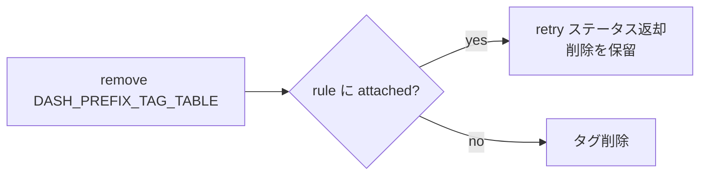
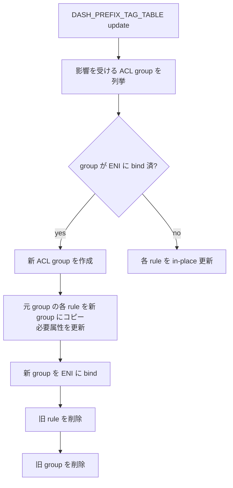
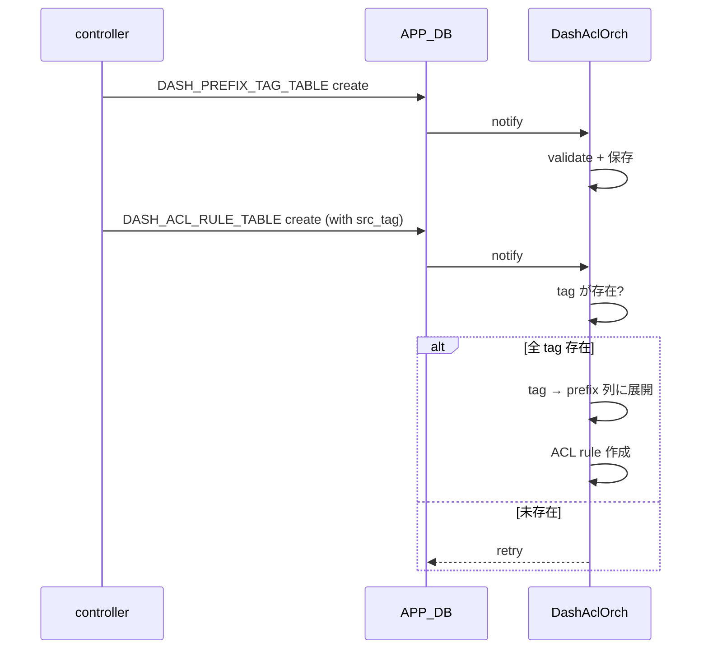

!!! warning "裏取りステータス: HLD-only / 段階導入の HLD"
    本 HLD は **stage 1 のソフトウェアのみ実装** を定義する初期版（採用ステータス未確認）。`DashAclOrch` の tag 展開ロジック、ENI 既 bind 時の **ACL group 再生成パス**、`APP_DB.DASH_PREFIX_TAG_TABLE` のスキーマ命名は実コードでの裏取り未済。stage 2 の SAI API 経由のタグ表現は本ページの範囲外。

# DASH ACL タグ（`DASH_PREFIX_TAG_TABLE` と `DASH_ACL_RULE_TABLE` 拡張）

## 概要

DASH (Disaggregated APIs for SONiC Hosts) の ACL では、**サービスタグ** が「あるサービスに属する IP プレフィックス群」を表す抽象である。コントローラはタグ配下のプレフィックスを管理し、メンバが変わった際にタグ自体を更新するだけで、これを参照する ACL ルールは設定変更が不要になる。プレフィックスを複数 ACL ルールに重複展開する必要がなくなり、メモリ効率も上がる[^1]。

実装は **2 段階** に分けられる[^1]:

| Stage | 内容 |
|-------|------|
| Stage 1 | **SWSS 側のソフトウェア展開のみ**。タグはルール作成時にプレフィックス列に展開される（SAI 変更なし） |
| Stage 2 | **SAI API 経由でタグを ASIC に下ろす**。本 HLD の対象外 |

本 HLD は **Stage 1 (SONiC のみ)** を定義する。

要件 (Stage 1)[^1]:

- orchagent が ACL タグの設定をサポート
- 1 プレフィックスは **複数タグに所属可能**
- タグからプレフィックスの **追加 / 削除はいつでも** 可能
- ルール生成時に **タグをプレフィックス列に展開** する

スケール目標[^1]:

| 項目 | 目標値 |
|------|-------|
| 総タグ数 | 4k |
| タグあたり最大プレフィックス数 | 24k |
| ACL ルールあたり最大タグ数 | 4k |

## 動作仕様

### `APP_DB.DASH_PREFIX_TAG_TABLE`

新規テーブル[^1]:

```text
DASH_PREFIX_TAG_TABLE:<tag_name>
    "ip_version": "ipv4" | "ipv6"
    "prefix_list": "<prefix1>,<prefix2>,..."
```

- `tag_name` は **unique**
- `prefix_list` は **空も許される**（空タグは「マッチするパケットなし」を意味）

### `APP_DB.DASH_ACL_RULE_TABLE` 拡張

既存テーブルに **`src_tag` / `dst_tag`** を追加[^1]:

```text
DASH_ACL_RULE_TABLE:<group_id>:<rule_num>
    "priority":    INT32   ; 値が小さいほど優先
    "action":      "allow" | "deny"
    "terminating": "true" | "false"
    "protocol":    list of INT (例: 6-tcp, 17-udp)        OPTIONAL
    "src_tag":     list of tag names ',' separated         OPTIONAL
    "dst_tag":     list of tag names ',' separated         OPTIONAL
    "src_addr":    list of prefixes ',' separated          OPTIONAL
    "dst_addr":    list of prefixes ',' separated          OPTIONAL
    "src_port":    list of port ranges                     OPTIONAL
    "dst_port":    list of port ranges                     OPTIONAL
```

制約: **同種の tag と prefix を同一ルールに同時設定しない**[^1]。`src_tag` と `src_addr` の併用は不可。`src_tag + dst_addr` のような **異種混在は OK**。

### `DashAclOrch` の責務

`APP_DB.DASH_PREFIX_TAG_TABLE` と `APP_DB.DASH_ACL_RULE_TABLE` を購読し、以下を処理する[^1]:

- タグの create / update / remove
- ルールの create / update / remove
- ルール作成時に **タグ → プレフィックス展開**

### タグのライフサイクル

#### add tag

1. タグ設定の妥当性検証
2. タグ設定を保存

#### remove tag



タグが ACL ルールから参照されている間は **削除できず retry**[^1]。

#### update tag (prefix_list の更新)

ENI に **bind 済みの ACL group** に属するルールが影響を受ける場合は **「コピー → 新 group bind → 旧 group 削除」** の段階で更新する[^1]:



ENI に bind されていない group では **in-place 更新** する。

### ACL rule のライフサイクル

#### create rule

1. ルールが tag を含むなら **各 tag が `DASH_PREFIX_TAG_TABLE` に存在するか** 検査
2. 1 つでも未存在なら **`retry`** を返し延期
3. 全て揃ったら **タグをプレフィックス列に展開** して ACL rule を作成

#### remove / update rule

ACL group が **ENI に bind 済み** なら remove / update を **エラーで拒否** する[^1]。bind されていない group のみで変更を許す。



### 展開例

タグ定義[^1]:

```text
DASH_PREFIX_TAG_TABLE:Tag1  prefix_list = 1.1.1.0/24,1.1.2.0/24,1.1.3.0/24
DASH_PREFIX_TAG_TABLE:Tag2  prefix_list = 2.2.2.0/24
DASH_PREFIX_TAG_TABLE:Tag3  prefix_list = 3.3.3.0/24
```

ルール定義[^1]:

```text
DASH_ACL_RULE_TABLE:AclGroup1:AclRule1
    src_addr = "Tag1,Tag2"   # tag 参照
    dst_addr = "Tag3"
```

`DashAclOrch` 内部での展開後[^1]:

```text
DASH_ACL_RULE_TABLE:AclGroup1:AclRule1 (展開後の論理表現)
    src_tag → 1.1.1.0/24,1.1.2.0/24,1.1.3.0/24,2.2.2.0/24
    dst_tag → 3.3.3.0/24
```

(HLD の例ではフィールド名が `src_tag/dst_tag` で示されているが、Stage 1 の意味は **これらが展開後のプレフィックス列に置き換わる** ことを表している)

## 設定

### CLI / YANG

Stage 1 は **CLI / YANG 拡張なし**[^1]。コントローラが APP_DB に直接書き込む設計。

### 関連する CONFIG_DB

`CONFIG_DB` への変更は無い[^1]。本機能は **APP_DB 側のみ** に影響する。

### 関連する APP_DB

| Table | Key | 説明 |
|-------|-----|------|
| `DASH_PREFIX_TAG_TABLE` | `<tag_name>` | tag 単位の prefix 集合 |
| `DASH_ACL_RULE_TABLE` | `<group_id>:<rule_num>` | `src_tag` / `dst_tag` を新たに受け付ける |

### 関連する CLI / YANG

該当なし[^1]。

### 設定例

```text
# tag 設定
DASH_PREFIX_TAG_TABLE:Tag1   ip_version=ipv4   prefix_list=1.1.1.0/24,1.1.2.0/24
DASH_PREFIX_TAG_TABLE:Tag2   ip_version=ipv4   prefix_list=2.2.2.0/24

# rule 設定
DASH_ACL_RULE_TABLE:AclGroup1:AclRule1
    priority=1 action=allow terminating=false
    src_addr="Tag1,Tag2"   # tag 参照（DashAclOrch が展開）
    dst_addr="3.3.3.0/24"
```

## 制限事項

- **Stage 1 は SAI API 不使用**。タグは SWSS 内でプレフィックス列に展開され ASIC からはタグの存在は見えない[^1]
- **warm / fast reboot は未サポート**（DPU SONiC 自体が未対応）[^1]
- **ENI に bind 済み ACL group のルール削除 / 更新は不可**。タグ更新は「group コピー方式」で実現[^1]
- **同種 tag と prefix の併用不可** (例: `src_tag + src_addr` 同時)[^1]
- 未存在 tag を参照するルール作成は **retry で延期**。controller は順序を意識して投入する必要
- HLD には **`DASH_PREFIX_TAG_TABLE` を ENI 単位にすべきか global にすべきか** の Open Item が残る[^1]

## 干渉する機能

- **`DashAclOrch`**: 本 HLD の主役。tag → prefix 展開と ENI bind 状態管理
- **DASH ENI 管理**: ACL group の ENI bind/unbind 状態が tag 更新時のフローを左右
- **APP_DB スキーマ**: `DASH_ACL_RULE_TABLE` の `src_tag` / `dst_tag` を消費する CLI / コントローラ
- **将来の Stage 2**: SAI API でタグを表現する設計に置き換わる可能性

## トラブルシューティング

- ACL rule が作成されない → 参照タグが `DASH_PREFIX_TAG_TABLE` に存在するか確認、syslog の DashAclOrch ログに `retry` メッセージが出ていないか
- tag を削除できない → 参照しているルールを先に削除する
- prefix_list を更新したのに反映されない → ENI bind 済み group の場合は **新 group 再生成** が走る。古い group が残っているか確認

## 引用元

[^1]: `sonic-net/SONiC` `doc/dash/dash-acl-tags/dash-acl-tags.md` @ `49bab5b5ff0e924f1ea52b3d9db0dfa4191a7c06`

<!-- concerns hint:
- DashAclOrch の DASH_PREFIX_TAG_TABLE 購読と tag 展開ロジックの実装存在確認
- DASH_ACL_RULE_TABLE の src_tag / dst_tag 受理ロジック確認
- ENI bind 済み group での「コピー → bind → 旧削除」シーケンス実装確認
- DASH_PREFIX_TABLE のスコープ（global / per ENI）の最終決定状況確認
- Stage 2 (SAI API 経由) の進捗確認
-->
