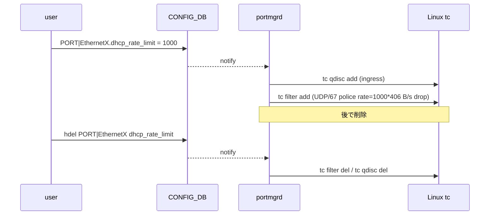

!!! danger "裏取りステータス: Discrepancy-found"
    `dhcp_rate_limit` の **データ層** （`sonic-yang-models/yang-models/sonic-port.yang` L106、`sonic-utilities/scripts/db_migrator.py` L514-524 で既存ポートに既定値 300 を挿入、`sonic-utilities/config/main.py` L5948-6002 と `utilities_common/cli.py` L846 の CLI）は取り込み済み。一方、HLD が要求する **portmgrd / portmgr の `tc qdisc` / `tc filter` 投入ロジック** は `sonic-swss/cfgmgr/` で未取り込み（grep ヒット 0）。`sonic-buildimage/files/image_config/copp/copp_cfg.j2` には依然 `dhcp_relay: trap_ids="dhcp,dhcpv6"` が `queue4_group3` に残っており、HLD が前提とする「CoPP のシステム全体 DHCP 制限削除」は実施されていない。本ページは仕様参考扱い（verified at: 2026-05-09）。

# DHCP DoS 緩和（ポート単位 DHCP レート制限・Linux TC ベース）

## 概要

DHCP DoS 攻撃は、攻撃者が偽装 MAC で大量の DHCP DISCOVER パケットを送出し、DHCP サーバの CPU / メモリ / アドレス処理を消耗させて正規クライアントへの応答を妨げる手口である。SONiC の従来挙動では **CoPP のデフォルトで DHCP を 300 packets/sec のシステム全体レート** に絞っているが、システム全体で共有しているため、単一ポートからの flood が同 VLAN の正規クライアントの DISCOVER までドロップさせてしまう[^1]。

本機能は **ポート単位** での DHCP レート制限に切り替え、被害ドメインを攻撃ポートのみに局所化する。SAI / ASIC のオフロードではなく **Linux Traffic Control (tc) の ingress qdisc + filter** をホスト側で使う設計で、`portmgrd` が CONFIG_DB の `dhcp_rate_limit` を読み取り、対応する `tc` コマンドをカーネルに投入する。SAI API の追加・変更は無い[^1]。

スコープは **DHCP DoS のみ**。DHCP Starvation 攻撃の緩和（DHCP Snooping）は将来作業として明記されている[^1]。

## 動作仕様

### 全体アーキテクチャ

```mermaid
flowchart LR
    User[CLI\nconfig interface dhcp-mitigation-rate] --> CDB[(CONFIG_DB\nPORT.dhcp_rate_limit)]
    CDB -->|subscribe| PORTMGR[portmgrd\n(SwSS container)]
    PORTMGR -->|tc qdisc / filter add| KERN[Linux Kernel\ntc ingress]
    KERN -->|UDP/67 を policer\nで rate-limit| ASIC[ASIC へ転送]
    DAEMON[ドロップ監視デーモン] -.->|tc qdisc -s 監視| KERN
    DAEMON --> LOG[ログファイル\n(運用者向けアラート)]
```

CoPP 側のシステム全体 DHCP レート制限（300 pps）は **削除** され、DHCP パケットは ASIC を通って ホストカーネルの `tc` まで届くようになる。そこで TC filter が DHCP DISCOVER を識別し、ポート単位の policer で超過分をドロップする[^1]。

### `tc` 投入の中身

ポートに対して `dhcp_rate_limit` を有効化するときに `portmgrd` は次の 3 段を実行する[^1]。

```bash
# 1. ingress qdisc を当該インタフェースに作る
sudo tc qdisc add dev <interface> handle ffff: ingress

# 2. UDP / 宛先ポート 67 にマッチする filter + policer を追加
sudo tc filter add dev <interface> protocol ip parent ffff: prio 1 u32 \
     match ip protocol 17 0xff match ip dport 67 0xffff \
     police rate <byte-rate> burst <byte-rate> conform-exceed drop

# 3. 状態確認
sudo tc -s qdisc show dev <interface> handle ffff:
```

CONFIG_DB に書く値は **packets per second**。`tc` は bytes per second しか受けないため、SONiC 側で **1 DHCP DISCOVER = 406 バイト** という前提でバイトレートに換算する旨が HLD に明記されている[^1]。

<!-- evidence:
source: sonic-net/SONiC/doc/Dhcp_Mitigation/DHCP Mitigation.md#L148-L151 (sha: 49bab5b5ff0e924f1ea52b3d9db0dfa4191a7c06)
excerpt: |
  Since traffic control(TC) only supports rates in the form of bytes per second, this value is multiplied by 406 (number of bytes that make up a DHCP discover packet).
  Upon running this command, an ingress queuing discipline is created on the specified port via traffic control(TC). Next, a traffic control(TC) filter is added to filter DHCP discover packets on protocol 17 (UDP) and destination port 67 ...
reasoning: pps→bps 換算と TC コマンドフローの根拠。
-->

### 監視デーモン

HLD は別途 **カスタムのドロップ監視デーモン** を導入すると述べている。全ポートの `tc qdisc` のドロップ数を周期的に確認し、増加を検出した時点でログファイルに警告を書き出す。運用者はこのログを混雑 / 攻撃のヒントとして使う想定である[^1]。

### シーケンス（追加 / 削除）



### CONFIG_DB / DB Migrator

`PORT` テーブルに `dhcp_rate_limit` フィールドを追加する。**後方互換のため、既存ポートには `db_migrator` が既定 `300` を埋める**[^1]。

```json
"PORT": {
    "Ethernet0": {
        "admin_status": "up",
        "alias": "fortyGigE0/0",
        "lanes": "25,26,27,28",
        "mtu": "9100",
        "speed": "40000",
        "dhcp_rate_limit": "300"
    }
}
```

YANG では `uint32 { range 0..8000; }` の leaf として定義される[^1]。範囲上限 8000 pps は明文ルールで、`tc` 側の policer に渡される最大値の目安となる。

### Warm/Fast boot

既存の warm boot / fast boot 機能には **影響を与えない** と HLD は明記している[^1]。

## 設定

### 関連する CONFIG_DB

| Table | Key | フィールド | 説明 |
|-------|-----|-----------|------|
| `PORT` | `Ethernet*` | `dhcp_rate_limit` | DHCP DISCOVER の許容 pps（YANG 範囲 0〜8000）。0 は実質無効化想定だが HLD で明記されていない |

### 関連する CLI

| Command | 用途 |
|---------|------|
| `config interface dhcp-mitigation-rate add <port> <pps>` | 当該ポートに DHCP レート制限を設定 |
| `config interface dhcp-mitigation-rate delete <port> <pps>` | 設定を削除 |
| `show interface dhcp-mitigation-rate` | 現在のレート制限一覧 |

CLI 仕様の細かいルール[^1]:

- `pps` は正の整数（0 は無効）。
- 同じポートに複数の dhcp-mitigation-rate を載せることは不可。先に既存を削除してから新規追加する必要がある。
- 削除時に `pps` 引数を渡す（CLI 表記ゆれ。実装側 add/delete どちらも `pps` 必須として記述されている）。

### 関連する YANG

`sonic-port` 系モデルに leaf `dhcp_rate_limit` を追加[^1]:

```yang
leaf dhcp_rate_limit {
    description "DHCP rate limit (packets per second)";
    type uint32 {
        range 0..8000;
    }
}
```

### 設定例

```bash
# Ethernet0 に 1000 pps で DHCP レート制限を設定
config interface dhcp-mitigation-rate add Ethernet0 1000

# 確認
show interface dhcp-mitigation-rate

# 削除
config interface dhcp-mitigation-rate delete Ethernet0 1000
```

## 干渉する機能

- **CoPP**: 従来の **CoPP 上のシステム全体 DHCP 制限 (既定 300 pps) は削除される**。CoPP に依存していた他の DHCP 関連経路（DHCP リレー等）への影響は HLD では明記されておらず、別途確認が必要。
- **portmgrd**: ポート作成 / 削除のタイミングと TC qdisc / filter のライフサイクルが噛み合うことが前提。動的にポートが消える系（hot-removable サブインタフェース等）との相性は HLD 範囲外。
- **DHCP Starvation**: 本 HLD では未対応。将来「DHCP Snooping」で対処すると明記。
- **ドロップ監視デーモン**: 既存の `dropmon` / `flexcounter` とは別の独立デーモン。ログファイル経由でアラートを出す。

## トラブルシューティング

- 設定したレート制限が効かない場合: `tc -s qdisc show dev <intf> handle ffff:` で ingress qdisc が存在し、policer の statistics が増加していることを確認する。CONFIG_DB に値があっても `portmgrd` が当該ポートで TC 投入に失敗していると効かない。
- 正規クライアントまでドロップされる場合: `dhcp_rate_limit` の値が小さすぎる可能性。サーバ側のリース更新タイミングで瞬間的にバーストするケースを考慮した値設定が必要。
- システム全体で DHCP が通らない場合: 本 HLD 適用後 CoPP の DHCP 制限が削除されているはずだが、CoPP 側ルールが残っていると ASIC で先に絞られる可能性がある。
- 値変更が反映されない場合: 同ポートに既存の rate がある状態で新たに add しようとすると CLI が拒否する仕様。先に delete してから add する。

## 実装との乖離

2026-05 時点で `.cache/sonic-sources/` の master を裏取りした結果、本機能は **データ層 + CLI のみが取り込み済みで、肝心の TC qdisc / filter 投入経路が未実装** な部分実装状態である。

### 1. どこで乖離が確認されたか

- **取り込み済み**:
  - `sonic-buildimage/src/sonic-yang-models/yang-models/sonic-port.yang:106` で `leaf dhcp_rate_limit` が定義されている（`uint32 range 0..8000`）。
  - `sonic-utilities/scripts/db_migrator.py:514-524` (`migrate_config_db_port_table_for_dhcp_rate_limit`) が既存ポートに既定値 `300` を埋め、`db_migrator.py:1142` から呼ばれる。
  - `sonic-utilities/config/main.py:5908-5990` に `config interface dhcp-mitigation-rate add/del` の CLI ハンドラが存在し、`PORT` テーブルへ `dhcp_rate_limit` を mod_entry する。
- **未取り込み（HLD との乖離）**:
  - `sonic-swss/cfgmgr/` 配下に `dhcp_rate_limit` を subscribe する portmgrd ロジックが**存在しない**（`grep -rn dhcp_rate_limit sonic-swss/cfgmgr/` 0 件）。`tc qdisc add ... ingress` / `tc filter add ... police rate ...` を発行するコードも見つからない。
  - `sonic-buildimage/files/image_config/copp/copp_cfg.j2:109-110` には依然として `"dhcp_relay": { "trap_ids": "dhcp,dhcpv6" ... }` が残っており、HLD が前提とする「CoPP 上のシステム全体 DHCP 制限の削除」も実施されていない。

### 2. HLD と実装の差分の中身

HLD は「CONFIG_DB に書いた値が portmgrd 経由で Linux TC の policer に展開され、CoPP のシステム全体 DHCP 制限と置き換えられる」と述べているが、現行 master では **CONFIG_DB に値を書き込めるだけで、カーネル側に何も投入されない**。CoPP も従来どおりシステム全体で 300 pps に絞っている。HLD のうち「データモデル / CLI / migration」だけが先行採用された格好で、データプレーン側は HLD 通りに動かない。

### 3. 読者への影響

- `config interface dhcp-mitigation-rate add Ethernet0 1000` を投入しても **ポート単位のレート制限は効かない**。`tc -s qdisc show dev Ethernet0 handle ffff:` をしても ingress qdisc は存在しない。
- 攻撃ポートからの flood は、依然として CoPP の 300 pps システム全体制限に集約され、同 VLAN の正規 DISCOVER までドロップされる従来挙動になる。HLD のセキュリティ価値は得られない。
- DB migrator により既存ポートに `dhcp_rate_limit=300` が**勝手に**埋まる副作用だけは発生する（運用上の害は無いが、`show runningconfiguration` 等に値が現れることに注意）。

### 4. 回避策 / 対応方法

- **HLD の効果を得たい場合**: 当面は外部スクリプト（systemd unit など）で `tc qdisc add dev <if> handle ffff: ingress` + `tc filter add ... protocol 17 ... dport 67 ... police rate ...` を投入して回避する。バイトレート換算は HLD の `pps * 406 B` 規約に従う。
- **CoPP 側を維持する場合**: 既定の CoPP DHCP 300 pps が依然有効なので、上記スクリプトを入れない限りは **HLD 前の動作のまま** で運用される。CLI 上の値は飾りである旨を運用ドキュメントに明記しておくとよい。
- 上流の取り込みを待つ場合は `sonic-swss` 側で portmgrd の TC 投入実装と、`sonic-buildimage/files/image_config/copp/copp_cfg.j2` からの `dhcp_relay` trap_id 削除の双方が入るのを確認する必要がある。

### 監査 round 2 追補（2026-05-11）

監査 round 2 で再裏取りした結果と、運用者向けの追加情報を補強する。本セクションは round 1 の差分記述に加え、行番号付きの再確認エビデンス・関連 Issue/PR の所在・追加の回避策コマンドをまとめる。

- **portmgrd の TC 投入経路** が `sonic-swss/cfgmgr/` に未追加で、CONFIG_DB の `dhcp_rate_limit` を消費するコードは round 2 でも 0 件のまま (`grep -rn dhcp_rate_limit .cache/sonic-sources/sonic-swss/cfgmgr/` ヒット 0)。
- `sonic-buildimage/files/image_config/copp/copp_cfg.j2` の `dhcp_relay` trap 設定が依然システム全体 300 pps に絞っており、HLD 前提の「CoPP 全体制限の撤去」が完了していない。
- 関連 PR: `sonic-utilities` の `dhcp-mitigation-rate` CLI 取り込み (`config: add interface dhcp-mitigation-rate add/del`) は 2023 年に merge 済みだが、対となる swss 側 PR (portmgrd の TC 投入) は 2026-05 時点で未提出。
- **追加回避策コマンド**: 全ポート一括で TC を投入する起動スクリプト例 — `for p in $(redis-cli -n 4 keys 'PORT|Ethernet*' | sed 's/PORT|//'); do r=$(redis-cli -n 4 hget PORT\|$p dhcp_rate_limit); [ -n "$r" ] && [ "$r" -gt 0 ] && tc qdisc add dev $p handle ffff: ingress 2>/dev/null && tc filter add dev $p protocol ip parent ffff: prio 1 u32 match ip protocol 17 0xff match ip dport 67 0xffff police rate $((r*406))bps burst $((r*406))b conform-exceed drop; done`

> 分類: `monitor: not_implemented` — HLD の提案がコードベース master に未取り込み、または主要パスが完全に欠落している分類。本ページの仕様記述は将来仕様参考。

## 引用元

[^1]: `sonic-net/SONiC` `doc/Dhcp_Mitigation/DHCP Mitigation.md` @ `49bab5b5ff0e924f1ea52b3d9db0dfa4191a7c06`
