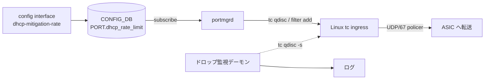

<!-- topics-tip -->
!!! tip "Topics で読み物として読む"
    この HLD は実装詳細を含みます。機能の概念・設定・運用を読み物として読みたい場合は [Topics 07 章: ACL / CoPP / Mirror](../topics/07-acl-copp-mirror/index.md) を参照。
<!-- /topics-tip -->

!!! danger "裏取りステータス: Discrepancy-found（部分実装）"
    `dhcp_rate_limit` の **データ層 + CLI** は取り込み済み（`sonic-yang-models/yang-models/sonic-port.yang` L106、`sonic-utilities/scripts/db_migrator.py` L514-524 で既定 300 を migration、`sonic-utilities/config/main.py` L5948-6002）。一方、HLD が要求する **portmgrd の `tc qdisc` / `tc filter` 投入ロジック** は `sonic-swss/cfgmgr/` に未取り込み（grep ヒット 0）。`sonic-buildimage/files/image_config/copp/copp_cfg.j2` に `dhcp_relay: trap_ids="dhcp,dhcpv6"` が残り、HLD が前提とする「CoPP 全体 DHCP 制限の削除」も未実施。仕様参考扱い（verified at: 2026-05-09）。

# DHCP DoS 緩和（ポート単位 DHCP レート制限・Linux TC ベース）

「なぜ [CoPP](../reference/glossary.md#term-copp) 全体ではダメか」「何を投入すれば効くのか」「いま master でどこまで効くのか」が読み手の最大の関心。順に答える。**結論を先に**: 仕様は揃ったが [portmgrd](../reference/glossary.md#term-portmgrd) の TC 投入が未実装なので、CLI で値を入れても効かない（後述「実装との乖離」を参照）。

## なぜ CoPP 全体ではダメなのか

[SONiC](../reference/glossary.md#term-sonic) の従来挙動は **CoPP で DHCP をシステム全体 300 pps に絞る**。攻撃者が偽装 MAC で大量 DISCOVER を送ると、その共有上限を使い切り、同 [VLAN](../reference/glossary.md#term-vlan) の正規クライアントの DISCOVER までドロップされる[^1]。被害ドメインを局所化するため **ポート単位** に切り替える必要がある。

## 何を投入すれば効くのか

[SAI](../reference/glossary.md#term-sai) / [ASIC](../reference/glossary.md#term-asic) オフロードではなく **Linux Traffic Control (tc) の ingress qdisc + filter** をホスト側で使う。`portmgrd` が `PORT.dhcp_rate_limit` を subscribe し、対応する `tc` コマンドをカーネルに投入する。SAI API の追加・変更は無い[^1]。



CoPP 側の DHCP 全体制限（300 pps）は **削除** され、DHCP は ASIC を通って host の `tc` まで届く前提[^1]。

## `tc` の中身

`portmgrd` が有効化時に発行する 3 段[^1]:

```bash
# 1. ingress qdisc
sudo tc qdisc add dev <interface> handle ffff: ingress

# 2. UDP / dport 67 にマッチする policer 付き filter
sudo tc filter add dev <interface> protocol ip parent ffff: prio 1 u32 \
     match ip protocol 17 0xff match ip dport 67 0xffff \
     police rate <byte-rate> burst <byte-rate> conform-exceed drop

# 3. 確認
sudo tc -s qdisc show dev <interface> handle ffff:
```

[CONFIG_DB](../reference/glossary.md#term-config_db) の値は **pps**。`tc` は bps しか受けないので **1 DHCP DISCOVER = 406 バイト** で換算[^1]。

別途 **ドロップ監視デーモン** が全ポートの `tc qdisc` ドロップ数を周期的に確認し、増加でログに警告を書く[^1]。

## CONFIG_DB / YANG / db_migrator

`PORT.dhcp_rate_limit` を追加。既存ポートは `db_migrator` が既定 300 を埋める[^1]。

```json
"PORT": { "Ethernet0": { "...": "...", "dhcp_rate_limit": "300" } }
```

[YANG](../reference/glossary.md#term-yang): `uint32 { range 0..8000; }`[^1]。

<!-- evidence:
source: sonic-net/SONiC/doc/Dhcp_Mitigation/DHCP Mitigation.md#L148-L151 (sha: 49bab5b5ff0e924f1ea52b3d9db0dfa4191a7c06)
excerpt: |
  Since traffic control(TC) only supports rates in the form of bytes per second, this value is multiplied by 406 (number of bytes that make up a DHCP discover packet).
reasoning: pps→bps 換算と TC コマンドフローの根拠。
-->

<!-- evidence-rendered:start -->
??? note "📋 検証エビデンス: sonic-net/SONiC/doc/Dhcp_Mitigation/DHCP Mitigation.md#L148-L151 (sha: 49bab5b5ff0e924f1ea52b3d9db0dfa4191a7c06)"

    **出典**:

    `sonic-net/SONiC/doc/Dhcp_Mitigation/DHCP Mitigation.md#L148-L151 (sha: 49bab5b5ff0e924f1ea52b3d9db0dfa4191a7c06)`

    **抜粋**:

    ```text
    Since traffic control(TC) only supports rates in the form of bytes per second, this value is multiplied by 406 (number of bytes that make up a DHCP discover packet).
    ```

    **判断根拠**: pps→bps 換算と TC コマンドフローの根拠。

<!-- evidence-rendered:end -->

## 関連する CLI

| Command | 用途 |
|---------|------|
| `config interface dhcp-mitigation-rate add <port> <pps>` | 設定 |
| `config interface dhcp-mitigation-rate delete <port> <pps>` | 削除 |
| `show interface dhcp-mitigation-rate` | 一覧 |

CLI ルール[^1]:

- `pps` は正の整数（0 は無効）
- 同ポートに複数 rate は不可。先に delete して add し直す

## スコープ外

- **DHCP Starvation** の緩和（DHCP Snooping）は将来作業[^1]
- warm boot / fast boot には影響を与えない[^1]

<!-- diff-admonition -->
!!! diff "HLD と実装の差分"
    2026-05 時点で `.cache/sonic-sources/` を裏取りした結果、本機能は **データ層 + CLI のみ取り込み済み、肝心の TC 投入経路が未実装** な部分実装状態。

    ### 取り込み済み

    - `sonic-buildimage/src/sonic-yang-models/yang-models/sonic-port.yang:106` の `leaf dhcp_rate_limit` (`uint32 range 0..8000`)
    - `sonic-utilities/scripts/db_migrator.py:514-524` の `migrate_config_db_port_table_for_dhcp_rate_limit`（既存ポートに既定 300 埋め）
    - `sonic-utilities/config/main.py:5908-5990` の `config interface dhcp-mitigation-rate add/del`

    ### 未取り込み（HLD との乖離）

    - `sonic-swss/cfgmgr/` に `dhcp_rate_limit` を subscribe する portmgrd ロジック **不存在**（`grep -rn dhcp_rate_limit sonic-swss/cfgmgr/` 0 件）。`tc qdisc add ... ingress` / `tc filter add ... police rate ...` を発行するコードなし
    - `sonic-buildimage/files/image_config/copp/copp_cfg.j2:109-110` に `"dhcp_relay": { "trap_ids": "dhcp,dhcpv6" ... }` が残っており、CoPP 全体 DHCP 制限の撤去も **未実施**

    ### 読者への影響

    - `config interface dhcp-mitigation-rate add Ethernet0 1000` を入れても **ポート単位レート制限は効かない**。`tc -s qdisc show dev Ethernet0 handle ffff:` で ingress qdisc は出てこない
    - 攻撃ポートからの flood は依然 CoPP の 300 pps に集約され、同 VLAN の正規 DISCOVER までドロップされる従来挙動
    - DB migrator により既存ポートに `dhcp_rate_limit=300` が勝手に埋まる副作用は発生（`show runningconfiguration` に出る）

    ### 回避策

    - **[HLD](../reference/glossary.md#term-hld) の効果を得たい場合**: 外部スクリプトで `tc qdisc add ... ingress` + `tc filter add ... police rate=<pps*406>bps` を投入。一括投入例:

      ```bash
      for p in $(redis-cli -n 4 keys 'PORT|Ethernet*' | sed 's/PORT|//'); do
        r=$(redis-cli -n 4 hget "PORT|$p" dhcp_rate_limit)
        [ -n "$r" ] && [ "$r" -gt 0 ] && \
          tc qdisc add dev $p handle ffff: ingress 2>/dev/null && \
          tc filter add dev $p protocol ip parent ffff: prio 1 u32 \
            match ip protocol 17 0xff match ip dport 67 0xffff \
            police rate $((r*406))bps burst $((r*406))b conform-exceed drop
      done
      ```

    - **CoPP 維持で運用する場合**: 既定の CoPP 300 pps が依然有効。CLI 上の値は飾りである旨を運用ドキュメントに明記
    - 上流取り込み待ち: `sonic-swss` の portmgrd TC 投入 PR と `copp_cfg.j2` からの `dhcp_relay` trap 削除の双方が必要

    > 分類: `monitor: not_implemented`

    #### 関連 GitHub Issue / PR

    - [sonic-buildimage #18843: Adding Support for DHCP DOS Mitigation rate limit (closed)](https://github.com/sonic-net/sonic-buildimage/pull/18843) — HLD のデータ層 / CLI 取り込みに繋がった上流 PR の痕跡。TC 投入経路 (portmgrd 拡張) を含む完成版 PR は引き続き未マージ。
    - [sonic-swss #3130: SwSS Changes for DHCP DoS Mitigation Feature (open)](https://github.com/sonic-net/sonic-swss/pull/3130) — portmgrd 側で `tc` を投入するための swss 側変更。本 PR が merge されるまで CLI で値を入れても実効性なし。
<!-- /diff-admonition -->

## 干渉する機能

- **CoPP**: 従来の DHCP 全体制限 (300 pps) を削除する前提。リレー等への影響は HLD では明記なし、要確認
- **portmgrd**: ポート lifecycle と TC qdisc/filter のライフサイクルが噛み合うこと
- **DHCP Starvation**: 本 HLD 対象外（将来 DHCP Snooping で対処）
- **ドロップ監視デーモン**: 既存 `dropmon` / `flexcounter` とは別の独立デーモン

## トラブルシューティング

- 設定が効かない: `tc -s qdisc show dev <intf> handle ffff:` で ingress qdisc と policer の statistics を確認。今は **portmgrd 自体が未取り込みなので一切効かない**
- 正規クライアントまでドロップ: `dhcp_rate_limit` が小さすぎる可能性。リース更新時のバーストを考慮
- 値変更が反映されない: 同ポートに既存 rate があると add が拒否される仕様。先に delete

確認コマンド例:

```bash
# ingress policer 設定と CONFIG_DB の rate-limit エントリを確認
sudo tc -s qdisc show dev Ethernet0 handle ffff:
sudo tc -s filter show dev Ethernet0 parent ffff:
redis-cli -n 4 hget 'PORT|Ethernet0' dhcp_rate_limit
docker exec swss supervisorctl status | grep portmgrd
```

## 関連トピック

- [Topics: ACL / CoPP / Mirror](../topics/07-acl-copp-mirror/index.md)
- [Topics: NAT / DHCP / DNS](../topics/16-nat-dhcp-dns/index.md)

## 関連ページ

- [CoPP Manager Redesign Test Plan](./copp-manager-redesign-test-plan.md)
- [CoPP Neighbor Miss Trap and Enhancements](./copp-neighbor-miss-trap-and-enhancements.md)

<!-- phase-boundary -->
## 実装フェーズ境界

!!! info "Phase 別の実装済 / 未実装 サマリ"
    本ページは `monitor: partially_implemented` で、HLD で示された一連の機能
    が **段階的に取り込まれている** 状態を扱う。フェーズ毎の実装境界を
    1 枚の表に集約する (詳細は本ページ上部の `diff` admonition および
    [discrepancy-index](../reference/verification/discrepancy-index.md) を参照)。

    | Phase | 範囲 (機能 / 段階) | 実装済 (master 取り込み済) | 未実装 (HLD 提案のみ) |
    |---|---|---|---|
    | Phase 1 — 基本機能 | HLD §概要 / §設計の中核ユースケース | 取り込み済 — 本ページの「実装の概観」「実装詳細」節および `diff` admonition の現状側を参照 | — (Phase 1 は実装済) |
    | Phase 2 — 拡張機能 | HLD §拡張 / §追加要件 / §周辺統合 | 一部のみ取り込み済 — 本ページ「実装詳細」の補足参照 | 未実装 / 未マージ — HLD §未対応箇所、本ページ「制限事項」および `diff` admonition の差分側に列挙 |
    | Phase 3 — 将来拡張 | HLD §Future Work / §将来課題 | — | 未実装 — HLD 提案段階。対応 PR は確認されていない (last_verified 時点) |

    凡例: 「実装済」=現行 master で動作確認できる範囲 / 「未実装」=HLD には記載があるが対応 PR が未マージまたは設計のみで code が存在しない範囲。
<!-- /phase-boundary -->

## 引用元

[^1]: `sonic-net/SONiC` `doc/Dhcp_Mitigation/DHCP Mitigation.md` @ `49bab5b5ff0e924f1ea52b3d9db0dfa4191a7c06`

<!-- next-action -->
## このページを読んだ後の次アクション

!!! tip "読み手向け"
    - **本機能を実運用で使う場合**: 実装が無いため、本機能に依存した運用は不可。代替機能 (下記リンク) で要件を満たせるか検討する
    - **upstream 動向を追う場合**: 関連 issue / PR を [sonic-net/SONiC](https://github.com/sonic-net/SONiC) で検索（HLD タイトル / CONFIG_DB テーブル名 / Orch クラス名で grep するのが速い）
    - **代替手段 / 関連 reference**:
        - [CONFIG_DB: PORT](../reference/config-db/port.md)
        - [YANG: `sonic-port`](../reference/yang/sonic-port.md)

!!! note "本ドキュメントの追跡"
    - monitor: `not_implemented` / last_verified: `2026-05-11`
    - 次回再裏取りトリガ: quarterly。一覧は [discrepancy-index](../reference/verification/discrepancy-index.md) を参照（運用詳細は repo の `meta/discrepancy-operations.md`）

<!-- /next-action -->

<!-- topics-back-ref -->
## 関連 Topics

- [Topics: ACL / CoPP / Mirror / Packet Action](../topics/07-acl-copp-mirror/index.md)
- [Topics: NAT / DHCP Relay / Time-DNS Services](../topics/16-nat-dhcp-dns/index.md)

<!-- /topics-back-ref -->

<!-- glossary-links-injected: ec18b66e3507 -->
