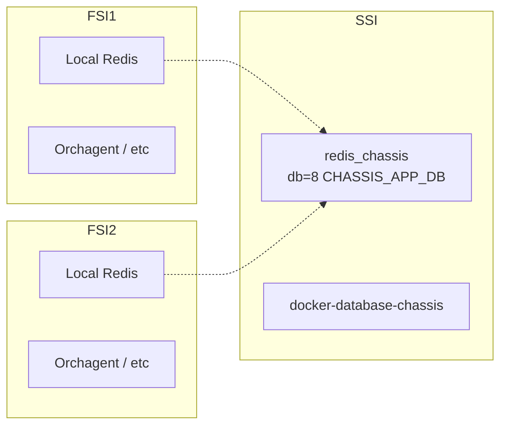

<!-- topics-tip -->
!!! tip "Topics で読み物として読む"
    この HLD は実装詳細を含みます。機能の概念・設定・運用を読み物として読みたい場合は [Topics 12 章: Multi-ASIC / VoQ / Chassis](../topics/12-multi-asic-voq/index.md) を参照。
<!-- /topics-tip -->

!!! success "裏取りステータス: Code-verified（骨格のみ）"
    `sonic-swss-common/common/database_config.json` L8-11 で `redis_chassis` インスタンス（hostname `redis_chassis.server`、`/var/run/redis/redis_chassis.sock`）、L80-88 で `CHASSIS_APP_DB` が `redis_chassis` インスタンスに紐付くこと、`sonic-buildimage/dockers/docker-database/docker-database-init.sh` L85-86 で `database-chassis` 用の docker init 経路を確認（verified at: 2026-05-09）。詳細な FSI/SSI 制御プレーンや LAG / 内部データプレーンは別 HLD 領域。

!!! note "area の経緯"
    backlog 上は `acl-qos` カテゴリだが、内容は分散転送のアーキテクチャ全体（routing / platform / system にまたがる）。本ページは backlog の指定どおり `acl-qos` 配下に置く。

# VoQ アーキテクチャの分散転送（FSI/SSI と Chassis DB / redis_chassis）

## 概要

VoQ（Virtual Output Queue）アーキテクチャでは、複数 [ASIC](../reference/glossary.md#term-asic) が **内部ファブリック** で繋がれた 1 つの論理ルータとして動く。本 [HLD](../reference/glossary.md#term-hld) は [SONiC](../reference/glossary.md#term-sonic) を「ラインカード × N」+「スーパバイザ × 1」の **分散 SONiC インスタンス** として動かすための骨格設計を定義する[^1]。

主要登場人物[^1]:

| 略号 | 名前 | 役割 |
|------|------|------|
| **FSI** | Forwarding SONiC Instance | ラインカード上の SONiC OS。1 個以上の ASIC を制御 |
| **SSI** | Supervisor SONiC Instance | スーパバイザ上の SONiC OS。FSI 群と内部ファブリックを管理 |
| ASIC / [NPU](../reference/glossary.md#term-npu) | Forwarding ASIC | 実パケット転送 |
| Fabric Chip | 内部ファブリックチップ | パケットを ASIC 間で運ぶ |

スコープは **SONiC 側の骨格のみ**（物理ポート表現と Chassis DB）。[LAG](../reference/glossary.md#term-lag) / 内部制御プレーン / データプレーンの具体は別 HLD に譲る[^1]。シャーシ前提だが「VoQ 構成なら他のフォームファクタにも拡張可能」と明記されている[^1]。

## 動作仕様

### 基本要件

- 各 FSI は **独立した SONiC** として完結し、ルーティングプロトコル等を単独で走らせる[^1]
- システム全体は **単一の SSI が中央管理**
- FSI 同士の **内部制御プレーン** は内部ファブリック上に張り、データパスと運命共有させる
- **内部管理プレーン** は別ネットワーク（管理経路）で SSI ↔ FSI を結ぶ
- 物理構成は起動時固定（HW SKU、ポート構成）。ホットスワップは **同一 SKU 限定**[^1]

### 状態共有: Chassis DB と redis_chassis



全システム共通状態は SSI 上の **`redis_chassis`** に乗る。各 FSI はローカル [Redis](../reference/glossary.md#term-redis) に加えて `redis_chassis` にもつなぎ、`CHASSIS_APP_DB`（id=8）にアクセスする[^1]。

#### `chassisdb.conf` による起動制御

`/usr/share/sonic/device/<platform>/chassisdb.conf`[^1]:

SSI 側:

```text
start_chassis_db=1
chassis_db_address=<redis_chassis IP>
```

FSI 側:

```text
chassis_db_address=<redis_chassis IP>
```

新規 systemd サービス `config-chassisdb` がこのファイルを読んで動作を分岐する[^1]:

- SSI: `docker-database-chassis` を起動 → `redis_chassis` 立ち上げ
- FSI: コンテナは起動しない。`/etc/hosts` に `redis_chassis.server` の IP を追記、`database_config.json` の `redis_chassis` エントリ経由で接続

#### `database_config.json` 抜粋[^1]

```json
"redis_chassis": {
  "hostname": "redis_chassis.server",
  "port": 6380,
  "unix_socket_path": "/var/run/redis/redis_chassis.sock",
  "unix_socket_perm": 777
},
"CHASSIS_APP_DB": { "id": 8, "separator": ":", "instance": "redis_chassis" }
```

SSI ↔ FSI 間の IP 到達性（典型的には 127.1/16 の linklocal）はプラットフォーム実装側の責務[^1]。

### チップ管理

| 種別 | 役割 | 管理 |
|------|------|------|
| **Forwarding ASIC (NPU)** | パケット受信・転送・キューイング・送信 | 既存 multi-ASIC パラダイム（`syncd` / `swss` インスタンス × N）|
| **Fabric Chip** | ASIC 間のファブリック転送 | パケット転送には関与せず、初期化後はモニタリングのみ |

Switch ID 採番[^1]:

- 各チップに **グローバル一意な Switch ID**
- チップは `C` 個の連続 Switch ID を消費（`C` = switching cores 数）
- 各コアは `0 〜 C` の Core ID

詳細は [SAI VoQ 仕様](https://github.com/opencomputeproject/SAI/blob/master/doc/VoQ/SAI-Proposal-VoQ-Switch.md) を参照[^1]。

### 命名

| 単位 | 命名規則 | 例 |
|------|---------|-----|
| FSI | `Linecard-N`（N = slot 番号）| `Linecard-3` |
| ASIC | `Linecard-N.K`（K = カード内 ASIC 番号）| `Linecard-3.0` |

ASIC 名は **グローバル DB のキー修飾子** として使われ、`syncd` / `OrchAgent` 等のコンテナ識別にも使われる[^1]。

### ポート分類

| 種別 | 説明 |
|------|------|
| **Local Ports** | フロントパネル直結ポート。既存の固定 SONiC と同じ表現 |
| **System Ports (sysports)** | 全システムでグローバル一意な `system_port_id` を持つ。各ポートには `Core Port Id`（コア内ローカル）も与えられる |
| **Inband Ports** | 内部制御プレーン用。FSI CPU と内部ファブリックを繋ぎ、`system_port_id` を持って全 FSI から到達可能[^1] |
| **Fabric Ports** | 本 HLD の対象外（別 HLD）|

### 障害シナリオ

| 障害 | 期待動作 |
|------|---------|
| FSI 障害 | Chassis DB 接続が切れる。内部制御プレーンが落ちて経路が再収束し、その FSI を経由しない[^1] |
| FSI ↔ Chassis DB 切断 | FSI が他 FSI の状態を取れなくなる → **外部とのプロトコルセッションを停止** して防御的に隔離する[^1] |
| SSI 障害 | 全 FSI が Chassis DB に届かなくなる → 上記と同じ防御動作で **システム全体が外部から隔離** される |

<!-- evidence:
source: sonic-net/SONiC/doc/voq/architecture.md#L218-L233 (sha: 49bab5b5ff0e924f1ea52b3d9db0dfa4191a7c06)
excerpt: |
  Loss of connectivity to the Chassis DB can prevent forwarding state from other FSIs from being propagated.
  To avoid traffic impact, The FSI must take defensive action to disconnect from the outside world
  (for example by ceasing protocol sessions) with neighbors to avoid any traffic flows through the FSI.
reasoning: Chassis DB 切断時の防御的シャットダウン動作の根拠。
-->

<!-- evidence-rendered:start -->
??? note "📋 検証エビデンス: sonic-net/SONiC/doc/voq/architecture.md#L218-L233 (sha: 49bab5b5ff0e924f1ea52b3d9db0dfa4191a7c06)"

    **出典**:

    `sonic-net/SONiC/doc/voq/architecture.md#L218-L233 (sha: 49bab5b5ff0e924f1ea52b3d9db0dfa4191a7c06)`

    **抜粋**:

    ```text
    Loss of connectivity to the Chassis DB can prevent forwarding state from other FSIs from being propagated.
    To avoid traffic impact, The FSI must take defensive action to disconnect from the outside world
    (for example by ceasing protocol sessions) with neighbors to avoid any traffic flows through the FSI.
    ```

    **判断根拠**: Chassis DB 切断時の防御的シャットダウン動作の根拠。

<!-- evidence-rendered:end -->

### 将来課題（HLD §4）

- **Dynamic system ports**: 走行中の FSI 追加 / SKU 変更カードへの差し替え。[SAI](../reference/glossary.md#term-sai) に `create_port` / `remove_port` のサポートが必要[^1]。
- **Dual supervisor**:
  - Warm standby: スタンバイ SSI は OS 起動だけ。切替時に再ブート相当の処理。OrchAgent / [syncd](../reference/glossary.md#term-syncd) を一旦止めて Redis アドレスを切替えて再接続[^1]
  - Hot standby: スタンバイ SSI も Chassis DB を mirror で保持。Live sync + 再接続時に SAI [ASIC_DB](../reference/glossary.md#term-asic_db) と整合をとる必要[^1]

## 設定

### 関連する CONFIG_DB / CLI / YANG

このページの主要表面は `chassisdb.conf` と `database_config.json` というファイルレベル。`CHASSIS_APP_DB` 上のテーブルスキーマは別 HLD（system port 等）に分離されている[^1]。

### 設定例（SSI 上）

```text
# /usr/share/sonic/device/<platform>/chassisdb.conf
start_chassis_db=1
chassis_db_address=127.100.0.1
```

### 設定例（FSI 上）

```text
# /usr/share/sonic/device/<platform>/chassisdb.conf
chassis_db_address=127.100.0.1
```

`/etc/hosts` に `127.100.0.1 redis_chassis.server` を `config-chassisdb` が追加する[^1]。

## 制限事項

- **物理構成は起動時固定**: HW SKU と物理ポート構成は起動時に決定し、走行中の動的変更は将来課題[^1]。
- **同一 SKU 限定のホットスワップ**: ラインカード差し替えは同 SKU 部品でのみサポート[^1]。
- **Fabric ports は本 HLD 範囲外**: 別 HLD で扱う[^1]。
- **古い HLD**: 2020-09 改訂。Single-ASIC VoQ 拡張など派生 HLD（[Single-ASIC VoQ](../platform/single-asic-voq-fixed-system-sonic.md)）が後から追加されており、最新の master では設計が分岐していることに留意。

## 干渉する機能

- **`syncd` / `swss` の [Multi-ASIC](../reference/glossary.md#term-multi-asic) 動作**: 既存の multi-ASIC パターンの拡張。FSI 内の ASIC ごとに `syncd` / `swss` が立つ。
- **iBGP メッシュ（[BGP for VoQ Chassis](../routing/bgp-setup-for-voq-chassis.md)）**: 内部 FSI 間の制御プレーンとして iBGP を張る前提。本 HLD はその物理基盤を提供する。
- **Single-ASIC VoQ**: chassisdb.conf の有無を `is_voq_chassis()` の判定キーに流用する派生機能[^1]（[Single-ASIC VoQ](../platform/single-asic-voq-fixed-system-sonic.md) 参照）。
- **dual-tor / [SmartSwitch](../reference/glossary.md#term-smartswitch)**: 似た概念だが本 HLD のスコープ外。Chassis DB は混同しないこと。

## トラブルシューティング

- FSI が起動するが他 FSI からの状態が見えない: `redis_chassis.server` への IP 到達性を確認。`/etc/hosts` と `chassisdb.conf` の整合をチェック[^1]。
- SSI 障害後、FSI が外部接続を切る: 仕様どおりの防御動作[^1]。SSI を回復させるか、`chassisdb.conf` を修正してから FSI を再起動。
- Switch ID の衝突: `C` 個連続消費の規則に違反していないか、各チップに与えた Switch ID 範囲を確認。

確認コマンド例:

```bash
# Chassis DB / FSI / SSI / Switch ID を確認
cat /etc/sonic/chassisdb.conf
redis-cli -h redis_chassis.server -p 6380 ping
redis-cli -h redis_chassis.server -p 6380 keys 'SYSTEM_NEIGH|*'
show chassis-module status
```

## 引用元

[^1]: `sonic-net/SONiC` `doc/voq/architecture.md` @ `49bab5b5ff0e924f1ea52b3d9db0dfa4191a7c06`

<!-- topics-back-ref -->
## 関連 Topics

- [Topics: Multi-ASIC / VOQ Chassis](../topics/12-multi-asic-voq/index.md)

<!-- /topics-back-ref -->

<!-- glossary-links-injected: 5c9b3765d470 -->
