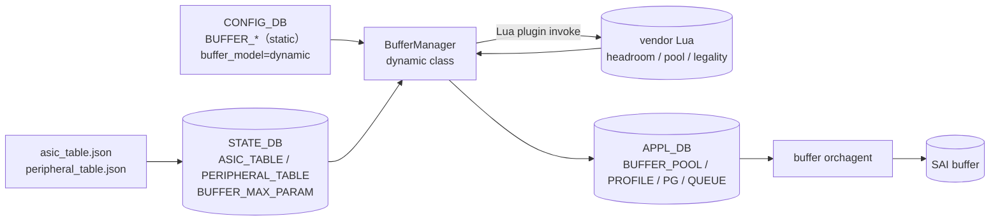

<!-- topics-tip -->
!!! tip "Topics で読み物として読む"
    この HLD は実装詳細を含む。機能の概念・設定・運用を読み物として読みたい場合は [Topics 08 章: QoS / Buffer / PFC](../topics/08-qos-buffer/index.md) を参照。
<!-- /topics-tip -->

!!! success "裏取りステータス: code-verified (2026-05-11)"
    `buffermgrd` の dynamic クラス主要パスを `sonic-swss/cfgmgr/buffermgrdyn.cpp` で確認: `default_dynamic_th` の `LOSSLESS_TRAFFIC_PATTERN` 読込 (L148-L153)、dynamic pool size 計算ループ (L676-L782)、`dynamic_calculated` profile 管理 (L1297, L1429-L1483)、shared headroom pool による dynamic profile 更新 (L1609-L1681)、PG 適用ガード (L1737-L1757)。vendor 提供 Lua plugin / `asic_table.json` 自体は vendor binary 配布相当のため非確認。

# Dynamic Headroom Calculation（buffer_model = dynamic）

[PFC](../reference/glossary.md#term-pfc) headroom（lossless 用 PG の `xon` / `xoff` / `size`）を **`pg_profile_lookup.ini` のテーブル lookup ではなく式から動的計算** するモード。読み手の関心は「**traditional から何が変わるのか**」「**何が再計算の trigger なのか**」「**vendor 依存をどう吸収しているのか**」の 3 点。順に答える。

## traditional から何が変わるのか

| 軸 | traditional | dynamic |
|----|-------------|---------|
| headroom 算出 | `pg_profile_lookup.ini` の表 lookup | cell size / IPG / MTU / cable / gearbox 等から式で計算 |
| 任意 cable length | 表に無いと対応不可 | 連続的に対応 |
| 静的 → 動的 変換 | なし（[CONFIG_DB](../reference/glossary.md#term-config_db) → [APPL_DB](../reference/glossary.md#term-appl_db) 素通し） | `BufferManager` が CONFIG_DB → APPL_DB で動的計算 |
| 起動 | `buffermgrd -l pg_profile_lookup.ini` | `buffermgrd -a asic_table.json -p peripheral_table.json` |

切替は `DEVICE_METADATA.localhost.buffer_model`（既定 `traditional`）[^1]:

| シナリオ | mode |
|----------|------|
| dynamic 対応 vendor の新規 install | `dynamic` |
| upgrade で buffer 設定がデフォルトのまま | `dynamic`（自動マイグレーション） |
| upgrade で buffer 設定を変えていた | `traditional` 維持 |
| `config load_minigraph` | `traditional` に戻る |
| `config qos reload` | 既定 `dynamic`、`--no-dynamic-mode` で traditional |

## 何が再計算の trigger なのか

| 入力変化 | 動作 |
|----------|------|
| port `speed` / `cable-length` / `MTU` 変更 | 当該 port の lossless PG 全てを再計算 |
| port admin shutdown / startup | shared pool 再計算（admin-down は headroom 寄与ゼロ） |
| `LOSSLESS_TRAFFIC_PATTERN` / `LOSSLESS_BUFFER_PARAM` 変更 | 全 port 再計算 |
| `BUFFER_PROFILE` を user が override | その profile の dynamic 計算を停止 |

## vendor 依存をどう吸収しているのか

vendor が **Lua plugin 3 つ + JSON 2 つ** を提供する[^1]。

| Lua plugin | 役割 |
|--------|------|
| headroom calc | speed/cable/MTU 変更で headroom 再計算 |
| legality check | 計算結果が [ASIC](../reference/glossary.md#term-asic) で実装可能か判定 |
| pool calc | shared pool size 再計算 |



`STATE_DB` に積むテーブル[^1]:

```text
ASIC_TABLE|<VENDOR>:        cell_size, ipg, pipeline_latency, mac_phy_delay, peer_response_time
PERIPHERAL_TABLE|<model>:   gearbox_delay, ...
PORT_PERIPHERAL_TABLE|<port>: peripheral = <model>
BUFFER_MAX_PARAM:           （SAI から取得した max headroom など）
```

[SAI](../reference/glossary.md#term-sai) 側は新 port attribute `SAI_PORT_ATTR_MAXIMUM_HEADROOM_SIZE` を読んで legality check に使う[^1]。

## buffer model の違い（独立 vs shared headroom pool）

| 軸 | independent headroom | shared headroom pool |
|----|---------------------|----------------------|
| `BUFFER_POOL.xoff` | 不要 | shared headroom pool size |
| `BUFFER_PROFILE.size` | `xon + xoff` 以上 | `xon + xoff` 未満可（threshold のみ） |
| ingress pool size | headroom 更新で要再計算 | 再計算不要 |

shared headroom pool は `BUFFER_POOL.xoff` で有効化。over-subscribe ratio または pool size 直指定[^1]。

<!-- evidence:
source: sonic-net/SONiC/doc/qos/dynamically-headroom-calculation.md#L102-L114 (sha: 49bab5b5ff0e924f1ea52b3d9db0dfa4191a7c06)
excerpt: |
  - When a port's cable length, speed or MTU is updated, headroom of all lossless priority groups will be updated according to the well-known formula
  - All the statically configured data will be stored in `CONFIG_DB` and all dynamically data in `APPL_DB`.
reasoning: 入力 → 再計算 → APPL_DB の流れと CONFIG_DB / APPL_DB / STATE_DB の責務分担。
-->

<!-- evidence-rendered:start -->
??? note "📋 検証エビデンス: sonic-net/SONiC/doc/qos/dynamically-headroom-calculation.md#L102-L114 (sha: 49bab5b5ff0e924f1ea52b3d9db0dfa4191a7c06)"

    **出典**:

    `sonic-net/SONiC/doc/qos/dynamically-headroom-calculation.md#L102-L114 (sha: 49bab5b5ff0e924f1ea52b3d9db0dfa4191a7c06)`

    **抜粋**:

    ```text
    - When a port's cable length, speed or MTU is updated, headroom of all lossless priority groups will be updated according to the well-known formula
    - All the statically configured data will be stored in `CONFIG_DB` and all dynamically data in `APPL_DB`.
    ```

    **判断根拠**: 入力 → 再計算 → APPL_DB の流れと CONFIG_DB / APPL_DB / STATE_DB の責務分担。

<!-- evidence-rendered:end -->

## Headroom override（式から外す）

特定 port の headroom を式から外して固定値にする運用も可能。`BUFFER_PROFILE` を直接指定して `BUFFER_PG` に当てる[^1]。

## 関連する CLI / CONFIG_DB

| Command | 用途 |
|---------|------|
| `config qos reload` | dynamic mode 適用 |
| `config qos reload --no-dynamic-mode` | traditional に戻す |
| `config interface {speed\|cable-length\|mtu}` | 動的再計算の trigger |

```yaml
DEVICE_METADATA|localhost:    buffer_model = dynamic | traditional
LOSSLESS_TRAFFIC_PATTERN:     mtu, small_packet_percentage, default_dynamic_th
LOSSLESS_BUFFER_PARAM:        default_lossless_pgs   # 例 "3,4"
```

## 制限事項

- vendor が dynamic 対応 Lua plugin と `asic_table.json` / `peripheral_table.json` を提供する platform 限定
- `config load_minigraph` で traditional に戻る（運用での意図せぬ復帰に注意）
- speed / cable-length 変更が即時に SAI まで効くため、ライブ運用で lossless トラフィックに影響あり

## 干渉する機能

- **[Reclaim Reserved Buffer](./reclaim-reserved-buffer.md)**: dynamic mode 下の admin-down port も `zero_profile` で reclaim 可能
- **PFC**: lossless PG（default `3, 4`）と headroom 計算が直接連動
- **Gearbox**: `PERIPHERAL_TABLE` で peripheral delay を加味

## トラブルシューティング

- speed 変更後 headroom が更新されない → `buffermgrd` ログで Lua plugin invoke を確認、`BUFFER_MAX_PARAM` legality check で reject されていないか確認
- shared pool の sum が合わない → `xoff` の有無、independent vs shared headroom モデルを確認

### コマンド例: 動的 headroom の確認

下記コマンドを順に実行することで、関連する CONFIG_DB / APP_DB / [STATE_DB](../reference/glossary.md#term-state_db) のエントリと、
CLI 表示・syslog の整合を一通り突き合わせ確認できる。

```bash
# 各ポートで適用中の dynamic profile / headroom 値を確認
show buffer pool
show priority-group persistent-watermark headroom
redis-cli -n 4 hgetall 'BUFFER_PROFILE|pg_lossless_100000_5m_profile'
# buffermgrd ログから dynamic 再計算イベントを抽出
sudo grep -i 'buffermgrd' /var/log/syslog | tail -50
```

## 裏取り済み実装位置 (2026-05-11)

- `default_dynamic_th` 読み込み: `sonic-swss/cfgmgr/buffermgrdyn.cpp` L148-L153
- dynamic pool size 計算ループ: L676-L782
- `dynamic_calculated` profile 管理: L1027-L1028, L1297, L1429-L1515
- shared headroom pool 更新時の profile 再計算: L1609-L1681
- PG への適用ガード: L1737-L1757

## 関連ページ

- [Reclaim Reserved Buffer](./reclaim-reserved-buffer.md)
- [Watermark Counters in SONiC](./watermark-counters-in-sonic.md)

## 引用元

[^1]: `sonic-net/SONiC` `doc/qos/dynamically-headroom-calculation.md` @ `49bab5b5ff0e924f1ea52b3d9db0dfa4191a7c06`

<!-- topics-back-ref -->
## 関連 Topics

- [Topics: QoS / Buffer / PFC / Watermark](../topics/08-qos-buffer/index.md)

<!-- /topics-back-ref -->

<!-- glossary-links-injected: c006405759d8 -->
