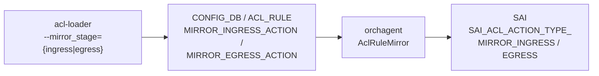
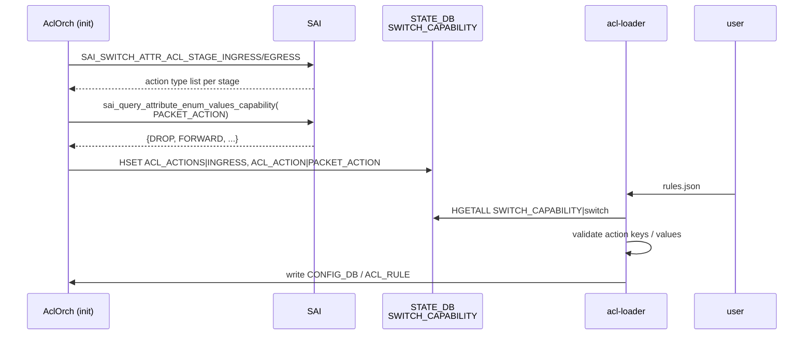

!!! warning "裏取りステータス: HLD-only / 古い HLD"
    本ページは 2019-05 改訂の古い HLD を根拠に書かれている。実装は HLD 提案の上に **`MIRROR_INGRESS_ACTION` / `MIRROR_EGRESS_ACTION` キー** や **`SWITCH_CAPABILITY` テーブル** として現行 master に取り込まれているが、`acl-loader --mirror_stage` オプションや `SWITCH_CAPABILITY` のキー命名（`ACL_ACTIONS|INGRESS` 等）が現行版どおりかは未確認。HLD 末尾の TODO（`sai_query_attribute_enum_values_capability` の libsairedis 対応）が解消されているかも未確認。

# ACL の egress mirror 対応と SAI ベース action capability 問い合わせ

## 概要

ACL は **ASIC ごとに ingress / egress stage で使えるアクションが異なる**。例えば「ingress テーブルに egress mirror アクションを設定できるか」「DROP / FORWARD / COPY 等のうちどれを `PACKET_ACTION` として書けるか」は ASIC 依存である。SONiC は当初 ACL_RULE のスキーマ上で stage を区別していなかったため、設定が ASIC で受理されるかどうかは試行錯誤に依存していた[^1]。

本 HLD は 2 つの変更を提案する[^1]:

1. **ACL_RULE スキーマに mirror アクションを ingress/egress 別に書ける拡張** を入れる（`MIRROR_INGRESS_ACTION` / `MIRROR_EGRESS_ACTION`、互換のため従来 `MIRROR_ACTION` も残す）。stage を SONiC 側で制限せず、SAI に投げて ASIC が受理するかを問い合わせで判別する設計
2. orchagent が起動時に **SAI から ACL アクションの capability を問い合わせ**、`STATE_DB` の `SWITCH_CAPABILITY` テーブルに公開する。Producer（acl-loader 等）はこれを参照して投入前に validate する

## 動作仕様

### 1. egress mirror サポート

SAI には mirror アクションが `SAI_ACL_ACTION_TYPE_MIRROR_INGRESS` と `SAI_ACL_ACTION_TYPE_MIRROR_EGRESS` の 2 種類存在する[^1]。SONiC の従来スキーマでは ACL_RULE に `MIRROR_ACTION` 1 種類しか無く、ingress テーブルに egress mirror を貼る組合せ等を表現できなかった。

#### `ACL_RULE` 拡張

| キー | 用途 | 後方互換 |
|------|------|---------|
| `MIRROR_ACTION` | 従来キー。値は mirror session 名。**暗黙的に ingress 扱い** | 既存設定はそのまま動く |
| `MIRROR_INGRESS_ACTION` | 明示的に ingress mirror 用 | 新規 |
| `MIRROR_EGRESS_ACTION` | 明示的に egress mirror 用 | 新規 |

設定例（ingress everflow テーブルに egress mirror ルールを追加）[^1]:

```json
{
  "ACL_RULE": {
    "EVERFLOW_INGRESS|RULE_1": {
      "MIRROR_EGRESS_ACTION": "everflow0",
      "PRIORITY": "9999",
      "SRC_IP": "20.0.0.10/32"
    }
  }
}
```

#### orchagent (`AclRuleMirror`) の処理

- 新スキーマを受理し、キー名から `SAI_ACL_ACTION_TYPE_MIRROR_INGRESS` / `MIRROR_EGRESS` への変換を行う
- 旧 `MIRROR_ACTION` キーは ingress として解釈する（後方互換）

#### `acl-loader` の拡張

CLI 側にも新オプションが入る[^1]:

```bash
admin@sonic:~$ acl-loader update incremental \
    --session_name=everflow0 \
    --mirror_stage=egress \
    rules.json
```

- `--mirror_stage` を省略すると **ingress** になる
- `egress` を指定すると `MIRROR_EGRESS_ACTION` として ACL_RULE に投入される



### 2. ACL アクション capability の問い合わせ

orchagent (`AclOrch`) は **初期化時に** SAI から ACL stage capability を取り出し、内部マップに保持し、`STATE_DB` に公開する[^1]。

#### 問い合わせる SAI 属性

| SAI 属性 | 内容 |
|----------|------|
| `SAI_SWITCH_ATTR_MAX_ACL_ACTION_COUNT` | 1 ルールに付けられる最大 action 数 |
| `SAI_SWITCH_ATTR_ACL_STAGE_INGRESS` | ingress stage で使える action type のリスト |
| `SAI_SWITCH_ATTR_ACL_STAGE_EGRESS` | egress stage で使える action type のリスト |

action 値が **enum 型**（例: `SAI_ACL_ENTRY_ATTR_ACTION_PACKET_ACTION` の `DROP` / `FORWARD` / `COPY` / `TRAP` 等）である場合は、追加で `sai_query_attribute_enum_values_capability` を呼んで使える enum 値の一覧を取得する[^1]:

```c++
status = sai_query_attribute_enum_values_capability(
    gSwitchId,
    SAI_OBJECT_TYPE_SWITCH,
    SAI_ACL_ENTRY_ATTR_ACTION_PACKET_ACTION,
    &enum_values_capability);
```

HLD は次の制約を明記している[^1]:

- `sai_query_attribute_enum_values_capability` は **stage 別の値を返さない**（ingress / egress を区別できない）
- HLD 執筆当時 (2019-05) `sai_query_attribute_enum_values_capability` は **libsairedis に未実装**（HLD の TODO）

<!-- evidence:
source: sonic-net/SONiC/doc/acl/acl_stage_capability.md#L92-L97 (sha: 49bab5b5ff0e924f1ea52b3d9db0dfa4191a7c06)
excerpt: |
  **NOTE**: sai_query_attribute_enum_values_capability does not return values supported per stage
  **TODO**: sai_query_attribute_enum_values_capability not yet supported by libsairedis implementation
reasoning: HLD は SAI API の制約と未実装事項を明記している。本ページではそれを「HLD 当時の前提」として読み手に共有する。
-->

#### `AclOrch` のクラス追加

```c++
class AclOrch
{
public:
  // stage で attr action が SAI で受理可能かを返す
  bool isActionSupported(acl_stage_type_t stage,
                         sai_acl_entry_attr_t attr) const;
private:
  void queryAclCapabilities();   // init() から呼ばれる
  std::map<sai_acl_stage_t, std::set<sai_acl_action_type_t>>
      m_aclStageCapabilities;
  std::map<sai_acl_entry_attr_t, std::set<int32_t>>
      m_aclEnumActionCapabilities;
};
```

`AclRule::validateAddAction` で上記マップを参照し、各派生（`AclRuleMirror` 等）が override 内で base を呼んで stage 適合性を弾く[^1]。

#### `STATE_DB / SWITCH_CAPABILITY` の公開フォーマット

orchagent は capability を **`SWITCH_CAPABILITY|switch`** に書き出す[^1]:

```text
127.0.0.1:6379[6]> hgetall "SWITCH_CAPABILITY|switch"
"ACL_ACTIONS|INGRESS"      "PACKET_ACTION,REDIRECT_ACTION,MIRROR_ACTION_INGRESS"
"ACL_ACTIONS|EGRESS"       "PACKET_ACTION,MIRROR_ACTION_EGRESS"
"ACL_ACTION|PACKET_ACTION" "DROP,FORWARD,COPY,TRAP"
```

- `ACL_ACTIONS|<stage>` で **その stage で使える action キー** を列挙
- `ACL_ACTION|<action-key>` で **enum 値**（`PACKET_ACTION` の `DROP` 等）を列挙

Producer（acl-loader 等）は次の順で validate する:

1. `ACL_ACTIONS|<stage>` を見て action キー自体が許されるか
2. キーが許される場合、`ACL_ACTION|<action-key>` が存在すれば値も enum 制約に当たるか
3. 値が object 参照型（mirror session / redirect target）の場合は enum 検査をスキップ



### 3. `redirect` の表記変更

旧 `PACKET_ACTION: redirect:Ethernet8` 形式は SAI と整合しないため、HLD は **`REDIRECT_ACTION` を独立キー** として切り出す[^1]:

```text
redirect_action = 1*255VCHAR   ; refer to the redirect object
```

旧形式の `"PACKET_ACTION": "redirect:Ethernet8"` は **後方互換のため動作させる**。

### 4. vslib / VS test

vslib では `SAI_SWITCH_ATTR_ACL_STAGE_INGRESS / EGRESS` をサポートする。HLD は 2 案を比較し、**「すべての action を supported として返す」シンプル案** を採用する（device 別 emulation はメンテナンス性が悪いため）[^1]。

VS テストの追加[^1]:

- ingress / egress テーブル × ingress / egress mirror ルールの全組合せの作成検査
- `setReadOnlyAttribute` で `SAI_SWITCH_ATTR_ACL_STAGE_*` を上書きし orchagent 再起動 → 未対応 action のルール作成 → ASIC_DB に entry が出ないことの検査

## 設定

### 関連する CONFIG_DB

| Table | Key | 説明 |
|-------|-----|------|
| `ACL_RULE` | `<table>|<rule>` | `MIRROR_INGRESS_ACTION` / `MIRROR_EGRESS_ACTION` / `REDIRECT_ACTION` を新キーとして受ける。`MIRROR_ACTION` は ingress 互換 |

### 関連する STATE_DB

| Table | Key | 説明 |
|-------|-----|------|
| `SWITCH_CAPABILITY` | `switch` | orchagent 起動時に `ACL_ACTIONS|<stage>` と `ACL_ACTION|<action>` を書き込む |

### 関連する CLI

| Command | 用途 |
|---------|------|
| `acl-loader update incremental --session_name=<n> --mirror_stage=ingress\|egress <rules.json>` | mirror stage を明示して ACL_RULE を投入 |

### 設定例

```bash
acl-loader update incremental \
  --session_name=everflow0 \
  --mirror_stage=egress \
  /etc/sonic/everflow_rules.json
```

## 制限事項

- HLD 当時 `sai_query_attribute_enum_values_capability` は **stage 別の値を返さない**。stage を区別したい場合は `SAI_SWITCH_ATTR_ACL_STAGE_INGRESS/EGRESS` の action type リスト側で制御する[^1]
- HLD 当時 `sai_query_attribute_enum_values_capability` は **libsairedis に未実装**（TODO）。実装が入るまで enum 値検査は実質スキップされる可能性[^1]
- ベンダ SAI が `SAI_SWITCH_ATTR_ACL_STAGE_*` を実装していなければ capability は空となり、orchagent が action 妥当性を判定できない
- vslib は **すべての action が supported** として返す方針。VS テストでは ASIC 個体差を検査できない
- system-level test は HLD 上 TBD

## 干渉する機能

- **AclOrch / AclRuleMirror**: 新スキーマと capability マップ参照で挙動が変わる
- **acl-loader**: `--mirror_stage` の追加と `SWITCH_CAPABILITY` 参照
- **mirror session 管理**: ingress / egress mirror が同一 ACL に共存し得るため、session 種別との整合確認が必要
- **`SWITCH_CAPABILITY` テーブル**: 他機能（CRM / port capability 等）と key namespace を共有しており、衝突しないキー命名が必要

## トラブルシューティング

- ACL ルールが ASIC_DB に降りない → `redis-cli -n 6 hgetall "SWITCH_CAPABILITY|switch"` で stage 別 action リストを確認
- `MIRROR_EGRESS_ACTION` を入れても効かない → vslib / ベンダ SAI 側で `SAI_SWITCH_ATTR_ACL_STAGE_EGRESS` の戻り値に `MIRROR_EGRESS` が含まれているかを確認
- 旧 `PACKET_ACTION: redirect:<port>` を使いつつ新 `REDIRECT_ACTION` も書く → 両者の扱いは互換ルートが優先されるため、片方に統一する

## 引用元

[^1]: `sonic-net/SONiC` `doc/acl/acl_stage_capability.md` @ `49bab5b5ff0e924f1ea52b3d9db0dfa4191a7c06`

<!-- concerns hint:
- AclOrch::queryAclCapabilities の現行 master 実装存在確認
- SWITCH_CAPABILITY テーブルのキー命名（ACL_ACTIONS|INGRESS 等）が現行版に取り込まれているか未確認
- acl-loader の --mirror_stage オプション実装存在確認
- libsairedis に sai_query_attribute_enum_values_capability が実装されたか未確認
- HLD は 2019 年改訂のため現行 master 実装との大幅な乖離リスクあり
-->
