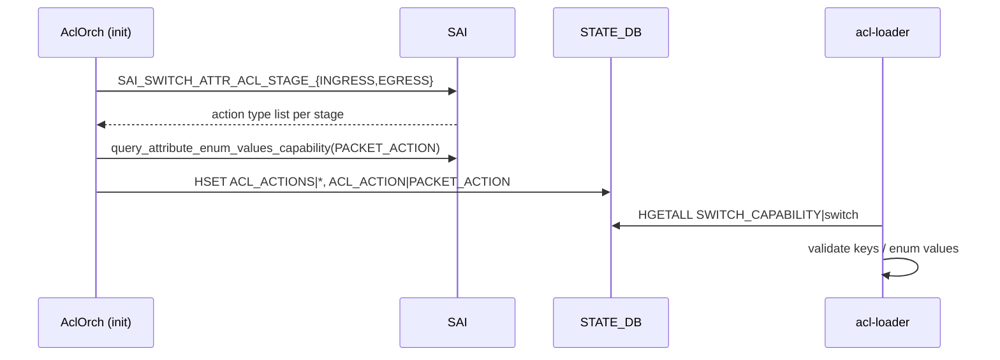

<!-- topics-tip -->
!!! tip "Topics で読み物として読む"
    この HLD は実装詳細を含みます。機能の概念・設定・運用を読み物として読みたい場合は [Topics 07 章: ACL / CoPP / Mirror](../topics/07-acl-copp-mirror/index.md) を参照。
<!-- /topics-tip -->

!!! success "裏取りステータス: code-verified (2026-05-11)"
    HLD の主要要素は master に取り込み済: `ACTION_MIRROR_{INGRESS,EGRESS}_ACTION` 定数（`aclorch.h:70-71`）、`AclOrch::queryAclActionCapability()` / `putAclActionCapabilityInDB()`（`aclorch.cpp:3975`,`4056`）、`SWITCH_CAPABILITY` への `ACL_ACTIONS|<stage>` 書き込み（`aclorch.cpp:4061`）、`acl-loader full --mirror_stage {ingress,egress}`（`acl_loader/main.py:1209,1238`）、libsairedis の `queryAttributeEnumValuesCapability`（`RedisRemoteSaiInterface.cpp:1245`）。詳細は末尾「実装との乖離」。

# ACL の egress mirror 対応と SAI ベース action capability 問い合わせ

## なぜ必要か

[ACL](../reference/glossary.md#term-acl) は **[ASIC](../reference/glossary.md#term-asic) ごとに ingress / egress stage で使えるアクションが異なる**。当初 [SONiC](../reference/glossary.md#term-sonic) は ACL_RULE スキーマで stage を区別せず、設定が ASIC で受理されるかは試行錯誤に依存していた[^1]。

本 [HLD](../reference/glossary.md#term-hld) は 2 点を入れる[^1]:

1. **ACL_RULE に mirror を ingress/egress 別に書ける拡張**（`MIRROR_INGRESS_ACTION` / `MIRROR_EGRESS_ACTION`、後方互換のため `MIRROR_ACTION` も残す）
2. **[orchagent](../reference/glossary.md#term-orchagent) 起動時に [SAI](../reference/glossary.md#term-sai) から ACL action capability を問い合わせ**、`STATE_DB.SWITCH_CAPABILITY` に公開。producer が投入前に validate

## 1. egress mirror サポート

SAI には mirror action が `SAI_ACL_ACTION_TYPE_MIRROR_INGRESS` / `MIRROR_EGRESS` の 2 種類あるが、旧 SONiC は `MIRROR_ACTION` 1 種類のみで「ingress テーブルに egress mirror」のような組合せを表現できなかった[^1]。

### `ACL_RULE` 拡張

| キー | 用途 |
|------|------|
| `MIRROR_ACTION` | 旧キー。**暗黙的に ingress** 扱い（互換） |
| `MIRROR_INGRESS_ACTION` | 明示 ingress mirror |
| `MIRROR_EGRESS_ACTION` | 明示 egress mirror |

```json
{ "ACL_RULE": { "EVERFLOW_INGRESS|RULE_1": {
  "MIRROR_EGRESS_ACTION": "everflow0",
  "PRIORITY": "9999", "SRC_IP": "20.0.0.10/32" } } }
```

`AclRuleMirror` がキー名から SAI action type へ変換。旧 `MIRROR_ACTION` は ingress として処理する。

### `acl-loader` 拡張

```bash
acl-loader update incremental \
  --session_name=everflow0 --mirror_stage=egress rules.json
```

- `--mirror_stage` 既定: `ingress`
- `egress` 指定で `MIRROR_EGRESS_ACTION` キーを使う

## 2. ACL action capability の問い合わせ

`AclOrch` が初期化時に SAI から取り出し、内部マップに保持して `STATE_DB` に公開する[^1]。

### 問い合わせる SAI 属性

| 属性 | 内容 |
|------|------|
| `SAI_SWITCH_ATTR_MAX_ACL_ACTION_COUNT` | 1 ルールの最大 action 数 |
| `SAI_SWITCH_ATTR_ACL_STAGE_INGRESS` | ingress 利用可能 action type リスト |
| `SAI_SWITCH_ATTR_ACL_STAGE_EGRESS` | egress 利用可能 action type リスト |

enum 型 action（`PACKET_ACTION` の `DROP` / `FORWARD` / `COPY` / `TRAP` 等）は `sai_query_attribute_enum_values_capability` で値一覧を追加取得する。HLD は **「stage 別の値は返らない」「HLD 執筆当時 libsairedis 未実装」** を明記している[^1]（→「実装との乖離」で解消済を裏取り）。

### `AclOrch` クラス追加

```c++
class AclOrch {
public:
  bool isActionSupported(acl_stage_type_t stage, sai_acl_entry_attr_t attr) const;
private:
  void queryAclCapabilities();
  std::map<sai_acl_stage_t, std::set<sai_acl_action_type_t>> m_aclStageCapabilities;
  std::map<sai_acl_entry_attr_t, std::set<int32_t>>          m_aclEnumActionCapabilities;
};
```

`AclRule::validateAddAction` でマップ参照、`AclRuleMirror` 等の派生で base を呼ぶ。

### `STATE_DB.SWITCH_CAPABILITY` 公開フォーマット

```text
hgetall "SWITCH_CAPABILITY|switch"
"ACL_ACTIONS|INGRESS"      "PACKET_ACTION,REDIRECT_ACTION,MIRROR_ACTION_INGRESS"
"ACL_ACTIONS|EGRESS"       "PACKET_ACTION,MIRROR_ACTION_EGRESS"
"ACL_ACTION|PACKET_ACTION" "DROP,FORWARD,COPY,TRAP"
```

producer の validate 順:

1. `ACL_ACTIONS|<stage>` で action キー受理可否
2. `ACL_ACTION|<action-key>` があれば enum 値も照合
3. object 参照型（mirror session / redirect target）は enum 検査スキップ



## 3. `redirect` 表記の独立化

旧 `PACKET_ACTION: redirect:Ethernet8` 形式は SAI と整合しないため、`REDIRECT_ACTION` を独立キーに切り出す[^1]。旧形式は後方互換で動作させる。

## 4. vslib / VS test

vslib は `SAI_SWITCH_ATTR_ACL_STAGE_{INGRESS,EGRESS}` をサポートし、**「全 action を supported として返す」** 案を採用（device 別 emulation は保守性が悪い）[^1]。VS テスト追加:

- ingress / egress テーブル × ingress / egress mirror ルールの全組合せ作成検査
- `setReadOnlyAttribute` で `SAI_SWITCH_ATTR_ACL_STAGE_*` を上書き → orchagent 再起動 → 未対応 action ルールが [ASIC_DB](../reference/glossary.md#term-asic_db) に出ないこと

## 設定

| 種別 | 名前 | 説明 |
|------|------|------|
| [CONFIG_DB](../reference/glossary.md#term-config_db) | `ACL_RULE` | `MIRROR_{INGRESS,EGRESS}_ACTION` / `REDIRECT_ACTION` を新キーとして受理 |
| [STATE_DB](../reference/glossary.md#term-state_db) | `SWITCH_CAPABILITY\|switch` | `ACL_ACTIONS\|<stage>` / `ACL_ACTION\|<action>` を起動時に書込 |
| CLI | `acl-loader update incremental --mirror_stage=<stage>` | stage を明示 |

## 制限事項

- HLD 当時 `sai_query_attribute_enum_values_capability` は **stage 別の値を返さない**[^1]（stage 制御は ACL_STAGE_* リスト側で実施）
- ベンダ SAI が `SAI_SWITCH_ATTR_ACL_STAGE_*` を未実装だと capability が空になり、action 妥当性判定不能
- vslib は **全 action supported** 返す方針で、VS テストでは ASIC 個体差を検査しない
- system-level test は HLD 上 TBD

## 干渉する機能

- AclOrch / AclRuleMirror、acl-loader
- mirror session 種別（ingress / egress）と ACL stage の整合
- `SWITCH_CAPABILITY` のキー namespace（[CRM](../reference/glossary.md#term-crm) / port capability 等と衝突しないキー命名）

## トラブルシューティング

```bash
redis-cli -n 6 hgetall "SWITCH_CAPABILITY|switch"   # stage 別 action リスト
```

- ACL ルールが ASIC_DB に降りない → 上記 capability の `ACL_ACTIONS|<stage>` 確認
- `MIRROR_EGRESS_ACTION` が効かない → ベンダ SAI の `ACL_STAGE_EGRESS` 戻り値に `MIRROR_EGRESS` が含まれるか

## 実装との乖離 / 補足

master（2026-05 時点）での裏取り結果:

- **`MIRROR_{INGRESS,EGRESS}_ACTION` キー**: `aclorch.h:70-71` 定義、`aclorch.cpp:124-125` で SAI mapping 済み
- **capability 問い合わせ**: 関数名は HLD の `queryAclCapabilities` ではなく `AclOrch::queryAclActionCapability()`（`aclorch.cpp:3975`）。`putAclActionCapabilityInDB()`（`aclorch.cpp:4056`）が `SWITCH_CAPABILITY|switch` HSET に書込み（`aclorch.cpp:4061`）。キー命名は HLD 想定通り
- **libsairedis の `queryAttributeEnumValuesCapability`**: HLD の TODO は解消済。`sonic-sairedis/lib/{Client,Server,ClientServer}Sai` / `RedisRemoteSaiInterface` に実装、`aclorch.cpp:4156` から呼び出し
- **acl-loader `--mirror_stage`**: `acl_loader/main.py:1209,1238` に `click.Choice(["ingress","egress"])` で実装、`set_mirror_stage()`（`main.py:491-496`）が分岐

## 関連 Topics

- [07-acl-copp-mirror/concept](../topics/07-acl-copp-mirror/concept.md): ACL / [CoPP](../reference/glossary.md#term-copp) / Mirror の境界
- [07-acl-copp-mirror/internals](../topics/07-acl-copp-mirror/internals.md): AclOrch と SAI capability

## 引用元

[^1]: `sonic-net/SONiC` `doc/acl/acl_stage_capability.md` @ `49bab5b5ff0e924f1ea52b3d9db0dfa4191a7c06`

<!-- topics-back-ref -->
## Topics 索引

- [Topics: ACL / CoPP / Mirror / Packet Action](../topics/07-acl-copp-mirror/index.md)

<!-- /topics-back-ref -->

<!-- glossary-links-injected: ec18b66e3507 -->
