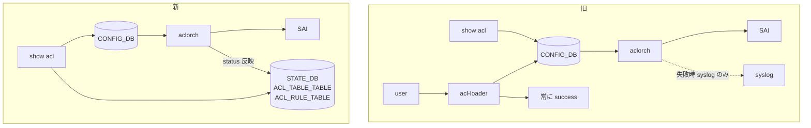

<!-- topics-tip -->
!!! tip "Topics で読み物として読む"
    この HLD は実装詳細を含みます。機能の概念・設定・運用を読み物として読みたい場合は [Topics 07 章: ACL / CoPP / Mirror](../topics/07-acl-copp-mirror/index.md) を参照。
<!-- /topics-tip -->

!!! success "裏取りステータス: Code-verified"
    `sonic-swss/orchagent/aclorch.cpp` L4201-4202 で `m_aclTableStateTable(stateDb, STATE_ACL_TABLE_TABLE_NAME)` / `m_aclRuleStateTable(stateDb, STATE_ACL_RULE_TABLE_NAME)` を確認、`sonic-swss-common/common/schema.h` L514-515 で `STATE_ACL_TABLE_TABLE_NAME = "ACL_TABLE_TABLE"` / `STATE_ACL_RULE_TABLE_NAME = "ACL_RULE_TABLE"` を確認。`sonic-utilities/show/acl.py` の `show acl table` / `show acl rule` が `acl-loader show table/rule` を呼び、`sonic-utilities/acl_loader/main.py` L76-80/L324-340 で STATE_DB の `ACL_TABLE_TABLE` / `ACL_RULE_TABLE` ステータスを参照することを確認（verified at: 2026-05-09）。

# `show acl` 強化（`STATE_DB.ACL_TABLE_TABLE` / `ACL_RULE_TABLE` の status）

## これは何か（一行で）

[ACL](../reference/glossary.md#term-acl) 設定は投入時に成功扱いになるが、ASIC リソース不足等で実際は作られないことがある。それを `show acl table` / `show acl rule` の **`Status` 列**（Active / Inactive）で見えるようにする[^1]。

## どんなときに使うか

- 投入は通っているのに、`acl` が効いてない（trap されない / hit カウンタが上がらない）ときの一次切り分け
- 大量 ACL を入れた直後に「どこまで反映されたか」を一目で見たい

本機能は **データプレーン ACL 専用**。コントロールプレーン ACL は別 [HLD](../reference/glossary.md#term-hld)[^1]。

## 旧フロー vs 新フロー



設定経路（add/update/delete）は変えず、`aclorch` が [SAI](../reference/glossary.md#term-sai) 戻り値で [STATE_DB](../reference/glossary.md#term-state_db) を Active / Inactive に更新する。`show` 側は [CONFIG_DB](../reference/glossary.md#term-config_db) と STATE_DB を join する[^1]。

## STATE_DB スキーマ

```yaml
ACL_TABLE_TABLE|<acl_table_name>
    status : "Active" | "Inactive"

ACL_RULE_TABLE|<acl_table_name>|<acl_rule_name>
    status : "Active" | "Inactive"
```

`aclorch` の動作:

- SAI が create 成功 → 該当エントリの STATE_DB を `status=Active`
- 失敗 → `status=Inactive`
- delete 時に STATE_DB の対応エントリも削除

!!! note "HLD 内表記揺れ"
    HLD 本文ではルール側のキーが `ACL_RULE_TABLE|...` と `ACL_RULE|...` の両方で書かれている[^1]。実装は `STATE_ACL_RULE_TABLE_NAME = "ACL_RULE_TABLE"` で確定（schema.h L515）。

例:

```text
$ redis-cli -n 6 hgetall 'ACL_TABLE_TABLE|DATAACL'
1) "status"
2) "Active"
```

## CLI 出力例

```text
$ show acl table DATAACL
Name     Type    Binding      Description    Stage      Status
-------  ------  -----------  -------------  -------    -------
DATAACL  L3      Ethernet0    DATAACL        ingress    Active
                 Ethernet4

$ show acl rule
Table    Rule    Priority  Action    Match                Status
-------  ------  --------  --------  -------------------  --------
DATAACL  RULE_1  9999      DROP      DST_IP: 9.5.9.3/32   Inactive
DATAACL  RULE_2  9998      FORWARD   DST_IP: 10.2.1.2/32  Inactive
```

`Status` 列が末尾に追加されるだけで、既存列は不変[^1]。

## 設定

### 関連する CONFIG_DB

既存 `ACL_TABLE` / `ACL_RULE` を使う。スキーマ変更なし。

### 関連する CLI

| Command | 変更 |
|---------|------|
| `show acl table` | 出力に `Status` 列追加 |
| `show acl rule` | 出力に `Status` 列追加 |

### 関連する YANG

HLD で言及なし。

### 確認例

```bash
config load <acl.json>
show acl table DATAACL          # Status 列で Active/Inactive を見る
redis-cli -n 6 hgetall 'ACL_TABLE_TABLE|DATAACL'
```

## 対象外・制限

- **データプレーン ACL のみ**。コントロールプレーン ACL は別 HLD[^1]
- **[PFC](../reference/glossary.md#term-pfc) / dual-ToR Mux handler が内部生成する ACL は対象外**（CONFIG_DB に対応行が無いため join できない）[^1]
- `Status` 値は `Active` / `Inactive` の 2 値のみ。失敗理由の詳細は syslog 参照
- **warm/fast boot を跨いで保持しない**。boot 後に `aclorch` が再書きするため追加の影響は無い[^1]

## 干渉する機能

- **`aclorch`**: 主要変更箇所。SAI 戻り値の解釈と STATE_DB 反映が追加
- **`acl-loader`**: 投入後の確認が CLI ベースになり、自動化が書きやすい
- **PFC / dual-ToR Mux**: 内部生成 ACL は出ない（運用上の混乱要注意）
- **[sonic-mgmt](../reference/glossary.md#term-sonic-mgmt) 既存テスト**: syslog 監視ベースから新 CLI ベースへ移行可能[^1]

## トラブルシューティング

- `Inactive` → syslog の `aclorch` SAI エラー（リソース不足 / 属性不一致）を確認
- `Status` 列が空 → STATE_DB に書かれていない（`aclorch` 未処理 or 内部生成 ACL）
- `redis-cli -n 6 hgetall 'ACL_RULE_TABLE|DATAACL|RULE_1'` で実値を直接確認

### コマンド例: show acl 拡張表示の確認

下記コマンドを順に実行することで、関連する CONFIG_DB / APP_DB / STATE_DB のエントリと、
CLI 表示・syslog の整合を一通り突き合わせ確認できる。

```bash
# Status 列を含む拡張表示と、STATE_DB 直読みでの突き合わせ
show acl rule
redis-cli -n 6 keys 'ACL_RULE_TABLE|*'
redis-cli -n 6 hgetall 'ACL_RULE_TABLE|DATAACL|RULE_1'
```


## 関連トピック

- [Topics: ACL / CoPP / Mirror](../topics/07-acl-copp-mirror/index.md)

## 関連ページ

- [ACL in SONiC](./acl-in-sonic.md)
- [ACL Flex Counters Support](./acl-flex-counters-support.md)

## 引用元

[^1]: `sonic-net/SONiC` `doc/acl/ACL-enhancements-on-show-command.md` @ `49bab5b5ff0e924f1ea52b3d9db0dfa4191a7c06`

<!-- concerns hint:
- aclorch の STATE_DB ACL_TABLE_TABLE / ACL_RULE_TABLE 書き込み実装
- STATE_DB ルール側キー (ACL_RULE_TABLE|... vs ACL_RULE|...) の最終形
- show acl table / show acl rule の sonic-utilities 取り込み
- PFC / Mux 内部生成 ACL の扱いの将来計画
- sonic-mgmt の test_acl.py 更新状況
-->

<!-- topics-back-ref -->
## 関連 Topics

- [Topics: ACL / CoPP / Mirror / Packet Action](../topics/07-acl-copp-mirror/index.md)

<!-- /topics-back-ref -->

<!-- glossary-links-injected: 25f52bcfe718 -->
