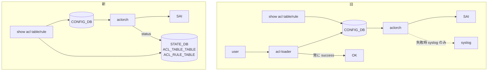

!!! warning "裏取りステータス: HLD-only"
    本ページは公式 HLD（Rev 0.2, 2023-03）のみを根拠に書かれている。`aclorch` の STATE_DB 書き込み、`show acl table` / `show acl rule` の sonic-utilities 取り込みは未確認。

# show acl 強化（`STATE_DB.ACL_TABLE_TABLE` / `ACL_RULE_TABLE` の status）

## 概要

SONiC の ACL 設定は CONFIG_DB（または APP_DB）に投入し、`acl-loader` で食わせる。問題は **「投入は成功扱いだが ASIC リソース不足等で実際には作られていない」** ケースを `show acl table` / `show acl rule` から判別できない点。両 CLI は CONFIG_DB / APP_DB を直接読むだけで、ASIC 反映状態を映していなかった[^1]。

本 HLD は STATE_DB に **`ACL_TABLE_TABLE` / `ACL_RULE_TABLE`** を新設し、`aclorch` が SAI 戻り値を反映する。`show acl table` / `show acl rule` の出力に **`Status`（Active / Inactive）** 列を追加する。本 HLD は **データプレーン ACL 専用**。コントロールプレーン ACL は別ドキュメント[^1]。

## 動作仕様

### 旧フローと新フロー



ACL の **設定経路（add/update/delete）は変えず**、`aclorch` が SAI 戻り値で `STATE_DB` の status を Active / Inactive に更新する。`show` 側は CONFIG_DB と STATE_DB を join する形に変更[^1]。

### STATE_DB スキーマ

```
ACL_TABLE_TABLE|<acl_table_name>
    status : "Active" | "Inactive"

ACL_RULE_TABLE|<acl_table_name>|<acl_rule_name>
    status : "Active" | "Inactive"
```

例:

```
$ redis-cli -n 6 hgetall 'ACL_TABLE_TABLE|DATA_ACL'
1) "status"
2) "Active"

$ redis-cli -n 6 hgetall 'ACL_RULE|DATAACL|RULE_1'
1) "status"
2) "Inactive"
```

> HLD 本文中の表記には揺れがあり、ルール側のキーが `ACL_RULE_TABLE|...` と `ACL_RULE|...` の両方で書かれている[^1]。実装側でどちらが採用されたかは要確認。

### `aclorch` の責務追加

- ACL table / rule create で SAI が成功 → 該当エントリの STATE_DB を `status=Active`
- 失敗 → `status=Inactive`
- delete 時には STATE_DB の対応エントリも削除

### CLI 出力例

```
$ show acl table DATAACL
Name     Type    Binding      Description    Stage      Status
-------  ------  -----------  -------------  -------    -------
DATAACL  L3      Ethernet0    DATAACL        ingress    Active
                 Ethernet4
                 Ethernet8
                 Ethernet12

$ show acl rule
Table    Rule    Priority  Action    Match                Status
-------  ------  --------  --------  -------------------  --------
DATAACL  RULE_1  9999      DROP      DST_IP: 9.5.9.3/32   Inactive
                                     ETHER_TYPE: 2048
DATAACL  RULE_2  9998      FORWARD   DST_IP: 10.2.1.2/32  Inactive
                                     ETHER_TYPE: 2048
                                     IP_PROTOCOL: 6
                                     L4_DST_PORT: 22
```

`show` 側は CONFIG_DB から既存列、STATE_DB から `Status` 列を取って `Status` を末尾に追加する[^1]。

<!-- evidence:
source: sonic-net/SONiC/doc/acl/ACL-enhancements-on-show-command.md#L37-L46 (sha: 49bab5b5ff0e924f1ea52b3d9db0dfa4191a7c06)
excerpt: |
  In the proposed design, we introduce a new table to `STATE_DB`, and `orchagent` will write the return status to the `STATE_DB` table.
  The user can check the status of ACL table or ACL rule creation with CLI `show acl table` or `show acl rule`.
reasoning: 「STATE_DB を増やして aclorch が反映、show が join」設計の根拠。
-->

### 内部生成 ACL は対象外

PFC handler や dual-ToR の Mux handler が **内部的に** 作る ACL table / rule は本 HLD の対象外。これらは CONFIG_DB に対応行が無いため `show` で結合できない[^1]。

### Warmboot / Fastboot

新規 STATE_DB テーブルは warm/fast boot を跨いで保持しない。よって warm/fast boot に追加の影響は無い[^1]。

## 設定

### 関連する CONFIG_DB

既存の `ACL_TABLE` / `ACL_RULE` テーブルを使う。スキーマ変更なし。

### 関連する CLI

| Command | 変更 |
|---------|------|
| `show acl table` | 出力に `Status` 列追加 |
| `show acl rule` | 出力に `Status` 列追加 |

### 関連する YANG

該当 YANG モジュールは HLD で言及されていない。

### 確認例

```bash
# テーブル作成確認
config load <acl.json>
show acl table DATAACL    # Status 列で Active/Inactive を見る

# 失敗していたら redis で詳細確認
redis-cli -n 6 hgetall 'ACL_TABLE_TABLE|DATAACL'
```

## 制限事項

- **データプレーン ACL のみ** が対象。コントロールプレーン ACL は別 HLD[^1]
- PFC / Mux 等が内部生成する ACL は対象外（CONFIG_DB に対応行が無いため）
- `Status` 列の値は `Active` / `Inactive` の 2 値のみ。失敗理由の詳細は出ない（syslog 参照）
- 既存の sonic-mgmt テストで syslog をパースして成否判定していたものは、新 CLI を使う形にリファクタ可能[^1]

## 干渉する機能

- **`aclorch`**: 主要変更箇所。SAI 戻り値の解釈と STATE_DB 反映ロジックが追加
- **`acl-loader`**: 投入後の確認手段が CLI ベースになるため、自動化スクリプトが分かりやすくなる
- **PFC / dual-ToR Mux handler**: 内部生成 ACL は本機能の対象外なので、運用上の混乱に注意
- **sonic-mgmt 既存テスト**: syslog 監視ベースから新 CLI ベースへ移行できる

## トラブルシューティング

- `show acl table` で `Inactive` が出る場合、`syslog` で `aclorch` の SAI エラー（リソース不足・属性不一致など）を確認
- `Status` 列が空の場合、STATE_DB に対応エントリが書かれていない可能性。`aclorch` がまだ処理していない or 内部生成 ACL の可能性
- `redis-cli -n 6 hgetall 'ACL_RULE_TABLE|DATAACL|RULE_1'` で実値を直接確認

## 引用元

[^1]: `sonic-net/SONiC` `doc/acl/ACL-enhancements-on-show-command.md` @ `49bab5b5ff0e924f1ea52b3d9db0dfa4191a7c06`

<!-- concerns hint:
- aclorch の STATE_DB ACL_TABLE_TABLE / ACL_RULE_TABLE 書き込み実装
- STATE_DB ルール側キー (ACL_RULE_TABLE|... vs ACL_RULE|...) の最終形
- show acl table / show acl rule の sonic-utilities 取り込み
- PFC / Mux 内部生成 ACL の扱いの将来計画
- sonic-mgmt の test_acl.py 更新状況
-->
