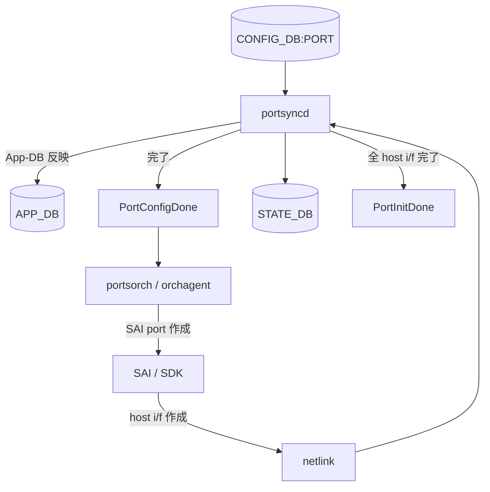
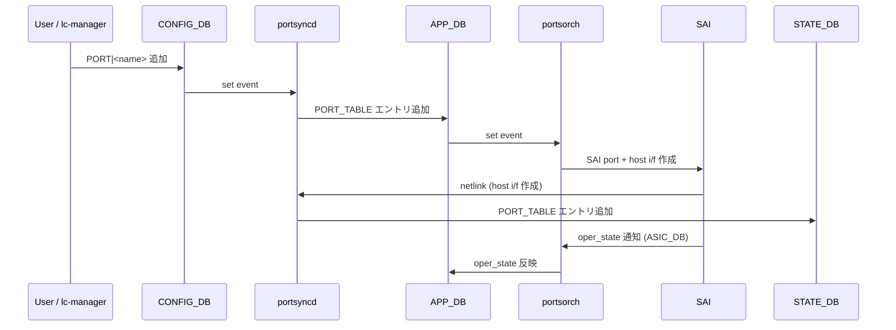

# 動的ポート add/del 概念

このページは [動的ポート add/del（概要ハブ）](enhancements-to-add-or-del-ports-dynamically.md) の派生で、**概念とユーザ責務** に絞る。設定 / 安全削除手順は [enhancements-to-add-or-del-ports-dynamically-operations.md](enhancements-to-add-or-del-ports-dynamically-operations.md)、各 mgrd / orch の内部仕様は [enhancements-to-add-or-del-ports-dynamically-internals.md](enhancements-to-add-or-del-ports-dynamically-internals.md)、[HLD](../reference/glossary.md#term-hld) と実装の乖離は [enhancements-to-add-or-del-ports-dynamically-limitations.md](enhancements-to-add-or-del-ports-dynamically-limitations.md) を参照。

## 1. 機能スコープ

[SONiC](../reference/glossary.md#term-sonic) は本来「init 時にすべてのポートを作る」前提で設計されており、線数固定システム以外で扱いにくかった。本機能は次の 3 つの起動形態をサポートし、さらに **post-init で動的に [CONFIG_DB](../reference/glossary.md#term-config_db) の `PORT` テーブルに add/del** することでポート追加・削除を可能にする[^1]:

- 全ポートを `config_db` に持って起動
- 一部ポートだけ持って起動
- **ゼロポート** で起動（line-card manager がプロビジョニング時に追加する想定）

ポート削除前にユーザは [ACL](../reference/glossary.md#term-acl) / [VLAN](../reference/glossary.md#term-vlan) / [LAG](../reference/glossary.md#term-lag) / Buffer PG など **全依存設定を先に削除する責任** を負う[^1]。

## 2. 初期化フェーズと App-DB フラグ

- **`PortConfigDone`**: [portsyncd](../reference/glossary.md#term-portsyncd) がポート設定を APP_DB に反映完了。[orchagent](../reference/glossary.md#term-orchagent) は **これを待ってから** [SAI](../reference/glossary.md#term-sai) ポート作成を始める[^1]。
- **`PortInitDone`**: 全 host interface が作成完了。`xcvrd` / `buffermgrd` / `natmgr` / `natsync` は **これを待つ**[^1]。

## 3. ゼロポート起動の要件

新たに **zero-port SKU** が必要[^1]:

- `hwsku.json` に interface セクション無し
- `platform.json` に interface セクション無し
- SAI profile に port エントリ無し

`sonic-cfggen` は port 無しで `config_db.json` を生成する。Pre-existing PR で `cfggen` / `portsyncd` / buffer drop counter 周りが「port 0 でも動く」ように改修済み[^1]:

| PR | 内容 |
|----|------|
| [sonic-buildimage](../reference/glossary.md#term-sonic-buildimage) #7999 | `cfggen` を port 無しで動かす |
| [sonic-swss](../reference/glossary.md#term-sonic-swss) #1808 | `portsyncd` を port 無しで動かす |
| sonic-swss #1860 | port 削除時の buffer drop counter 削除 |

## 3.1 フェーズ別 実装境界

HLD は「全ポート / 一部 / ゼロポート起動 + post-init add/del + ref counter による安全削除 + restore」までを提案しているが、master では **どのフェーズまで動き、どこから先が未取り込みか** に明確な段差がある[^1]。

| Phase | 実装済 (master で動く) | 未実装 (HLD 提案のみ) |
|-------|----------------------|---------------------|
| 全ポート / 一部ポート 起動 | ✅ 取り込み済（既存パス）| — |
| ゼロポート起動 (`cfggen` / `portsyncd` の port=0 対応) | ✅ sonic-buildimage #7999 / sonic-swss #1808 がマージ済 | — |
| `PortConfigDone` / `PortInitDone` 待ち合わせ | ✅ orchagent / xcvrd / buffermgrd 側で動作 | — |
| post-init ポート追加 (`PORT` を CONFIG_DB に投入 → [portsorch](../reference/glossary.md#term-portsorch) で SAI port 作成) | ✅ 動作する（基本パス）| — |
| post-init ポート削除 (admin down → 依存削除 → `PORT` 削除) | 🟡 **運用側で全依存を先に削除すれば動く** | orchagent 側の **ref counter による削除拒否** ロジックは未取り込み |
| ポート restore (削除後の再構築) | — | ❌ HLD 提案のみ、未実装 |
| `lldpmgrd` の動的 port 反映 | 🟡 部分的（`pending_cmds` 経由）| 一部改修が未マージ |

`✅` フェーズはユーザ視点で素直に動作するが、`🟡` フェーズは HLD が想定する自動保護が無いため運用側で前述の責務を負う必要があり、`❌` フェーズは現行 master では使えない[^1]。

## 4. Post-init: 追加 / 削除のシーケンス

### ポート追加

### ポート削除

`portmgrd` 経由で APP_DB から削除し、portsorch が SAI port + host i/f を削除する。state-db のクリーンアップは host i/f の netlink 削除イベント受領後に portsyncd が行う[^1]。

## 引用元

[^1]: `sonic-net/SONiC` `doc/port-add-del-dynamically/dynamic_port_add_del_hld.md` @ `49bab5b5ff0e924f1ea52b3d9db0dfa4191a7c06`

<!-- glossary-links-injected: 4e8b9837844c -->
