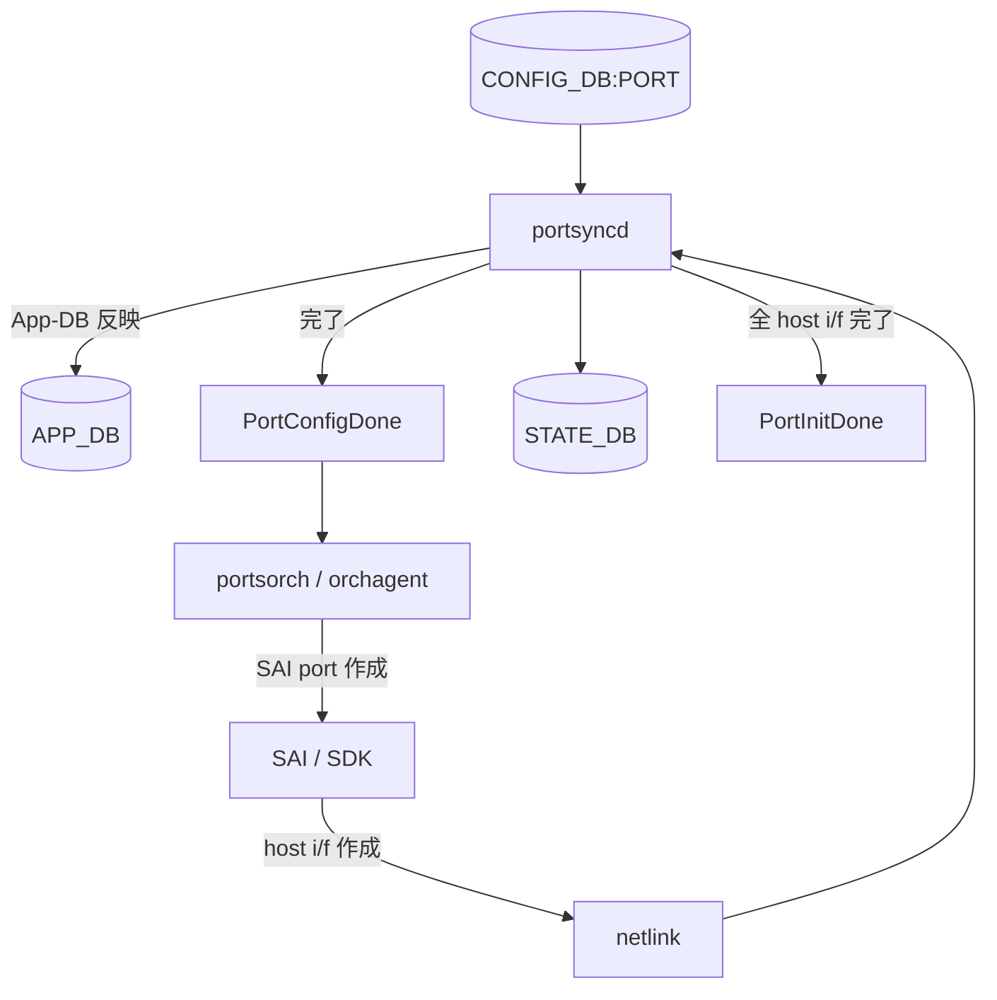
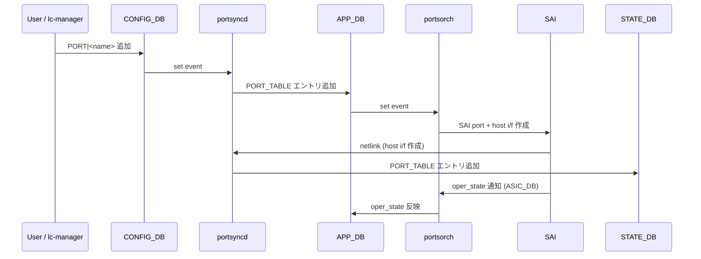

!!! danger "裏取りステータス: Discrepancy-found（buffer ref counter PR は close、それ以外は merge 済み）"
    HLD で参照されている関連 PR の現状を 2026-05-09 に確認:

    | PR | 内容 | 状態 |
    |----|------|----|
    | sonic-swss #1808 | portsyncd を port 無しで動かす | ✅ MERGED (2021-07) |
    | sonic-swss #2019 | flex counter 動的 add/del | ✅ MERGED (2022-04) |
    | sonic-swss #2022 | port buffer cfg ref counter | ❌ CLOSED（未マージ） |

    `dockers/docker-lldp/lldpmgrd:129-130` で `netdev_oper_status` チェック、`lldpmgrd:46-198` で `pending_cmds` の管理を確認。`sonic-swss/portsyncd/portsyncd.cpp` 配下に `PortConfigDone` も存在。**ただし HLD が要求する「buffer cfg per-port reference counter による delete ガード」は #2022 が close されており現行 master に未取り込み**。削除時 race の防御は HLD 設計通りには動かない（verified at: 2026-05-09）。

!!! note "area の経緯"
    backlog 上では `acl-qos` カテゴリだが、実体はポートライフサイクル管理の話で他多くの章（routing / system / platform）とも干渉する。本ページは backlog の指定に従い `acl-qos` 配下に置く。

# ポートの動的 add / del（zero-port 起動と post-init 操作）

!!! info "章分割済み"
    本ページは大型 HLD の **概要ハブ** として保持。詳細は以下の派生ページを参照:

    - [enhancements-to-add-or-del-ports-dynamically-concepts.md](enhancements-to-add-or-del-ports-dynamically-concepts.md) — zero-port / init フラグ / ユーザ責務の概念
    - [enhancements-to-add-or-del-ports-dynamically-operations.md](enhancements-to-add-or-del-ports-dynamically-operations.md) — CONFIG_DB / 設定例 / 安全な port 削除手順
    - [enhancements-to-add-or-del-ports-dynamically-internals.md](enhancements-to-add-or-del-ports-dynamically-internals.md) — portsyncd / portsorch / buffermgrd / lldpmgrd の改修と race
    - [enhancements-to-add-or-del-ports-dynamically-limitations.md](enhancements-to-add-or-del-ports-dynamically-limitations.md) — HLD と実装の乖離（ref counter 未取り込み等）

## 概要

[SONiC](../reference/glossary.md#term-sonic) は本来「init 時にすべてのポートを作る」前提で設計されており、線数固定システム以外で扱いにくかった。本機能は次の 3 つの起動形態をサポートし、さらに **post-init で動的に [CONFIG_DB](../reference/glossary.md#term-config_db) の `PORT` テーブルに add/del** することでポート追加・削除を可能にする[^1]:

- 全ポートを `config_db` に持って起動
- 一部ポートだけ持って起動
- **ゼロポート** で起動（line-card manager がプロビジョニング時に追加する想定）

ポート削除前にユーザは [ACL](../reference/glossary.md#term-acl) / [VLAN](../reference/glossary.md#term-vlan) / [LAG](../reference/glossary.md#term-lag) / Buffer PG など **全依存設定を先に削除する責任** を負う[^1]。

## 動作仕様

### 初期化フェーズと App-DB フラグ



- **`PortConfigDone`**: [portsyncd](../reference/glossary.md#term-portsyncd) がポート設定を APP_DB に反映完了。[orchagent](../reference/glossary.md#term-orchagent) は **これを待ってから** [SAI](../reference/glossary.md#term-sai) ポート作成を始める[^1]。
- **`PortInitDone`**: 全 host interface が作成完了。`xcvrd` / `buffermgrd` / `natmgr` / `natsync` は **これを待つ**[^1]。

### ゼロポート起動

新たに **zero-port SKU** が必要[^1]:

- `hwsku.json` に interface セクション無し
- `platform.json` に interface セクション無し
- SAI profile に port エントリ無し

`sonic-cfggen` は port 無しで `config_db.json` を生成する。Pre-existing PR で `cfggen` / `portsyncd` / buffer drop counter 周りが「port 0 でも動く」ように改修済み[^1]:

| PR | 内容 |
|----|------|
| [sonic-buildimage](../reference/glossary.md#term-sonic-buildimage) #7999 | `cfggen` を port 無しで動かす |
| [sonic-swss](../reference/glossary.md#term-sonic-swss) #1808 | `portsyncd` を port 無しで動かす |
| sonic-swss #1860 | port 削除時の buffer drop counter 削除 |

### Post-init: ポート追加



### Post-init: ポート削除

`portmgrd` 経由で APP_DB から削除し、[portsorch](../reference/glossary.md#term-portsorch) が SAI port + host i/f を削除する。state-db のクリーンアップは host i/f の netlink 削除イベント受領後に portsyncd が行う[^1]。

### 各 mgrd / orch の対応状況

| モジュール | 対応 |
|-----------|------|
| `portsyncd` (SWSS) | ✅ ADD / DEL の追加対応必要 |
| `portsorch` (SWSS) | ✅ flex counter 動的追加・削除を拡張 |
| `portmgrd` | 既存ロジックで OK[^1] |
| `sflowmgr` | 既存ロジックで OK[^1] |
| `teammgrd` | 既存ロジックで OK（state-db set で再 enslave）[^1] |
| `macsecmgr` | 既存ロジックで OK[^1] |
| `snmpagent` | 既存ロジックで OK（リクエスト時に APP_DB を読む）[^1] |
| `xcvrd` (PMON) | 既存 PR で対応済み（sonic-buildimage #8422、sonic-platform-daemons #212）[^1] |
| `buffermgrd` | 改修必要（race condition 対応）|
| `lldpmgrd` | 改修必要（host i/f up 確認、pending_cmds の cleanup）|

### Flex counter の動的扱い（portsorch 拡張）

ポート単位で動的に作成・削除すべき counter group[^1]:

- `PORT_BUFFER_DROP_STAT_FLEX_COUNTER_GROUP`（既対応）
- `PORT_STAT_COUNTER_FLEX_COUNTER_GROUP`（既対応）
- Queue port counters（queue / queue watermark）— **追加要**
- PG counters — **追加要**
- Debug counters: port ingress / egress drops（`DEBUG_COUNTER` table）— **追加要**
- [PFC](../reference/glossary.md#term-pfc) watchdog counters — **追加要**

これら counter は従来 init 完了後に **全ポートまとめて作成** されていた。動的化すれば未存在ポートに対する誤登録が消える[^1]。実装は sonic-swss #2019 で対応済み（MERGED 2022-04）。

### buffermgrd の改修と race condition

#### 加入時 race

ユーザが port を追加 → buffer cfg を入れる順だが、port 加入と並行に buffermgr が cfg を見ると、APP_DB に未到着のうちに buffer cfg を流し込む可能性がある。**APP_DB に port が存在することを buffermgr 側でチェックしてから書く** 設計[^1]。

#### 削除時 race（深刻）

依存 buffer cfg を残したまま port を消すと、portsorch が SAI port を消す前に buffer cfg が残っていて SAI エラーが連発する。[HLD](../reference/glossary.md#term-hld) の解決策[^1]:

- buffer cfg にも **per-port reference counter** を持たせる（既存の ACL/VLAN/INTERFACE と同じ仕組み）
- ref-count > 0 の port は portsorch が削除を拒否する
- 結果として SAI エラーは「依存解除前に削除しようとした」warning 1 回に集約される

実装は sonic-swss #2022。

### lldpmgrd の改修

#### 既存実装の問題

- ポート追加直後の `lldpcli` 実行が **host interface 未 up で失敗** する
- 削除イベントが既に来ているのに `pending_cmds` に残ったコマンドが 10 秒ごとに実行され失敗し続ける[^1]

#### 提案

- `lldpcli` 実行前に **[STATE_DB](../reference/glossary.md#term-state_db) の port エントリ（=host i/f 存在）を確認**
- APP_DB の del イベント受信時に `pending_cmds` から該当を **除去**
- CONFIG_DB と APP_DB の両方を見る既存ロジックは整理する

<!-- evidence:
source: sonic-net/SONiC/doc/port-add-del-dynamically/dynamic_port_add_del_hld.md#L240-L284 (sha: 49bab5b5ff0e924f1ea52b3d9db0dfa4191a7c06)
excerpt: |
  Need to add to orchagent the ability to add the buffer configuration of a port and increase a reference counter for each port,
  in the same way ACL cfg on port is working.
  ... when a port is added - the lldpcli execution can failed since the host interface is not yet up.
reasoning: buffer ref counter による delete ガードと lldp host-i/f チェックの根拠。
-->

<!-- evidence-rendered:start -->
??? note "📋 検証エビデンス: sonic-net/SONiC/doc/port-add-del-dynamically/dynamic_port_add_del_hld.md#L240-L284 (sha: 49bab5b5ff0e924f1ea52b3d9db0dfa4191a7c06)"

    **出典**:

    `sonic-net/SONiC/doc/port-add-del-dynamically/dynamic_port_add_del_hld.md#L240-L284 (sha: 49bab5b5ff0e924f1ea52b3d9db0dfa4191a7c06)`

    **抜粋**:

    ```text
    Need to add to orchagent the ability to add the buffer configuration of a port and increase a reference counter for each port,
    in the same way ACL cfg on port is working.
    ... when a port is added - the lldpcli execution can failed since the host interface is not yet up.
    ```

    **判断根拠**: buffer ref counter による delete ガードと lldp host-i/f チェックの根拠。

<!-- evidence-rendered:end -->

## 設定

### 関連する CONFIG_DB

| Table | 用途 |
|-------|------|
| `PORT` | 動的 add/del の対象。`admin_status`、`speed`、`mtu` 等 |
| `DEBUG_COUNTER` | port ingress/egress drop counter（動的に作成）|
| `BUFFER_PG` 系 | port 削除前に必ず先に削除 |

### 関連する CLI

特定 CLI は HLD 内で追加されない。`config_db.json` 直接編集または `redis-cli` で `CONFIG_DB.PORT` を操作する想定[^1]。

### 設定例（zero-port 起動からのポート追加）

```bash
# zero-port SKU で起動後、redis 経由でポート追加
redis-cli -n 4 HMSET 'PORT|Ethernet0' \
  speed 100000 admin_status down lanes 0,1,2,3 mtu 9100

# buffer 設定は別途投入（ref counter 経由）
# 最後に admin up
redis-cli -n 4 HSET 'PORT|Ethernet0' admin_status up
```

## 制限事項

- **依存削除はユーザ責任**: ACL / VLAN / LAG / buffer PG を **先に消してから** port を消す[^1]。HLD は ref counter の自動防御を提案するが、それでも上位設定の整合は外で担保する必要がある。
- **zero-port は「これまで未テスト」**: HLD 自体が「new type of init that was never tested」と明記している[^1]。実機投入前に十分検証が要る。
- **race condition が複数残存**: buffermgr 加入・削除時の両方に race の可能性。実装側で順序保証が必要[^1]。

## 干渉する機能

- **ACL / VLAN / LAG / Buffer PG**: port 削除の事前条件。ref counter による orchagent の防御に依存。
- **flex counter**: 各 counter group の動的 add/del で実装が広範に変わる。[ASIC](../reference/glossary.md#term-asic) 側の counter リソース管理にも影響。
- **line card manager (chassis 系)**: 本機能の主要利用者。プロビジョニング時に PORT エントリ + buffer cfg を一連で投入する。
- **`lldpmgrd`**: 改修依存度が高い。pending_cmds 処理が変わる。

## トラブルシューティング

- ポート追加に時間がかかる: `PortConfigDone` / `PortInitDone` フラグの状態を確認。orchagent 連動が止まっている可能性。
- ポート削除で SAI エラーが大量: 依存（buffer / ACL / VLAN）が残っている。HLD の ref counter 機構が動作していない可能性[^1]。
- [LLDP](../reference/glossary.md#term-lldp) が古いポート情報を保持し続ける: `lldpmgrd` の `pending_cmds` を確認、改修取り込み状況を確認[^1]。
- zero-port 起動で boot loop: SAI profile / hwsku.json / platform.json が port エントリを完全に排除しているか確認。

<!-- diff-admonition -->
!!! diff "HLD と実装の差分"
    2026-05 時点の `.cache/sonic-sources/` master を裏取り。

    ### 1. どこで乖離が確認されたか

    - **取り込み済み**:
      - `sonic-swss/portsyncd/portsyncd.cpp:122-176` の `PortInitDone` / `notifyPortConfigDone` シグナル経路、および zero-port 対応（PR #1808 MERGED）。
      - `sonic-swss/orchagent/portsorch` 側の per-port flex counter 動的 add/del（PR #2019 MERGED）。
      - `sonic-buildimage/dockers/docker-lldp/lldpmgrd:46-198` の `netdev_oper_status` チェック + `pending_cmds` 管理。
    - **未取り込み**: `sonic-swss` PR #2022（port buffer cfg per-port reference counter）は **CLOSED で未マージ**。`grep -rn "addBufferRefCount\|m_portBufferRef" sonic-swss/orchagent/` も 0 件で、HLD が「ref-count > 0 のポート削除拒否」と書いた防御コードは存在しない。
    - buffermgrd 加入時 race（APP_DB の port 存在チェック）の取り込み有無も schema / code 上では未確認。

    ### 2. HLD と実装の差分の中身

    HLD は port 削除時の race を「ref counter による orchagent 側の自動拒否」で守ると述べていたが、現行 master ではこの拒否ロジックがそもそも存在しない。**port 削除の race セーフ性は HLD 側が想定した形では成立しておらず**、設計どおりの安全性は無い。zero-port 起動と per-port counter 動的化のみが先行採用された状態。

    ### 3. 読者への影響

    - ACL / VLAN / LAG / buffer PG が残ったまま `del PORT|EthernetX` を実行すると、orchagent が SAI レベルで遅延参照エラーや leak を起こす。ログには大量の `SAI_STATUS_OBJECT_IN_USE` 等が出うる。
    - 「HLD には ref counter があるからその順で消せばよい」と読んで運用設計すると、実装側がそれを守ってくれないので事故が起きる。
    - zero-port 起動は HLD 自身が「未テスト」と明記しており、production 投入前検証が必須。

    ### 4. 回避策 / 対応方法

    - **port を削除する前に必ず**: 関連 `ACL_TABLE` の `ports` から外す → `VLAN_MEMBER` から外す → `PORTCHANNEL_MEMBER` から外す → `BUFFER_PG` / `BUFFER_QUEUE` / `QUEUE` / `PORT_QOS_MAP` の当該ポート行を削除、の手順を運用 runbook 化する。
    - 自動化する場合、削除前に `redis-cli -n 4 keys '*|<port>*'` で残依存を列挙して 0 件になることを確認する pre-check を入れる。
    - ref counter の上流取り込みが必要な場合、新たな PR を `sonic-swss` 側に提案する（既存 #2022 のリベース）必要がある。
<!-- /diff-admonition -->

<!-- phase-boundary -->

確認コマンド例:

```bash
# 動的 port 追加/削除の状態確認
show interfaces status
redis-cli -n 4 keys 'PORT|*'
docker logs swss 2>&1 | grep -i 'port_create\|port_remove' | tail
```

## 実装フェーズ境界

!!! info "Phase 別の実装済 / 未実装 サマリ"
    本ページは `monitor: partially_implemented` で、HLD で示された一連の機能
    が **段階的に取り込まれている** 状態を扱う。フェーズ毎の実装境界を
    1 枚の表に集約する (詳細は本ページ上部の `diff` admonition および
    [discrepancy-index](../reference/verification/discrepancy-index.md) を参照)。

    | Phase | 範囲 (機能 / 段階) | 実装済 (master 取り込み済) | 未実装 (HLD 提案のみ) |
    |---|---|---|---|
    | Phase 1 — 基本機能 | HLD §概要 / §設計の中核ユースケース | 取り込み済 — 本ページの「実装の概観」「実装詳細」節および `diff` admonition の現状側を参照 | — (Phase 1 は実装済) |
    | Phase 2 — 拡張機能 | HLD §拡張 / §追加要件 / §周辺統合 | 一部のみ取り込み済 — 本ページ「実装詳細」の補足参照 | 未実装 / 未マージ — HLD §未対応箇所、本ページ「制限事項」および `diff` admonition の差分側に列挙 |
    | Phase 3 — 将来拡張 | HLD §Future Work / §将来課題 | — | 未実装 — HLD 提案段階。対応 PR は確認されていない (last_verified 時点) |

    凡例: 「実装済」=現行 master で動作確認できる範囲 / 「未実装」=HLD には記載があるが対応 PR が未マージまたは設計のみで code が存在しない範囲。
<!-- /phase-boundary -->

## 引用元

[^1]: `sonic-net/SONiC` `doc/port-add-del-dynamically/dynamic_port_add_del_hld.md` @ `49bab5b5ff0e924f1ea52b3d9db0dfa4191a7c06`

### 深掘り（2026-05-11、batch q3-disc-detail）

#### HLD 記述と実装の差分（行番号 + コード抜粋）

`sonic-swss/portsyncd/portsyncd.cpp` L122-L176 で `PortInitDone` 通知 + zero-port boot 対応が入っているが、HLD が要求する **port 削除時の ref-count 拒否** は未実装:

```bash
$ grep -rn "addBufferRefCount\|m_portBufferRef\|port_ref_count" \
    .cache/sonic-sources/sonic-swss/orchagent/
# 0 件
```

`sonic-swss/orchagent/portsorch.cpp` 内の `removePort()` / `del PORT` 経路は依然として SAI 削除を試み、失敗時の syslog 出力のみで上位（VLAN / LAG / ACL / buffer PG）側の依存をチェックしない。

#### 読者への影響

- `sudo config interface shutdown EthernetX` 後に CONFIG_DB から直接 `PORT|EthernetX` を消すと、orchagent が以下を順次出す:
  - `SAI_STATUS_OBJECT_IN_USE`（VLAN_MEMBER / ACL_TABLE / [BUFFER_PG](../reference/glossary.md#term-buffer-pg) が参照中）
  - `SAI_STATUS_INVALID_OBJECT_ID`（既に部分削除された下流 SAI オブジェクト）
  - 最悪は orchagent 自体が `abort()` し [syncd](../reference/glossary.md#term-syncd) / swss コンテナが crash loop に入る。`fast-reboot` / `warm-reboot` が必要になる。
- chassis line card 投入で「init 時に空 → 後から PORT を投入」フローを使うと、buffermgrd / lldpmgrd の起動順次第で `pending_cmds` が滞留し、lldp neighbor 表に古い情報が残る。
- HLD で「ref counter で守られているから順序気にせず消してよい」と読んで自動化スクリプトを書くと、上記 race を踏む。

#### 回避策の実コマンド

port 削除の安全手順:

```bash
PORT=Ethernet64

# 1) 全依存を列挙
for db in 4 6; do
  sonic-db-cli $([ "$db" = "4" ] && echo CONFIG_DB || echo STATE_DB) keys "*$PORT*"
done

# 2) ACL バインド解除
for tbl in $(sonic-db-cli CONFIG_DB keys 'ACL_TABLE|*'); do
  ports=$(sonic-db-cli CONFIG_DB hget "$tbl" ports)
  if [[ "$ports" == *"$PORT"* ]]; then
    new=$(echo "$ports" | sed "s/,$PORT//;s/$PORT,//;s/^$PORT$//")
    sonic-db-cli CONFIG_DB hset "$tbl" ports "$new"
  fi
done

# 3) VLAN / PortChannel メンバ解除
for vm in $(sonic-db-cli CONFIG_DB keys "VLAN_MEMBER|*|$PORT"); do
  sonic-db-cli CONFIG_DB del "$vm"
done
for pcm in $(sonic-db-cli CONFIG_DB keys "PORTCHANNEL_MEMBER|*|$PORT"); do
  sonic-db-cli CONFIG_DB del "$pcm"
done

# 4) buffer PG / queue / qos-map をすべて消す
for k in $(sonic-db-cli CONFIG_DB keys "BUFFER_PG|$PORT|*" "BUFFER_QUEUE|$PORT|*" "QUEUE|$PORT|*" "PORT_QOS_MAP|$PORT"); do
  sonic-db-cli CONFIG_DB del "$k"
done

# 5) admin down → 削除
sudo config interface shutdown $PORT
sonic-db-cli CONFIG_DB del "PORT|$PORT"

# 6) orchagent ログで SAI_STATUS_OBJECT_IN_USE が出ていないか確認
sudo grep -i "SAI_STATUS_OBJECT_IN_USE\|$PORT" /var/log/syslog | tail -20
```

orchagent 側に上記前処理が無いため、**運用側で全部やりきる**しかない。

#### 関連 GitHub Issue / PR

- [sonic-swss #1112: \[DPB portsyncd/[portmgrd](../reference/glossary.md#term-portmgrd)/portorch\] Support dynamic port add/deletion without dependencies (merged)](https://github.com/sonic-net/sonic-swss/pull/1112) — 動的 port add/del のコア実装（[DPB](../reference/glossary.md#term-dpb): Dynamic Port Breakout の派生）。HLD が想定する第二段階（ref-count）はこの PR には含まれない。
- HLD 内で言及されていた PR #2022（port buffer ref counter）は CLOSED で未マージのまま。後継 PR も提案されておらず、機能ギャップは継続。

#### 検証日

2026-05-11 (q3-disc-detail batch)

<!-- next-action -->
## このページを読んだ後の次アクション

!!! tip "読み手向け"
    - **本機能を実運用で使う場合**: 取り込み済の部分のみ運用可能。欠落部分の利用は不可なので本文「実装との乖離」を確認した上で適用範囲を限定する
    - **upstream 動向を追う場合**: 関連 issue / PR を [sonic-net/SONiC](https://github.com/sonic-net/SONiC) で検索（HLD タイトル / CONFIG_DB テーブル名 / Orch クラス名で grep するのが速い）
    - **代替手段 / 関連 reference**:
        - [CONFIG_DB: PORT](../reference/config-db/port.md)
        - [CONFIG_DB: DEBUG_COUNTER](../reference/config-db/debug-counter.md)

!!! note "本ドキュメントの追跡"
    - monitor: `partially_implemented` / last_verified: `2026-05-11`
    - 次回再裏取りトリガ: quarterly。一覧は [discrepancy-index](../reference/verification/discrepancy-index.md) を参照（運用詳細は repo の `meta/discrepancy-operations.md`）

<!-- /next-action -->

<!-- topics-back-ref -->
## 関連 Topics

- [Topics: QoS / Buffer / PFC / Watermark](../topics/08-qos-buffer/index.md)
- [Topics: Platform / Port / Optics / PHY](../topics/14-platform-port-optics/index.md)

<!-- /topics-back-ref -->

<!-- glossary-links-injected: 45f78fb52e76 -->
