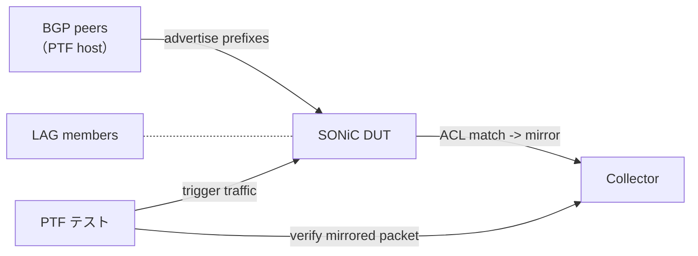

<!-- topics-tip -->
!!! tip "Topics で読み物として読む"
    この HLD は実装詳細を含みます。機能の概念・設定・運用を読み物として読みたい場合は [Topics 07 章: ACL / CoPP / Mirror](../topics/07-acl-copp-mirror/index.md) を参照。
<!-- /topics-tip -->

!!! success "裏取りステータス: code-verified (2026-05-11)"
    テストプラン本体は `sonic-mgmt` 側の Ansible / PTF テストスクリプトに対する仕様だが、被テストの mirror 機能 (`MIRROR_SESSION` 制御パス: src/dst IP / DSCP / TTL / GRE type / next-hop / queue / status) は `sonic-swss/orchagent/mirrororch.cpp` L15-L24 ほか 1611 行に渡って実装されている。P4 mirror manager 系も `orchagent/p4orch/mirror_session_manager.cpp` で存在を確認。`sonic-mgmt` ツリーはローカルキャッシュ未取り込みのためテストスクリプト本体の文言一致は別バッチに委ねる。

# Everflow テストプラン（ingress + egress mirror、LAG / ECMP / IPv6）

## 概要

Everflow（[SAI](../reference/glossary.md#term-sai) mirror session ベースのトラフィックミラーリング）について、SAI API の単体テストではなく **本番に近い構成での functional / negative テスト** を行うプラン[^1]。[LAG](../reference/glossary.md#term-lag)・[BGP](../reference/glossary.md#term-bgp) route advertise・[ECMP](../reference/glossary.md#term-ecmp) next-hop 変動・neighbor MAC 変更・policer [DSCP](../reference/glossary.md#term-dscp) enforcement を含む。

旧 Everflow テストプランからの拡張点:

- **Egress [ACL](../reference/glossary.md#term-acl) table** と **Egress mirror session** の追加カバレッジ
- ACL rule で `IN_PORTS` マッチ（既存スクリプトでは未カバー）
- ICMP `type` / `code` マッチ
- **IPv6 Everflow**

## 動作仕様

### テスト構成



事前条件: BGP セッション、LAG、ACL table / rule、mirror session が configured な「running [SONiC](../reference/glossary.md#term-sonic) system」を用意する[^1]。テストは特定 SAI API ではなく **end-to-end 機能** の検証。

### 事前準備（apply_config）

- `acl_rule_persistent.json` を `acl-loader` で投入
- `session.json` で `MIRROR_SESSION` を `config mirror_session add` で投入
- `acl_table.json` で `ACL_TABLE`（mirror 用）を投入

### テストケース（既存 1〜5）

| # | 目的 |
|---|------|
| 1 | best match 解決 route 経由でミラーされる |
| 2 | neighbor MAC 変更後、新 MAC で encap される |
| 3 | ECMP route 変更（mirror に使われていない NH 削除）でも mirror が継続 |
| 4 | ECMP route 変更（mirror に使われている NH 削除）で迅速に他 NH に切替 |
| 5 | policer enforcement で mirror パケットの DSCP が ACL 設定通り |

### 拡張ケース（本プランの追加）

- **Egress ACL table + Egress mirror**: ingress では落とさず egress 段階で mirror する。Egress 側 SAI ACL がある platform 限定[^1]
- **ACL rule `IN_PORTS` 一致**: 入力ポートマッチでの mirror。LAG メンバーポートの個別指定にも使える
- **ICMP `type` / `code` マッチ**: ping / unreachable など特定 ICMP のみ取る
- **IPv6 Everflow**: IPv6 src/dst で match し、collector へは IPv6-in-IPv6 / GRE で encap

### LAG 環境固有の注意

LAG + Everflow は **専用テストベッドでのみ実行**[^1]。LAG hash の決定性に依存するため、テストの入力フローを LAG 全メンバーに分散させる前提で組む。

<!-- evidence:
source: sonic-net/SONiC/doc/acl/Everflow-test-plan.md#L60-L66 (sha: 49bab5b5ff0e924f1ea52b3d9db0dfa4191a7c06)
excerpt: |
  The test is targeting a running SONIC system with fully functioning configuration.
  The purpose of the test is not to test specific SAI API, but functional testing of Everflow on SONiC system,
  making sure that traffic flows correctly, according to BGP routes advertised by BGP peers of SONIC switch,
  and the LAG configuration.
reasoning: テストの目的（SAI 単体ではなく end-to-end 機能）の根拠。
-->

<!-- evidence-rendered:start -->
??? note "📋 検証エビデンス: sonic-net/SONiC/doc/acl/Everflow-test-plan.md#L60-L66 (sha: 49bab5b5ff0e924f1ea52b3d9db0dfa4191a7c06)"

    **出典**:

    `sonic-net/SONiC/doc/acl/Everflow-test-plan.md#L60-L66 (sha: 49bab5b5ff0e924f1ea52b3d9db0dfa4191a7c06)`

    **抜粋**:

    ```text
    The test is targeting a running SONIC system with fully functioning configuration.
    The purpose of the test is not to test specific SAI API, but functional testing of Everflow on SONiC system,
    making sure that traffic flows correctly, according to BGP routes advertised by BGP peers of SONIC switch,
    and the LAG configuration.
    ```

    **判断根拠**: テストの目的（SAI 単体ではなく end-to-end 機能）の根拠。

<!-- evidence-rendered:end -->

## 設定

### 関連する CLI

| Command | 用途 |
|---------|------|
| `config acl add table <name> <type>` | ACL table 作成 |
| `config acl update full <json>` | ACL rules を一括投入 |
| `acl-loader update full <json>` | 同上、JSON ファイルから |
| `aclshow` | rule 単位カウンタ表示 |
| `config mirror_session add` | mirror session（dst IP / DSCP / TTL / GRE type） |
| `sonic-cfggen -j <json> --write-to-db` | テスト config の流し込み |

## 制限事項

- LAG ケースは LAG-specific testbed が必須[^1]
- platform が egress ACL / IPv6 ACL に対応していない場合、当該テストは skip
- BGP peer / collector の接続性は事前条件（`get_neighbor_info.yml` 等で確認）

## 干渉する機能

- **ACL Flex Counter**: `aclshow` の counter は別 framework 由来（rule 単位）。テストの counter assertion はここに依存
- **Mirror session resolve**: best match route 経由・neighbor MAC で encap header を組むため、route / neighbor 変動に追随する [neighorch / mirrororch] 挙動が前提
- **[Policer](../reference/glossary.md#term-policer)**: rule に policer を載せた場合の rate / DSCP enforcement 確認

## トラブルシューティング

- mirror パケットが届かない → BGP route で collector への best match が取れているか確認、neighbor MAC 解決確認
- LAG 越しに偏る → LAG hash 確認。テスト側の flow 多様化を確認

### コマンド例: Everflow / mirror 確認

下記コマンドを順に実行することで、関連する [CONFIG_DB](../reference/glossary.md#term-config_db) / APP_DB / [STATE_DB](../reference/glossary.md#term-state_db) のエントリと、
CLI 表示・syslog の整合を一通り突き合わせ確認できる。

```bash
# Mirror session と関連 ACL の状態を確認
show mirror_session
redis-cli -n 4 hgetall 'MIRROR_SESSION|everflow0'
# ACL_RULE のヒットカウントで mirror trigger を確認
show acl counters
```

## 裏取り済み実装位置 (2026-05-11)

- Mirror session 制御フィールド: `sonic-swss/orchagent/mirrororch.cpp` L15-L24 (`MIRROR_SESSION_STATUS` / `STATUS_ACTIVE` / `STATUS_INACTIVE` / `NEXT_HOP_IP` / `SRC_IP` / `DST_IP` / `GRE_TYPE` / `DSCP` / `TTL` / `QUEUE`)
- MirrorOrch 本体: 同 `mirrororch.cpp` (1611 行) と `mirrororch.h`
- P4 経路の MirrorSessionManager: `sonic-swss/orchagent/p4orch/mirror_session_manager.cpp` / `.h` （SAI mirror session 抽象化）

> `sonic-mgmt` 配下の Everflow テストスクリプト本体（Ansible playbook / PTF）と本テストプランの文言一致は本ローカルでは確認できないため、別バッチで `.cache/sonic-sources/sonic-mgmt` を取り込んだ後に再検証する。

## 引用元

[^1]: `sonic-net/SONiC` `doc/acl/Everflow-test-plan.md` @ `49bab5b5ff0e924f1ea52b3d9db0dfa4191a7c06`

<!-- concerns hint:
- sonic-mgmt 上の Everflow Ansible / PTF テストスクリプトが本テストプランと一致しているか確認
- Egress ACL / Egress mirror の sonic-swss / SAI 取り込み確認
- aclshow rule counter 取得経路（COUNTERS_DB）と本テストの assertion の整合確認
- ACL rule IN_PORTS マッチの SAI 対応確認（platform 依存）
- ICMP type/code マッチの SAI ACL field 取り込み確認
- IPv6 Everflow の collector encap（IPv6-in-IPv6 / GRE 6to6）対応確認
-->

<!-- topics-back-ref -->
## 関連 Topics

- [Topics: ACL / CoPP / Mirror / Packet Action](../topics/07-acl-copp-mirror/index.md)
- [Topics: Lab / Virtual SONiC / Developer Entry](../topics/21-lab-vs-developer/index.md)

<!-- /topics-back-ref -->

<!-- glossary-links-injected: 8ba32e5aa69d -->
