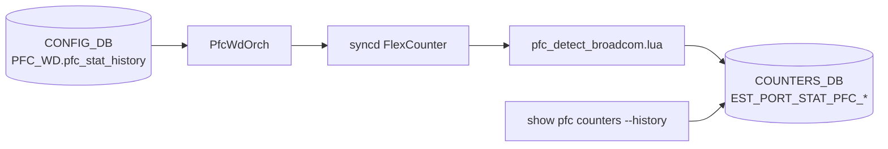

<!-- topics-tip -->
!!! tip "Topics で読み物として読む"
    この HLD は実装詳細を含みます。機能の概念・設定・運用を読み物として読みたい場合は [Topics 08 章: QoS / Buffer / PFC](../topics/08-qos-buffer/index.md) を参照。
<!-- /topics-tip -->

!!! success "裏取りステータス: Code-verified（Broadcom 限定）"
    現行 master で実装を確認: `sonic-swss/orchagent/pfc_detect_broadcom.lua` に `EST_PORT_STAT_PFC_*_RX_PAUSE_DURATION_US` / `EST_PORT_STAT_PFC_*_RECENT_PAUSE_TIME_US` 等の estimate フィールド (L20-45)、`sonic-swss/orchagent/pfcwdorch.cpp` に `PFC_STAT_HISTORY` 設定キー (L18)、`sonic-utilities/scripts/pfcstat` に `--history` オプション (L376) と `collect_history` / `get_history` 実装 (L154-)、`sonic-utilities/config/main.py` に `config pfcwd pfc_stat_history` (L3529-) と `config pfcwd start --pfc-stat-history` (L3457) を確認 (verified at: 2026-05-09)。

# PFC 履歴統計（PFCWD lua スクリプトによる estimate と `--history` CLI）

## これは何か（一行で）

[PFC](../reference/glossary.md#term-pfc) pause を **受けていた累積時間 / 遷移回数 / 直近 pause 時刻** を PFCWD の lua ポーリングから推定して `COUNTERS_DB` に書き、`show pfc counters --history` で表示する Broadcom 限定機能[^1]。

## どんなときに使うか

- 「`SAI_PORT_STAT_PFC_*_RX_PAUSE_DURATION_US` を [ASIC](../reference/glossary.md#term-asic) が直接出せない」プラットフォームで、過去の pause 履歴を知りたい
- PFC ストームではないが「**pause が断続的に来ていた**」事象を後追いしたい

ストーム検出（PFCWD 本体）は別物。本機能は同じ lua スクリプトに乗る **観測専用の付加機能**。

## 何を計測するか

per-port × per-priority で次の 4 値を推定する[^1]:

| キー | 意味 |
|------|------|
| `EST_PORT_STAT_PFC_*_ON2OFF_RX_PKTS` | paused → unpaused 遷移の累積回数 |
| `EST_PORT_STAT_PFC_*_RX_PAUSE_DURATION_US` | 累積 pause 時間（μs） |
| `EST_PORT_STAT_PFC_*_RECENT_PAUSE_TIMESTAMP` | 直近 unpaused → paused 時刻（Linux epoch float） |
| `EST_PORT_STAT_PFC_*_RECENT_PAUSE_TIME_US` | 直近 paused 後の経過時間（μs） |

同等値が [SAI](../reference/glossary.md#term-sai) で直接出るならそちらを優先する。

## 推定アルゴリズム

ポーリング周期ごとに 3 つの状態を見て増分を決める[^1]:

- `Was Paused`: 前回ポーリング時の paused 状態
- `PFC Activity`: 前回からこの周期までに PFC RX カウンタが進んだか
- `Now Paused`: SAI `SAI_QUEUE_ATTR_PAUSE_STATUS` 利用可ならそれ、無ければ `PFC Activity` を代用

8 通りの真理値表で各カウンタの増分を決める。精度はモード依存:

- RX カウンタのみ: `PFC Activity = true ⇒ paused とみなす`（poll 区間中はずっと paused だったと近似）
- Pause Status あり: 状態を SAI から直読し、Activity は遷移検出に使う（精度高い）

## 全体構造



reboot 時、PFCWD は全 `_last` フィールドをクリアして古いポーリングデータの混入を防ぐ[^1]。

## 設定

### CONFIG_DB

| Table | Key | フィールド | 説明 |
|-------|-----|-----------|------|
| `PFC_WD` | `<port>` | `pfc_stat_history` | port 単位で履歴 estimate を `enable` / `disable` |

その他既存の `action` / `detection_time` / `restoration_time` は不変。

### CLI

| Command | 用途 |
|---------|------|
| `config pfcwd pfc_stat_history enable\|disable [ports]` | port 単位で履歴 estimate を切替 |
| `config pfcwd start <ports> --pfc-stat-history` | start と同時に history を有効化 |
| `show pfc counters --history` | 履歴統計表示 |
| `sonic-clear pfc` | 履歴含めてクリア（CLI 内部キャッシュ diff、DB 書き換えは無し） |

### 設定例

```bash
sudo config pfcwd pfc_stat_history enable Ethernet0
sudo config pfcwd start Ethernet0 400
show pfc counters --history
```

出力例[^1]:

```text
       Port  Priority  RX Pause Transitions  Total RX Pause Time US  Recent RX Pause Time US  Recent RX Pause Timestamp
  Ethernet0      PFC3                     6               1,430,570                  527,739  03/25/2025, 17:22:37.982800
  Ethernet0      PFC4                     6               1,328,012                  425,181  03/25/2025, 17:22:37.982800
```

### YANG

[HLD](../reference/glossary.md#term-hld) に記述なし。

## 制限事項

- **Broadcom 限定**。他プラットフォームでは lua スクリプトの追加実装が必要[^1]。
- 受信 pause（RX）のみ。送信 pause は対象外。
- RX カウンタのみのモードでは「ポーリング間隔より短い pause」を取りこぼす可能性[^1]。
- `sonic-clear pfc` は CLI 内部キャッシュの差分でクリアを表現するため、`Recent Time` / `Recent Timestamp` はクリアされない[^1]。
- PFC enabled でないポートに `pfc_stat_history enable` は CLI バリデーションで拒否。

## 干渉する機能

- **PFCWD ストーム検出**: 同じ lua に乗るが検出ロジックは不変
- **`SAI_QUEUE_ATTR_PAUSE_STATUS` / `SAI_PORT_STAT_PFC_*_ON2OFF_RX_PKTS`**: SAI で出ていれば estimate せず直読
- **[CRM](../reference/glossary.md#term-crm) / counter polling**: 通常の flex counter と同じ [syncd](../reference/glossary.md#term-syncd) ポーリングに依存

## トラブルシューティング

- `--history` で全 `N/A` → `pfc_stat_history` が enable で、PFCWD が当該ポートで `start` 済みか確認
- 値が増え続けてクリア効かない → `sonic-clear pfc` は CLI 内 diff 方式。CLI 再起動でキャッシュが消えるとリセット効果も消える点に注意
- transitions 数が多すぎる → RX-only モードでは短い pause が遷移として水増しされる場合あり

### コマンド例: PFC 統計履歴の確認

下記コマンドを順に実行することで、関連する [CONFIG_DB](../reference/glossary.md#term-config_db) / APP_DB / [STATE_DB](../reference/glossary.md#term-state_db) のエントリと、
CLI 表示・syslog の整合を一通り突き合わせ確認できる。

```bash
# PFC stats と historical counter（pfc_wd 含む）の確認
show pfc counters
show pfcwd stats
# COUNTERS_DB から RX/TX PFC キュー別カウンタを直接取得
redis-cli -n 2 keys 'COUNTERS:oid:*' | head
```


## 関連トピック

- [Topics: QoS / Buffer](../topics/08-qos-buffer/index.md)
- [Topics: ACL / CoPP / Mirror](../topics/07-acl-copp-mirror/index.md)

## 関連ページ

- [Asymmetric PFC Test Plan](./asymmetric-pfc-test-plan.md)
- [WRED / ECN Statistics](./wred-and-ecn-statistics.md)

## 引用元

[^1]: `sonic-net/SONiC` `doc/PFC_historical_statistics/PFC_Counters_History_HLD.md` @ `49bab5b5ff0e924f1ea52b3d9db0dfa4191a7c06`

<!-- topics-back-ref -->
## 関連 Topics

- [Topics: QoS / Buffer / PFC / Watermark](../topics/08-qos-buffer/index.md)

<!-- /topics-back-ref -->

<!-- glossary-links-injected: c006405759d8 -->
