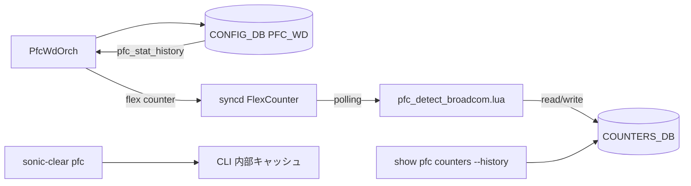

!!! success "裏取りステータス: Code-verified（Broadcom 限定）"
    現行 master で実装を確認: `sonic-swss/orchagent/pfc_detect_broadcom.lua` に `EST_PORT_STAT_PFC_*_RX_PAUSE_DURATION_US` / `EST_PORT_STAT_PFC_*_RECENT_PAUSE_TIME_US` 等の estimate フィールド (L20-45)、`sonic-swss/orchagent/pfcwdorch.cpp` に `PFC_STAT_HISTORY` 設定キー (L18)、`sonic-utilities/scripts/pfcstat` に `--history` オプション (L376) と `collect_history` / `get_history` 実装 (L154-)、`sonic-utilities/config/main.py` に `config pfcwd pfc_stat_history` (L3529-) と `config pfcwd start --pfc-stat-history` (L3457) を確認 (verified at: 2026-05-09)。

# PFC 履歴統計（PFCWD lua スクリプトによる estimate と --history CLI）

## 概要

PFC Watchdog (PFCWD) の検出 lua スクリプトを拡張して、**PFC pause を受信した時間と遷移回数を推定（estimate）して COUNTERS_DB に保存** し、`show pfc counters --history` で表示できるようにする[^1]。SAI ネイティブの `SAI_PORT_STAT_PFC_*_ON2OFF_RX_PKTS` / `SAI_PORT_STAT_PFC_*_RX_PAUSE_DURATION_US` をサポートしないプラットフォームでも、ポーリング差分から擬似的に履歴を再現する。

**Broadcom 限定** の現行実装。他プラットフォームへの移植は、本 HLD を参考に lua スクリプトを増やせば可能と HLD で示唆されている[^1]。

## 動作仕様

### 推定対象の 4 値（per-port × per-priority）

| 推定キー | 意味 |
|----------|------|
| `EST_PORT_STAT_PFC_*_ON2OFF_RX_PKTS`         | paused → unpaused 遷移の累積回数 |
| `EST_PORT_STAT_PFC_*_RX_PAUSE_DURATION_US`   | 累積 pause 時間（μs） |
| `EST_PORT_STAT_PFC_*_RECENT_PAUSE_TIMESTAMP` | 直近 unpaused → paused 時刻（Linux epoch float） |
| `EST_PORT_STAT_PFC_*_RECENT_PAUSE_TIME_US`   | 直近 paused 後の経過時間（μs） |

SAI で同等値を直接公開している場合は estimate せずに SAI 値を読む（HLD 表で明記）[^1]。

### 推定アルゴリズム

各ポーリング周期で以下の 3 点から状態を判定する：

- `Was Paused`: 前回ポーリング時の paused 状態
- `PFC Activity`: 前回からこの周期までに PFC RX カウンタが進んだか
- `Now Paused`: 現在の paused 状態（`SAI_QUEUE_ATTR_PAUSE_STATUS` 利用可ならそれ、そうでなければ `PFC Activity` を代用）

8 通りの組み合わせから増分を決める真理値表が HLD にある[^1]。RX カウンタのみのモードと、`SAI_QUEUE_ATTR_PAUSE_STATUS` を使えるモードでは精度が異なる：

- RX カウンタのみ: `PFC Activity = true ⇒ paused とみなす`（poll 区間中は paused だったと近似）
- Pause Status あり: 状態は SAI から直読、PFC Activity は遷移検出に使う

### モジュール構成



### COUNTERS_DB

```text
TIMESTAMP
    PFCWD_POLL_TIMESTAMP_last = <epoch_us>

COUNTERS:oid:<port-oid>
    EST_PORT_STAT_PFC_<n>_ON2OFF_RX_PKTS         = <counter>
    EST_PORT_STAT_PFC_<n>_RX_PAUSE_DURATION_US   = <counter>
    EST_PORT_STAT_PFC_<n>_RECENT_PAUSE_TIME_US   = <counter>
    EST_PORT_STAT_PFC_<n>_RECENT_PAUSE_TIMESTAMP = <epoch_float>
    SAI_PORT_STAT_PFC_<n>_RX_PKTS_last           = <metadata>

COUNTERS:oid:<queue-oid>
    (SAI|EST)_QUEUE_ATTR_PAUSE_STATUS_last = <bool>
```

reboot 時、PFCWD は全 `_last` フィールドをクリアして古いポーリングデータの混入を防ぐ[^1]。

### CONFIG_DB

```text
PFC_WD|<port>
    action            = drop | ...
    detection_time    = ms
    restoration_time  = ms
    pfc_stat_history  = "enable" | "disable"
```

## 設定

### 関連する CONFIG_DB

| Table | Key | フィールド | 説明 |
|-------|-----|-----------|------|
| `PFC_WD` | `<port>` | `pfc_stat_history` | port 単位で履歴 estimate を ON/OFF |

### 関連する CLI

| Command | 用途 |
|---------|------|
| `config pfcwd pfc_stat_history enable\|disable [ports]` | port 単位で履歴 estimate を切替 |
| `config pfcwd start <ports> --pfc-stat-history` | start と同時に history を有効化 |
| `show pfc counters --history`              | 履歴統計表示 |
| `sonic-clear pfc`                          | 履歴含めてクリア（CLI 内部キャッシュ diff、DB 書き換えは無し） |

### 関連する YANG

HLD に YANG モデルの記述は無い。

### 設定例

```bash
sudo config pfcwd pfc_stat_history enable Ethernet0
sudo config pfcwd start Ethernet0 400
show pfc counters --history
```

出力例（HLD より）:

```text
       Port  Priority  RX Pause Transitions  Total RX Pause Time US  Recent RX Pause Time US  Recent RX Pause Timestamp
  Ethernet0      PFC3                     6               1,430,570                  527,739  03/25/2025, 17:22:37.982800
  Ethernet0      PFC4                     6               1,328,012                  425,181  03/25/2025, 17:22:37.982800
```

## 制限事項

- **Broadcom 限定**。他プラットフォームでは lua スクリプトの追加実装が必要[^1]。
- 受信 pause（RX）のみ追跡。送信 pause は対象外。
- RX カウンタのみのモードでは「ポーリング間隔より短い pause」を取りこぼす可能性あり（HLD でモード比較表として明記）[^1]。
- `sonic-clear pfc` は CLI 内部キャッシュの差分でクリアを表現するため、`Recent Time` / `Recent Timestamp` はクリアされない[^1]。
- PFC enabled でないポートに `pfc_stat_history enable` を入れるのは無効（CLI バリデーションで拒否）。

## 干渉する機能

- **PFCWD storm detection**: 同じ lua スクリプトに乗る。ストーム検出のロジックは変えない。
- **`SAI_QUEUE_ATTR_PAUSE_STATUS` / `SAI_PORT_STAT_PFC_*_ON2OFF_RX_PKTS` / `SAI_PORT_STAT_PFC_*_RX_PAUSE_DURATION_US`**: SAI で公開されていれば estimate を行わずに直読する。
- **CRM / counter polling**: 通常の flex counter 同様 syncd ポーリングに依存。

## トラブルシューティング

- `--history` を打ったら全 `N/A` → `pfc_stat_history` が enable で、PFCWD が当該ポートで `start` 済みか確認。
- 値が連続して増え続ける（クリアできない） → `sonic-clear pfc` の動作は CLI 内 diff 方式のため、CLI を再起動するとキャッシュが失われリセット効果が消える点に注意。
- 期待より transitions 数が多い → RX-only モードでは `PFC Activity = true` がそのまま `Now Paused` 扱いされ、短い pause の重ね打ちで遷移が水増しされる場合がある。

## 引用元

[^1]: `sonic-net/SONiC` `doc/PFC_historical_statistics/PFC_Counters_History_HLD.md` @ `49bab5b5ff0e924f1ea52b3d9db0dfa4191a7c06`
