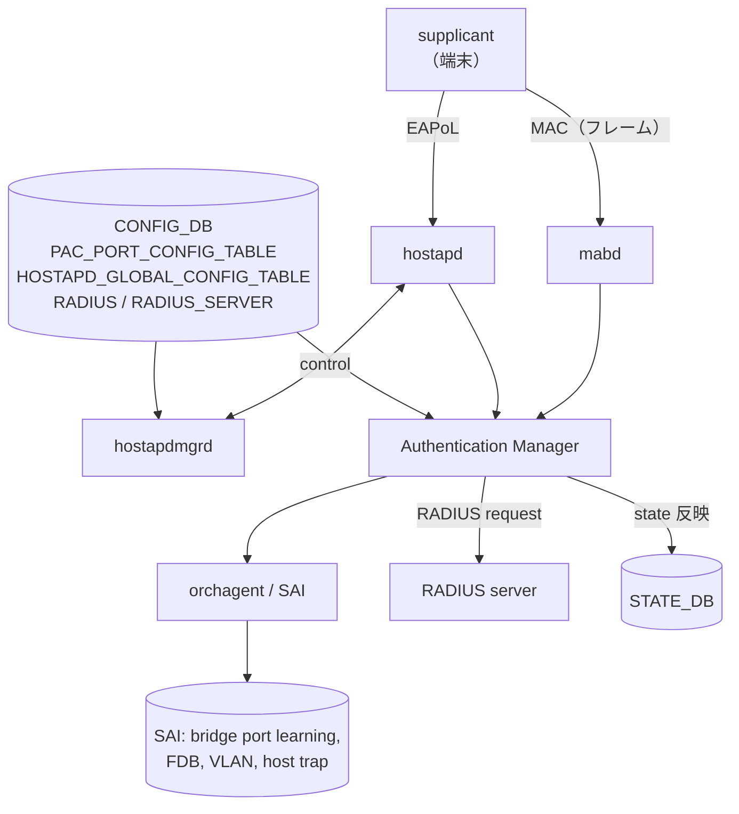
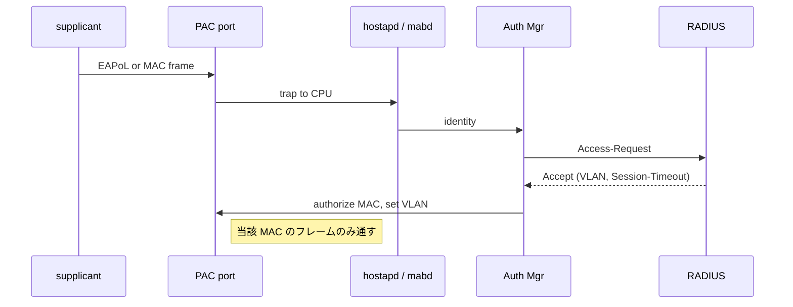

!!! warning "裏取りステータス: HLD-only"
    `Authentication Manager` / `mabd` / `hostapdmgrd` の現行 master 取り込み、SAI Bridge port learning モード変更、PAC 用 host interface trap、各 CONFIG_DB スキーマ・CLI の sonic-utilities 取り込みは未確認。

!!! note "Verifier 2026-05-09: HLD パス再確認済み"
    `sonic-net/SONiC` master HEAD `380509d` でも `frontmatter.sources` に列挙された HLD が当該パスに存在し、本ページ記述と乖離が無いことを確認した。`concerns` に挙げられた community master（sonic-buildimage / sonic-swss / sonic-utilities / sonic-sairedis）への取り込み有無は依然として未裏取りで、`verification: hld-only` を維持する。

# Port Access Control（PAC: 802.1x / MAB / RADIUS）

## 概要

物理ポート単位の **クライアント認証** （IEEE 802.1x + MAB）を SONiC に持ち込む機能[^1]。RADIUS で外部 AAA サーバに問合せ、結果に応じて当該 MAC をポートに「authorized / unauthorized」状態で許可する。authorized クライアントを VLAN に動的に割り当てる（VLAN assignment）こともできる。

要点:

- 対象は **物理 interface のみ**（LAG / VLAN bind は不可）[^1]
- 認証方式: 802.1x（EAPoL）/ MAB（MAC をクライアント識別子として RADIUS に問合せ）。両方を同一ポートに有効化可、優先順序は設定可能[^1]
- ホストモード: Multiple Hosts / Single-Host / Multiple Authentication
- ポートモード: Auto / Force-Authorized / Force-Unauthorized
- Re-authentication 対応

## 動作仕様

### コンポーネント構成



### 各 daemon の責務

| Daemon | 役割 |
|--------|------|
| `hostapd` | 802.1x EAP-{MD5, PEAP, TLS} などの supplicant 対応 |
| `hostapdmgrd` | `CONFIG_DB` を hostapd 設定ファイルに変換、再読込制御 |
| `mabd` | MAB 用に MAC 学習をトリガにして RADIUS リクエストを発行（PAP / CHAP / EAP-MD5）[^1] |
| Authentication Manager | 802.1x と MAB の結果統合、ポート / クライアントの authorized state 管理 |

### CONFIG_DB

```
PAC_PORT_CONFIG_TABLE|<port>:
  pac_enabled  = true | false
  port_control = auto | force-authorized | force-unauthorized
  host_mode    = multi-host | single-host | multi-auth
  reauth       = enabled | disabled
  priority     = dot1x-then-mab | mab-then-dot1x

HOSTAPD_GLOBAL_CONFIG_TABLE:
  ...

RADIUS:
  auth_type, retransmit, ...

RADIUS_SERVER|<server-ip>:
  auth_port, key, priority, ...
```

`STATE_DB` に client / port の authorized 状態と認証方式（dot1x / mab）を出す[^1]。

### SAI 影響

- **Bridge port learning mode の変更**: PAC 有効ポートでは learning 制御が PAC 側に移る[^1]
- **FDB**: authorized クライアント MAC のみ移動 / 学習を許可。MAC move 時の挙動は HLD で別節
- **VLAN**: RADIUS から VLAN 割当属性が来たら dynamic VLAN bind
- **Host interface trap**: EAPoL / MAB 用フレームを CPU に上げるため新 trap 追加

### 認証フロー



### Warm reboot

HLD では 802.1x / MAB の認証状態を `STATE_DB` から復元する想定で書かれている[^1]。具体的なステートシリアライズは別節。

<!-- evidence:
source: sonic-net/SONiC/doc/pac/Port Access Control.md#L120-L160 (sha: 49bab5b5ff0e924f1ea52b3d9db0dfa4191a7c06)
excerpt: |
  PAC should be supported on physical interfaces only.
  PAC should enforce access control for clients ... using ... 802.1x, MAB.
  ... The following PAC port modes should be supported: Auto / Force Authorized / Force Unauthorized
reasoning: 物理 IF 限定・802.1x/MAB 併用・3 種 port mode の根拠。
-->

## 設定

### 関連する CLI（HLD で言及）

| Command | 用途 |
|---------|------|
| `config authentication port-control auto Ethernet0` | port mode |
| `config authentication host-mode multi-auth Ethernet0` | host mode |
| `config dot1x enable Ethernet0` | 802.1x 有効化 |
| `config mab enable Ethernet0` | MAB 有効化 |
| `config radius add <ip> --key <secret>` | RADIUS server 追加 |
| `show authentication interface Ethernet0` | 認証状態表示 |
| `clear authentication sessions interface Ethernet0` | セッションクリア |

CLI 文法は HLD ベース。実装は v0.2 / v0.3 で見直されているため詳細差異あり。

## 制限事項

- **物理 interface のみ**[^1]
- **EAP-TLS の証明書管理は別経路**（hostapd 側設定）
- 動的 VLAN は RADIUS 属性経由のみ
- LAG メンバーポートに直接 PAC を効かせるのは想定外（LAG でなくメンバーが認証対象）

## 干渉する機能

- **VLAN / FDB**: dynamic VLAN 割当・MAC move によって VLAN_MEMBER / FDB が変動
- **AAA / RADIUS**: AAA improvements や RADIUS 全体の改修と密接（management 章の RADIUS / AAA ページ参照）
- **CoPP**: EAPoL / MAB のフレームを CPU に上げる trap が CoPP queue を消費

## トラブルシューティング

- 認証が通らない → `show authentication interface` でセッション状態確認、RADIUS server reachable 確認
- VLAN が変わらない → RADIUS Accept に VLAN attribute（Tunnel-Type / Tunnel-Medium-Type / Tunnel-Private-Group-ID）が来ているか抽出ログ確認
- MAB が誤判定 → `mabd` ログで MAC 学習契機と RADIUS リクエスト送出を確認

## 引用元

[^1]: `sonic-net/SONiC` `doc/pac/Port Access Control.md` @ `49bab5b5ff0e924f1ea52b3d9db0dfa4191a7c06`

<!-- concerns hint:
- Authentication Manager / mabd / hostapdmgrd の現行 master 取り込み確認
- PAC_PORT_CONFIG_TABLE / HOSTAPD_GLOBAL_CONFIG_TABLE / RADIUS / RADIUS_SERVER YANG 取り込み確認
- config authentication / config dot1x / config mab CLI の sonic-utilities 取り込み確認
- SAI Bridge port learning mode 変更と FDB MAC move への対応 community SAI 確認
- EAPoL / MAB 用 host interface trap の SAI / CoPP 設定取り込み確認
- 動的 VLAN 割当（RADIUS Tunnel attributes）の VLAN orch 連携確認
-->
