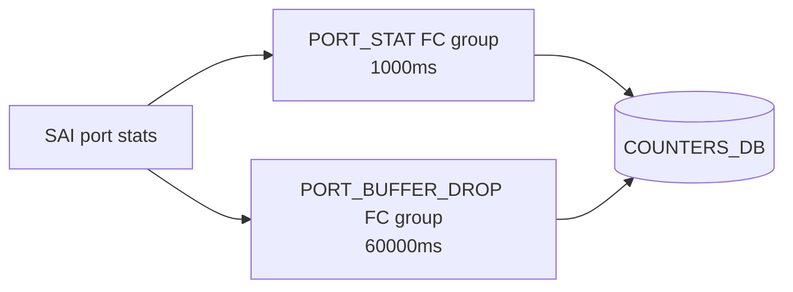

<!-- topics-tip -->
!!! tip "Topics で読み物として読む"
    この HLD は実装詳細を含みます。機能の概念・設定・運用を読み物として読みたい場合は [Topics 08 章: QoS / Buffer / PFC](../topics/08-qos-buffer/index.md) を参照。
<!-- /topics-tip -->

!!! success "裏取りステータス: code-verified"
    `sonic-swss/orchagent/portsorch.h` L31 で `PORT_BUFFER_DROP_STAT_FLEX_COUNTER_GROUP="PORT_BUFFER_DROP_STAT"`、`portsorch.cpp` L88 で `PORT_BUFFER_DROP_STAT_POLLING_INTERVAL_MS=60000`、`sonic-utilities/counterpoll/main.py` L146-178 で `click.IntRange(30000, 300000)` バリデーション (verified at: 2026-05-09)。

# ポートバッファドロップカウンタ（PORT_BUFFER_DROP FC group）

ポート単位の [SAI](../reference/glossary.md#term-sai) バッファドロップカウンタは「**なぜ専用 FC グループにしたか**」「**何を取るのか**」「**CLI でどう操作するか**」の 3 点が分かれば全体像はつかめる。順に答える。

## なぜ専用 FC グループに分けたのか

過去に普通の `PORT_STAT` と同じ FC グループに混ぜて 1 秒間隔でポーリングしたところ、性能影響と衝突を起こし master から外された経緯がある[^1]。

> "These counters are causing widespread issues in the master branch, so we're backing them out for now to be revisited in a later PR. They will likely need to be polled separately from the other counters, and on a longer interval, to avoid performance issues and conflicts." — [sonic-swss](../reference/glossary.md#term-sonic-swss) PR 1308

そこで **専用 FC グループ `PORT_BUFFER_DROP` を新設し、既定 60 秒** というゆったりした間隔で取る設計に切り替えた。CLI でも短すぎる interval を弾くバリデーションを入れている[^1]。

## 何を取るのか

SAI port stat 2 種[^1]:

| SAI counter | 意味 |
|-------------|------|
| `SAI_PORT_STAT_IN_DROPPED_PKTS` | ingress バッファドロップ |
| `SAI_PORT_STAT_OUT_DROPPED_PKTS` | egress バッファドロップ |



既存 `PORT_STAT` から本 2 カウンタを切り出して別 FC グループにするだけ。保管先は同じ [COUNTERS_DB](../reference/glossary.md#term-counters_db)。

## CLI でどう操作するか

`counterpoll show` の出力に `PORT_BUFFER_DROP` 行が追加される（既定 60000ms / enable）[^1]。

```bash
counterpoll port-buffer-drop enable
counterpoll port-buffer-drop disable
counterpoll port-buffer-drop interval 30000    # 30000〜300000 のみ受理
```

interval バリデーションは **30s〜5min**。範囲外は CLI で拒否される（過去の性能問題再発防止）[^1]。

<!-- evidence:
source: sonic-net/SONiC/doc/port_buffer_drop_counters/sonic_port_buffer_drop_counters.md#L52-L60 (sha: 49bab5b5ff0e924f1ea52b3d9db0dfa4191a7c06)
excerpt: |
  3. The polling interval is 60s by default
  3.2 Users can set the polling interval in range from 30s to 5m
reasoning: 既定 60s と CLI バリデーション範囲（30s〜5m）の根拠。
-->

<!-- evidence-rendered:start -->
??? note "📋 検証エビデンス: sonic-net/SONiC/doc/port_buffer_drop_counters/sonic_port_buffer_drop_counters.md#L52-L60 (sha: 49bab5b5ff0e924f1ea52b3d9db0dfa4191a7c06)"

    **出典**:

    `sonic-net/SONiC/doc/port_buffer_drop_counters/sonic_port_buffer_drop_counters.md#L52-L60 (sha: 49bab5b5ff0e924f1ea52b3d9db0dfa4191a7c06)`

    **抜粋**:

    ```text
    3. The polling interval is 60s by default
    3.2 Users can set the polling interval in range from 30s to 5m
    ```

    **判断根拠**: 既定 60s と CLI バリデーション範囲（30s〜5m）の根拠。

<!-- evidence-rendered:end -->

## 関連する CONFIG_DB / CLI

| Table | Key | フィールド | 用途 |
|-------|-----|-----------|------|
| `FLEX_COUNTER_TABLE` | `PORT_BUFFER_DROP` | `FLEX_COUNTER_STATUS`, `POLL_INTERVAL` | enable / interval 保持 |

| Command | 用途 |
|---------|------|
| `counterpoll show` | 全 FC グループ状態一覧 |
| `counterpoll port-buffer-drop enable/disable` | 有効化 / 無効化 |
| `counterpoll port-buffer-drop interval <ms>` | 30000〜300000 |

## 制限事項

- interval は 30s〜5min の範囲外を受け付けない[^1]
- 対象は port 単位の `IN/OUT_DROPPED_PKTS` のみ。Queue / PG / [Buffer Pool](../reference/glossary.md#term-buffer-pool) 単位は別 FC 系統[^1]
- 既定 60s のため、サブ秒のマイクロドロップを瞬時に観測する用途には向かない

## 干渉する機能

- **`PORT_STAT` FC group**: 元々まとまっていた drop 系が分離。`PORT_STAT` を 1s のまま運用しても drop 系は 60s 側で安全
- **`show interfaces counters`**: `COUNTERS_DB` 経由で読むため、disable 時は値が固まる
- **マイクロバースト解析**: サブ秒精度が要るなら watermark / テレメトリ系を併用
- **[WRED](../reference/glossary.md#term-wred) 統計**: WRED 由来の早期ドロップを区別したいなら WRED 統計側を使う

## トラブルシューティング

- `PORT_BUFFER_DROP` 行が出ない: [sonic-utilities](../reference/glossary.md#term-sonic-utilities) が未取り込み。`FLEX_COUNTER_TABLE|PORT_BUFFER_DROP` を redis で確認
- `interval 1000` で error: 仕様。30000〜300000 を指定
- drop count が 0 のまま: `counterpoll show` で enable 状態か確認
- 値が桁違いに少ない: interval が長いため瞬間ドロップは積み上がりにくい。観測時の dt を考慮

### コマンド例: Port buffer drop counter 確認

下記コマンドを順に実行することで、関連する [CONFIG_DB](../reference/glossary.md#term-config_db) / APP_DB / [STATE_DB](../reference/glossary.md#term-state_db) のエントリと、
CLI 表示・syslog の整合を一通り突き合わせ確認できる。

```bash
# buffer-drop counter の polling と現在値
counterpoll show
show queue counters
# COUNTERS_DB の BUFFER_DROP 系キー
redis-cli -n 2 keys '*BUFFER_DROP*' | head
```

## 関連ページ

- [Configurable Drop Counters in SONiC](./configurable-drop-counters-in-sonic.md)
- [Watermark Counters in SONiC](./watermark-counters-in-sonic.md)

## 引用元

[^1]: `sonic-net/SONiC` `doc/port_buffer_drop_counters/sonic_port_buffer_drop_counters.md` @ `49bab5b5ff0e924f1ea52b3d9db0dfa4191a7c06`

<!-- topics-back-ref -->
## 関連 Topics

- [Topics: QoS / Buffer / PFC / Watermark](../topics/08-qos-buffer/index.md)

<!-- /topics-back-ref -->

<!-- glossary-links-injected: 881c373e11ef -->
