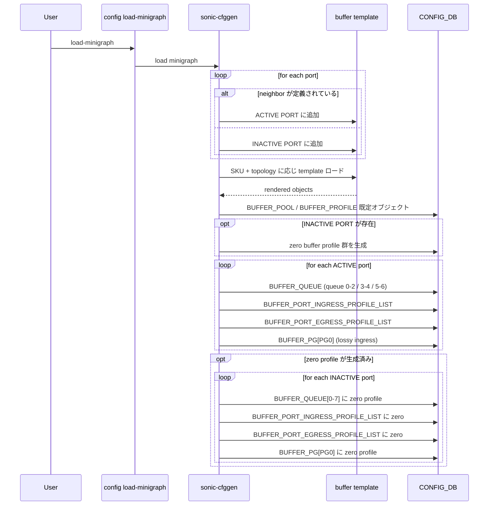
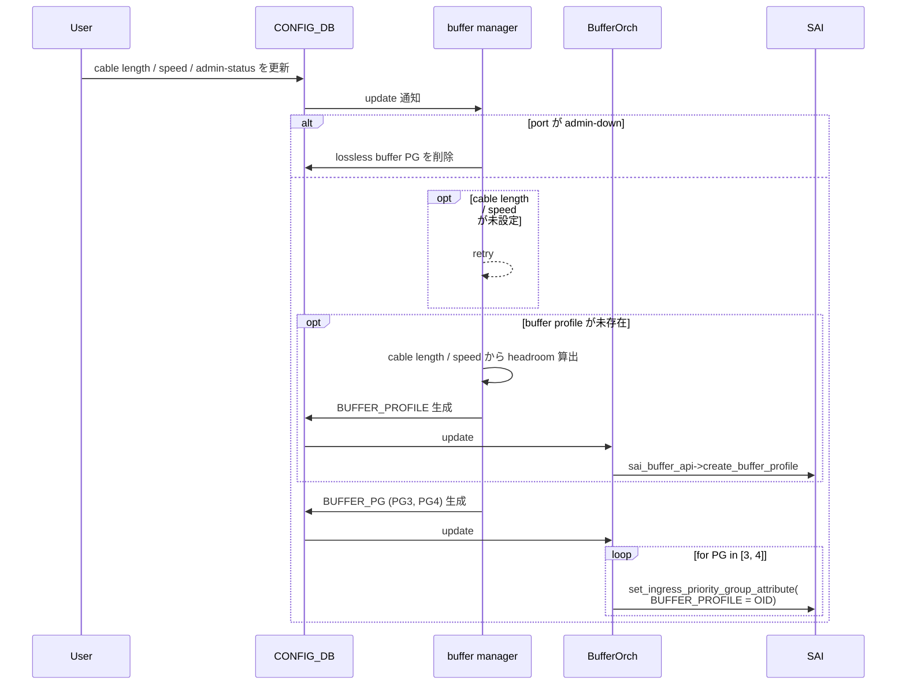
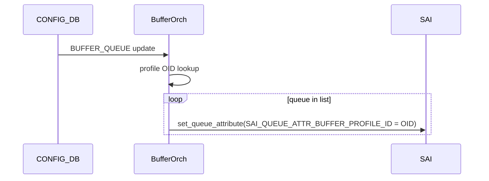
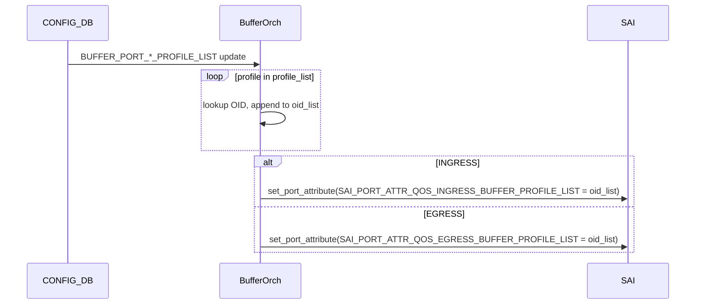
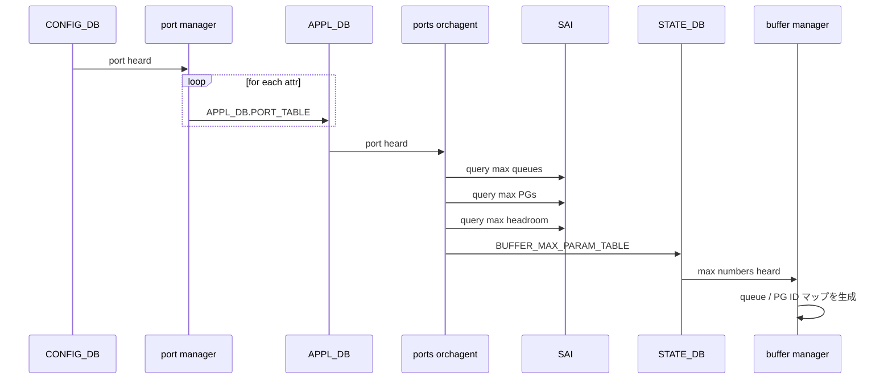
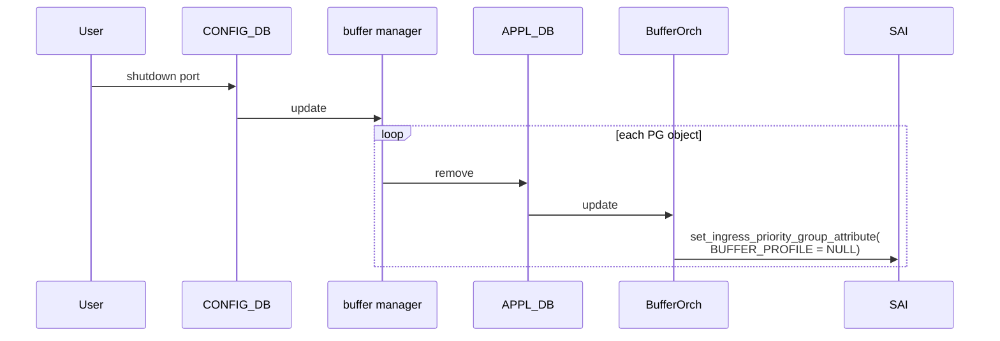
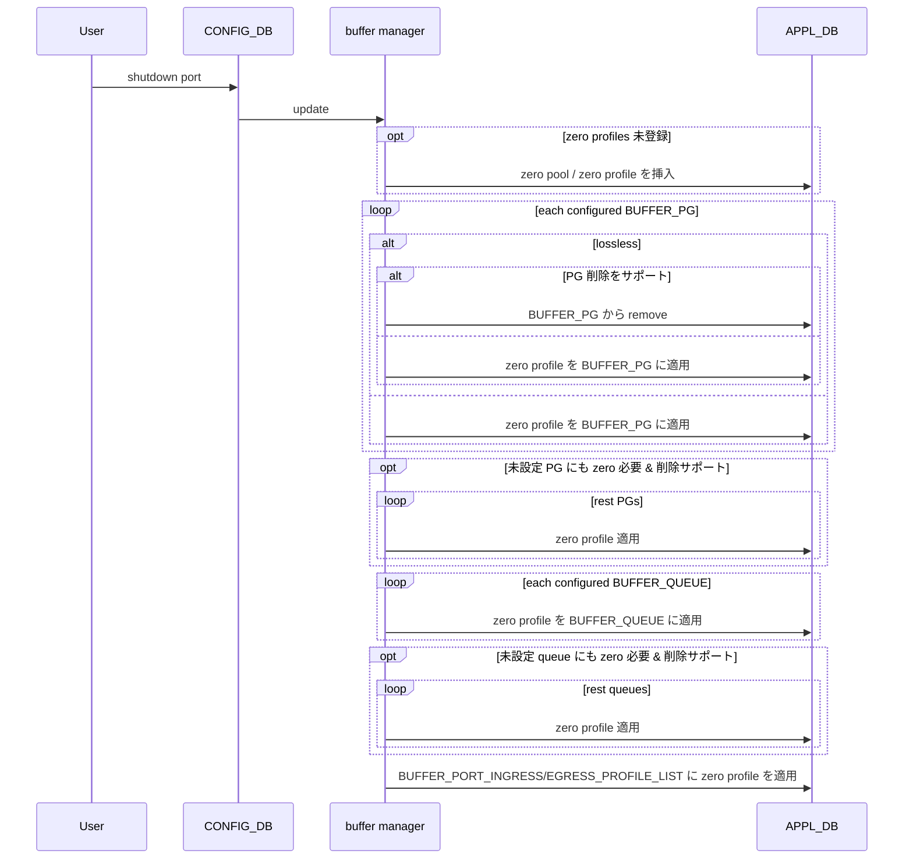

!!! warning "裏取りステータス: HLD-only"
    本ページは公式 HLD 配下のシーケンス図 markdown を再構成したもの。`buffermgrd` / `BufferOrch` / `sonic-cfggen` の zero profile 適用ロジックや、`STATE_DB.BUFFER_MAX_PARAM_TABLE` の現行 schema、PG / queue 削除サポート (`support removing PGs`) のフラグ表現は実コードでの裏取り未済。

# 未使用ポートの予約バッファ回収（reclaim reserved buffer）シーケンス

## 概要

SONiC のバッファ管理は **buffer pool / profile / PG / queue** で構成され、各ポートに対し default で priority group (PG) と queue ごとの **予約バッファ（reserved size + headroom）** が確保される。実運用では minigraph で **neighbor が宣言されていないポート（INACTIVE PORT）** が存在し、そのポート分の予約バッファは ASIC の有限リソースを浪費する。

本 HLD は **「INACTIVE / admin-down ポートの buffer 予約を zero buffer profile で 0 化して回収する」** ためのシーケンスを定義する[^1]。対象フローは 3 つのカテゴリに分けて整理されている:

1. **deploy フロー**: `config load-minigraph` 起動時の初期投入で INACTIVE ポートに zero profile を適用する
2. **normal フロー**: 動的に admin-down された場合に lossless PG を削除し、zero profile を適用する
3. **dynamic buffer 系**: dynamic buffer model でポート shutdown 時に zero pool / profile を APPL_DB に挿入し、PG / queue / profile_list 全てに zero profile を反映する

## 動作仕様

### 1. deploy フロー (`config load-minigraph` 起点)

`sonic-cfggen` は minigraph を読み、ポートを **ACTIVE / INACTIVE** に分類した上で SKU + topology に応じた buffer template を render する[^1]。

ポイント[^1]:

- **ACTIVE ポートには通常の lossy PG / queue / profile_list** を投入
- **INACTIVE ポートには zero profile** を全 PG / queue / profile_list に適用し、ASIC のバッファ予約を 0 にする
- zero profile 生成の有無は `INACTIVE PORT` 集合が空でないことで条件分岐される

### 2. normal フロー（traditional buffer model, admin-down 時）

CONFIG_DB に書かれた cable length / speed / admin-status を起点に **`buffer manager`** が反応し、必要に応じ buffer profile を生成して `BUFFER_PG` を更新、最終的に **`BufferOrch`** が SAI へ反映する[^1]。

admin-down 時は **lossless PG (PG 3 / 4) を削除** することで対応する。

### 3. queue / port profile_list 個別の SAI 反映

#### `BUFFER_QUEUE` 反映

`BufferOrch` は CONFIG_DB 通知を受け、queue ごとに `SAI_QUEUE_ATTR_BUFFER_PROFILE_ID` を SAI へ設定する[^1]:

#### `BUFFER_PORT_INGRESS/EGRESS_PROFILE_LIST` 反映

ポートに紐づくバッファプロファイルのリストを **OID リスト** に変換し、`SAI_PORT_ATTR_QOS_INGRESS_BUFFER_PROFILE_LIST` または `..._EGRESS_BUFFER_PROFILE_LIST` を一括 set する[^1]:

### 4. dynamic buffer 系の port 初期化フロー

dynamic buffer model では **`port manager` → `ports orchagent` → `buffer manager`** の経路で `STATE_DB.BUFFER_MAX_PARAM_TABLE` に各ポートの **最大 queue / PG / headroom** を登録する。`buffer manager` はこの値から内部の queue / PG ID マップを生成し、後段の zero profile 適用で「設定されていない PG / queue にも zero を当てる」のに使う[^1]:

### 5. dynamic buffer 系の shutdown フロー（旧 vs 新）

#### 旧フロー

ポート shutdown 時、`buffer manager` は **buffer PG オブジェクトを APPL_DB から削除** する。`BufferOrch` は通知を受け、SAI 側で `SAI_INGRESS_PRIORITY_GROUP_ATTR_BUFFER_PROFILE = SAI_NULL_OBJECT_ID` を設定し、reserved / headroom を 0 にする[^1]:

#### 新フロー（reclaim reserved buffer）

旧フローの「PG を削除 → SAI で NULL profile を設定 → reserved 0」では **削除を許さない ASIC** で挙動が破綻する。新フローでは **APPL_DB に zero pool / zero profile を先に挿入し、PG / queue / profile_list へ zero profile を貼る** ことで「削除をサポートしない ASIC でも 0 化できる」設計とする[^1]:

ポイント[^1]:

- zero profile は **pool ごとに 1 つ** 用意し、profile_list の各 entry に対応する zero profile を入れる
- ASIC が **PG / queue 削除をサポート** すれば「`remove` で 0 化」、サポートしなければ **`zero profile` で 0 化** と二段階のフォールバック
- `BUFFER_MAX_PARAM_TABLE` から得た最大 PG / queue 数を使い、**設定されていない PG / queue にも zero profile を貼る** (削除サポート時のみ)

## 設定

### 関連する CONFIG_DB

| Table | 用途 |
|-------|------|
| `BUFFER_POOL` | バッファプール定義（zero pool もここに挿入される） |
| `BUFFER_PROFILE` | バッファプロファイル定義（zero profile もここ） |
| `BUFFER_PG` | priority group 単位のバッファ割当 |
| `BUFFER_QUEUE` | egress queue 単位のバッファ割当 |
| `BUFFER_PORT_INGRESS_PROFILE_LIST` | port の ingress 側 profile リスト |
| `BUFFER_PORT_EGRESS_PROFILE_LIST` | port の egress 側 profile リスト |

### 関連する STATE_DB

| Table | 用途 |
|-------|------|
| `BUFFER_MAX_PARAM_TABLE` | port の最大 queue / PG / headroom 数（`ports orchagent` が SAI から取得して書き込む） |

### 関連する CLI

| Command | 用途 |
|---------|------|
| `config load-minigraph` | minigraph を読み deploy フロー（INACTIVE port に zero profile 適用）を実行 |

### 設定例

INACTIVE ポートの予約回収は **ユーザ操作不要**。minigraph に neighbor を書かないポートが自動的に INACTIVE と判定され、`config load-minigraph` 実行時に zero profile が適用される。

## 制限事項

- 旧 normal フローは **lossless PG (3, 4) のみ remove** 対象。lossy PG (0) は触らない[^1]
- dynamic buffer 系の zero profile 適用は **pool ごとに zero profile を持つ前提**。pool 種別と zero profile の対応が崩れていると不整合
- 「PG / queue 削除をサポートしない ASIC」では **未設定 PG / queue への zero 適用は不可**（削除サポートがある場合のみ網羅可）
- HLD 本体は flow chart 集であり、各シーケンス上の **エラー時の retry / rollback** は明示されていない

## 干渉する機能

- **`buffermgrd` / `buffer manager`**: 主体。CONFIG_DB / APPL_DB の双方を扱う
- **`BufferOrch`**: SAI への反映を担う。set / create / remove の整合は BufferOrch 側責務
- **`portsorch`**: dynamic buffer の前段で `BUFFER_MAX_PARAM_TABLE` を SAI から構築
- **`sonic-cfggen` + buffer template (Jinja)**: deploy フロー時の zero profile 生成元
- **lossless / lossy queue 構成**: PFC / headroom と密結合。zero 適用で意図せず PFC 設定が失われないこと

## トラブルシューティング

- INACTIVE ポートの予約バッファが解放されない → `redis-cli -n 4 keys 'BUFFER_PG|*'` で zero profile が適用されているか確認
- shutdown 後にバッファが残る → ASIC の **PG/queue 削除サポート** の有無と、`BUFFER_PG` / `BUFFER_QUEUE` の現行値を確認
- `BUFFER_MAX_PARAM_TABLE` が空 → `portsorch` が SAI から最大値を取得する初期化が完了していない可能性

## 引用元

[^1]: `sonic-net/SONiC` `doc/qos/reclaim-reserved-buffer-images/reclaim-reserved-buffer-sequence-flow.md` @ `49bab5b5ff0e924f1ea52b3d9db0dfa4191a7c06`

<!-- concerns hint:
- buffermgrd / buffer manager の zero profile 挿入ロジックの実装存在確認
- BUFFER_MAX_PARAM_TABLE の現行 STATE_DB スキーマ確認
- BufferOrch の SAI 経路（create_buffer_profile / set_ingress_priority_group_attribute）確認
- ASIC の PG / queue 削除サポートを表現するフラグの場所確認
- sonic-cfggen の buffer template (Jinja) で INACTIVE port 判定が現行 master にあるか未確認
-->
