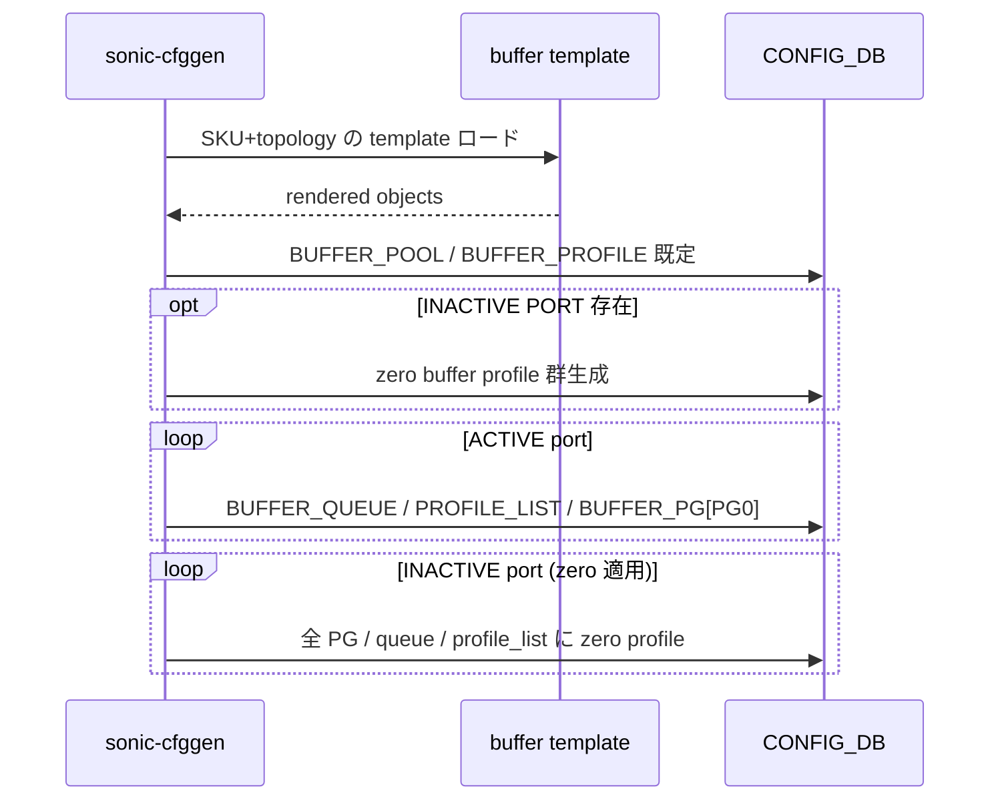
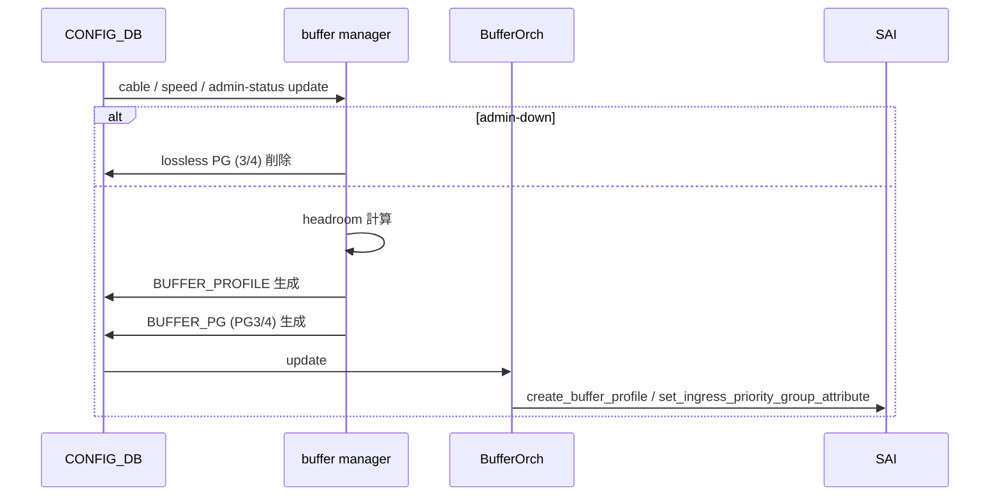
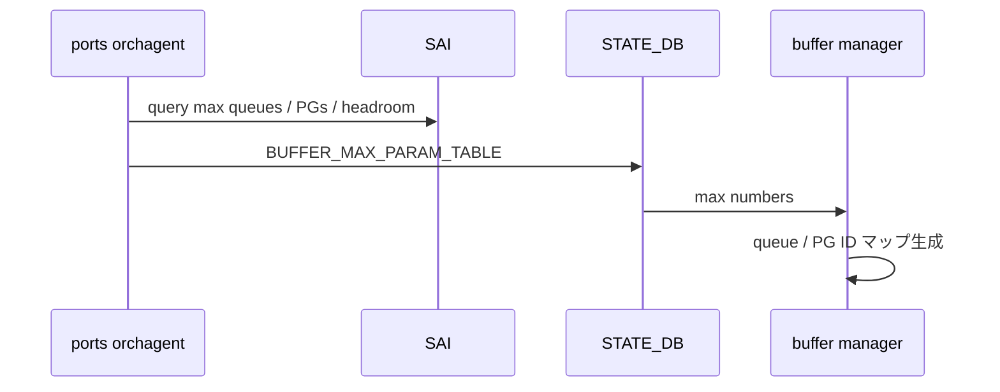
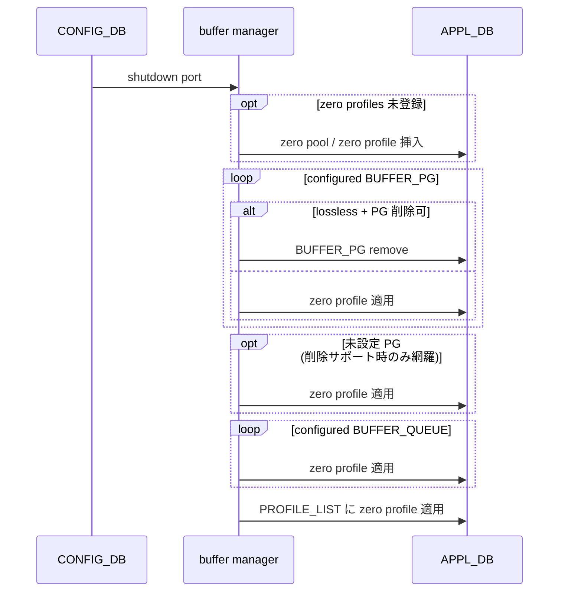

<!-- topics-tip -->
!!! tip "Topics で読み物として読む"
    この HLD は実装詳細を含む。機能の概念・設定・運用を読み物として読みたい場合は [Topics 08 章: QoS / Buffer / PFC](../topics/08-qos-buffer/index.md) を参照。
<!-- /topics-tip -->

!!! success "裏取りステータス: code-verified"
    `sonic-swss/cfgmgr/buffermgrd.cpp` L26/L98-121 で `-z zero_profiles.json` オプションを確認。`buffermgrdyn.cpp` L245-275 で `pgs_to_apply_zero_profile` / `ingress_zero_profile` / `queues_to_apply_zero_profile` / `egress_zero_profile` のパースと zero profile 適用ロジックを確認。`buffermgrdyn.h` L33 で `zero_profile_name` メンバを確認。`sonic-swss-common/common/schema.h` L480 で `STATE_BUFFER_MAXIMUM_VALUE_TABLE = "BUFFER_MAX_PARAM_TABLE"` を確認（verified at: 2026-05-09）。

# 未使用ポートの予約バッファ回収（reclaim reserved buffer）シーケンス

## なぜ必要か

[SONiC](../reference/glossary.md#term-sonic) のバッファ管理は **buffer pool / profile / PG / queue** で構成され、各ポートに priority group (PG) と queue ごとの **予約バッファ（reserved + headroom）** が確保される。minigraph で neighbor が宣言されない **INACTIVE PORT** の分まで予約すると [ASIC](../reference/glossary.md#term-asic) の有限リソースを浪費する。

本 [HLD](../reference/glossary.md#term-hld) は **「INACTIVE / admin-down ポートの予約を zero buffer profile で 0 化する」** 3 系統のフローを定義する[^1]:

1. **deploy フロー**: `config load-minigraph` 起動時に INACTIVE ポートへ zero profile 投入
2. **normal フロー**: 動的 admin-down 時に lossless PG を削除（traditional buffer model）
3. **dynamic buffer フロー**: shutdown 時に zero pool / profile を [APPL_DB](../reference/glossary.md#term-appl_db) に挿入し、PG / queue / profile_list を全て zero へ寄せる

## 1. deploy フロー（`config load-minigraph`）

`sonic-cfggen` が minigraph を読み、neighbor 有無で **ACTIVE / INACTIVE** に分類、SKU + topology に応じた buffer template を render する[^1]。



- ACTIVE: 通常 lossy PG / queue / profile_list
- INACTIVE: 全 PG / queue / profile_list に zero profile を当て予約 0 化
- zero profile 生成は INACTIVE 集合が非空のときのみ

## 2. normal フロー（traditional buffer model, admin-down 時）

cable length / speed / admin-status を起点に **`buffer manager`** が反応、必要なら profile を生成 → `BUFFER_PG` 更新 → **`BufferOrch`** が [SAI](../reference/glossary.md#term-sai) に反映[^1]。



admin-down 時は **lossless PG (PG 3/4) のみ削除**、lossy PG (PG0) は触らない。

## 3. SAI 反映（queue / port profile_list）

- `BUFFER_QUEUE` update → `BufferOrch` が queue ごとに `SAI_QUEUE_ATTR_BUFFER_PROFILE_ID` を set
- `BUFFER_PORT_{INGRESS,EGRESS}_PROFILE_LIST` update → profile を OID リストに変換し `SAI_PORT_ATTR_QOS_{INGRESS,EGRESS}_BUFFER_PROFILE_LIST` を一括 set

## 4. dynamic buffer の port 初期化

`port manager → ports orchagent → buffer manager` の経路で `STATE_DB.BUFFER_MAX_PARAM_TABLE` に **最大 queue / PG / headroom** を登録。`buffer manager` はこの値から内部 queue / PG ID マップを生成し、後段の zero 適用で「未設定 PG / queue」にも zero を当てる材料にする[^1]。



## 5. dynamic buffer の shutdown フロー（旧 vs 新）

### 旧フロー

shutdown 時、buffer manager が **PG オブジェクトを APPL_DB から削除** し、`BufferOrch` が SAI で `SAI_INGRESS_PRIORITY_GROUP_ATTR_BUFFER_PROFILE = SAI_NULL_OBJECT_ID` を設定して reserved / headroom を 0 にする。**PG 削除を許さない ASIC で破綻** する。

### 新フロー（reclaim reserved buffer）

APPL_DB に **zero pool / zero profile を先に挿入** し、PG / queue / profile_list に zero profile を貼ることで「削除非対応 ASIC でも 0 化」する設計[^1]:



ポイント[^1]:

- zero profile は **pool ごとに 1 つ**。profile_list の各 entry に対応する zero を入れる
- ASIC が **PG / queue 削除サポート** すれば「remove で 0 化」、未対応なら「zero profile で 0 化」と二段階フォールバック
- `BUFFER_MAX_PARAM_TABLE` の最大値から **未設定 PG / queue にも zero を貼る**（削除サポート時のみ）

## 設定

### CONFIG_DB / STATE_DB / CLI

| 種別 | 名前 | 用途 |
|------|------|------|
| [CONFIG_DB](../reference/glossary.md#term-config_db) | `BUFFER_POOL` / `BUFFER_PROFILE` | zero pool / profile もここに挿入される |
| CONFIG_DB | `BUFFER_PG` / `BUFFER_QUEUE` | PG / queue 単位の割当 |
| CONFIG_DB | `BUFFER_PORT_{INGRESS,EGRESS}_PROFILE_LIST` | port 側 profile リスト |
| [STATE_DB](../reference/glossary.md#term-state_db) | `BUFFER_MAX_PARAM_TABLE` | port の最大 queue / PG / headroom |
| CLI | `config load-minigraph` | deploy フローのトリガ |

### 設定例

INACTIVE ポートの予約回収は **ユーザ操作不要**。minigraph に neighbor を書かないポートが自動的に INACTIVE と判定され、`config load-minigraph` 実行時に zero profile が適用される。

## 制限事項

- traditional normal フローは **lossless PG (3/4) のみ remove**。lossy PG (0) は触らない[^1]
- dynamic buffer の zero 適用は **pool ごとに zero profile が揃っている前提**
- 「PG / queue 削除非サポート ASIC」では **未設定 PG / queue は網羅不可**
- HLD は flow chart 集で、各シーケンスの **retry / rollback は未明示**

## 干渉する機能

- `buffermgrd` / `buffer manager`: 主体（CONFIG_DB / APPL_DB 双方）
- `BufferOrch`: SAI 反映。set / create / remove の整合を担当
- `portsorch`: dynamic buffer 前段で `BUFFER_MAX_PARAM_TABLE` を構築
- `sonic-cfggen` + buffer template (Jinja): deploy フローの zero profile 生成元
- lossless / lossy queue 構成: [PFC](../reference/glossary.md#term-pfc) / headroom と密結合（zero 適用で PFC 設定が失われないこと）

## トラブルシューティング

```bash
redis-cli -n 4 keys 'BUFFER_PG|*'         # INACTIVE port に zero profile が当たっているか
redis-cli -n 6 hgetall 'BUFFER_MAX_PARAM_TABLE|<port>'   # 最大 PG/queue が来ているか
```

- INACTIVE ポートの予約が解放されない → zero profile 名と [BUFFER_PG](../reference/glossary.md#term-buffer-pg) の値を確認
- shutdown 後にバッファが残る → ASIC の PG/queue 削除サポート有無を確認
- `BUFFER_MAX_PARAM_TABLE` が空 → `portsorch` 初期化が完了していない可能性

## 関連 Topics

- [08-qos-buffer/concept](../topics/08-qos-buffer/concept.md): [QoS](../reference/glossary.md#term-qos) / buffer の全体像
- [08-qos-buffer/internals](../topics/08-qos-buffer/internals.md): buffermgrd / BufferOrch / dynamic buffer

## 引用元

[^1]: `sonic-net/SONiC` `doc/qos/reclaim-reserved-buffer-images/reclaim-reserved-buffer-sequence-flow.md` @ `49bab5b5ff0e924f1ea52b3d9db0dfa4191a7c06`

<!-- topics-back-ref -->
## Topics 索引

- [Topics: QoS / Buffer / PFC / Watermark](../topics/08-qos-buffer/index.md)

<!-- /topics-back-ref -->

<!-- glossary-links-injected: ec18b66e3507 -->
