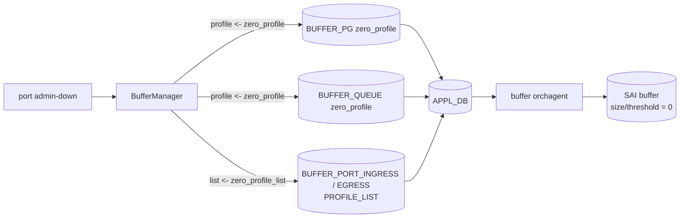

!!! warning "裏取りステータス: HLD-only"
    `zero_profile` を含む BUFFER スキーマ拡張、buffermgrd / db_migrator / Mellanox SAI 側挙動は現行 master 未裏取り。

!!! note "Verifier 2026-05-09: HLD パス再確認済み"
    `sonic-net/SONiC` master HEAD `380509d` でも `frontmatter.sources` に列挙された HLD が当該パスに存在し、本ページ記述と乖離が無いことを確認した。`concerns` に挙げられた community master（sonic-buildimage / sonic-swss / sonic-utilities / sonic-sairedis）への取り込み有無は依然として未裏取りで、`verification: hld-only` を維持する。

# Reclaim Reserved Buffer（admin-down ポートの zero_profile）

## 概要

Mellanox プラットフォームで顕著な「admin-down ポートにも default で reserved buffer が割り当てられ、shared pool が圧迫される」問題に対し、**`zero_profile` を admin-down ポートに明示的に紐付け、reserved buffer をゼロ化して shared pool に取り戻す** 設計[^1]。

対象は次の SONiC buffer config 全体[^1]:

- `BUFFER_PG`
- `BUFFER_QUEUE`
- `BUFFER_PORT_INGRESS_PROFILE_LIST` / `BUFFER_PORT_EGRESS_PROFILE_LIST`

ポートの admin-down 契機は 2 通り[^1]:

1. deployment で利用しないポート（INACTIVE port）
2. メンテナンスのため一時的 shut down

両方で reclaim が走る。

## 動作仕様

### 「単純削除」では起きる不整合

最初に思いつくのは「admin-down ポートの BUFFER_PG / BUFFER_QUEUE エントリを削除する」だが、HLD はこれを否定する。SAI / SDK は **「設定が無いとき = SDK default 値（一部は非ゼロ）」** であり、設定削除（`SAI_NULL_OBJECT_ID`）すると **0 にリセット** される。結果、

- 起動時設定なし → SDK default（非ゼロ）
- 起動後に削除 → 0

という同じ「設定なし」状態で ASIC 側が異なる、という不整合になる[^1]。

### `zero_profile` 解（採用）

`zero_profile` の中身（Mellanox 例）:

| 対象 | profile mode | 値 |
|------|-------------|---|
| Lossy PG | static threshold | `static_th = 0`, `size = 0`、`zero_pool` に紐付け（pool size 0） |
| Queue / Profile list | dynamic threshold | `size = 0` |
| Lossless PG | （profile を当てず）SAI から完全に削除する |

**lossless PG** は zero_profile ではなく **SAI から完全削除**。`SAI_NULL_OBJECT_ID` で削除しても結果が 0 になる対象（HLD 引用部）であるため[^1]。

### 起動条件

- **traditional buffer model**: deployment 時に未使用ポートが分かっていれば最初から `zero_profile` 適用。途中で `config interface shutdown` した場合は user の責任で profile 適用[^1]
- **dynamic buffer model**: 未使用ポートが 1 つでもあれば `zero_profile` を `APPL_DB` に push。ランタイムで buffer manager が自動 toggle

### Database migrator

旧イメージから upgrade した system に対し、`db_migrator` が admin-down ポートの BUFFER 設定を `zero_profile` 紐付けに書き換える[^1]。

### Vendor 別

zero_profile を template で提供している vendor のみ採用。それ以外は HLD のいう「buffer 設定削除」方式に従う（不整合は受け入れる）[^1]。

<!-- evidence:
source: sonic-net/SONiC/doc/qos/reclaim-reserved-buffer.md#L66-L96 (sha: 49bab5b5ff0e924f1ea52b3d9db0dfa4191a7c06)
excerpt: |
  - For lossless buffer priority groups, SONiC should remove them from SAI when the port is admin down.
  - For other buffer objects: Introduce a new type of buffer profiles - `zero profile`.
reasoning: lossless PG は削除、それ以外は zero_profile という分担の根拠。
-->

## 設定

### CLI

HLD 内で reclaim 専用の CLI 言及は無い。`config interface shutdown` / `startup` のフックとして buffer manager が自動で `zero_profile` を着脱する設計[^1]。

### CONFIG_DB

`zero_profile` 系は **テンプレート（buffers_config.j2）に同梱** される vendor 提供データ。CONFIG_DB に手書きする運用は想定されない。

## 制限事項

- **vendor が zero_profile テンプレートを提供している platform 限定**[^1]
- traditional buffer model でランタイム shutdown した場合、user 側で profile を当てる必要あり
- shared headroom pool model など vendor 固有の buffer model 差異がそのまま zero_profile 定義に反映される

## 干渉する機能

- **Dynamic Buffer Calculation**: 同じ buffer manager が司る。dynamic mode では shutdown 時の自動 reclaim が標準動作になる
- **db_migrator**: 旧 image からの upgrade 時に admin-down ポートを zero_profile に置換
- **PFC / lossless**: lossless PG は zero_profile ではなく削除なので、enable し直しの順序に注意

## トラブルシューティング

- shared pool が増えない → admin-down ポートの BUFFER_PG / BUFFER_QUEUE に zero_profile が当たっているか APPL_DB で確認
- lossless トラフィックが落ちる → admin-down 後 admin-up した際の lossless PG 再作成順序を確認

## 引用元

[^1]: `sonic-net/SONiC` `doc/qos/reclaim-reserved-buffer.md` @ `49bab5b5ff0e924f1ea52b3d9db0dfa4191a7c06`

<!-- concerns hint:
- buffermgrd の admin-down hook で zero_profile を APPL_DB に push する実装存在確認
- BUFFER_PG / BUFFER_QUEUE / BUFFER_PORT_*_PROFILE_LIST の YANG 取り込み確認（zero_profile 受け入れ）
- db_migrator の admin-down ポート処理ロジック実装確認
- Mellanox SAI 側で zero_pool / zero profile を受けて size=0 になる挙動確認
- vendor 別実装差異（zero_profile 提供の有無）の現行 sonic-buildimage 内ベンダーディレクトリ確認
- shared headroom pool model など複数 buffer model における zero_profile 互換性確認
-->
