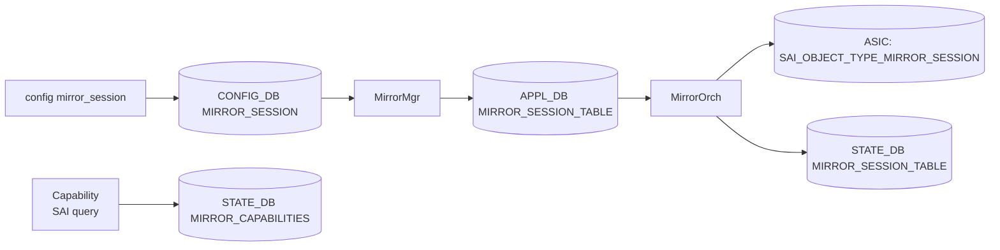

!!! warning "裏取りステータス: HLD-only"
    HLD は v0.2 / 2025-09 改訂。ポート/Port-Channel 単位の SPAN ingress/egress、ERSPAN、Mirror Capability Discovery 関連の実装が現行 master の `MirrorOrch` / `sonic-utilities` でこの仕様どおりかは未確認。**詳細は HLD `doc/port-mirroring/SONiC_Port_Mirroring_HLD.md` を参照（30KB 超のため要点のみ抜粋）**。

# SONiC Port Mirroring（SPAN / ERSPAN）

## 概要

SONiC の port mirroring 拡張。Port / Port-Channel 単位の **ingress / egress / both** SPAN、および ERSPAN（IP encapsulation）に対応する[^1]。複数ソース・単一宛先の動的セッション管理、Port-Channel に対するセッションは少なくとも 1 メンバが UP のとき有効、を要件とする。

v0.2 では **Mirror Capability Discovery and Validation** が追加された（プラットフォームが対応する mirror モード・属性を STATE_DB に公開して上位が事前検証できるようにする仕組み）[^1]。

## 動作仕様

### 主要要件（要約）

- Port / Port-Channel の ingress / egress / both のミラー方向選択。
- **SPAN**: 同一スイッチ内ポートへのコピー。
- **ERSPAN**: 任意の IP 宛先への encapsulation 配送。
- 複数ソース → 単一宛先（many-to-one）。
- Port-Channel ソースは少なくとも 1 メンバ UP で有効化。
- 動的更新（メンバ追加・削除、宛先変更）。
- Capability Discovery: ASIC ごとに対応モード/属性を STATE_DB に公開し、未対応モードの設定試行を早期に弾く。

### モジュール



### CONFIG_DB スキーマ

```text
MIRROR_SESSION|<session_name>
    type            = "SPAN" | "ERSPAN"
    src_ip          = ipv4/v6      ; ERSPAN only
    dst_ip          = ipv4/v6      ; ERSPAN only
    gre_type        = uint16       ; ERSPAN only
    dscp            = uint8        ; ERSPAN only
    ttl             = uint8        ; ERSPAN only
    queue           = uint         ; ERSPAN only
    src_port        = comma-list   ; ingress/egress マッピング
    dst_port        = ifname       ; SPAN destination
    direction       = "rx" | "tx" | "both"
```

### Capability Discovery

`MIRROR_CAPABILITIES` テーブル（STATE_DB）に、プラットフォームでサポートされる mirror モードと属性を syncd 起動時に書き込み。`MirrorOrch` は新セッション作成前に capability を参照し、未対応モードを `MirrorMgr` に対してエラー返却する。

## 設定

### 関連する CONFIG_DB

| Table | 説明 |
|-------|------|
| `MIRROR_SESSION` | session 単位の SPAN/ERSPAN 定義 |

### 関連する CLI

```text
config mirror_session add <name> --type SPAN --src-port <p> --dst-port <p> --direction rx
config mirror_session add <name> --type ERSPAN --src-ip <ip> --dst-ip <ip> --gre-type <type> --src-port <p>
config mirror_session remove <name>
show mirror_session
```

### 設定例

```bash
sudo config mirror_session add MIR_SPAN1 \
    --type SPAN --src-port Ethernet0 --dst-port Ethernet48 --direction both
show mirror_session
```

## 制限事項

- Mirror セッション数の上限は ASIC 依存。Capability Discovery で取得する。
- Port-Channel 宛先は HLD の主要対象ではない（ソースのみ Port-Channel 対応が明記）。
- Warm boot 影響は HLD 別節を参照。
- 詳細フロー / SAI 属性マッピングは HLD `doc/port-mirroring/SONiC_Port_Mirroring_HLD.md` を参照。

## 干渉する機能

- **ACL ベース mirror（Everflow）**: 別途 ACL ルールに `MIRROR` アクションを付ける機能があり、本ページの port-based mirror とは独立に動く。
- **Buffer / Egress queue**: ERSPAN は egress queue を消費する。輻輳時のミラー精度に影響。
- **Port-Channel メンバシップ変更**: メンバ全滅でセッションが down する。

## トラブルシューティング

- mirror が走らない → `show mirror_session` で `status: active` を確認、capability 未対応モード指定でないか確認。
- ERSPAN 受信側で抜ける → src_ip / dst_ip / gre_type の組み合わせを受信側 collector と合わせる。
- 一部メンバのみ反映される → Port-Channel メンバの oper-up を `show interfaces status` で確認。

## 引用元

[^1]: `sonic-net/SONiC` `doc/port-mirroring/SONiC_Port_Mirroring_HLD.md` @ `49bab5b5ff0e924f1ea52b3d9db0dfa4191a7c06`
