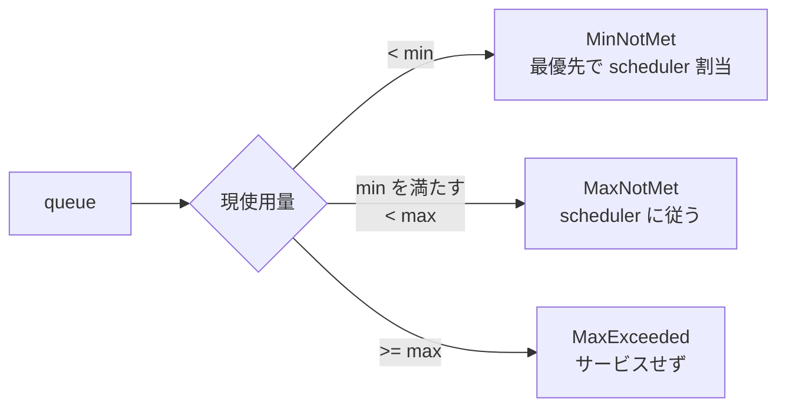
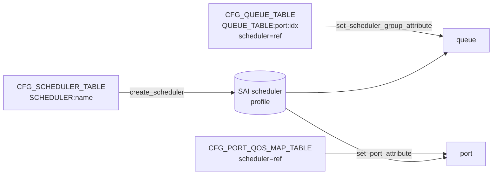

!!! success "裏取りステータス: code-verified"
    Verifier 2026-05-09: `sonic-swss/orchagent/qosorch.cpp:1333` で `m_qos_handler_map.insert({CFG_SCHEDULER_TABLE_NAME, &QosOrch::handleSchedulerTable})`、L1380-1432 で `SAI_SCHEDULER_ATTR_SCHEDULING_TYPE` / `SAI_SCHEDULER_ATTR_SCHEDULING_WEIGHT` / `SAI_SCHEDULER_ATTR_METER_TYPE` / `SAI_SCHEDULER_ATTR_MIN_BANDWIDTH_RATE` / `SAI_SCHEDULER_ATTR_MIN_BANDWIDTH_BURST_RATE` / `SAI_SCHEDULER_ATTR_MAX_BANDWIDTH_RATE` / `SAI_SCHEDULER_ATTR_MAX_BANDWIDTH_BURST_RATE` の SAI scheduler attribute 設定経路を確認。L70 では `SAI_PORT_ATTR_QOS_SCHEDULER_PROFILE_ID` で port バインドを確認。HLD の SAI 属性マッピングと整合。

# QoS Scheduler / Shaper（SP / WRR / DWRR + min/max bandwidth）

## 概要

SONiC の QoS には **scheduling** と **shaping** の 2 軸がある[^1]:

- **Scheduling**: egress queue への帯域配分。SP / WRR / DWRR の 3 方式
- **Shaping**: queue / port 単位の最大帯域（および queue では最小帯域）制限

scheduler オブジェクトは **profile** 単位で定義し、queue または port にバインドする。SAI レイヤでは `saischeduler.h` の `create_scheduler` / `set_scheduler_group_attribute` / `set_port_attribute` を使う[^1]。

要件[^1]:

- 各 egress queue で SP / WRR / DWRR を選択可能
- queue 毎の min/max shaping rate と burst を設定可能
- 物理ポート毎の max shaping rate と burst を設定可能（min は無し）
- `config load` でインクリメンタル適用、warm-reboot を跨いで動作継続

## 動作仕様

### 帯域配分の 3 状態

queue は以下の **bandwidth consumption group** で分類されてサービスされる[^1]:



ポート帯域に空きがある間、まず `MinNotMet` を満たし、次に `MaxNotMet` を scheduler 規律で配り、`MaxExceeded` は飛ばす[^1]。

### scheduler / queue / port のバインド



QosOrch は `CFG_SCHEDULER_TABLE` / `CFG_QUEUE_TABLE` / `CFG_PORT_QOS_MAP_TABLE` を subscribe する[^1]。

### CONFIG_DB スキーマ抜粋

`SCHEDULER` テーブル[^1]:

```text
key       = "SCHEDULER":<name>
type      = "DWRR" | "WRR" | "STRICT"
weight    = 1..100              ; 既定 1
priority  = 1*DIGIT
meter_type = "packets" | "bytes" ; 既定 bytes
cir / cbs / pir / pbs = 1..11 DIGIT
```

`QUEUE` テーブルおよび `PORT_QOS_MAP` テーブルから `scheduler` フィールドで `[SCHEDULER|name]` を参照する。

### 主要 SAI 属性

| 役割 | SAI 属性 |
|------|---------|
| scheduler 種別 | `SAI_SCHEDULER_ATTR_SCHEDULING_TYPE` |
| weight | `SAI_SCHEDULER_ATTR_SCHEDULING_WEIGHT` |
| min/max bandwidth rate | `SAI_SCHEDULER_ATTR_MIN/MAX_BANDWIDTH_RATE` |
| min/max burst | `SAI_SCHEDULER_ATTR_MIN/MAX_BANDWIDTH_BURST_RATE` |
| queue へのバインド | `SAI_SCHEDULER_GROUP_ATTR_SCHEDULER_PROFILE_ID` |
| port shaper | `SAI_PORT_ATTR_QOS_SCHEDULER_PROFILE_ID` |

## 設定例

### Queue shaper（Ethernet52 の queue 0-5 を 10Gbps に制限）

```json
{
  "SCHEDULER": {
    "scheduler.queue": { "meter_type": "bytes", "pir": "1250000000", "pbs": "8192" }
  },
  "QUEUE": {
    "Ethernet52|0-5": { "scheduler": "[SCHEDULER|scheduler.queue]" }
  }
}
```

### Port shaper（Ethernet52 を 8Gbps に制限）

```json
{
  "SCHEDULER": {
    "scheduler.port": { "meter_type": "bytes", "pir": "1000000000", "pbs": "8192" }
  },
  "PORT_QOS_MAP": {
    "Ethernet52": { "scheduler": "[SCHEDULER|scheduler.port]" }
  }
}
```

### CLI

| Command | 用途 |
|---------|------|
| `config load <file>` | SCHEDULER profile 読み込み |
| `show queue counters [-c] [interface <if>]` | queue 別 packet/byte/drop。shaping 平均レート観測にも使う |
| `config qos clear` | QoS 構成全削除（scheduler / shaper 含む） |

## 制限事項

- 物理ポートおよびその egress queue にのみ適用可能。**VLAN / PortChannel インタフェースでは設定不可**[^1]
- scheduler profile 上限は ASIC 依存。HLD 上の参考値は **128**[^1]
- 専用の `show scheduler` 等の CLI は無く、queue 統計で間接的に観測する

## 干渉する機能

- **buffer**: shaper で max を超えた場合は queue に滞留 → tail drop。drop は `show queue counters` で確認
- **warm-reboot**: scheduler / shaper 設定は warm-reboot を跨いで保持される必要あり[^1]

## トラブルシューティング

- 設定誤り: コンソール表示と syslog ERROR
- SAI 失敗: syslog ERROR
- shaping 効果確認: `show queue counters` を時間差で 2 回取得して bps 計算

## 引用元

[^1]: [sonic-net/SONiC doc/qos/scheduler/SONiC_QoS_Scheduler_Shaper.md @ 49bab5b](https://github.com/sonic-net/SONiC/blob/49bab5b5ff0e924f1ea52b3d9db0dfa4191a7c06/doc/qos/scheduler/SONiC_QoS_Scheduler_Shaper.md)
