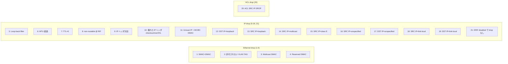

<!-- topics-tip -->
!!! tip "Topics で読み物として読む"
    この HLD は実装詳細を含みます。機能の概念・設定・運用を読み物として読みたい場合は [Topics 07 章: ACL / CoPP / Mirror](../topics/07-acl-copp-mirror/index.md) を参照。
<!-- /topics-tip -->

!!! info "裏取りステータス: code-verified（test plan）"
    HLD 21 ケース表と CLI チェック方法（`portstat -j` / `intfstat -j` / `aclshow -a`）、`counterpoll port|rif enable` を `sonic-utilities/scripts/{portstat,intfstat,aclshow}` および HLD 本文で確認。SAI debug counter のベンダ実装差や L2/L3 drop counter の合算挙動は ASIC 依存のため本ページでは触れない。

# ingress discards テスト計画（21 ケースで drop counter を検証）

## 概要

DUT が **特定の不正パケット** を ingress で drop し、対応する drop counter が正しく増えるかを検証する [sonic-mgmt](../reference/glossary.md#term-sonic-mgmt) テストプラン[^1]。Ethernet / IP / [ACL](../reference/glossary.md#term-acl) の各層の drop reason を 21 ケースで網羅する。

> 注: 制御プレーン traffic（VM 由来）は本テスト前に **無効化** することが前提[^1]。drop されるパケットの **destination IP は routable** にしておき、「routing で出ていく」のではなく「discard されている」ことを確実にする。

## 動作仕様（テスト観点）

### 適用 topology

`t0` / `t1` / `t1-lag` / `ptf32`[^1].

### Counter の見方

| 層 | コマンド | 見るフィールド |
|----|----------|---------------|
| Ethernet drop | `portstat -j` | `RX_DRP` |
| IP drop | `intfstat -j` | `RX_ERR` |
| ACL drop | `aclshow -a` | `PACKETS COUNT` |

### 21 テストケース



ケース 21 は **negative test** 的意味合いで、ERIF（Egress RIF）を disable していると drop されない（= counter 増えない）ことを確認[^1]。

### General test flow（共通手順）

1. 関連 counter を enable: `counterpoll port enable`、`counterpoll rif enable`
2. counter を clear: `sonic-clear counters` / `sonic-clear rifcounters`
3. PTF から指定パターンの不正パケットを inject
4. `portstat -j` / `intfstat -j` / `aclshow -a` で対応 counter が **増える** ことを確認
5. （陰性ケース）counter が増えない / 別 counter が増えないことを確認

### ベンダ間 counter 集約の差異

[HLD](../reference/glossary.md#term-hld) で明記されている注意点[^1]:

> different vendors can have different drop counters calculation, for example L2 and L3 drop counters can be combined and L2 drop counter will be increased for all ingress discards.

つまりベンダによっては **L2 drop counter に L3 drop も合算** されうる。テストはこの両ケースを区別して扱う必要がある。

<!-- evidence:
source: sonic-net/SONiC/doc/ingress-discards-test/SONIC_Test_Ingress_Discards_HLD.md#L98-L102 (sha: 49bab5b5ff0e924f1ea52b3d9db0dfa4191a7c06)
excerpt: |
  As different vendors can have diferent drop counters calculation, for example L2 and L3 drop counters can be combined and L2 drop counter will be increased for all ingress discards.
  So for valid drop counters verification there is a need to distinguish whether drop counters are combined or not for current vendor.
reasoning: ベンダ依存の counter 集約方式（合算 vs 分離）の根拠。
-->

<!-- evidence-rendered:start -->
??? note "📋 検証エビデンス: sonic-net/SONiC/doc/ingress-discards-test/SONIC_Test_Ingress_Discards_HLD.md#L98-L102 (sha: 49bab5b5ff0e924f1ea52b3d9db0dfa4191a7c06)"

    **出典**:

    `sonic-net/SONiC/doc/ingress-discards-test/SONIC_Test_Ingress_Discards_HLD.md#L98-L102 (sha: 49bab5b5ff0e924f1ea52b3d9db0dfa4191a7c06)`

    **抜粋**:

    ```text
    As different vendors can have diferent drop counters calculation, for example L2 and L3 drop counters can be combined and L2 drop counter will be increased for all ingress discards.
    So for valid drop counters verification there is a need to distinguish whether drop counters are combined or not for current vendor.
    ```

    **判断根拠**: ベンダ依存の counter 集約方式（合算 vs 分離）の根拠。

<!-- evidence-rendered:end -->

## 設定

### 関連する CONFIG_DB

該当なし。テストプランで [CONFIG_DB](../reference/glossary.md#term-config_db) スキーマ拡張は無い。

### 関連する CLI

| Command | 用途 |
|---------|------|
| `counterpoll port enable` | port counter group ON |
| `counterpoll rif enable` | [RIF](../reference/glossary.md#term-rif) counter group ON |
| `portstat -j` | port 統計を JSON で |
| `intfstat -j` | RIF (interface) 統計を JSON で |
| `aclshow -a` | ACL counter |
| `sonic-clear counters` / `rifcounters` | クリア |

### 設定例

```bash
counterpoll port enable
counterpoll rif enable
sonic-clear counters
sonic-clear rifcounters

# テスト pkt を inject (PTF 等)
# ...

portstat -j | jq '.Ethernet0.RX_DRP'
intfstat -j | jq '.Ethernet0.RX_ERR'
aclshow -a
```

## 制限事項

- **VM traffic 無効化が前提**[^1]。[BGP](../reference/glossary.md#term-bgp) keepalive 等が走っていると counter が汚れる
- destination IP は **routable** であることを確認した上で injection（routing で出ていかない / かつ discard 経路に乗る）
- ベンダ間で L2/L3 counter 合算挙動が異なるため、合否判定は per-vendor のロジックを必要とする
- 21 ケース中、[SAI](../reference/glossary.md#term-sai) 属性 / CONFIG_DB の特定 attribute によっては **deprecated** されたものがあれば注意

## 干渉する機能

- **debug counters / trap flow counter**: 同じ drop reason を別 counter で見ることがある。本テストは port / RIF / ACL の sentinel counter を見る
- **[CoPP](../reference/glossary.md#term-copp)**: control plane traffic を OFF にする際に CoPP の挙動を意識
- **ACL**: ケース 20 のみ ACL に依存。ACL がデフォルトで入っている前提
- **port breakout / [VLAN](../reference/glossary.md#term-vlan) config**: ケース 2 (VLAN TAG) は VLAN 設定に強く依存

## トラブルシューティング

```bash
# counter が enable になっているか
counterpoll | head
counterpoll port show
counterpoll rif show

# JSON で
portstat -j > /tmp/p.json
intfstat -j > /tmp/i.json

# ACL hit
aclshow -a | head

# ERIF 状態 (ケース 21)
redis-cli -n 1 KEYS "ASIC_STATE:SAI_OBJECT_TYPE_ROUTER_INTERFACE:*" | head
```

## 引用元

[^1]: `sonic-net/SONiC` `doc/ingress-discards-test/SONIC_Test_Ingress_Discards_HLD.md` @ `49bab5b5ff0e924f1ea52b3d9db0dfa4191a7c06`

<!-- topics-back-ref -->
## 関連 Topics

- [Topics: ACL / CoPP / Mirror / Packet Action](../topics/07-acl-copp-mirror/index.md)

<!-- /topics-back-ref -->

<!-- glossary-links-injected: 5a655f5b35d2 -->
