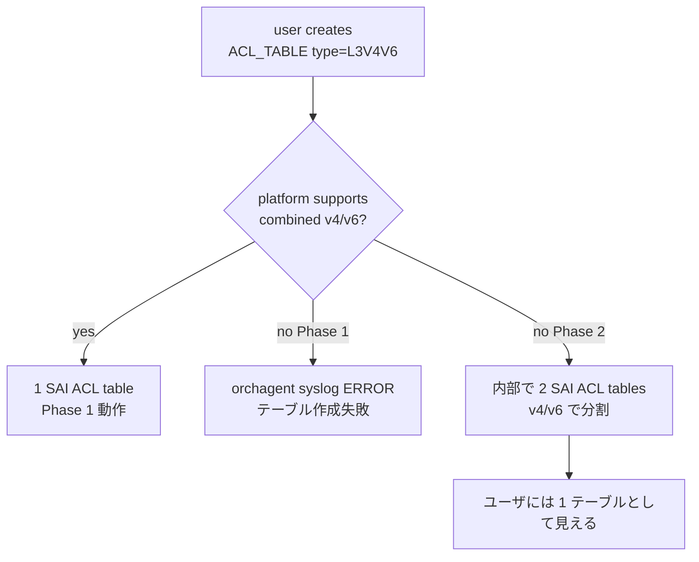

<!-- topics-tip -->
!!! tip "Topics で読み物として読む"
    この HLD は実装詳細を含む。機能の概念・設定・運用を読み物として読みたい場合は [Topics 07 章: ACL / CoPP / Mirror](../topics/07-acl-copp-mirror/index.md) を参照。
<!-- /topics-tip -->

!!! success "裏取りステータス: code-verified"
    sonic-swss `orchagent/aclorch.cpp` L44 で `STATE_DB_ACL_L3V4V6_SUPPORTED = "supported_L3V4V6"` 定義、L240 で `TABLE_TYPE_L3V4V6` を default table types に追加、L2737/L2739 で table 作成時に `isAclL3V4V6TableSupported(stage)` を判定、L3519/L3527 で `m_L3V4V6Capability` を ingress/egress 別に検出、L3541 でケーパビリティを SWSS_LOG に出力。`aclorch.h` L616 `isAclL3V4V6TableSupported` / L633 `m_L3V4V6Capability` マップを確認。CLI 側は sonic-utilities `acl_loader/main.py` L429-433 で `is_table_l3v4v6`、L780/L784 で `L3V4V6` 用 ethertype チェックを確認。YANG は sonic-yang-models `sonic-types.yang.j2` L115 `enum L3V4V6` を確認（verified at: 2026-05-09）。

# L3V4V6 ACL テーブル型（v4 / v6 ルールを 1 SAI ACL テーブルに同居）

## 概要

従来 [SONiC](../reference/glossary.md#term-sonic) は IPv4 用 `L3` と IPv6 用 `L3V6` を **別々の [SAI](../reference/glossary.md#term-sai) [ACL](../reference/glossary.md#term-acl) テーブル** として作成していた。多くの [ASIC](../reference/glossary.md#term-asic) では同一 [TCAM](../reference/glossary.md#term-tcam) テーブルで v4 / v6 両方を扱える（IPv6 アドレス用に確保された 128bit 幅に IPv4 32bit を相乗り可能）ため、TCAM の使い切りが起こり得た[^1]。

本 [HLD](../reference/glossary.md#term-hld) は **新規組み込みテーブル型 `L3V4V6`** を導入し、この最適化を operator が選択的に有効化できるようにする[^1]。`MIRROR` / `MIRRORV6` で過去に行ったコンパイル時マージ最適化（Option-A）と異なり、ユーザに見える ACL テーブルが 1 つで済む点が利点。

## 動作仕様

### 検討された選択肢[^1]

| Option | 内容 | 採否 |
|--------|------|------|
| A | MirrorV4/V6 と同じく compile-time マージ | 不採用（テーブル数制約・bind ポート不一致） |
| B | 既存 `L3V6` に v4 match field を増やす | 不採用（ユーザ設定書き換えが必要） |
| C | 新型 `L3V4V6` を導入 | **採用** |

### `L3V4V6` の match / action / bind

サポート match[^1]:

- `VLAN_ID`, `IP_TYPE`, `ETHER_TYPE`
- `SRC_IPV6` / `DST_IPV6` / `SRC_IP` / `DST_IP`
- `ICMPV6_TYPE/CODE` / `ICMP_TYPE/CODE`
- `IP_PROTOCOL` / `NEXT_HEADER`
- `L4_SRC_PORT` / `L4_DST_PORT` / `TCP_FLAGS`

action: `PACKET_ACTION` / `REDIRECT_ACTION`（egress では `REDIRECT` 非対応な ASIC では `PACKET_ACTION` のみ）。bind: Port / [LAG](../reference/glossary.md#term-lag)。

ACL ルールには **`IP_TYPE` または `ETHER_TYPE` を含めることを推奨**。Phase 2 で非対応 ASIC 上で内部的に v4 用 / v6 用の 2 枚に振り分ける際の判定キーになる[^1]。

### Phase 1 / Phase 2



現状は **Phase 1 のみ実装** され、非対応 ASIC では [orchagent](../reference/glossary.md#term-orchagent) が syslog にエラーを出してテーブル作成を断る[^1]。

### `STATE_DB` capability 公開

```text
hgetall "ACL_STAGE_CAPABILITY_TABLE|INGRESS"
  ...
  supported_L3V4V6 -> "true"

hgetall "ACL_STAGE_CAPABILITY_TABLE|EGRESS"
  ...
  supported_L3V4V6 -> "true"
```

operator はこのフィールドで platform 対応可否を確認できる[^1]。

<!-- evidence:
source: sonic-net/SONiC/doc/acl/Extend-L3V6ACLs.md#L256-L325 (sha: 49bab5b5ff0e924f1ea52b3d9db0dfa4191a7c06)
excerpt: |
  AclOrch::init() -> initDefaultTableTypes() -> addAclTableType(TABLE_TYPE_L3V4V6)
  ... A new field called `supported_L3V4V6` is added to the ACL capability in STATE_DB ...
reasoning: orchagent 側エントリポイントと STATE_DB capability キー名を引用
-->

<!-- evidence-rendered:start -->
??? note "📋 検証エビデンス: sonic-net/SONiC/doc/acl/Extend-L3V6ACLs.md#L256-L325 (sha: 49bab5b5ff0e924f1ea52b3d9db0dfa4191a7c06)"

    **出典**:

    `sonic-net/SONiC/doc/acl/Extend-L3V6ACLs.md#L256-L325 (sha: 49bab5b5ff0e924f1ea52b3d9db0dfa4191a7c06)`

    **抜粋**:

    ```text
    AclOrch::init() -> initDefaultTableTypes() -> addAclTableType(TABLE_TYPE_L3V4V6)
    ... A new field called `supported_L3V4V6` is added to the ACL capability in STATE_DB ...
    ```

    **判断根拠**: orchagent 側エントリポイントと STATE_DB capability キー名を引用

<!-- evidence-rendered:end -->

### YANG / CLI

`sonic-acl` の `ACL_TABLE.type` enum に `L3V4V6` を追加[^1]。CLI:

```bash
config acl add table -s ingress -p Ethernet0 DATAACL L3V4V6
```

設定例（v4 ルールと v6 ルールを同テーブルに混在）:

```json
{
  "ACL_TABLE": {
    "DATAACL": { "STAGE": "INGRESS", "TYPE": "L3V4V6", "PORTS": ["Ethernet0", "Ethernet1"] }
  },
  "ACL_RULE": {
    "DATAACL|RULE1": { "ETHER_TYPE": "0x0800", "PRIORITY": "5",
                       "DST_IP": "20.2.2.2/32",  "PACKET_ACTION": "DROP" },
    "DATAACL|RULE2": { "IP_TYPE": "IPV6ANY",   "PRIORITY": "6",
                       "DST_IPV6": "2001::2/64", "PACKET_ACTION": "DROP" }
  }
}
```

## 制限事項

- ACL テーブル間の優先順位付けは未実装。1 ポートに複数 ACL テーブルが bind され action が衝突した場合の勝者は未定義。Phase 2 で `ACL_TABLE` priority 設定で対処予定[^1]
- `L3V4V6` テーブル内のルールには `IP_TYPE` または `ETHER_TYPE` を含めるのが望ましい
- warm/fast-boot への影響は無し[^1]

## 干渉する機能

- **既存 L3 / L3V6 テーブル**: 共存可能。同一ポートに複数 ACL テーブル bind が発生しうる
- **MIRROR / MIRRORV6**: 既に compile-time マージで最適化済み。本機能は L3 系のみ

## 引用元

[^1]: [sonic-net/SONiC doc/acl/Extend-L3V6ACLs.md @ 49bab5b](https://github.com/sonic-net/SONiC/blob/49bab5b5ff0e924f1ea52b3d9db0dfa4191a7c06/doc/acl/Extend-L3V6ACLs.md)

<!-- topics-back-ref -->
## 関連 Topics

- [Topics: ACL / CoPP / Mirror / Packet Action](../topics/07-acl-copp-mirror/index.md)

<!-- /topics-back-ref -->

<!-- glossary-links-injected: ec18b66e3507 -->
