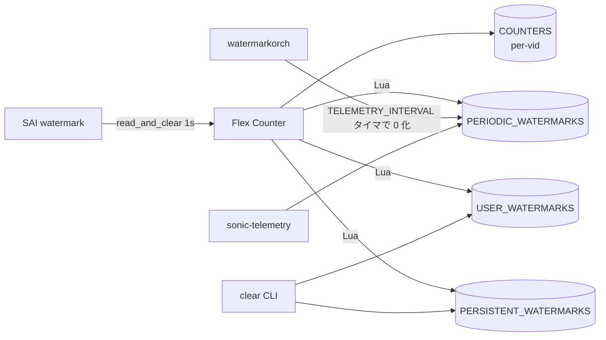

<!-- topics-tip -->
!!! tip "Topics で読み物として読む"
    この HLD は実装詳細を含みます。機能の概念・設定・運用を読み物として読みたい場合は [Topics 08 章: QoS / Buffer / PFC](../topics/08-qos-buffer/index.md) を参照。
<!-- /topics-tip -->

!!! success "裏取りステータス: Code-verified（キー名は TELEMETRY_INTERVAL）"
    `sonic-swss/orchagent/watermarkorch.{h,cpp}` で `WatermarkOrch` 実装、`DEFAULT_TELEMETRY_INTERVAL=120` (cpp L9)、`CFG_WATERMARK_TABLE.TELEMETRY_INTERVAL` キー処理 (cpp L97) を確認。Lua plugin `watermark_bufferpool.lua` / `watermark_pg.lua` / `watermark_queue.lua` あり。`STATS_MODE_READ_AND_CLEAR` は `bufferorch.cpp` L334 / `portsorch.cpp` L868/L874 で利用。**HLD の `TELEMETRY_PERIOD` 表記は実装では `TELEMETRY_INTERVAL`** (verified at: 2026-05-09)。

# バッファ Watermark カウンタ（PG / queue 占有量の最大値追跡）

読み手の関心は「**何を watermark として記録するのか**」「**telemetry / 手動 / 永続の 3 系統がなぜ要るのか**」「**clear を打つと何が起きるのか**」の 3 点に集約される。順に答える。

## 何を watermark として記録するのか

対象 [SAI](../reference/glossary.md#term-sai) カウンタは 3 つ[^1]。

| 用途 | SAI 属性 |
|------|----------|
| Ingress headroom per PG | `SAI_INGRESS_PRIORITY_GROUP_STAT_XOFF_ROOM_WATERMARK_BYTES` |
| Ingress shared 占有 per PG | `SAI_INGRESS_PRIORITY_GROUP_STAT_SHARED_WATERMARK_BYTES` |
| Egress shared 占有 per queue (UC/MC 共通) | `SAI_QUEUE_STAT_SHARED_WATERMARK_BYTES` |

これらを Flex Counter が **既定 1 秒間隔で `STATS_MODE_READ_AND_CLEAR`** で取り、ハードウェア側も同時にクリアする[^1]。新規拡張として [syncd](../reference/glossary.md#term-syncd) の FC 設定スキーマに `STATS_MODE` 行が追加される。

```text
"POLL_INTERVAL"  -> "1000"
"STATS_MODE"     -> "STATS_MODE_READ_AND_CLEAR"
```

## なぜ 3 系統に分けるのか

「telemetry の周期リセットがユーザ観測を破壊する」「他ユーザの clear で誤って消える」を避けるため、3 系統の独立 watermark テーブルを並走させる[^1]。



Lua plugin が毎周期 `max(COUNTERS, table)` で 3 テーブルそれぞれを更新する。

| テーブル | クリア主体 | 用途 |
|----------|-----------|------|
| `COUNTERS` | Flex Counter（HW から再取得で上書き） | 内部処理用 |
| `PERIODIC_WATERMARKS` | `watermarkorch` の `TELEMETRY_INTERVAL` タイマ | streaming telemetry |
| `USER_WATERMARKS` | `clear` CLI | ユーザの「ある時点からの最大」 |
| `PERSISTENT_WATERMARKS` | `clear persistent-watermark` CLI | 起動以来 / 前回 clear 以来の最大 |

## clear を打つと何が起きるのか

`watermarkorch` が CLEAR 通知を受け、該当行の値を **0 にするだけ**。次の Lua 周期で `COUNTERS` から max 比較で再充填されるため、トラフィックがあれば即座に非ゼロに戻る[^1]。これは仕様（バグではない）。

clear CLI は **sudo 必須**。watermark は全ユーザ共有資源で、複数 SSH セッションでの同時観測を尊重するための制限[^1]。

## COUNTERS_DB スキーマと補助マップ

```text
COUNTERS / PERIODIC_WATERMARKS / USER_WATERMARKS / PERSISTENT_WATERMARKS
  : queue_vid -> SAI_QUEUE_STAT_SHARED_WATERMARK_BYTES
  : pg_vid    -> SAI_INGRESS_PRIORITY_GROUP_STAT_XOFF_ROOM_WATERMARK_BYTES
                 SAI_INGRESS_PRIORITY_GROUP_STAT_SHARED_WATERMARK_BYTES
```

| 補助マップ | 用途 |
|--------|------|
| `COUNTERS_PG_PORT_MAP` | PG OID → ポート OID |
| `COUNTERS_PG_NAME_MAP` | PG OID → PG 名 |
| `COUNTERS_PG_INDEX_MAP` | PG OID → PG インデックス (0..7) |

## `watermarkorch` の責務

3 点だけ[^1]:

1. `WATERMARK_TABLE`（[CONFIG_DB](../reference/glossary.md#term-config_db)）の subscribe
2. `PERIODIC_WATERMARKS` を `TELEMETRY_INTERVAL` ごとに 0 化（**新値は現行タイマー満了時にのみ反映**）
3. `CLEAR_WATERMARK` 通知の受信処理

<!-- evidence:
source: sonic-net/SONiC/doc/buffer-watermark/watermarks_HLD.md#L99-L106 (sha: 49bab5b5ff0e924f1ea52b3d9db0dfa4191a7c06)
excerpt: |
  When one regular user and the streaming telemetry coexist, they do not interfere with each other.
reasoning: 3 系統 (PERIODIC / USER / PERSISTENT) を分離する目的の根拠。
-->

<!-- evidence-rendered:start -->
??? note "📋 検証エビデンス: sonic-net/SONiC/doc/buffer-watermark/watermarks_HLD.md#L99-L106 (sha: 49bab5b5ff0e924f1ea52b3d9db0dfa4191a7c06)"

    **出典**:

    `sonic-net/SONiC/doc/buffer-watermark/watermarks_HLD.md#L99-L106 (sha: 49bab5b5ff0e924f1ea52b3d9db0dfa4191a7c06)`

    **抜粋**:

    ```text
    When one regular user and the streaming telemetry coexist, they do not interfere with each other.
    ```

    **判断根拠**: 3 系統 (PERIODIC / USER / PERSISTENT) を分離する目的の根拠。

<!-- evidence-rendered:end -->

## Telemetry 経由の参照

`sonic-telemetry` は `WATERMARKS/...` virtual path から読める[^1]:

| Virtual Path | 意味 |
|--------------|------|
| `WATERMARKS/Ethernet*/Queues/PERIODIC_WATERMARKS` | 全ポートの queue periodic |
| `WATERMARKS/Ethernet<N>/PriorityGroups/PERSISTENT_WATERMARKS` | 単一ポートの PG persistent |

## 関連する CONFIG_DB / CLI

| Table | Key | フィールド |
|-------|-----|-----------|
| `WATERMARK_TABLE` | `TELEMETRY_INTERVAL`（[HLD](../reference/glossary.md#term-hld) では `TELEMETRY_PERIOD` 表記あり） | streaming telemetry の周期クリア間隔 |

| Command | 用途 |
|---------|------|
| `show priority-group watermark {headroom\|shared}` | user watermark |
| `show priority-group persistent-watermark {headroom\|shared}` | persistent 版 |
| `show queue watermark {unicast\|multicast}` | UC/MC queue user watermark |
| `show queue persistent-watermark {unicast\|multicast}` | persistent 版 |
| `clear priority-group {watermark\|persistent-watermark} {headroom\|shared}` | sudo 必須 |
| `clear queue {watermark\|persistent-watermark} {unicast\|multicast}` | sudo 必須 |
| `show watermark telemetry interval` / `config watermark telemetry interval <v>` | 表示 / 更新 |

表示例:

```text
$ show priority-group watermark shared
Interface         PG0   PG1   PG2   PG3   PG4   PG5   PG6   PG7
Ethernet0           0  1092     0   380     0     0     0     0
```

## 干渉する機能

- **[PFC](../reference/glossary.md#term-pfc) watchdog**: 同じ FC 系を使うためポーリング負荷の競合に留意（HLD の Open Question）[^1]
- **`STATS_MODE_READ_AND_CLEAR`**: 非対応 SAI 実装では意図どおりに動かない
- **`clear` の即時 0 観測**: トラフィック停止状態でしか純粋な 0 は得られない
- **`TELEMETRY_INTERVAL` の遅延反映**: 現行タイマー満了まで新値は効かない

## トラブルシューティング

- 値がいつもゼロ: SAI / [ASIC](../reference/glossary.md#term-asic) が `_WATERMARK_BYTES` 未対応か `STATS_MODE_READ_AND_CLEAR` 未開始。`syncd` ログと FC group 設定を確認
- `clear` で 0 に戻らない: 仕様。トラフィック停止 → 即 read で確認
- `TELEMETRY_INTERVAL` を短くしても効かない: 現行タイマー満了待ち
- PG OID と物理 port の対応不明: `COUNTERS_PG_PORT_MAP` / `COUNTERS_PG_INDEX_MAP` を redis から
- `clear` で他人の観測値が消えた: 仕様。sudo を要求しているのもこのため

### コマンド例: Watermark counter 確認

下記コマンドを順に実行することで、関連する CONFIG_DB / APP_DB / [STATE_DB](../reference/glossary.md#term-state_db) のエントリと、
CLI 表示・syslog の整合を一通り突き合わせ確認できる。

```bash
# Watermark の polling 有効化と現在値
counterpoll show
show queue persistent-watermark
show priority-group persistent-watermark headroom
```

## 関連トピック

- [Topics: QoS / Buffer](../topics/08-qos-buffer/index.md)

## 関連ページ

- [Align Watermark Flow with Port Configuration](./align-watermark-flow-with-port-configuration-hld.md)
- [PFC Historical Statistics](./pfc-historical-statistics.md)

## 引用元

[^1]: `sonic-net/SONiC` `doc/buffer-watermark/watermarks_HLD.md` @ `49bab5b5ff0e924f1ea52b3d9db0dfa4191a7c06`

<!-- topics-back-ref -->
## 関連 Topics

- [Topics: QoS / Buffer / PFC / Watermark](../topics/08-qos-buffer/index.md)

<!-- /topics-back-ref -->

<!-- glossary-links-injected: c006405759d8 -->
