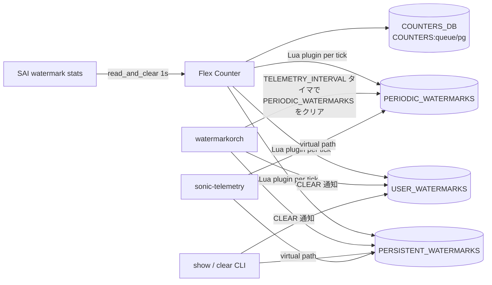

!!! success "裏取りステータス: Code-verified（キー名は TELEMETRY_INTERVAL）"
    `sonic-swss/orchagent/watermarkorch.{h,cpp}` で `WatermarkOrch` クラスの存在、`DEFAULT_TELEMETRY_INTERVAL=120` (cpp L9) と CFG_WATERMARK_TABLE 連動 `handleWmConfigUpdate` の `TELEMETRY_INTERVAL` キー処理 (cpp L97) を確認。Lua plugin として `orchagent/watermark_bufferpool.lua`, `watermark_pg.lua`, `watermark_queue.lua` を確認。`STATS_MODE_READ_AND_CLEAR` は `bufferorch.cpp` L334 / `portsorch.cpp` L868/L874 で利用、`hftelutils.cpp` で `SAI_STATS_MODE_READ_AND_CLEAR` が SAI 側へ受け渡し。**HLD で混在していた `TELEMETRY_PERIOD` ではなく実装は `TELEMETRY_INTERVAL`** (verified at: 2026-05-09)。

# バッファ Watermark カウンタ（PG / queue 占有量の最大値追跡）

## 概要

バッファ占有量はマイクロバースト解析や輻輳調査の主要な観測量だが、瞬時値は刻一刻変動するため、**サンプリング期間中の最大値（watermark）** をハードウェアで保持し、ソフトウェアから読み出して使うのが一般的である。本機能は SONiC の COUNTERS_DB と CLI から、入力 PG (Priority Group) と egress queue の watermark を観測 / リセットできるようにするためのもので、3 種類の用途（**telemetry 用**、**ユーザ手動**、**永続的最大値**）を干渉なく並走させる設計を導入する[^1]。

対象 SAI カウンタは次の 3 つ[^1]。

| 用途 | SAI 属性 |
|------|----------|
| Ingress headroom per PG | `SAI_INGRESS_PRIORITY_GROUP_STAT_XOFF_ROOM_WATERMARK_BYTES` |
| Ingress shared 占有 per PG | `SAI_INGRESS_PRIORITY_GROUP_STAT_SHARED_WATERMARK_BYTES` |
| Egress shared 占有 per queue (UC/MC 共通) | `SAI_QUEUE_STAT_SHARED_WATERMARK_BYTES` |

## 動作仕様

### 全体アーキテクチャ



### Flex counter とハードウェアからのクリア

Watermark カウンタは Flex Counter で **既定 1 秒間隔で読み取り、同時にハードウェア側もクリア** する `STATS_MODE_READ_AND_CLEAR` モードを使う[^1]。これは新規拡張であり、`syncd` の Flex Counter 設定スキーマに `STATS_MODE` 行が追加される。

```text
"POLL_INTERVAL"        -> "1000"
"STATS_MODE"           -> "STATS_MODE_READ_AND_CLEAR"
"FLEX_COUNTER_STATUS"  -> "disable"  (default; 有効化は別経路)
```

SAI 側は `sai_get_queue_stats_ext()` / `sai_get_ingress_priority_group_stats_ext()` の `_ext` 系で stats mode を渡せる API を要求する。

### 3 系統の watermark テーブル

Lua プラグインは Flex Counter の毎周期で起動し、`COUNTERS:<vid>` から読み取った値を 3 つの watermark テーブルそれぞれと **max 比較** して上書きする[^1]。

```lua
PERIODIC_WATERMARKS [vid][stat] = max(COUNTERS[vid][stat], PERIODIC_WATERMARKS [vid][stat])
USER_WATERMARKS    [vid][stat] = max(COUNTERS[vid][stat], USER_WATERMARKS    [vid][stat])
PERSISTENT_WATERMARKS[vid][stat]= max(COUNTERS[vid][stat], PERSISTENT_WATERMARKS[vid][stat])
```

各テーブルの寿命は次のとおり整理される。

| テーブル | クリア主体 | 用途 |
|----------|-----------|------|
| `COUNTERS` | Flex Counter（1 秒ごとに HW から再取得して上書き） | 内部処理用。直接ユーザに見せない |
| `PERIODIC_WATERMARKS` | `watermarkorch` のタイマが TELEMETRY_INTERVAL ごとに 0 化 | streaming telemetry 用 |
| `USER_WATERMARKS` | `clear` CLI で 0 化 | 通常ユーザの「ある時点からの最大」用 |
| `PERSISTENT_WATERMARKS` | `clear persistent-watermark` CLI で 0 化 | 起動以来 / 前回 clear 以来の最大 |

3 系統が独立しているため「telemetry の周期リセットがユーザの観測を破壊する」「他ユーザの clear で誤ってリセットされる」事態を避けられる[^1]。

<!-- evidence:
source: sonic-net/SONiC/doc/buffer-watermark/watermarks_HLD.md#L99-L106 (sha: 49bab5b5ff0e924f1ea52b3d9db0dfa4191a7c06)
excerpt: |
  Streaming telemetry is only interested in periodic watermark, i.e., it queries the watermark at regular intervals.
  ... When one regular user and the streaming telemetry coexist, they do not interfere with each other.
reasoning: 3 系統 (PERIODIC / USER / PERSISTENT) を分離する目的の根拠。
-->

### COUNTERS_DB スキーマ

各 watermark テーブルは VID をキーに次のフィールドを持つ[^1]。

```text
COUNTERS / PERIODIC_WATERMARKS / USER_WATERMARKS / PERSISTENT_WATERMARKS
  : queue_vid
       SAI_QUEUE_STAT_SHARED_WATERMARK_BYTES
  : pg_vid
       SAI_INGRESS_PRIORITY_GROUP_STAT_XOFF_ROOM_WATERMARK_BYTES
       SAI_INGRESS_PRIORITY_GROUP_STAT_SHARED_WATERMARK_BYTES
```

加えて以下の補助マップが追加される。

| マップ | 用途 |
|--------|------|
| `COUNTERS_PG_PORT_MAP` | PG OID → ポート OID |
| `COUNTERS_PG_NAME_MAP` | PG OID → PG 名 |
| `COUNTERS_PG_INDEX_MAP` | PG OID → PG インデックス (0..7) |

### `watermarkorch`

新規 orch エージェント `watermarkorch` を追加する。責務は次の 3 点[^1]。

1. `WATERMARK_TABLE`（CONFIG_DB、`TELEMETRY_PERIOD` 等）の購読と反映。
2. PERIODIC_WATERMARKS を `TELEMETRY_INTERVAL` ごとに 0 化するタイマー管理。**新インターバルは現行タイマー満了時にのみ反映** される（途中で短くなって即発火しない）[^1]。
3. `CLEAR_WATERMARK` 通知チャネルの購読。クリア要求は単に該当行の値を 0 にするだけで、Lua プラグインの次回サイクルで再充填される。

### Telemetry 経由の参照

`sonic-telemetry` は `WATERMARKS/...` 系の virtual path から PG / queue の watermark を読める。完全な構文は HLD では「TBD」とされているが、例として次が挙げられている[^1]。

| Virtual Path | 意味 |
|--------------|------|
| `WATERMARKS/Ethernet*/Queues/PERIODIC_WATERMARKS` | 全ポートの queue periodic |
| `WATERMARKS/Ethernet<N>/PriorityGroups/PERSISTENT_WATERMARKS` | 単一ポートの PG persistent |

### `clear` の権限

`clear` 系 CLI は **sudo を要求** する。watermark は全ユーザで共有されるため、SSH で複数人が繋いでいる状況でクリアすると他の観測も巻き込むためである[^1]。

## 設定

### 関連する CONFIG_DB

| Table | Key | フィールド | 説明 |
|-------|-----|-----------|------|
| `WATERMARK_TABLE` | `TELEMETRY_INTERVAL`（HLD では `TELEMETRY_PERIOD` の表記もあり） | 値 | streaming telemetry 用の周期クリア間隔 |

### 関連する CLI

| Command | 用途 |
|---------|------|
| `show priority-group watermark headroom` | PG headroom の user watermark |
| `show priority-group watermark shared` | PG shared 占有の user watermark |
| `show priority-group persistent-watermark headroom` | persistent 版 |
| `show priority-group persistent-watermark shared` | persistent 版 |
| `show queue watermark unicast` | UC queue shared 占有の user watermark |
| `show queue watermark multicast` | MC queue shared 占有の user watermark |
| `show queue persistent-watermark unicast/multicast` | persistent 版 |
| `clear priority-group {watermark\|persistent-watermark} {headroom\|shared}` | クリア（sudo 必須） |
| `clear queue {watermark\|persistent-watermark} {unicast\|multicast}` | クリア（sudo 必須） |
| `show watermark telemetry interval` | TELEMETRY_INTERVAL の表示 |
| `config watermark telemetry interval <value>` | TELEMETRY_INTERVAL の更新（次回満了から有効） |

### 表示例

```text
$ show priority-group watermark shared
Ingress shared pool occupancy per PG:
Interface         PG0   PG1   PG2   PG3   PG4   PG5   PG6   PG7
Ethernet0           0  1092     0   380     0     0     0     0
...
Ethernet128         0     0     0     0     0     0     0     0
```

### 関連する YANG

HLD 上で YANG モデル定義の記述は無い。`WATERMARK_TABLE` 用 YANG は実装側で別途定義される想定で、本 HLD では未明記。

## 干渉する機能

- **PFC watchdog (PFC WD)**: HLD の Open Question として「PG watermark を Flex Counter に追加すると PFC WD カウンタの性能に影響しないか?」が残されている[^1]。同じ Flex Counter 系を使うため、ポーリング負荷の競合に留意。
- **`STATS_MODE_READ_AND_CLEAR`**: ハードウェアから読むタイミングで HW 側もクリアするモード。これに対応していない SAI 実装では本機能は意図どおり動かない。
- **3 系統の watermark テーブル**: `clear` を打っても直近で max 比較される値次第ですぐに非ゼロに戻る。これはバグではなく Lua プラグインの設計意図。
- **TELEMETRY_INTERVAL 短縮反映**: 設定変更直後ではなく、現行タイマー満了時に反映される非同期挙動に注意。

## トラブルシューティング

- watermark がいつもゼロ: SAI / ASIC が `_WATERMARK_BYTES` 系をサポートしていないか、Flex Counter group が `STATS_MODE_READ_AND_CLEAR` で開始されていない可能性。`syncd` 起動ログと Flex Counter group 設定を確認。
- `clear` を打っても値が戻る: 仕様。COUNTERS から再充填されるため、本当に 0 を観測したい場合はトラフィック停止状態でクリア → ただちに read。
- TELEMETRY_INTERVAL を短くしたが反映されない: 現行タイマー満了まで待つ。
- PG OID と物理ポートの対応がわからない: `COUNTERS_PG_PORT_MAP` / `COUNTERS_PG_INDEX_MAP` を redis から直接読む。
- `clear` で他ユーザの観測値が消えた: 仕様。watermark は全ユーザ共有資源で、`clear` には sudo が必要なのもこのため。

## 引用元

[^1]: `sonic-net/SONiC` `doc/buffer-watermark/watermarks_HLD.md` @ `49bab5b5ff0e924f1ea52b3d9db0dfa4191a7c06`
