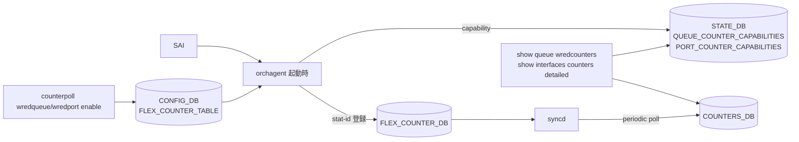

<!-- topics-tip -->
!!! tip "Topics で読み物として読む"
    この HLD は実装詳細を含む。機能の概念・設定・運用を読み物として読みたい場合は [Topics 08 章: QoS / Buffer / PFC](../topics/08-qos-buffer/index.md) を参照。
<!-- /topics-tip -->

!!! success "裏取りステータス: code-verified"
    `sonic-swss/orchagent/portsorch.h` L42 で `WRED_QUEUE_STAT_COUNTER_FLEX_COUNTER_GROUP = "WRED_ECN_QUEUE_STAT_COUNTER"` を確認、`flexcounterorch.cpp` L62/L95 で `WRED_QUEUE_KEY = "WRED_ECN_QUEUE"` のマッピングを確認。`portsorch.cpp` L433 で `SAI_QUEUE_STAT_WRED_DROPPED_PACKETS` を、L1872-1901 で `m_queueCounterCapabilitiesTable` への `WRED_ECN_QUEUE_*_COUNTER` capability 書き込みを確認。`sonic-utilities/counterpoll/main.py` L609-L624 で `counterpoll wredqueue` サブコマンド群、`tests/counterpoll_test.py` L326-L374 で `wredport` / `wredqueue` enable/interval を確認（verified at: 2026-05-09）。

# WRED / ECN 統計（per-queue / per-port、capability ベース）

## これは何か（一行で）

[SAI](../reference/glossary.md#term-sai) が出す [WRED](../reference/glossary.md#term-wred) ドロップ / [ECN](../reference/glossary.md#term-ecn) マーク専用カウンタを Flex Counter で `COUNTERS_DB` に出し、`show queue wredcounters` および `show interfaces counters detailed` の拡張で見えるようにする[^1]。

## どんなときに使うか

- 「`portstat` の `RX_DRP` が増えているが、これが WRED 起因か知りたい」
- 「ECN マーク数を per-queue で観測したい」（輻輳制御のチューニング）
- WRED ドロップを **color 別**（Green / Yellow / Red）で見たい

## 設計上のキモ: capability ベース

プラットフォームによって対応カウンタが異なるため、`orchagent` が起動時に **`sai_query_stats_capability`** を呼び、`STATE_DB` に結果を書く。CLI はそれを見て **対応カウンタだけを取得・表示** し、非対応は `N/A`[^1]。

`SAI_PORT_STAT_ECN_MARKED_PACKETS`（ポート単位 ECN マーク）は本 [HLD](../reference/glossary.md#term-hld) の **次フェーズ** 扱い。

## 全体フロー



## Capability キー

`STATE_DB` に書かれる主なフラグ[^1]:

```text
QUEUE_COUNTER_CAPABILITIES:
  WRED_ECN_QUEUE_ECN_MARKED_PKT_COUNTER  : true/false
  WRED_ECN_QUEUE_ECN_MARKED_BYTE_COUNTER : ...
  WRED_ECN_QUEUE_WRED_DROPPED_PKT_COUNTER: ...
  WRED_ECN_QUEUE_WRED_DROPPED_BYTE_COUNTER: ...

PORT_COUNTER_CAPABILITIES:
  WRED_ECN_PORT_WRED_GREEN_DROP_COUNTER : ...
  WRED_ECN_PORT_WRED_YELLOW_DROP_COUNTER: ...
  WRED_ECN_PORT_WRED_RED_DROP_COUNTER   : ...
  WRED_ECN_PORT_WRED_TOTAL_DROP_COUNTER : ...
```

既定すべて `false`。全部 `false` のグループを `counterpoll` で enable すると **syslog エラー** を出す仕様[^1]。

## Flex Counter グループ

新規 2 グループ。**既定 disable**[^1]:

| グループ | 既定 POLL_INTERVAL | 計測対象 SAI カウンタ |
|---------|---------------------|----------------------|
| `WRED_ECN_QUEUE` | 10000 ms | `SAI_QUEUE_STAT_WRED_ECN_MARKED_PACKETS` / `_BYTES`, `SAI_QUEUE_STAT_WRED_DROPPED_PACKETS` / `_BYTES` |
| `WRED_ECN_PORT` | 1000 ms | `SAI_PORT_STAT_GREEN_WRED_DROPPED_PACKETS`, `_YELLOW_..`, `_RED_..`, `SAI_PORT_STAT_WRED_DROPPED_PACKETS`（合計）|

ポート側は将来 `SAI_PORT_STAT_ECN_MARKED_PACKETS` 追加予定。

## CLI

| Command | 用途 |
|---------|------|
| `counterpoll wredqueue {enable\|disable}` | `WRED_ECN_QUEUE` グループ ON/OFF |
| `counterpoll wredport {enable\|disable}` | `WRED_ECN_PORT` グループ ON/OFF |
| `counterpoll wredqueue interval <ms>` | キュー側ポーリング間隔 |
| `counterpoll wredport interval <ms>` | ポート側ポーリング間隔 |
| `show queue wredcounters [<intf>]` | キュー単位 WRED/ECN 統計（**新規**） |
| `sonic-clear queue wredcounters` | キュー単位クリア（**新規**） |
| `show interfaces counters detailed <intf>` | 出力末尾に WRED Green/Yellow/Red/Total を追加 |

表示例（両対応プラットフォーム）[^1]:

```text
$ show queue wredcounters Ethernet16
      Port    TxQ    WredDrp/pkts    WredDrp/bytes  EcnMarked/pkts EcnMarked/bytes
Ethernet16    UC0               0                0               0               0
Ethernet16    UC1               1              120               0               0
```

ECN 非対応なら `EcnMarked/*` が `N/A`、WRED 非対応なら `WredDrp/*` が `N/A`。

## 設定

### CONFIG_DB

| Table | Key | フィールド | 説明 |
|-------|-----|-----------|------|
| `FLEX_COUNTER_TABLE` | `WRED_ECN_QUEUE` | `FLEX_COUNTER_STATUS` | `enable` / `disable`（既定 disable） |
| | | `POLL_INTERVAL` | ms 単位（既定 10000） |
| `FLEX_COUNTER_TABLE` | `WRED_ECN_PORT` | `FLEX_COUNTER_STATUS` | 同上（既定 disable） |
| | | `POLL_INTERVAL` | ms 単位（既定 1000） |

### YANG

`sonic-flex_counter.yang` に `WRED_ECN_QUEUE` / `WRED_ECN_PORT` コンテナを追加[^1]:

```yang
container WRED_ECN_QUEUE {
    leaf FLEX_COUNTER_STATUS { type flex_status; }
    leaf FLEX_COUNTER_DELAY_STATUS { type flex_delay_status; }
    leaf POLL_INTERVAL { type poll_interval; }
}
container WRED_ECN_PORT { /* 同様 */ }
```

### 設定例

```bash
counterpoll wredqueue enable
counterpoll wredport  enable
show queue wredcounters Ethernet16
show interfaces counters detailed Ethernet16
sonic-clear queue wredcounters
```

## 干渉する機能

- **`portstat` / `queuestat`**: 共通 Flex Counter インフラに並ぶ。`POLL_INTERVAL` を縮めすぎると [syncd](../reference/glossary.md#term-syncd) 全体の負荷が増える
- **WRED 設定 (`WRED_PROFILE`)**: プロファイルがキューに紐付いていないと drop / mark は増えない
- **ECN マーキング**: WRED プロファイル内の `ecn` 設定が必要。無効なキューでは `EcnMarked/*` が 0 のまま
- **Warm/fast boot**: HLD で「影響なし」と明記[^1]

## トラブルシューティング

- `show queue wredcounters` で値が出ない → `STATE_DB.QUEUE_COUNTER_CAPABILITIES` を確認。全 `false` なら SAI 未対応
- 一部だけ `N/A` → capability 差異による仕様
- enable 後もカウンタ 0 → `FLEX_COUNTER_TABLE|WRED_ECN_QUEUE` の `FLEX_COUNTER_STATUS=enable` と `POLL_INTERVAL`、syncd ログで group が ready かを確認
- syslog エラー → 全カウンタ非対応グループを enable した場合の仕様
- `show interfaces counters detailed` に WRED 行が出ない → `WRED_ECN_PORT` が disable / capability false

### コマンド例: WRED / ECN 統計確認

下記コマンドを順に実行することで、関連する [CONFIG_DB](../reference/glossary.md#term-config_db) / APP_DB / [STATE_DB](../reference/glossary.md#term-state_db) のエントリと、
CLI 表示・syslog の整合を一通り突き合わせ確認できる。

```bash
# WRED profile と queue ごとの ECN マーク / drop 数
show queue counters
redis-cli -n 4 keys 'WRED_PROFILE|*'
redis-cli -n 2 keys 'COUNTERS:*' | head
```


## 関連トピック

- [Topics: QoS / Buffer](../topics/08-qos-buffer/index.md)

## 関連ページ

- [PFC Historical Statistics](./pfc-historical-statistics.md)
- [SONiC QoS Scheduler and Shaping](./sonic-qos-scheduler-and-shaping.md)
- [Watermark Counters in SONiC](./watermark-counters-in-sonic.md)

## 引用元

[^1]: `sonic-net/SONiC` `doc/qos/ECN_and_WRED_statistics_HLD.md` @ `49bab5b5ff0e924f1ea52b3d9db0dfa4191a7c06`

<!-- topics-back-ref -->
## 関連 Topics

- [Topics: QoS / Buffer / PFC / Watermark](../topics/08-qos-buffer/index.md)

<!-- /topics-back-ref -->

<!-- glossary-links-injected: d17c6a828148 -->
