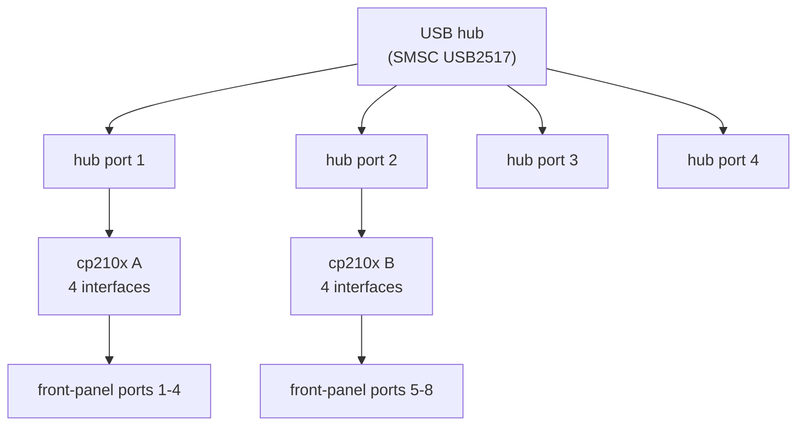
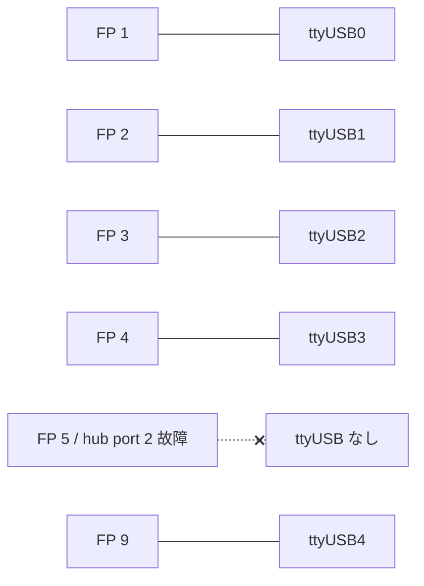

<!-- topics-tip -->
!!! tip "Topics で読み物として読む"
    この HLD は実装詳細を含みます。機能の概念・設定・運用を読み物として読みたい場合は [Topics 14 章: Platform / Port / Optics](../topics/14-platform-port-optics/index.md) を参照。
<!-- /topics-tip -->

!!! note "裏取りステータス: code-verified（haliburton platform で実装確認）"
    `sonic-buildimage/platform/broadcom/sonic-platform-modules-cel/haliburton/script/50-ttyUSB-C0.rules` に HLD と一致する `DRIVERS=="cp210x", ATTRS{interface}=="CP2108 Interface N", SYMLINK+="C0-X"` 形式の rules が確認できた。`platform-modules-haliburton.init` で /etc/udev/rules.d/ 配下に配置される。USB hub 故障の syslog / SNMP 通知機構は本 platform では実装なし。

# ターミナルサーバの ttyUSB 安定 symlink を作る udev rules 設計

## 概要

ターミナルサーバ機能を持つ [SONiC](../reference/glossary.md#term-sonic) 装置はフロントパネルに複数のシリアルポートを持ち、内部で **USB hub + USB-to-UART (例: cp210x) チップ** を介して `/dev/ttyUSB<N>` に枚挙される。標準では `ttyUSB0`〜`ttyUSB(n-1)` という順序付けだが、**1 つのポートが故障すると枚挙が詰まり** `ttyUSB0` 以降の number と front-panel 番号の対応が崩れる[^1]。

本 [HLD](../reference/glossary.md#term-hld) は **udev rules で安定した symlink** を生成し、front-panel 番号と `/dev/Mytty-<N>` 名の **物理的な対応を固定** する設計を示す。

## 動作仕様

### udev rules 概観

udev は **マッチ** と **アクション** で構成される。例[^1]:

```text
ACTION=="add", KERNELS=="1-1.1.3", ATTRS{devpath}=="1.1.3",
ATTRS{idProduct}=="2303", ATTRS{idVendor}=="067b",
SYMLINK+="myttypl2303"
```

`==` がマッチ、`SYMLINK+=` がアクション。

### 設計の前提

ターミナルサーバの **物理構成は確定** している[^1]:

1. USB hub のチップ種別と port 番号
2. USB-to-UART チップ種別と interface 番号
3. front-panel ポート ↔ (hub port, UART interface) のマッピング

これらが固定なら **`KERNELS` / `DRIVERS` / `ATTRS{bInterfaceNumber}`** をマッチ条件にできる。



### `udevadm` で属性取得

各 `/dev/ttyUSB*` の親階層を辿るには[^1]:

```bash
udevadm info -a -n /dev/ttyUSB0
```

得られる階層:

| 階層 | 種別 | 主な属性 |
|------|------|---------|
| top | root hub | (root_hub) |
| 2nd | usb hub | `idVendor=0424`, `idProduct=2517` |
| 3rd | USB-to-UART (cp210x) | `idVendor=10c4`, `idProduct=ea71` |
| bottom | ttyUSB | `bInterfaceNumber`, `interface`（CP2108 Interface N）|

### 例: 8〜16 ポート構成のルール

`Mytty-N` 形式で安定 symlink を作る[^1]:

```text
KERNELS=="1-1.1.1:1.0", DRIVERS=="cp210x", ATTRS{bInterfaceNumber}=="00",
  ATTRS{interface}=="CP2108 Interface 0", SYMLINK+="Mytty-1"
KERNELS=="1-1.1.1:1.1", DRIVERS=="cp210x", ATTRS{bInterfaceNumber}=="01",
  ATTRS{interface}=="CP2108 Interface 1", SYMLINK+="Mytty-2"
KERNELS=="1-1.1.1:1.2", DRIVERS=="cp210x", ATTRS{bInterfaceNumber}=="02",
  ATTRS{interface}=="CP2108 Interface 2", SYMLINK+="Mytty-3"
KERNELS=="1-1.1.1:1.3", DRIVERS=="cp210x", ATTRS{bInterfaceNumber}=="03",
  ATTRS{interface}=="CP2108 Interface 3", SYMLINK+="Mytty-4"

KERNELS=="1-1.1.2:1.0", ..., SYMLINK+="Mytty-5"
KERNELS=="1-1.1.2:1.1", ..., SYMLINK+="Mytty-6"
... (続く)
```

ポイント[^1]:

- `KERNELS` で **USB バス位置** を物理的に固定（`1-1.1.<hub_port>:1.<interface>`）
- `ATTRS{bInterfaceNumber}` で UART チップの interface index を判別
- `SYMLINK+=` は **追記** なので元の `ttyUSB<N>` も残る

### 故障時の挙動

USB hub の port 2 配下の cp210x が壊れると、kernel は `ttyUSB0..3` を hub port 1 配下に、`ttyUSB4..7` を hub port 3 配下に枚挙する（ttyUSB4 が **front-panel ポート 9** に対応するなど **番号がずれる**）[^1]。



`Mytty-N` 化していれば運用者は **`Mytty-1` 〜 `Mytty-12`** の名前で常に front-panel 番号通りにアクセスできる。`Mytty-5` 〜 `Mytty-8`（壊れた hub port 2 配下）は**作成されない**ため、欠損が分かる:

```text
$ ls /dev/Mytty*
/dev/Mytty-1 -> ttyUSB0
/dev/Mytty-2 -> ttyUSB1
/dev/Mytty-3 -> ttyUSB2
/dev/Mytty-4 -> ttyUSB3
/dev/Mytty-9 -> ttyUSB4
/dev/Mytty-10 -> ttyUSB5
/dev/Mytty-11 -> ttyUSB6
/dev/Mytty-12 -> ttyUSB7
```

## 設定

### CLI / CONFIG_DB / YANG

本 HLD は SONiC 内部 DB との対話を **持たない**。`/etc/udev/rules.d/` 配下に platform 固有 udev rules ファイルを配置するだけ。

### 設定例

例えば `/etc/udev/rules.d/99-terminal-server.rules` に上記ルールを保存し:

```bash
# rules を再読込
sudo udevadm control --reload-rules
sudo udevadm trigger

# 確認
ls -l /dev/Mytty*
```

`udevadm info -a -n /dev/ttyUSB0` で属性を確認しながら新ハードに合わせ `KERNELS` 値を調整する。

## 制限事項

- **ハードウェア接続の物理関係に強く依存**[^1]。USB hub の port 番号や cp210x チップの ID が変わると rules 全書き換え
- udev rules は **kernel 経由のデバイス出現** に依存するため、device 自体が detect されない場合は症状を救えない
- `KERNELS=="1-1.1.1:1.0"` の形式は **ホスト USB トポロジに固定** され、`/sys` 階層が変われば破綻
- `Mytty-X` のような任意名は他 udev rules / アプリと衝突しないよう運用上注意
- HLD は 2020 年と古い。現行 SONiC で配布される standard udev rules セットがあるかは別途確認

## 干渉する機能

- **kernel USB スタック / cp210x ドライバ**: マッチ対象の前提
- **`udev`**: rules 評価エンジン
- **terminal server 用 daemon (rfconsoled / minicom 等)**: `Mytty-N` を使ってアクセス
- **platform 固有スクリプト**: rules ファイルの配置 / 維持
- **`/dev/ttyUSB<N>` を直接参照する既存スクリプト**: symlink 利用に切替を要する

## トラブルシューティング

- `Mytty-N` ができない → `udevadm info -a -n /dev/ttyUSBn` で `KERNELS` / `bInterfaceNumber` が rules と一致するか確認
- `udevadm control --reload-rules` 後も symlink が古い → `udevadm trigger` を実行
- 一部 port が常に欠損 → hub の物理故障 / cp210x 認識失敗 (`dmesg`) を確認
- 別ハードで rules を流用したら全滅 → `KERNELS` の bus 位置がハードに依存。新ハードで `udevadm info -a` で属性を改めて確認

### コマンド例: Terminal server udev 確認

下記コマンドを順に実行することで、関連する [CONFIG_DB](../reference/glossary.md#term-config_db) / APP_DB / [STATE_DB](../reference/glossary.md#term-state_db) のエントリと、
CLI 表示・syslog の整合を一通り突き合わせ確認できる。

```bash
# udev rule の適用状態と /dev/console-* シンボリックリンクを確認
ls -l /dev/console-*
udevadm info --query=all --name=/dev/ttyUSB0 | head -30
# console_mgr / line-card 認識ログ
sudo grep -Ei 'udev|console' /var/log/syslog | tail -30
```


## 関連 reference

- [HLD: portable-console-device-design](../management/portable-console-device-design.md)
- [Reference index](../reference/index.md)
- [Topics: Platform / Port / Optics](../topics/14-platform-port-optics/index.md)

## 引用元

[^1]: `sonic-net/SONiC` `doc/udev-terminalserver/udev rules for Terminal Server.md` @ `49bab5b5ff0e924f1ea52b3d9db0dfa4191a7c06`

<!-- evidence (verifier-batch-20):
- sonic-buildimage/platform/broadcom/sonic-platform-modules-cel/haliburton/script/50-ttyUSB-C0.rules:10 ACTION=="add",KERNELS=="1-1.1.1:1.0",DRIVERS=="cp210x",ATTRS{bInterfaceNumber}=="00",ATTRS{interface}=="CP2108 Interface 0",SYMLINK+="C0-1",MODE="0666" (HLD と完全一致)
- sonic-buildimage/platform/broadcom/sonic-platform-modules-cel/debian/platform-modules-haliburton.init で udev rules を /etc/udev/rules.d/ に配置
-->

<!-- concerns hint:
- terminal server 機能を提供する SONiC platform リポでの udev rules 配布有無確認
- /etc/udev/rules.d/ 配置パスと命名規約（platform 別 rules ファイル）の現行確認
- cp210x ドライバが提供する ATTRS{interface} 名（"CP2108 Interface N"）が ASIC ベンダ依存で変わる可能性
- 故障 USB hub port 検出を syslog / SNMP に通知する仕組みの有無確認
- HLD は 2020 年改訂のため現行 master との乖離リスクあり
-->

<!-- topics-back-ref -->
## 関連 Topics

- [Topics: NAT / DHCP Relay / Time-DNS Services](../topics/16-nat-dhcp-dns/index.md)
- [Topics: Lab / Virtual SONiC / Developer Entry](../topics/21-lab-vs-developer/index.md)

<!-- /topics-back-ref -->

<!-- glossary-links-injected: 8ba32e5aa69d -->
