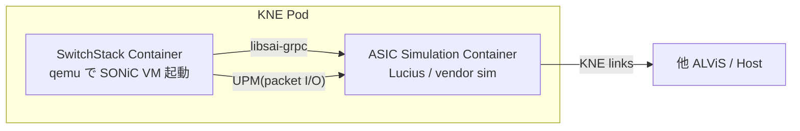

<!-- topics-tip -->
!!! tip "Topics で読み物として読む"
    この HLD は実装詳細を含みます。機能の概念・設定・運用を読み物として読みたい場合は [Topics 21 章: Lab / Virtual SONiC / Developer Entry](../topics/21-lab-vs-developer/index.md) を参照。
<!-- /topics-tip -->

!!! note "裏取りステータス: code-verified（部分）"
    `sonic-buildimage` master に `platform/alpinevs` サブモジュール（`url=https://github.com/sonic-net/sonic-alpine/`、`.gitmodules`）と `.azure-pipelines/azure-pipelines-build-alpinevs.yml` が登録され、`build_image.sh` で `TARGET_MACHINE=alpinevs` が分岐される。一方、`libsai-grpc` 等の syncd 連携実体は `sonic-alpine` 配下に集約されており本リポジトリ単体では追跡できない（submodule のため）。`alpinevs-init` サービスや `hwsku=alpine_vs` の記述は HLD 由来であり、buildimage 単体では確認できない。

# Alpine 仮想 SONiC（ALViS / KNE デプロイ）

## 概要

ALPINE は Google が提案した [SONiC](../reference/glossary.md#term-sonic) のスイッチスタックシミュレーションフレームワーク[^1]。仮想スイッチ本体である **ALViS (Alpine Virtual Switch)** と、KNE (Kubernetes Network Emulation) ベースのデプロイモデル **AKD (Alpine KNE Deployment)** から成る。既存の `sonic-vs` と異なり、SONiC VM とソフトウェア dataplane を **2 つの container に分離** して実機に近い挙動（特に warm reboot 時に dataplane を維持）を再現する点がコア設計。

## 動作仕様

### 2-container 構成



`SwitchStack Container` は qemu で SONiC VM を立ち上げ、その内部で全 SONiC コンテナが動く[^1]。`syncd` は **gRPC ベースの [SAI](../reference/glossary.md#term-sai) クライアント** (`libsai-grpc`) で別 container の dataplane と通信する。CPU port の packet in/out は **UPM (Userspace Packet Module)** が担う。

`ASIC Simulation Container` がソフトウェア dataplane。デフォルトは OpenConfig 由来の **Lucius** (lemming プロジェクト)[^1]。vendor は (1) [ASIC](../reference/glossary.md#term-asic) sim container イメージ、(2) socket ベースの SAI 実装、(3) UPM、の 3 点を提供すれば差し替え可能。

### 2 container にする理由

- **Warm reboot 模擬**: VM だけ再起動して dataplane を維持できる。SAI/SDK reconciliation のテストが実機前に可能[^1]
- **Dynamic Port Breakout**: VM 起動時に lane を確定させず、`create_hostif`/`create_port` 呼び出し時にポート生成
- **HW 模擬度**: VM 内に余分な veth が無く、`ip addr` で見える netdev は SAI が作った hostif と完全一致

### Build / Platform

`sonic-buildimage` に新プラットフォーム `alpinevs` が追加される[^1]:

```text
PLATFORM=alpinevs make configure
make target/sonic-alpinevs.img.gz
```

ランタイム時は `alpinevs-init` サービスが `config_db.json` の `DEVICE_METADATA.hwsku` を見て platform を選択する。`hwsku=alpine_vs` 指定で:

```yaml
HwSKU: alpine_vs
ASIC: alpinevs
```

無指定なら sonic_vs と同じ `Force10-S6000` がデフォルト。

### Ports

| 種別 | 用途 |
|------|------|
| Data ports | dataplane 内のスイッチング。KNE topology の links から生成 |
| Management port | container 間通信および外部 test runner との接続 |
| HostIF | VM 内に hostif として作られ、ASIC ⇄ CPU の packet I/O。genetlink / send-to-ingress も対応 |

### KNE デプロイ (AKD)

KNE のノード type `ALPINE`（[openconfig/kne の topo/node/alpine](https://github.com/openconfig/kne/tree/main)）を使う[^1]。topology 例:

```text
nodes: {
  name: "alpine-dut"
  vendor: ALPINE
  config: {
    image: "...alpine-vs:ga"
    vendor_data {
      [type.googleapis.com/alpine.AlpineConfig] {
        containers: { name: "dataplane"
                      image: "...lucius:ga"
                      command: "/lucius/lucius" }
      }
    }
  }
}
```

`vendor_data` の `containers` で別 vendor の sim を差し替え可能。services は ssh(22) / gnmi+gnoi(9339) / p4rt(9559) を露出する。

<!-- evidence:
source: sonic-net/SONiC/doc/alpine/alpine_hld.md#L101-L150 (sha: 49bab5b5ff0e924f1ea52b3d9db0dfa4191a7c06)
excerpt: |
  At a high level, the Alpine Virtual Switch (ALViS) is composed of 2 foundational Docker containers:
  1. SwitchStack Container which runs a SONiC VM, and
  2. ASIC Simulation Container which runs the virtual ASIC.
reasoning: 2-container 構成と各 container の役割の根拠。
-->

<!-- evidence-rendered:start -->
??? note "📋 検証エビデンス: sonic-net/SONiC/doc/alpine/alpine_hld.md#L101-L150 (sha: 49bab5b5ff0e924f1ea52b3d9db0dfa4191a7c06)"

    **出典**:

    `sonic-net/SONiC/doc/alpine/alpine_hld.md#L101-L150 (sha: 49bab5b5ff0e924f1ea52b3d9db0dfa4191a7c06)`

    **抜粋**:

    ```text
    At a high level, the Alpine Virtual Switch (ALViS) is composed of 2 foundational Docker containers:
    1. SwitchStack Container which runs a SONiC VM, and
    2. ASIC Simulation Container which runs the virtual ASIC.
    ```

    **判断根拠**: 2-container 構成と各 container の役割の根拠。

<!-- evidence-rendered:end -->

## SAI

SAI 仕様自体への変更は無い[^1]。dataplane への接続方式は vendor 実装次第。Lucius の場合は **gRPC 経由で SAI 呼び出しを auto-generated client が転送** する（[lemming の protoforsai](https://github.com/openconfig/lemming/blob/main/dataplane/docs/protoforsai.md) 参照）。

## リソース要件

VM は qemu で `-m 32768`（32GB RAM）`-smp 12`（12 vCPU）で起動する[^1]。実測例では qemu プロセスが ~4.2GB RES、Lucius が ~230MB RES。**開発者ワークステーションでも動かせる規模** が要件の 1 つ。

## Warmboot / Fastboot

設計に変更は無い[^1]。むしろ ALViS は **warm reboot 開発のためのツール**として位置づけられる（VM 再起動中も dataplane container が forwarding を続ける）。

## 制限事項

- 現行は AKD 環境でしか動かない[^1]
- KVM 有効ホストが必須。VM 内で動かす場合は nested virtualization が必要
- `docker-sonic-alpinevs`（VM 抜きで apps + dataplane を直接動かす派生）は Open/Action 項目で検討中

## 干渉する機能

- **sonic-vs**: 同じ仮想スイッチ枠だが、`sonic-vs` は SAI に bcm 等の実装無しの単純 sim。ALViS は SAI を gRPC で外出しする点が異なる
- **KNE / ondatra**: トポロジ・テスト用 control framework として直接連携

## 関連 reference

- [Topics: Build / Packaging](../topics/19-build-packaging/index.md)
- [HLD: build-system-improvements](build-system-improvements.md)
- [HLD: build-profiles](build-profiles.md)

## 引用元

[^1]: `sonic-net/SONiC` `doc/alpine/alpine_hld.md` @ `49bab5b5ff0e924f1ea52b3d9db0dfa4191a7c06`

<!-- evidence (verifier-batch-18):
- sonic-buildimage `.gitmodules` に `[submodule "platform/alpinevs"] url = https://github.com/sonic-net/sonic-alpine/` が登録済（HEAD 確認）
- `sonic-buildimage/.azure-pipelines/azure-pipelines-build-alpinevs.yml` 存在
- `sonic-buildimage/build_image.sh` に `if [ "$TARGET_MACHINE" = "alpinevs" ]` 分岐あり
- libsai-grpc / Lucius / alpinevs-init の実体は `sonic-alpine` サブモジュール（本リポでは展開していない）
-->

<!-- concerns hint:
- alpinevs platform の sonic-buildimage 取り込み確認 → 取り込み済（submodule + pipeline + build_image.sh 分岐）
- libsai-grpc / UPM の syncd 連携の現行実装確認 → sonic-alpine submodule に集約、本リポでは確認不能
- Lucius (lemming) との互換 commit pin の確認 → submodule 側で確認のこと
- KNE alpine node type 取り込みの upstream openconfig/kne 状況確認 → 別 repo
- v0.1 (2025-05) Initial Proposal のため採否未確認、現行 master への取り込み確認 → buildimage 側は採用済
-->

<!-- topics-back-ref -->
## 関連 Topics

- [Topics: Lab / Virtual SONiC / Developer Entry](../topics/21-lab-vs-developer/index.md)

<!-- /topics-back-ref -->

<!-- glossary-links-injected: ec18b66e3507 -->
