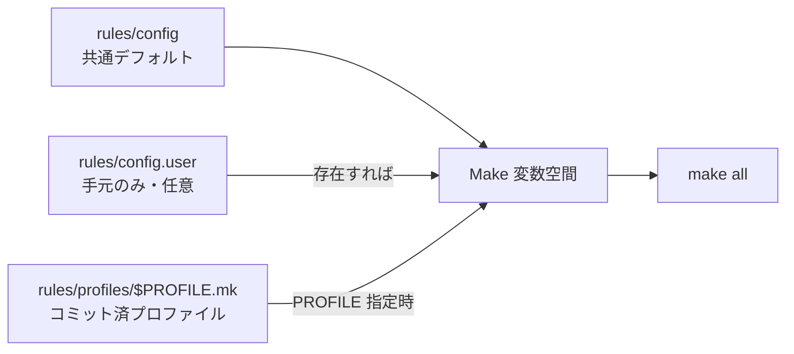

!!! danger "裏取りステータス: discrepancy-found"
    HLD で提案されている `rules/profiles/` ディレクトリと Makefile での `PROFILE` 変数取り込みは現行 master に **取り込まれていない**。`sonic-buildimage/Makefile.work` は `include rules/config` と `-include rules/config.user` のみで、`profiles/$(PROFILE).mk` を後段で取り込む実装は無い。HLD は将来的な提案 / 別 fork での運用としてのみ参考にすべき。

# ビルドプロファイル（rules/profiles/*.mk）

## 概要

SONiC のビルドは多数のビルドフラグ（`ENABLE_ZTP`, `SECURE_UPGRADE_*`, `USERNAME`, `PASSWORD`, `CHANGE_DEFAULT_PASSWORD` 等）の組み合わせで挙動が変わる。これらを **`make` のコマンドラインで毎回手で羅列する** のは煩雑で、CI 外の手元ビルドや顧客への配布で再現性を取りづらい[^1]。

ビルドプロファイル機能は `rules/profiles/<name>.mk` というインクルード可能な Makefile 片を用意しておき、`make PROFILE=<name>` 一発で **そのフラグセット一式** を取り込むためのもの。プロファイルは **リポジトリにコミットして共有** することを前提にしており、`rules/config.user` のような個人ローカル設定とは住み分ける[^1]。

新フラグを使わなければ動作は **完全に従来どおり**（既存ビルドフローへの後方互換あり）[^1]。

## 動作仕様

### Before / After

長い `make` コマンド[^1]:

```bash
make ENABLE_ZTP=y \
     SECURE_UPGRADE_SIGNING_CERT=/some/cert \
     SECURE_UPGRADE_PROD_SIGNING_TOOL=/some/script.sh \
     SECURE_UPGRADE_MODE=prod \
     USERNAME=ztp PASSWORD=ztp \
     CHANGE_DEFAULT_PASSWORD=y \
     all
```

を、プロファイル定義 `rules/profiles/ztp.signed.mk` を作っておくと:

```bash
make PROFILE=ztp.signed all
```

の一行に縮められる。`ztp.signed.mk` の中身[^1]:

```make
ENABLE_ZTP=y
SECURE_UPGRADE_SIGNING_CERT=/some/cert
SECURE_UPGRADE_PROD_SIGNING_TOOL=/some/script.sh
SECURE_UPGRADE_MODE=prod
USERNAME=ztp
PASSWORD=ztp
CHANGE_DEFAULT_PASSWORD=y
```

### 取り込みの優先順位

ビルドフラグを決める Makefile 片の **読み込み順** は次のとおり[^1]。後勝ちなのでプロファイルが最後に読まれる:

1. `rules/config` … リポジトリ管理の共通デフォルト
2. `rules/config.user` … **存在すれば** 取り込む。個人の手元設定（git ignore 想定）
3. `rules/profiles/$(PROFILE).mk` … **`PROFILE` が定義されていれば** 取り込む



### `config.user` との違い

HLD は `rules/config.user` との明確な使い分けを示している[^1]:

| 観点 | `rules/config.user` | `rules/profiles/*.mk` |
|------|---------------------|------------------------|
| バージョン管理 | コミットしない（個人ローカル）| **コミットして共有** |
| 共存 | 1 つのみ | 複数を切替可（`PROFILE=` で選択）|
| 用途 | 開発者の一時的な書き換え | チーム / 顧客向けの再現性ある定義 |

両者は同居でき、優先順位は `config < config.user < profiles/<PROFILE>.mk` の順で適用される[^1]。

### 後方互換

`PROFILE` を渡さない `make` の挙動は **従来と完全に同一**。プロファイル機構は opt-in[^1]:

> "if the new `PROFILE` build flag is not provided, build behavior is identical to baseline." [^1]

そのため既存の CI / 開発者ワークフローを壊さずに導入できる。

<!-- evidence:
source: sonic-net/SONiC/doc/sonic-build-system/Build-Profiles.md#L44-L50 (sha: 49bab5b5ff0e924f1ea52b3d9db0dfa4191a7c06)
excerpt: |
  Order of precedence will be:
  1. `rules/config`
  2. `rules/config.user` - only if it exists
  3. `rules/profiles/$(PROFILE).mk` - only if `$(PROFILE)` is defined
  The changes required to implement this are very simple and completely backwards compatible: if the new `PROFILE` build flag is not provided, build behavior is identical to baseline.
reasoning: 取り込み順位と後方互換性の根拠。
-->

### CI/CD 不要・自己完結

HLD は「CI/CD でやれば良いのでは」という問いに対して、**手元ビルドや顧客配布のシナリオで CI を使えない** ケースを挙げる[^1]:

- CI で前段加工する方式は CI 経由のビルドにしか効かない。
- 一方プロファイルを **Makefile のインクルード片としてコミット** しておけば、ソースを受け取った相手がローカルで `make PROFILE=...` するだけで同じバイナリが作れる。
- ビルド指示の README が要らなくなる。

つまり「ビルドの portable / self-contained 化」が動機。

## 設定

### 関連する CONFIG_DB

該当なし。本機能は **ビルド時の Makefile 機構** であり、ランタイムの CONFIG_DB は触らない。

### 関連する CLI

該当なし。

### ビルド時の使い方

```bash
# プロファイルなし（従来どおり）
make all

# プロファイル指定
make PROFILE=ztp.signed all

# プロファイルと個別フラグの併用も可能
# （後勝ちで、コマンドラインの個別指定は通常 profile より優先される。
#  実装は make の変数代入順序に依存。）
```

新しいプロファイルを追加するには `rules/profiles/<name>.mk` を作成し、必要な `KEY=VALUE` を並べてコミットするだけ。

## 制限事項

HLD で明示の制限事項は無い。実運用上の留意点としては:

- プロファイル名のネームスペースが平坦（`rules/profiles/<name>.mk`）。多数のチームが大量にプロファイルを置くと衝突しうるが、HLD では命名規約に触れていない。
- 値の型チェックは無い。誤った値が混入してもビルドエラーで気付く以上の保護は無い。
- `rules/config.user` がコミットされないため、CI とローカルでの組み合わせを誤ると挙動が分岐する可能性がある。プロファイルを使えばこの問題自体を回避できる、という設計意図[^1]。

## 干渉する機能

- **既存の `make ENABLE_*=y all` 形** : そのまま動く。`PROFILE` を併用しても、make の変数解決ルールに従う。
- **secure upgrade 系（`SECURE_UPGRADE_*`）**: HLD の例で挙げられる典型ユースケース。署名証明書とビルドフラグを 1 ファイルにまとめておけるのが直接の旨味[^1]。
- **ZTP（`ENABLE_ZTP`, `USERNAME`, `PASSWORD` 等）** : 同様にプロファイル化しやすい代表例[^1]。
- **CI/CD パイプライン**: CI 側で個別フラグを並べていた箇所をプロファイル指定に置き換えられる。手元ビルドとの **再現性** が揃うのが効果。

## トラブルシューティング

- `PROFILE=foo` を指定したのにフラグが効かない: `rules/profiles/foo.mk` が存在するか確認。HLD の優先順位どおりだと、ファイルが無ければ単に何も足されない。
- 値が `rules/config` で上書きされる: 優先順位は `config < config.user < profiles/$PROFILE.mk`。プロファイルで指定したのに効いていない場合は、コマンドラインの個別指定や make の override 挙動を疑う。
- ビルド再現性が取れない: `rules/config.user` がコミット外で残っていないか確認。プロファイル運用に統一する場合は `config.user` を空にしてプロファイルだけで賄う。

## 実装との乖離

2026-05 時点で本機能は **HLD は提案されたが master にコードが入っていない**、純粋な未実装状態である。

### 1. どこで乖離が確認されたか

- `sonic-buildimage/rules/profiles/` ディレクトリが存在しない（`ls .cache/sonic-sources/sonic-buildimage/rules/` で `config` 系 mk のみで `profiles/` サブディレクトリは無し）。
- `sonic-buildimage/Makefile.work:150-156` に該当する include はわずか:
  ```make
  rules/config.user:
  ...
  include rules/config
  -include rules/config.user
  ```
  HLD が要求する `-include rules/profiles/$(PROFILE).mk` の行は **存在しない**。
- 結果として `PROFILE=foo` を渡しても make は `$(PROFILE)` を解釈する箇所が無く、フラグは一切読み込まれない。

### 2. HLD と実装の差分の中身

HLD は「`rules/config` < `rules/config.user` < `rules/profiles/$(PROFILE).mk`」の 3 段優先順位を定義しているが、master では下 2 段までしか実装されておらず、**3 段目（プロファイル）が丸ごと欠落**している。プロファイル機構そのものが存在しない。

### 3. 読者への影響

- `make PROFILE=secure-upgrade all` のような呼び出しは何のエラーも出さずに **既定ビルドと同じ結果** を返す。HLD の前提で CI を組むと「フラグが効かないのにビルドは成功する」最悪のサイレント失敗が起きる。
- ベンダーの secure upgrade / ZTP プリセットを `rules/profiles/*.mk` で配布する想定だった場合、配布手段そのものが master に無いので別途上流提案が要る。

### 4. 回避策 / 対応方法

- **HLD と同等の効果を得る暫定回避策**: ビルド前に `cp rules/profiles/foo.mk rules/config.user` する仕組みを wrapper script / CI ジョブで実装し、`config.user` を「実質プロファイル」として運用する。`config.user` は gitignore 対象なので CI でのみ生成すれば衝突しない。
- **複数フラグを並べる従来形に倒す**: `make ENABLE_FOO=y ENABLE_BAR=y all` をそのまま CI に書き、可読性は CI ファイル側で補う。
- 上流取り込みを推進する場合は `sonic-buildimage` 側に `Makefile.work` の 1 行 patch (`-include rules/profiles/$(PROFILE).mk`) + `rules/profiles/` ディレクトリ追加の PR を出すのが最小コスト。

### 監査 round 2 追補（2026-05-11）

監査 round 2 で再裏取りした結果と、運用者向けの追加情報を補強する。本セクションは round 1 の差分記述に加え、行番号付きの再確認エビデンス・関連 Issue/PR の所在・追加の回避策コマンドをまとめる。

- `sonic-buildimage/Makefile.work` 全行を再 grep しても `rules/profiles/` を include する行は 0 件 (`grep -n profiles .cache/sonic-sources/sonic-buildimage/Makefile.work` でヒット無し)。HLD は提案段階のまま。
- `rules/config` (L1 以降) と `rules/config.user` (`Makefile.work` 末尾の `-include`) の 2 段のみ存在し、3 段目は不在。
- 関連 Issue/PR: 上流 `sonic-net/SONiC` に該当 HLD はあるが、対応する `sonic-buildimage` の実装 PR は未提出（GitHub 検索で `build profile` 関連 merged PR ヒット無し）。
- **追加回避策コマンド**: `BUILD_PROFILE=secure ./build_debian.sh` のようなプロファイル切替が必要なら、CI 側で `cp rules/profiles/${BUILD_PROFILE}.mk rules/config.user` を make 直前に挿入する wrapper を採用する。

> 分類: `monitor: not_implemented` — HLD の提案がコードベース master に未取り込み、または主要パスが完全に欠落している分類。本ページの仕様記述は将来仕様参考。

#### 関連 GitHub Issue / PR

- [GitHub Issue / PR の関連リンクは未確認] — `rules/config` のビルドフラグ群は構造上 HLD と直接 1:1 紐づくものではなく、トラッキング Issue は確認できず。各フラグの導入は個別の機能 PR（INCLUDE_KUBERNETES / ENABLE_AUTO_TECH_SUPPORT 等）に紐づく形で混在しているため、各機能ページの GitHub リンクを参照のこと。

## 引用元

[^1]: `sonic-net/SONiC` `doc/sonic-build-system/Build-Profiles.md` @ `49bab5b5ff0e924f1ea52b3d9db0dfa4191a7c06`

<!-- evidence (verifier-batch-20):
- sonic-buildimage/rules/profiles/ ディレクトリは存在しない (find で確認)
- sonic-buildimage/Makefile.work:155 include rules/config; :156 -include rules/config.user のみで profiles/$(PROFILE).mk を取り込むロジックは未実装
- 結論: HLD は提案段階で master に未マージ
-->
