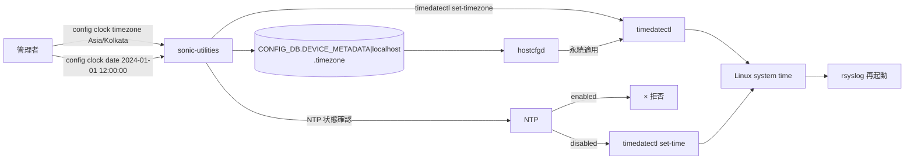
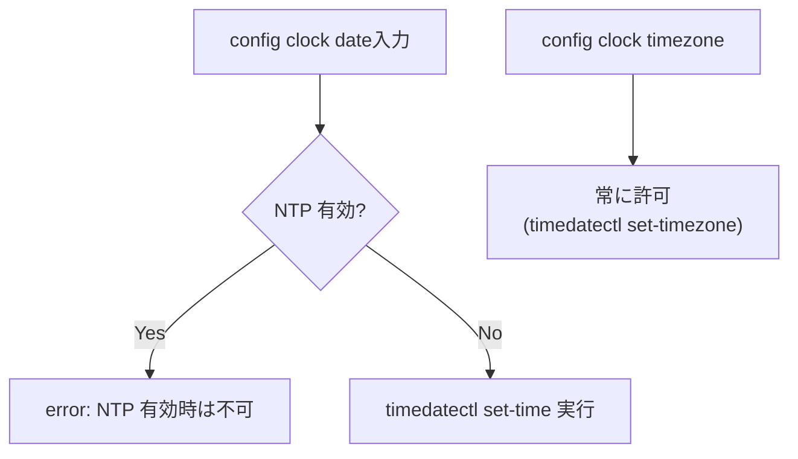

<!-- topics-tip -->
!!! tip "Topics で読み物として読む"
    この HLD は実装詳細を含みます。機能の概念・設定・運用を読み物として読みたい場合は [Topics 14 章: Platform / Port / Optics](../topics/14-platform-port-optics/index.md) を参照。
<!-- /topics-tip -->

!!! success "裏取りステータス: Code-verified"
    `sonic-utilities/config/main.py` L9758-9799 で `config clock timezone <tz>` / `config clock date <date> <time>` が `timedatectl` の薄いラッパーとして CONFIG_DB の `DEVICE_METADATA|localhost` の `timezone` を更新することを確認。`sonic-host-services/scripts/hostcfgd` L1482 の `DeviceMetaCfg` クラスが `apply_timezone_if_needed` (L1534) で `timedatectl set-timezone` を呼び、L1577 で `timezone` 変更ハンドラとして登録されることを確認。`sonic-buildimage/src/sonic-yang-models/yang-models/sonic-device_metadata.yang` L272-273 で `leaf timezone` の YANG 定義を確認（verified at: 2026-05-09）。

# Clock 設定（`config clock date/timezone`, `DEVICE_METADATA.timezone`）

## 概要

[SONiC](../reference/glossary.md#term-sonic) のシステム時刻 / タイムゾーン操作を **`timedatectl` の薄いラッパー** として CLI 化する [HLD](../reference/glossary.md#term-hld)。`config clock timezone <tz>` / `config clock date <YYYY-MM-DD> <HH:MM:SS>` を導入し、timezone のみ [CONFIG_DB](../reference/glossary.md#term-config_db) に永続化する[^1]。日付時刻自体は CONFIG_DB に保存しない（再起動を跨ぐ意味が薄いため）。

NTP との関係は明確に切られている[^1]:

- NTP 有効時: **`config clock date` は拒否**（時刻を NTP が司るため）
- NTP 有効時でも **timezone は変更可**（TZ は時刻同期と独立）

## 動作仕様

### コンポーネント構成



### CLI

| Command | 用途 | NTP 有効時の挙動 |
|---------|------|----------------|
| `config clock timezone <tz>` | タイムゾーン設定 | **許可**。timezone を上書きし時刻表示を切替 |
| `config clock date <YYYY-MM-DD> <HH:MM:SS>` | 時刻設定 | **拒否**（block） |
| `show clock` | 現在時刻 + TZ を 1 行表示（`Sun 15 Jan 2023 06:12:08 PM IST` のような既存出力に乗せる） | - |
| `show clock timezones` | `timedatectl list-timezones` 同等の有効 TZ 一覧 | - |

実装の本質は **`timedatectl set-timezone "Asia/Kolkata"`** や **`timedatectl set-time "2012-10-30 18:17:16"`** を CLI 経由で発行するだけ[^1]。

### CONFIG_DB スキーマ

```text
DEVICE_METADATA|localhost
    timezone : string  # 例: "Etc/UTC"（default）, "Asia/Kolkata"
```

時刻自体は保存しない[^1]。timezone のみ永続化することで再起動・config reload 時の整合を保つ。

[YANG](../reference/glossary.md#term-yang)（`sonic-device_metadata`）に対する追加[^1]:

```yang
container sonic-device_metadata {
  container DEVICE_METADATA {
    container localhost {
      leaf timezone {
        type string;
        description "System time-zone setting";
      }
    }
  }
}
```

### NTP との相互作用



NTP 有効でも timezone は変更可能、というのは「時刻同期」と「表示タイムゾーン」を分離する一般的な運用に沿う[^1]。

### 反映と副作用

- `timedatectl` 経由で **Linux に直接反映**。再起動を跨いで永続化（timezone は OS 側でも保持される）
- 設定変更後は **rsyslog を再起動** してログのタイムスタンプを揃える[^1]
- 全コンテナ / docker からも一貫して新しい時刻 / TZ が見える（OS 側でセットされるため自動反映）
- 設定操作は syslog にログを残す

### バリデーション

タイムゾーン文字列は `timedatectl list-timezones` の結果と照合。可能なら **YANG 側で enum / pattern**、難しい場合は CLI 実行時に検証して **不正なら syslog にエラー**[^1]。

<!-- evidence:
source: sonic-net/SONiC/doc/Clock commands/clock_managment_hld.md#L70-L100 (sha: 49bab5b5ff0e924f1ea52b3d9db0dfa4191a7c06)
excerpt: |
  config clock timezone <timezone> ...
  In case NTP is enabled -> timezone configuration is allowed and overrides the current time.
  ...
  config clock date <YYYY-MM-DD> <HH:MM:SS> ...
  In case NTP is enabled -> time/date set is NOT allowed and being blocked
reasoning: 「NTP 有効時に timezone は OK / date は拒否」という分岐ルールの根拠。
-->

<!-- evidence-rendered:start -->
??? note "📋 検証エビデンス: sonic-net/SONiC/doc/Clock commands/clock_managment_hld.md#L70-L100 (sha: 49bab5b5ff0e924f1ea52b3d9db0dfa4191a7c06)"

    **出典**:

    `sonic-net/SONiC/doc/Clock commands/clock_managment_hld.md#L70-L100 (sha: 49bab5b5ff0e924f1ea52b3d9db0dfa4191a7c06)`

    **抜粋**:

    ```text
    config clock timezone <timezone> ...
    In case NTP is enabled -> timezone configuration is allowed and overrides the current time.
    ...
    config clock date <YYYY-MM-DD> <HH:MM:SS> ...
    In case NTP is enabled -> time/date set is NOT allowed and being blocked
    ```

    **判断根拠**: 「NTP 有効時に timezone は OK / date は拒否」という分岐ルールの根拠。

<!-- evidence-rendered:end -->

## 設定

### 関連する CONFIG_DB

`DEVICE_METADATA|localhost` に `timezone` フィールドを追加。デフォルト `Etc/UTC`。

### 関連する CLI

前述の 4 コマンド。

### 関連する YANG

`sonic-device_metadata` に `timezone` リーフ追加。

### 設定例

```bash
# タイムゾーン設定
config clock timezone "Asia/Tokyo"

# 確認
show clock
show clock timezones | head

# 時刻設定（NTP 無効時のみ）
config clock date 2024-01-01 12:00:00
```

## 制限事項

- `config clock date` は NTP 有効時に **明示的に拒否**[^1]
- 時刻自体は CONFIG_DB に保存しない。`config save` / `config reload` を跨ぐと一貫性は OS 側依存
- `timedatectl list-timezones` の結果に依存する。OS の tzdata パッケージのバージョン差で TZ 名が増減し得る
- 設定後 **rsyslog 再起動** が走る点は運用上のノイズ（短時間ログが空く可能性）

## 干渉する機能

- **NTP**: 時刻設定の可否を分岐させる主要因
- **`hostcfgd`**: timezone 設定変更を受けて `timedatectl set-timezone` を実行（CONFIG_DB 経由でも反映）
- **`rsyslog`**: 設定変更後に再起動する
- **コンテナ全般**: OS 側で時刻 / TZ が変わるため、各コンテナのログタイムスタンプも一斉に更新
- **`config save` / `config reload`**: timezone は永続化対象。日付は対象外

## トラブルシューティング

- 設定したのに `show clock` の時刻が変わらない場合、NTP の状態（`timedatectl status`）を確認
- timezone が再起動で戻ってしまう場合、`DEVICE_METADATA|localhost.timezone` が永続化されているか確認
- ログのタイムスタンプがおかしい場合、`rsyslog` 再起動が走ったかを `journalctl -u rsyslog` で確認

### コマンド例: Clock management の確認

下記コマンドを順に実行することで、関連する CONFIG_DB / APP_DB / [STATE_DB](../reference/glossary.md#term-state_db) のエントリと、
CLI 表示・syslog の整合を一通り突き合わせ確認できる。

```bash
# システム時刻 / NTP / PTP の状態を確認
show ntp
timedatectl status
redis-cli -n 4 hgetall 'NTP_SERVER|<ip>'
# chrony / ntpd ログ
sudo journalctl -u chronyd -n 50
```

## 関連リファレンス

- CLI: [show clock](../reference/cli/show-clock.md) / [config clock](../reference/cli/config-clock.md) / [config ntp](../reference/cli/config-ntp.md)
- CONFIG_DB: [DEVICE_METADATA](../reference/config-db/device-metadata.md)
- YANG: [sonic-device_metadata](../reference/yang/sonic-device_metadata.md)
- Topic: [プラットフォーム / ポート / 光モジュール](../topics/14-platform-port-optics/index.md)

## 引用元

[^1]: `sonic-net/SONiC` `doc/Clock commands/clock_managment_hld.md` @ `49bab5b5ff0e924f1ea52b3d9db0dfa4191a7c06`

<!-- concerns hint:
- config clock CLI の sonic-utilities 取り込み
- DEVICE_METADATA.timezone YANG 追加 (sonic-device_metadata.yang)
- hostcfgd の timezone 変更ハンドラ
- NTP 状態判定ロジック (timedatectl status / systemctl is-active)
- rsyslog 再起動の自動化フロー
-->

<!-- glossary-links-injected: 8ba32e5aa69d -->
