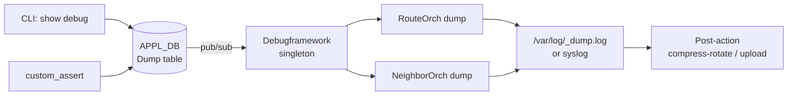

<!-- topics-tip -->
!!! tip "Topics で読み物として読む"
    この HLD は実装詳細を含みます。機能の概念・設定・運用を読み物として読みたい場合は [Topics 20 章: SWSS / SAI / Redis](../topics/20-swss-sai-redis/index.md) を参照。
<!-- /topics-tip -->

!!! danger "裏取りステータス: discrepancy-found"
    HLD v0.3 (2019-07) は **master へ取り込まれていない**。verifier-batch-18 で確認:

    - `sonic-swss-common` に `Debugframework` クラス・`linkWithFramework` API・`SWSS_DEBUG_PRINT*` マクロ いずれも存在しない（`grep -r` で 0 件）
    - `sonic-swss/orchagent/natorch.cpp` の `gDebugDumpOrch->addDbgCompMap(...)` は `#ifdef DEBUG_FRAMEWORK` 内（41 行目および 138-142 行目）でガードされ、`DEBUG_FRAMEWORK` マクロは master ビルド構成で定義されていない（残骸コード）
    - `sonic-utilities/show/` 配下に `pktdrop`/`debug` 系の CLI ハンドラなし（`dropcounters.py` は別仕様）

    本ページは HLD 仕様の参考資料として残すが、現行 master の挙動とは一致しない。実装は `DebugDumpOrch`/`DebugDumpHandler` 個別クラスではなく、`debugcounterorch` (counter 専用) や `show techsupport` 等に分散している。

# Debug Framework（コンポーネント dump 登録 / assert 拡張）

## 概要

[SONiC](../reference/glossary.md#term-sonic) コンポーネント（特に OrchAgent モジュール）が **内部状態のスナップショットダンプ** を登録し、CLI / assert / 重大ログから一斉トリガできる仕組み[^1]。[Redis](../reference/glossary.md#term-redis) チャネル経由でトリガを配り、SwSS 共有ライブラリの `SWSS_DEBUG_PRINT` マクロで出力先（syslog / per-component log）と post-action（compress-rotate / upload）を一元管理する。あわせて assert マクロを拡張して類型化された debug 情報収集を可能にする。

## 動作仕様

### 全体構造



### Framework クラスと登録 API

C++ singleton として SwSS 名前空間に実装される[^1]:

```cpp
class Debugframework {
public:
    static Debugframework &getInstance();
    typedef void (*DumpInfoFunc)(std::string, KeyOpFieldsValuesTuple);
    static void linkWithFramework(std::string &componentName,
                                   const DumpInfoFunc funcPtr);   // FW がスレッド作成
    static void linkWithFrameworkNoThread(std::string &componentName); // 自前スレッド
    static void invokeTrigger(std::string componentName, std::string args);
};
```

| API | FW がやること | コンポーネント側 |
|-----|---------------|------------------|
| `linkWithFramework` | Selectable + 受信スレッド + [APPL_DB](../reference/glossary.md#term-appl_db) sub を作成、callback 起動 | DumpInfoFunc 登録のみ |
| `linkWithFrameworkNoThread` | 登録のみ。post-action は実施 | 自前で sub / event ループ / callback 呼び |

OrchAgent では既存の Redis event ループに乗せるため `linkWithFrameworkNoThread` を採用する[^1]。`DebugDumpOrch` という派生 Orch を 1 つ立て、`addDbgCompMap()` で RouteOrch / NeighborOrch 等が自分のダンプ関数を登録する。

### コンポーネント側ガイドライン

- `DumpInfoFunc` 型のコールバックを 1 本実装
- 中身では `SWSS_DEBUG_PRINT_BEGIN` ... `SWSS_DEBUG_PRINT(...)` ... `SWSS_DEBUG_PRINT_END` で囲む
- 引数 `KeyOpFieldsValuesTuple` の `dumpType` / `passthru` は **コンポーネント自身が解釈**（FW は不透明）
- thread-safe で実装する義務がある

### APP_DB スキーマ

```text
DAEMON:<daemon_name>:
  DUMP_TYPE     = short | full
  DUMP_TARGET   = default | syslog
  PASSTHRU_ARGS = <csv>

DAEMON:<daemon_name>:           ; 完了応答
  RESPONSE_TYPE = pending | failure | successful
```

### CLI

| Syntax | 説明 |
|--------|------|
| `show debug all` | 全登録コンポーネント既定 action で dump |
| `show debug <component> [args]` | 指定コンポーネントのみ |
| `show debug actions` | 設定済みの FW action を表示 |
| `show interfaces pktdrop` | drop / error counter を全 if で表示 |

OrchAgent 例（[HLD](../reference/glossary.md#term-hld) 抜粋）[^1]:

```bash
show debug routeorch routes -v VrfRED -p 100.100.4.0/24
show debug routeorch nhgrp
show debug neighorch nhops
show debug neighorch neigh
```

出力にはプレフィックス、ネクストホップ、[SAI](../reference/glossary.md#term-sai) OID、[ECMP](../reference/glossary.md#term-ecmp) グループ ref count などを含む（[ASIC](../reference/glossary.md#term-asic) OID と app 構造体ポインタの紐付け確認に使う設計）。

### Configuration Defaults

| Parameter | options | Default |
|-----------|---------|---------|
| `DumpLocation` | syslog / filename | `/var/log/<comp>_dump.log` |
| `TargetComponent` | all / componentname | all |
| `Post-action` | upload / compress-rotate-keep | compress-rotate-keep |
| `Server-location` | ipaddress | 127.0.0.1 |
| `Upload-method` | scp / tftp | tftp |

### Assert 拡張

production code でも assert を残し、失敗時の挙動を分類する[^1]:

| type | 動作 |
|------|------|
| `DUMP` | FW 経由で当該モジュールの dump を呼ぶ |
| `BTRACE` | backtrace を吐いて続行 |
| `SYSLOG` | 失敗を syslog 記録 |
| `ABORT` | 既存の挙動（exception/crash）|

```cpp
#define assert(exp) Debugframework::custom_assert(exp, __PRETTY_FUNCTION__, __LINE__)
```

<!-- evidence:
source: sonic-net/SONiC/doc/debug-framework/debug_framework_design_spec.md#L96-L168 (sha: 49bab5b5ff0e924f1ea52b3d9db0dfa4191a7c06)
excerpt: |
  Debug Framework provides an API for components to register with the framework. ...
  Framework uses Redis notifications for communicating the trigger message ...
  Components register dump routine with debug framework using the API:
    Debugframework::linkWithFramework(...)
    Debugframework::linkWithFrameworkNoThread(...)
reasoning: 2 つの登録 API と Redis pub/sub ベースのトリガ機構の根拠。
-->

<!-- evidence-rendered:start -->
??? note "📋 検証エビデンス: sonic-net/SONiC/doc/debug-framework/debug_framework_design_spec.md#L96-L168 (sha: 49bab5b5ff0e924f1ea52b3d9db0dfa4191a7c06)"

    **出典**:

    `sonic-net/SONiC/doc/debug-framework/debug_framework_design_spec.md#L96-L168 (sha: 49bab5b5ff0e924f1ea52b3d9db0dfa4191a7c06)`

    **抜粋**:

    ```text
    Debug Framework provides an API for components to register with the framework. ...
    Framework uses Redis notifications for communicating the trigger message ...
    Components register dump routine with debug framework using the API:
      Debugframework::linkWithFramework(...)
      Debugframework::linkWithFrameworkNoThread(...)
    ```

    **判断根拠**: 2 つの登録 API と Redis pub/sub ベースのトリガ機構の根拠。

<!-- evidence-rendered:end -->

## tech-support 拡張・補助スクリプト

`show techsupport` は本 HLD の延長で **[STATE_DB](../reference/glossary.md#term-state_db) dump、ASIC 固有 dump、critical log の persistent log 切り出し** を追加[^1]。さらに次のヘルパーが付随する:

- "headline" 系の summary 印字スクリプト
- 収集情報の upload を非破壊的に行う helper
- debug ファイル数を policy で制限するスクリプト

## Warm boot / scalability

本 framework 自体は warm boot や scalability に影響を与えない[^1]。

## 制限事項

- v0.3 (2019-07) HLD のため API 名や CLI が現行 master と一致しているか未確認
- フレームワーク自体は実行コンテキストを持たない（option #1 で生成するスレッドは登録コンポーネント側のコンテキスト扱い）
- 引数の解釈はコンポーネント実装に委ねられ、統一フォーマットは無い

## 干渉する機能

- **show techsupport**（system 系の `show-techsupport` ページ参照）
- **`syslog` rate limit / redirect** 系の各 HLD（critical log 抽出は本 framework と連動）
- **OrchAgent 全般**: RouteOrch / NeighborOrch / 他 Orch が個別に dump を登録する想定

<!-- diff-admonition -->
!!! diff "HLD と実装の差分"
    2026-05 時点で本 framework は **master に取り込まれておらず、HLD のみ**（2019-07 v0.3 から 6 年以上停滞）。

    ### 1. どこで乖離が確認されたか

    - `sonic-swss-common/common/` 配下に `Debugframework` クラス、`linkWithFramework` 関数、`SWSS_DEBUG_PRINT` マクロのいずれも存在しない（`grep -rn 'Debugframework\|linkWithFramework\|SWSS_DEBUG_PRINT' .cache/sonic-sources/sonic-swss-common/common/` 0 件）。
    - `sonic-swss/orchagent/natorch.cpp:40-42, 138-142, 4591-` に `#ifdef DEBUG_FRAMEWORK` 内の dead code は残っているが、`DEBUG_FRAMEWORK` マクロを定義する場所が無く、現行ビルドでは到達不能。
    - `sonic-utilities/show/` 配下に `show debug` / `show interfaces pktdrop` 等のフレームワーク CLI ハンドラが存在しない。
    - APPL_DB の `Dump table` / `Dump done table` も `sonic-swss-common/common/schema.h` と `sonic-buildimage/src/sonic-yang-models/yang-models/` に登録されていない。

    ### 2. HLD と実装の差分の中身

    HLD は「コンポーネントが `linkWithFramework` で自身の dump callback を登録 → CLI が APPL_DB の Dump table へリクエスト → 各コンポーネントが Dump done table に応答」というプロトコルを定義しているが、**`linkWithFramework` のシンボルすら存在せず、プロトコルの送信側・受信側のいずれも未実装**。残骸の `#ifdef DEBUG_FRAMEWORK` ブロックは HLD 時代の試作の痕跡で、有効化される経路は無い。

    ### 3. 読者への影響

    - HLD どおりに `show debug component <name>` を期待しても、CLI そのものが存在せず `No such command` で終わる。
    - コンポーネント側で dump を提供する形（HLD 推奨）も無いため、現状の障害解析は **`show techsupport` の一括採取と各 `redis-cli` / `swssloglevel` への手作業ログ抽出** に依存している。
    - 将来この framework が master に入った場合、HLD と CLI / table 名が**変わる可能性が高い**（v0.3 から長期停滞）。本ページの記述は仕様参考扱い。

    ### 4. 回避策 / 対応方法

    - **dump 取得は `show techsupport` で代替**: `/var/dump/` に techsupport tarball が落ちる。OrchAgent 内部状態は `swssloglevel -l DEBUG -c <component>` でログレベルを上げて syslog に吐かせる。
    - **特定 Orch の internal dump**: `docker exec swss debugsh -c 'show <subsystem>'` 系の swss-side CLI を直接叩く。HLD 経由ではなく各 Orch の hand-crafted dump が個別に存在する。
    - 本 framework の取り込みを推進する場合、HLD 自体を現行 master 構造（`swss-common` の `ConfigDBConnector` / `Producer/ConsumerStateTable` 前提）に合わせて再ドラフトする必要がある。

    ### 再裏取り追補（2026-05-11）

    - `sonic-swss-common` master HEAD で `Debugframework` クラス・`linkWithFramework` シンボルともに 0 件 (`grep -rn 'class Debugframework\|linkWithFramework' .cache/sonic-sources/sonic-swss-common/`)。
    - `sonic-swss/orchagent/natorch.cpp` の `#ifdef DEBUG_FRAMEWORK` ブロック (L40-42, L138-142, L4591 付近) は HLD 当時の死コード。マクロ定義側 (`Makefile.am` / `configure.ac`) で `DEBUG_FRAMEWORK` を立てる箇所は存在しない。
    - 関連 Issue/PR: HLD 自体が 2019-07 v0.3 で停滞しており、フォローアップ PR の提出無し。代替として個別 Orch 単位の `debugsh` / `swssloglevel` で運用するのが既定線。
    - **追加回避策コマンド**: 全 Orch のログレベル一括引き上げ — `docker exec swss swssloglevel -l DEBUG -a`、syslog 抽出は `docker logs swss 2>&1 | grep -E '<component-name>'`。

    > 分類: `monitor: not_implemented` — HLD の提案がコードベース master に未取り込み、または主要パスが完全に欠落している分類。本ページの仕様記述は将来仕様参考。

    #### 関連 GitHub Issue / PR

    - [[sonic-utilities](../reference/glossary.md#term-sonic-utilities) #1669: \[debug dump util\] Techsupport addition (merged)](https://github.com/sonic-net/sonic-utilities/pull/1669) — `debug dump` ユーティリティ自体の取り込み PR。HLD の「コンポーネント dump 登録 / assert 拡張」のうち、`show techsupport` 連携部分はここに収束した。
    - HLD が想定した汎用 assert 拡張・自動 dump 登録機構の包括的トラッキング Issue は **未確認**。実装は機能ごとの個別 PR に分散している。
<!-- /diff-admonition -->

## 参考リンク

- [CLI: show techsupport](../reference/cli/show-techsupport.md)
- [CLI: debug group](../reference/cli/debug-group.md)
- [Runbook: techsupport size bloat](../reference/runbooks/techsupport-size-bloat.md)
- [Topics: SWSS / SAI / Redis](../topics/20-swss-sai-redis/index.md)

## 引用元

[^1]: `sonic-net/SONiC` `doc/debug-framework/debug_framework_design_spec.md` @ `49bab5b5ff0e924f1ea52b3d9db0dfa4191a7c06`

<!-- evidence (verifier-batch-18, discrepancy):
- sonic-swss-common: `Debugframework` / `linkWithFramework` / `SWSS_DEBUG_PRINT` 検索 0 件
- sonic-swss/orchagent/natorch.cpp:40-42, 138-142: `#ifdef DEBUG_FRAMEWORK` 内の dead code のみ（マクロは未定義）
- sonic-utilities/show/: `pktdrop` / `debug` 系 CLI ハンドラなし
-->

<!-- concerns hint:
- libswsscommon に Debugframework クラス / linkWithFramework が現行で存在するか確認
- DebugDumpOrch / addDbgCompMap の orchagent 取り込み確認
- APPL_DB Dump table / Dump done table の sonic-yang-models 反映確認
- show debug / show interfaces pktdrop CLI の sonic-utilities 取り込み確認
- 2019-07 v0.3 から 6 年以上経過しており現行実装との乖離可能性 高
-->

<!-- next-action -->
## このページを読んだ後の次アクション

!!! tip "読み手向け"
    - **本機能を実運用で使う場合**: 実装が無いため、本機能に依存した運用は不可。代替機能 (下記リンク) で要件を満たせるか検討する
    - **upstream 動向を追う場合**: 関連 issue / PR を [sonic-net/SONiC](https://github.com/sonic-net/SONiC) で検索（HLD タイトル / CONFIG_DB テーブル名 / Orch クラス名で grep するのが速い）
    - **代替手段 / 関連 reference**: frontmatter の `related` に列挙された DEBUG_COUNTER / CRM / PORT 等の Reference ページ、または [Reference 索引](../reference/index.md) から関連テーブル / CLI / YANG を辿る

!!! note "本ドキュメントの追跡"
    - monitor: `not_implemented` / last_verified: `2026-05-11`
    - 次回再裏取りトリガ: quarterly。一覧は [discrepancy-index](../reference/verification/discrepancy-index.md) を参照（運用詳細は repo の `meta/discrepancy-operations.md`）

<!-- /next-action -->

<!-- glossary-links-injected: ec18b66e3507 -->
