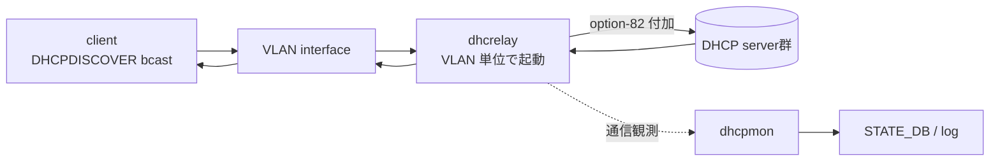

!!! success "裏取りステータス: code-verified"
    実装裏取り済み（下記コード位置）。dhcpmon / dhcrelay: sonic-buildimage/dockers/docker-dhcp-relay/dhcp-relay.monitors.j2 で program:dhcpmon-{vlan} と /usr/sbin/dhcpmon -id <vlan> を確認。yang: sonic-dhcpv4-relay.yang。

# DHCPv4 Relay Agent（dhcpmon / dhcrelay / option-82 / circuit-id）

## 概要

ToR スイッチが downstream client から受けた DHCPDISCOVER / REQUEST broadcast を、upstream の DHCP サーバ群へ unicast で中継する仕組み[^1]。SONiC は ISC 由来の `dhcrelay` を VLAN 単位で起動し、付随する `dhcpmon` で監視・統計収集する。

主な責務:

- VLAN broadcast → upstream へ relay（複数 server に対する parallel forwarding）
- option-82（Relay Agent Information）に **circuit-id** / **remote-id** を埋め込む
- dual ToR / MC-LAG 環境で 1 client の DHCPLEASE が双方の ToR から重複して返らないように調整
- counter / リーク検知のための状態を `STATE_DB` / log に出す

## 動作仕様



ポイント[^1]:

- `dhcrelay` は CONFIG_DB の `DHCP_RELAY|<VLAN>` から `dhcp_servers` リストを読み、VLAN 単位に起動。VLAN を VRF にバインドしている場合は VRF コンテキスト指定で動かす
- option-82 の **circuit-id** はデフォルトで client 側 interface 名相当（実装によっては VLAN + port）、**remote-id** は switch hostname or MAC ベース
- `dhcpmon` は `dhcrelay` の入出力を観測してドロップ / カウンタを `STATE_DB` に出す。dual-ToR / active-active 構成で peer 側との整合性を見る運用に用いる

### dual ToR / MC-LAG での挙動

- 両 ToR で `dhcrelay` を起動する設計だが、リース重複や ToR 切替えで lease の移行が発生し得る
- 詳細はこの HLD では概要のみ。dual-ToR の active-active / standby ページを参照する

## 設定

### 関連する CONFIG_DB

| Table | Key | 説明 |
|-------|-----|------|
| `DHCP_RELAY` | `<vlan>` | `dhcp_servers`（list of DHCP server IP）、`vrfid` 等 |
| `VLAN` | `<vlan>` | VLAN そのものの定義（DHCP relay 対象は VLAN interface） |

### 関連する CLI

| Command | 用途 |
|---------|------|
| `config vlan dhcp_relay add <vlan> <server>` | server 追加 |
| `config vlan dhcp_relay del <vlan> <server>` | server 削除 |
| `show dhcp_relay ipv4` | リレー設定とカウンタ表示 |

### 設定例

```bash
config vlan dhcp_relay add 1000 10.1.0.1
config vlan dhcp_relay add 1000 10.1.0.2
show dhcp_relay ipv4
```

## 制限事項

- **broadcast 起点のみ**: client が unicast で server を直叩きする経路は relay 対象外
- option-82 の circuit-id / remote-id 文字列フォーマットは platform / 実装で差がある
- dual-ToR 環境では client 側 single-link / dual-link で挙動が異なる（peer 側 relay の有無）
- ISC `dhcrelay` 自体の制約（`-pf` PID file、parallel server 数）は ISC 側に依存

## 干渉する機能

- **dual ToR active-active / standby**: lease 整合と repaire の挙動が ToR モードで変わる
- **VRF**: server 到達経路の VRF 指定が必要。`mgmt` VRF か data VRF か明確化が要件
- **ipv4-port-based-dhcp-server**: SONiC 側で local DHCP server を立てる場合との排他関係（用途が違う）
- **DHCP DoS mitigation / dhcp-mac-move-test**: ACL / 監視系がパケットドロップの原因になり得る

## トラブルシューティング

- client がアドレスを取れない → `show dhcp_relay ipv4` でカウンタ、`dhcrelay` プロセス起動状態、server 到達性を確認
- option-82 が想定と違う → `dhcrelay` 起動引数の circuit-id / remote-id 設定とプラットフォーム実装差を確認
- dual-ToR で IP がフラップ → ToR モード（active-active / active-standby）と peer 側 relay の状態確認

## 引用元

[^1]: `sonic-net/SONiC` `doc/DHCPv4_relay/DHCPv4-relay-agent-High-Level-Design.md` @ `49bab5b5ff0e924f1ea52b3d9db0dfa4191a7c06`

<!-- concerns hint:
- dhcrelay / dhcpmon の現行 docker-dhcp-relay 取り込み確認
- CONFIG_DB DHCP_RELAY スキーマと VRF 指定方法の現行 sonic-yang-models 確認
- option-82 circuit-id / remote-id の SONiC 実装値（hostname / MAC / port-name）の確認
- show dhcp_relay ipv4 CLI の sonic-utilities 取り込み確認
- dual-ToR active-active での lease 整合ロジックの現行実装確認
- ISC dhcrelay バージョンと SONiC 拡張 patch の現行差分確認
-->

<!-- topics-back-ref -->
## 関連 Topics

- [Topics: NAT / DHCP Relay / Time-DNS Services](../topics/16-nat-dhcp-dns/index.md)
