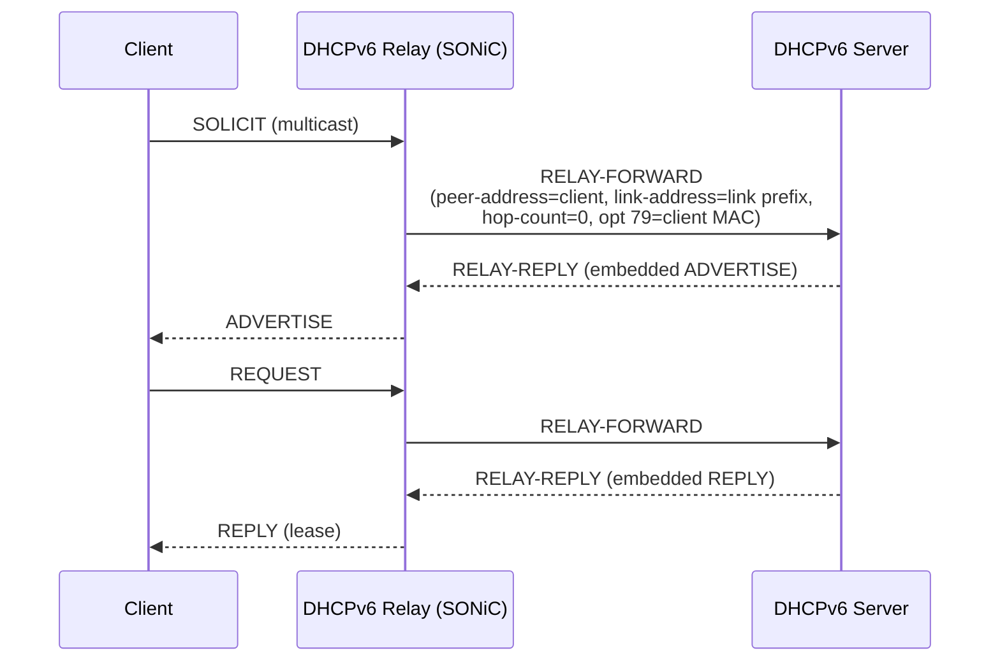

<!-- topics-tip -->
!!! tip "Topics で読み物として読む"
    この HLD は実装詳細を含みます。機能の概念・設定・運用を読み物として読みたい場合は [Topics 14 章: Platform / Port / Optics](../topics/14-platform-port-optics/index.md) を参照。
<!-- /topics-tip -->

!!! note "裏取りステータス: code-verified"
    `sonic-dhcp-relay/dhcp6relay/src/config_interface.cpp` で `DHCP_RELAY|<intf>` の `dhcpv6_servers` / `dhcpv6_option|rfc6939_support` 解釈、`dockers/docker-dhcp-relay/cli/clear/plugins/clear_dhcp_relay.py` で `DHCPV6_COUNTER_TABLE_PREFIX` と `sonic-clear dhcp6relay_counters` 定義、`dhcp6relay/src/{main.cpp, sender.h}` 等の存在を確認。dual ToR loopback / linkmgrd 連動 / CoPP 動的切替の細部は別 repo 追跡（要 follow-up）。

# DHCPv6 Relay Agent（Option 79 / dual ToR loopback）

## 読み手が知りたいこと

- なぜ DHCPv4 と同じ ISC dhcrelay を使わないのか
- Option 79 とは何で、なぜデフォルト on にするのか
- dual ToR 環境で何が問題になり、どう解決しているのか
- 設定変更は container 再起動なしで効くのか
- どんな counter が取れるのか

## 結論

DHCPv6 では [SONiC](../reference/glossary.md#term-sonic) 自前実装の relay daemon を使う[^1]。理由は (1) ISC が **Option 79 (RFC 6939, client link-layer address)** を未対応、(2) 設定変更で container 再起動が要る、の 2 点を解消するため。Option 79 は default on で、MAC ベース予約と multi-hop relay の MAC 伝搬を成立させる。dual ToR 用に **loopback 送信元 IP** オプションを追加する。

## 動作仕様

### Relay 動作シーケンス



hop-count > `HOP_COUNT_LIMIT` のメッセージは破棄。`link-address` には対応 link の global / site-scope address を入れ、server がどの subnet から割当てるかを判断する材料にする[^1]。

### DHCPv4 (ISC) との比較

| | DHCPv4 (ISC) | DHCPv6 (SONiC 自前) |
|---|--------------|--------------------|
| Option | 82 | **79 (RFC 6939)**、default on |
| 設定変更 | container 再起動 | [CONFIG_DB](../reference/glossary.md#term-config_db) 経由で動的反映 |
| dual ToR | 既存 | **loopback 送信元 IP** オプション |
| [CoPP](../reference/glossary.md#term-copp) | DHCPv4 trap | DHCPv6 enable 時のみ trap[^1] |

### CONFIG_DB / YANG

```text
DHCP|<intf>
  dhcpv6_servers                 = ["<server-ipv6>", ...]
  dhcpv6_option|rfc6939_support  = "true" | "false"   ; default true
```

[YANG](../reference/glossary.md#term-yang) は `sonic-dhcpv6-relay.yang`。`DHCP` コンテナ下の `VLAN_LIST` に `dhcpv6_servers`（`inet6:ip-address` list）と `rfc6939_support`（bool）を持つ[^1]。

### Option 79 の役割

relay agent が SOLICIT/REQUEST を受けた際の **L2 source MAC を Relay-Forward Option 79 に埋める**[^1]。これで server は DUID と独立に MAC を取れ、DUID-LL/LLT に依存しない MAC ベース予約が成立する。デフォルト on、CLI で無効化可。

### Dual ToR の送信元 IP

active/standby dual ToR で active が送った Relay-Forward の返答が **standby 側 ToR に着く** ことがある。[VLAN](../reference/glossary.md#term-vlan) SVI を src にすると応答先が自分宛と認識できないため、**loopback IP を src に固定するオプション** (`use-loopback-address`) を提供[^1]。peer ToR は loopback 宛の応答を見て相手 ToR へ forward する。

| 環境 | 送信元 IP |
|------|-----------|
| 通常 | VLAN SVI |
| dual ToR | Loopback（CLI で enable） |

### CoPP / RADV / Feature

- **CoPP**: DHCPv6 enable 時のみ DHCPv6 packet を CPU trap[^1]
- **RADV**: RA の `M` bit / `O` bit との整合を要求（DHCPv6 only vs SLAAC+DHCPv6 other-config）
- **Feature table**: 既存 DHCP relay container に同居、新規エントリ追加なし[^1]

### CLI / Counter

```bash
show dhcp6relay_counters
sonic-clear dhcprelay_counters
config dhcp6relay option79          enable|disable
config dhcp6relay use-loopback-address enable|disable
```

counter は SOLICIT / ADVERTISE / REQUEST / CONFIRM / RENEW / REBIND / REPLY / RELEASE / DECLINE / RELAY-FORWARD / RELAY-REPLY を per-interface で持つ[^1]。

<!-- evidence:
source: sonic-net/SONiC/doc/DHCPv6_relay/DHCPv6-relay-agent-High-Level-Design.md#L42-L45 (sha: 49bab5b5ff0e924f1ea52b3d9db0dfa4191a7c06)
excerpt: |
  Providing option 79 in DHCPv6 Relay-Forward messages will help carry the client link-layer address explicitly. ...
  ISC DHCP currently has no support for option 79.
reasoning: ISC 置換動機と Option 79 採用の根拠。
-->

<!-- evidence-rendered:start -->
??? note "📋 検証エビデンス: sonic-net/SONiC/doc/DHCPv6_relay/DHCPv6-relay-agent-High-Level-Design.md#L42-L45 (sha: 49bab5b5ff0e924f1ea52b3d9db0dfa4191a7c06)"

    **出典**:

    `sonic-net/SONiC/doc/DHCPv6_relay/DHCPv6-relay-agent-High-Level-Design.md#L42-L45 (sha: 49bab5b5ff0e924f1ea52b3d9db0dfa4191a7c06)`

    **抜粋**:

    ```text
    Providing option 79 in DHCPv6 Relay-Forward messages will help carry the client link-layer address explicitly. ...
    ISC DHCP currently has no support for option 79.
    ```

    **判断根拠**: ISC 置換動機と Option 79 採用の根拠。

<!-- evidence-rendered:end -->

## 制限事項

- DHCP packet 到着頻度は低く CPU 経由でも転送性能影響は小さいと想定[^1]
- hop-count > `HOP_COUNT_LIMIT` は破棄
- Option 79 は default on だが server 側未対応で互換性問題を起こすケースあり
- dual ToR の loopback src は active/standby 切替前提に依存

## 干渉する機能

- **DHCPv4 relay (ISC)**: 同 container 同居
- **dual ToR / mux**: loopback src は mux active/standby と連動
- **CoPP**: DHCPv6 trap 切替が CoPP manager と連動
- **RADV (radvd)**: M/O bit の整合要

## 確認コマンド

- `show dhcp6relay_counters interface <vlan>` — DHCPv6 メッセージ種別ごとの relay 統計
- `docker exec dhcp_relay supervisorctl status` — dhcp6relay プロセス・ISC dhcrelay の状態
- `sonic-db-cli CONFIG_DB hgetall "DHCP_RELAY|<vlan>"` — `dhcpv6_servers` / `rfc6939_support` 設定確認
- `tcpdump -ni Vlan1000 'udp port 547'` — Relay-Forward/Reply を直接観測

### コマンド例: DHCPv6 relay の確認

下記コマンドを順に実行することで、関連する CONFIG_DB / APP_DB / [STATE_DB](../reference/glossary.md#term-state_db) のエントリと、
CLI 表示・syslog の整合を一通り突き合わせ確認できる。

```bash
# DHCPv6 relay 設定と統計の確認
show dhcp6relay_counters interface
redis-cli -n 4 keys 'DHCP_RELAY|*'
redis-cli -n 6 keys 'DHCPv6_COUNTER_TABLE|*'
# dhcp-relay container のログ
docker logs dhcp_relay 2>&1 | tail -50
```

## 引用元

[^1]: `sonic-net/SONiC` `doc/DHCPv6_relay/DHCPv6-relay-agent-High-Level-Design.md` @ `49bab5b5ff0e924f1ea52b3d9db0dfa4191a7c06`

## 関連ページ

- [Architecture: DHCPv4 Relay Agent](dhcpv4-relay-agent.md)
- [Topic: NAT / DHCP / DNS](../topics/16-nat-dhcp-dns/index.md)
- [CLI: config-dhcp-relay](../reference/cli/config-dhcp-relay.md)

<!-- evidence (verifier-batch-18):
- sonic-dhcp-relay/dhcp6relay/src/config_interface.cpp: dhcpv6_servers / rfc6939_support 解釈
- docker-dhcp-relay/cli/clear/plugins/clear_dhcp_relay.py: DHCPV6_COUNTER_TABLE_PREFIX 定義
- dual ToR loopback / CoPP は sonic-linkmgrd / sonic-host-services で別途裏取り要
-->

<!-- topics-back-ref -->
## 関連 Topics

- [Topics: NAT / DHCP Relay / Time-DNS Services](../topics/16-nat-dhcp-dns/index.md)

<!-- /topics-back-ref -->

<!-- glossary-links-injected: 8ba32e5aa69d -->
