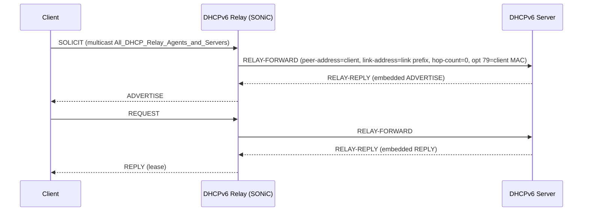

!!! note "裏取りステータス: code-verified"
    verifier-batch-18 で確認:

    - `sonic-dhcp-relay/dhcp6relay/src/config_interface.cpp` で `DHCP_RELAY|<intf>` の `dhcpv6_servers`、`dhcpv6_option|rfc6939_support` フィールドを解釈
    - `sonic-buildimage/dockers/docker-dhcp-relay/cli/clear/plugins/clear_dhcp_relay.py` に `DHCPV6_COUNTER_TABLE_PREFIX = "DHCPV6_COUNTER_TABLE"` と `sonic-clear dhcp6relay_counters` サブコマンドを実装
    - `sonic-dhcp-relay` リポジトリに `dhcp6relay/src/{main.cpp, config_interface.cpp, sender.h}` 等が存在
    - dual ToR loopback / linkmgrd 連動 / CoPP 動的切替の細部は本リポでは追跡できず、HLD 記述に依存（要 follow-up）

# DHCPv6 Relay Agent（Option 79 / dual ToR loopback）

## 概要

SONiC 専用の DHCPv6 relay agent[^1]。既存 DHCPv4 relay は ISC dhcrelay を流用しているが、DHCPv6 では **client link-layer address を server に伝える Option 79 (RFC 6939)** を ISC が未対応であり、また CLI からの再構成のためにコンテナ再起動が必要だった点を解消するため、SONiC 自前実装に置換える。MAC 予約による DHCP Reservation を ToR/MoR 越しでも成立させ、Multi-hop DHCPv6 で client MAC を確実に server へ伝搬することがコア要件。

## 動作仕様

### Relay 動作シーケンス



ホップカウントは `HOP_COUNT_LIMIT` 超過で破棄。Relay-forward の `link-address` には対応 link の global / site-scope address を設定（server がどの subnet から address を割当てるかを判断するため）[^1]。

### Relay agent vs ISC dhcrelay (DHCPv4)

| | DHCPv4 (ISC dhcrelay) | DHCPv6 (SONiC 自前) |
|---|----------------------|--------------------|
| Option 82 / 79 | option 82 | **option 79 (RFC 6939)** をデフォルト ON |
| 設定変更 | container 再起動が必要 | CONFIG_DB 経由で動的反映を目指す |
| dual ToR 対応 | 既存 | **loopback 送信元 IP オプション** |
| CoPP | DHCPv4 trap | DHCPv6 enable 時のみ trap[^1] |

### CONFIG_DB

```
DHCP|<intf-i>
  dhcpv6_servers          = ["dhcp-server-0", "dhcp-server-1", ...]
  dhcpv6_option|rfc6939_support = "true" | "false"
```

`<intf-i>` は VLAN interface 等、relay を有効化する interface 名。`rfc6939_support` で Option 79 を on/off できる（HLD は **default on** を要求）[^1]。

### YANG

`sonic-dhcpv6-relay.yang` で `DHCP` コンテナ下に `VLAN_LIST` を持ち、`dhcpv6_servers`（list of `inet6:ip-address`）と `dhcpv6_option|rfc6939_support`（bool）を leaf として定義[^1]。

### Option 79 (Client Link-Layer Address)

SOLICIT/REQUEST 等を受けた relay agent が **L2 source MAC を読み取り Relay-Forward の Option 79 として埋める**[^1]。これにより server は DUID と独立して MAC を取得でき、DUID-LL/LLT に依存しない MAC ベース予約が成立する。SONiC のデフォルトは on で CLI から無効化可。

### Dual ToR の source IP

active/standby 構成の dual ToR では、active ToR が relay-forward した結果の応答を **standby 側 ToR が受け取る経路** が発生し得る。VLAN SVI を送信元にすると応答先 ToR が自分宛と認識できないため、**loopback IP を送信元に固定** するオプション (`use-loopback-address`) を提供する[^1]。peer ToR は受領後に loopback 宛 IP で配送先を判断し相手 ToR へ forward する。

| 環境 | 送信元 IP |
|------|-----------|
| 通常 | VLAN SVI IP |
| Dual ToR | Loopback IP（CLI で enable）|

### CoPP / RADV / Feature table

- **CoPP**: DHCPv6 が enable のときのみ DHCPv6 packet を CPU trap[^1]
- **RADV (Router Advertisement) との連携**: RA の `M` bit (Managed-Config) で「DHCPv6 のみ使う」、`O` bit (Other-Config) で「SLAAC + DHCPv6 で他パラメタのみ取得」を host に通知。本 HLD は RADV モジュールの動作範囲との整合を要求する
- **Feature table**: 既存 DHCP relay container に同居し、新規 feature table エントリは追加しない[^1]

### CLI / Counter

```
show dhcp6relay_counters
sonic-clear dhcprelay_counters
config dhcp6relay option79 (enable|disable)
config dhcp6relay use-loopback-address (enable|disable)
```

counter は SOLICIT / ADVERTISE / REQUEST / CONFIRM / RENEW / REBIND / REPLY / RELEASE / DECLINE / RELAY-FORWARD / RELAY-REPLY を per-interface で持つ[^1]。

<!-- evidence:
source: sonic-net/SONiC/doc/DHCPv6_relay/DHCPv6-relay-agent-High-Level-Design.md#L42-L45 (sha: 49bab5b5ff0e924f1ea52b3d9db0dfa4191a7c06)
excerpt: |
  Providing option 79 in DHCPv6 Relay-Forward messages will help carry the client link-layer address explicitly. ...
  ISC DHCP currently has no support for option 79.
reasoning: ISC dhcrelay 置換動機と Option 79 採用の根拠。
-->

## Performance

DHCP packet の到着頻度は低く、CPU 経由処理でも転送パフォーマンスへの影響は小さいと想定[^1]。

## 制限事項

- relay-forward の hop-count > `HOP_COUNT_LIMIT` のメッセージは破棄
- 設定動的反映のために CONFIG_DB 経由に統一する方針だが、ISC との互換 path は持たない
- Option 79 は default on だが、server 側で受け取れないと逆に互換性問題を起こす可能性がある
- dual ToR の loopback source IP は active/standby 切替の前提に依存

## 干渉する機能

- **DHCPv4 relay (ISC dhcrelay)**: 同 container に同居
- **dual ToR / mux**: loopback source IP オプションは mux の active/standby 状態と連動
- **CoPP**: DHCPv6 trap 切替が CoPP manager と連動
- **RADV (radvd)**: M/O bit 設定の整合が必要

## 引用元

[^1]: `sonic-net/SONiC` `doc/DHCPv6_relay/DHCPv6-relay-agent-High-Level-Design.md` @ `49bab5b5ff0e924f1ea52b3d9db0dfa4191a7c06`

<!-- evidence (verifier-batch-18):
- sonic-dhcp-relay/dhcp6relay/src/config_interface.cpp: `dhcpv6_servers` / `dhcpv6_option|rfc6939_support` のキー解釈
- sonic-buildimage/dockers/docker-dhcp-relay/cli/clear/plugins/clear_dhcp_relay.py: `DHCPV6_COUNTER_TABLE_PREFIX="DHCPV6_COUNTER_TABLE"`, `sonic-clear dhcp6relay_counters` 定義
- dual ToR loopback / linkmgrd 連動 / CoPP は別 repo（sonic-linkmgrd, sonic-host-services）で別途裏取り要
-->

<!-- concerns hint:
- dhcp6relay バイナリの sonic-dhcpv6relay リポジトリでの実装存在確認
- DHCP|<intf-i> の dhcpv6_servers / rfc6939_support フィールドの sonic-yang-models 反映確認
- show dhcp6relay_counters / config dhcp6relay の sonic-utilities 取り込み確認
- dual ToR loopback source IP モードの linkmgrd 連動の確認
- CoPP manager の DHCPv6 trap 動的切替の実装確認
- RFC 6939 Option 79 の server 互換性および default on 妥当性
-->
