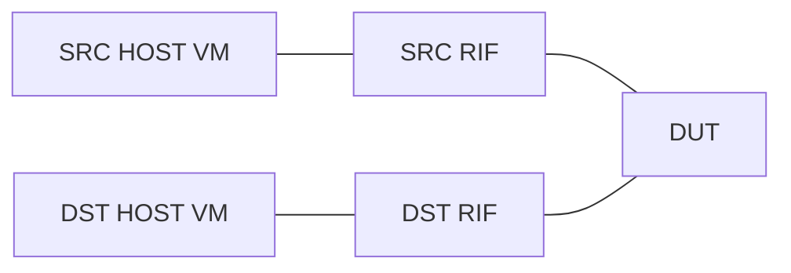

# DIP=SIP PTF 検証 概念

このページは [DIP=SIP PTF 検証（概要ハブ）](dip-sip-ptf-validation-high-level-design.md) の派生で、**テストの目的・トポロジ・対応 testbed** に絞って整理する。ファイル構成・前処理は [dip-sip-ptf-validation-high-level-design-operations.md](dip-sip-ptf-validation-high-level-design-operations.md)、パケット仕様 / 内部実装は [dip-sip-ptf-validation-high-level-design-internals.md](dip-sip-ptf-validation-high-level-design-internals.md)、制限と [HLD](../reference/glossary.md#term-hld) 乖離は [dip-sip-ptf-validation-high-level-design-limitations.md](dip-sip-ptf-validation-high-level-design-limitations.md) を参照。

## 1. テストの目的

「DIP（destination IP）と SIP（source IP）が同じ」L3 パケットを [SONiC](../reference/glossary.md#term-sonic) スイッチが正しくルーティングできるかを **PTF (Packet Test Framework) で検証** するテストの設計。一見奇妙な条件だが、ループバック検証や特定の DOS 系トラフィック形状への耐性、ハードウェアパスでの [ACL](../reference/glossary.md#term-acl) / RPF が誤作動しないかを担保する目的で必要となる[^1]。

このページは機能 [HLD](../reference/glossary.md#term-hld) ではなく **テストインフラの HLD**。SONiC 自体の挙動仕様というより、**`sonic-mgmt` リポジトリにどんな Ansible role / PTF スクリプトを置くか** の設計が記述されている[^1]。

## 2. トポロジ

DUT に対して **SRC [RIF](../reference/glossary.md#term-rif) / DST RIF** の 2 つの router interface を立て、それぞれの先に Source / Destination ホスト VM をぶら下げる単純な構成[^1]:



RIF は **PORT または [LAG](../reference/glossary.md#term-lag)** のいずれにも対応する[^1]。host は VM でエミュレートする。

## 3. 対応 testbed

`dip_sip.yml` のサポート topology[^1]:

- `t0`, `t0-16`, `t0-56`, `t0-64`, `t0-64-32`, `t0-116`
- `t1`, `t1-lag`, `t1-64-lag`

router が複数メンバ（LAG など）を持つ場合は **すべてのメンバ index を算出** する必要があるため、Ansible の前処理段階で minigraph / [LLDP](../reference/glossary.md#term-lldp) を見て port index 配列を作る[^1]。

## 4. 関連ページへの導線

- [dip-sip-ptf-validation-high-level-design.md](dip-sip-ptf-validation-high-level-design.md) — 概要ハブ
- [dip-sip-ptf-validation-high-level-design-operations.md](dip-sip-ptf-validation-high-level-design-operations.md) — ファイル構成 / 前処理 / 実行
- [dip-sip-ptf-validation-high-level-design-internals.md](dip-sip-ptf-validation-high-level-design-internals.md) — パケット仕様 / パラメータ
- [dip-sip-ptf-validation-high-level-design-limitations.md](dip-sip-ptf-validation-high-level-design-limitations.md) — 制限・HLD 乖離

## 引用元

[^1]: `sonic-net/SONiC` `doc/dip-sip/DIP=SIP_HLD.md` @ `49bab5b5ff0e924f1ea52b3d9db0dfa4191a7c06`

## 制限事項

!!! diff "HLD と実装の乖離"
    - HLD と実装の差分は本ページの章本文で逐次注記している
    - 追加の境界事項は本セクションで列挙する

## 確認コマンド

dip-sip-ptf concepts の動作確認に使う代表コマンド:

```bash
# 基本動作確認
show platform summary
show version
docker logs --tail 200 $(docker ps --format "{{.Names}}" | head -1)
```

<!-- glossary-links-injected: 8ba32e5aa69d -->
