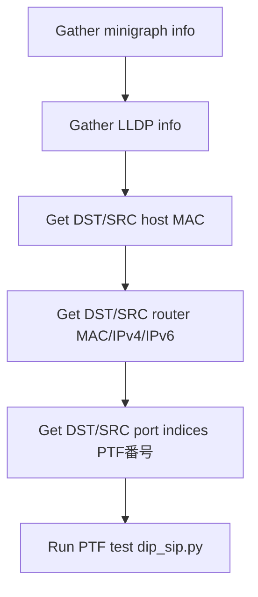

# DIP=SIP PTF 検証 運用

このページは [DIP=SIP PTF 検証（概要ハブ）](dip-sip-ptf-validation-high-level-design.md) の派生で、**ファイル構成・前処理ワークフロー・実行コマンド** に絞って整理する。テストの目的は [dip-sip-ptf-validation-high-level-design-concepts.md](dip-sip-ptf-validation-high-level-design-concepts.md)、パケット仕様は [dip-sip-ptf-validation-high-level-design-internals.md](dip-sip-ptf-validation-high-level-design-internals.md)、制限と [HLD](../reference/glossary.md#term-hld) 乖離は [dip-sip-ptf-validation-high-level-design-limitations.md](dip-sip-ptf-validation-high-level-design-limitations.md) を参照。

## 1. ファイル構成

`sonic-mgmt` 配下の配置（HLD 当時）[^1]:

```text
sonic-mgmt/ansible/
  roles/test/
    files/ptftests/dip_sip.py    # PTF コア
    tasks/dip_sip.yml            # 前処理 + 実行
    vars/testcases.yml           # testcase エントリ定義
```

役割[^1]:

| ファイル | 役割 |
|----------|------|
| `testcases.yml` | testcase のエントリポイント定義 |
| `dip_sip.yml` | アーティファクト収集と前処理。topology に応じた MAC / IPv4 / IPv6 / port indices の収集と PTF 起動 |
| `dip_sip.py` | PTF コアロジック。UDP パケットの組立て・送受信 |

> 現行 master では本体ロジックは `sonic-mgmt/tests/ipfwd/test_dip_sip.py` (pytest 形式) に移行している。詳細は [dip-sip-ptf-validation-high-level-design-limitations.md](dip-sip-ptf-validation-high-level-design-limitations.md) の差分参照。

## 2. dip_sip.yml の前処理ワークフロー



router type が [LAG](../reference/glossary.md#term-lag) 等で複数 member を持つ場合は、E で **配列** として port index を集める[^1]。

## 3. 実行コマンド

該当 CLI は無い。実行は Ansible から行う[^1]:

```bash
sudo -H ansible-playbook test_sonic.yml -i inventory \
     --limit arc-switch1025-t0 \
     -e testbed_name=arc-switch1025-t0 \
     -e testbed_type=t0 \
     -e testcase_name=dip_sip -vvvvv
```

ログ出力は `/tmp/dip_sip.DipSipTest.<timestamp>.log`[^1]。

現行 (pytest 移行後) は以下でも実行可能:

```bash
cd sonic-mgmt/tests && \
  pytest ipfwd/test_dip_sip.py --topology=t0 --testbed=<tb>
```

## 4. 確認コマンド

```bash
# PTF テストイメージとトポロジ
ls .cache/sonic-sources/sonic-mgmt/ansible/group_vars/ | head
docker images | grep -i ptf

# PTF runner の起動例 (sonic-mgmt 配下、collect-only でテスト適用範囲を確認)
cd .cache/sonic-sources/sonic-mgmt/tests && \
  pytest --inventory=../ansible/veos --testbed=vms-kvm-t0 \
         --testbed_file=../ansible/testbed.yaml \
         ipfwd/test_dip_sip.py --collect-only

# PTF テスト走行ログ
sudo journalctl -u ptf -n 200 --no-pager
```

## 5. 設定

### 関連する CONFIG_DB

該当エントリは無い。本機能は **テストインフラ** であり DUT 側の設定変更は伴わない（既存の [RIF](../reference/glossary.md#term-rif) を使うのみ）。

### 関連する CLI

該当 CLI は無い。実行は上記の Ansible / pytest 経由。

## 6. 関連ページへの導線

- [dip-sip-ptf-validation-high-level-design.md](dip-sip-ptf-validation-high-level-design.md) — 概要ハブ
- [dip-sip-ptf-validation-high-level-design-concepts.md](dip-sip-ptf-validation-high-level-design-concepts.md) — 概念
- [dip-sip-ptf-validation-high-level-design-internals.md](dip-sip-ptf-validation-high-level-design-internals.md) — パケット仕様
- [dip-sip-ptf-validation-high-level-design-limitations.md](dip-sip-ptf-validation-high-level-design-limitations.md) — 制限・HLD 乖離

## 実装との乖離

`monitor: evolved_beyond_hld` の HLD と実装の差分。 本ページは split-child のため、差分の主要根拠 / 影響 / 回避策は親ページ [DIP=SIP PTF 検証 運用 親ページ](dip-sip-ptf-validation-high-level-design.md) の同セクション（`## 実装との乖離` または `!!! diff` ブロック）を参照のこと。

## 引用元

[^1]: `sonic-net/SONiC` `doc/dip-sip/DIP=SIP_HLD.md` @ `49bab5b5ff0e924f1ea52b3d9db0dfa4191a7c06`

<!-- glossary-links-injected: 0ffb8e51f432 -->

## 制限事項

!!! diff "HLD と実装の乖離"
    - HLD と実装の差分は本ページの章本文で逐次注記している
    - 追加の境界事項は本セクションで列挙する

## 確認コマンド

dip-sip-ptf operations の動作確認に使う代表コマンド:

```bash
# 基本動作確認
show platform summary
show version
docker logs --tail 200 $(docker ps --format "{{.Names}}" | head -1)
```

