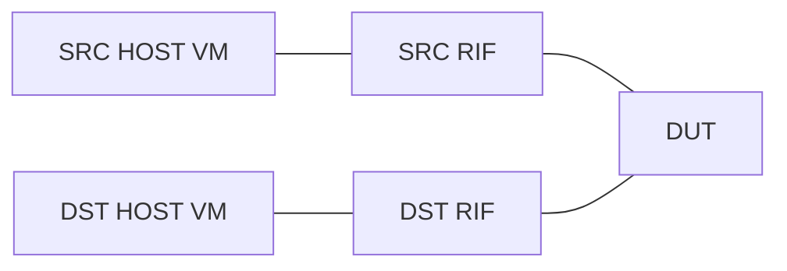
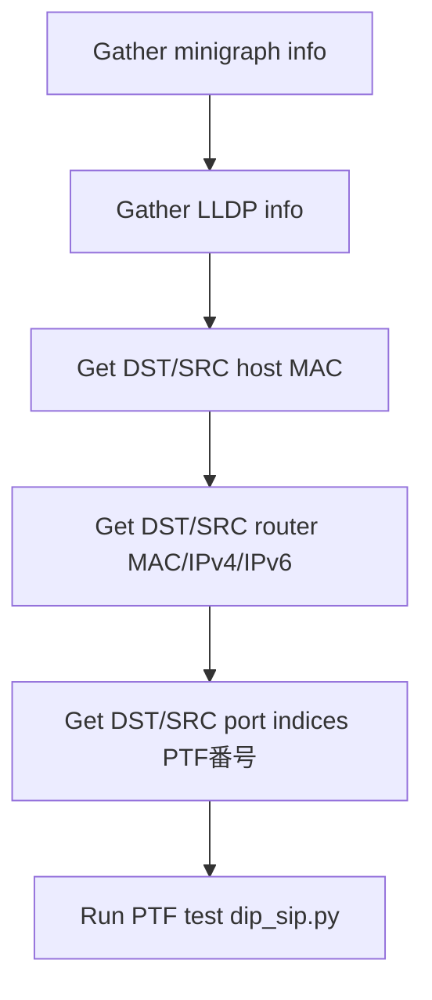

<!-- topics-tip -->
!!! tip "Topics で読み物として読む"
    この HLD は実装詳細を含みます。機能の概念・設定・運用を読み物として読みたい場合は [Topics 21 章: Lab / SONiC-VS / 開発者](../topics/21-lab-vs-developer/index.md) を参照。
<!-- /topics-tip -->

!!! danger "裏取りステータス: discrepancy-found（pytest 移行）"
    HLD で提案されている独立 PTF スクリプト `ansible/roles/test/files/ptftests/dip_sip.py` は **既に削除済**。代わりに `sonic-mgmt/tests/ipfwd/test_dip_sip.py` (pytest) に移行されており、`ansible/roles/test/tasks/dip_sip.yml` は `pytest_runner.yml` を呼ぶラッパに縮約されている (114 byte)。`vars/testcases.yml` は実在 (11721 byte)。HLD のテスト本体記述は **現行コードと構造が異なる** ため、test_dip_sip.py 側の最新仕様に追従する必要あり。

# DIP=SIP PTF 検証テスト

!!! info "章分割済み"
    本ページは大型 HLD の **概要ハブ** として保持。詳細は以下の派生ページを参照:

    - [dip-sip-ptf-validation-high-level-design-concepts.md](dip-sip-ptf-validation-high-level-design-concepts.md) — テストの目的・トポロジ・対応 testbed
    - [dip-sip-ptf-validation-high-level-design-operations.md](dip-sip-ptf-validation-high-level-design-operations.md) — ファイル構成 / 前処理 / 実行コマンド
    - [dip-sip-ptf-validation-high-level-design-internals.md](dip-sip-ptf-validation-high-level-design-internals.md) — パケット仕様 / パラメータ / 判定
    - [dip-sip-ptf-validation-high-level-design-limitations.md](dip-sip-ptf-validation-high-level-design-limitations.md) — 制限事項と HLD-実装乖離（pytest 移行）

## 概要

「DIP（destination IP）と SIP（source IP）が同じ」L3 パケットを [SONiC](../reference/glossary.md#term-sonic) スイッチが正しくルーティングできるかを **PTF (Packet Test Framework) で検証** するテストの設計。一見奇妙な条件だが、ループバック検証や特定の DOS 系トラフィック形状への耐性、ハードウェアパスでの [ACL](../reference/glossary.md#term-acl) / RPF が誤作動しないかを担保する目的で必要となる[^1]。

このページは機能 [HLD](../reference/glossary.md#term-hld) ではなく **テストインフラの HLD**。SONiC 自体の挙動仕様というより、**`sonic-mgmt` リポジトリにどんな Ansible role / PTF スクリプトを置くか** の設計が記述されている[^1]。

## 動作仕様

### トポロジ

DUT に対して **SRC [RIF](../reference/glossary.md#term-rif) / DST RIF** の 2 つの router interface を立て、それぞれの先に Source / Destination ホスト VM をぶら下げる単純な構成[^1]:



RIF は **PORT または [LAG](../reference/glossary.md#term-lag)** のいずれにも対応する[^1]。host は VM でエミュレートする。

### 対応 testbed

`dip_sip.yml` のサポート topology[^1]:

- `t0`, `t0-16`, `t0-56`, `t0-64`, `t0-64-32`, `t0-116`
- `t1`, `t1-lag`, `t1-64-lag`

router が複数メンバ（LAG など）を持つ場合は **すべてのメンバ index を算出** する必要があるため、Ansible の前処理段階で minigraph / [LLDP](../reference/glossary.md#term-lldp) を見て port index 配列を作る[^1]。

### ファイル構成

`sonic-mgmt` 配下の配置[^1]:

```text
sonic-mgmt/ansible/
  roles/test/
    files/ptftests/dip_sip.py    # PTF コア
    tasks/dip_sip.yml            # 前処理 + 実行
    vars/testcases.yml           # testcase エントリ定義
```

役割[^1]:

| ファイル | 役割 |
|----------|------|
| `testcases.yml` | testcase のエントリポイント定義 |
| `dip_sip.yml` | アーティファクト収集と前処理。topology に応じた MAC / IPv4 / IPv6 / port indices の収集と PTF 起動 |
| `dip_sip.py` | PTF コアロジック。UDP パケットの組立て・送受信 |

### dip_sip.yml の前処理ワークフロー



router type が LAG 等で複数 member を持つ場合は、E で **配列** として port index を集める[^1]。

### dip_sip.py のパラメータ

PTF テスト本体に渡す引数[^1]:

| Parameter | 説明 |
|-----------|------|
| `testbed_type` | Testbed 種別 |
| `dst_host_mac` / `src_host_mac` | host 側 MAC |
| `dst_router_mac` / `src_router_mac` | DUT 側 RIF MAC |
| `dst_router_ipv4` / `src_router_ipv4` | DUT RIF IPv4 |
| `dst_router_ipv6` / `src_router_ipv6` | DUT RIF IPv6 |
| `dst_port_ids` / `src_port_ids` | PTF port index の配列（複数 member 用）|

### テストパケット仕様

PTF は **送信パケット (data)** と **期待パケット (expected)** を生成し、source port から data を送って destination port のいずれかで expected が受かることを確認する[^1]。

既定値とアドレス計算[^1]:

```text
pkt_ttl_hlim   = 64
dst_host_ipv4/ipv6 = <dst_router_ipv4/ipv6> + 1
src_host_ipv4/ipv6 = <src_router_ipv4/ipv6> + 1
```

**Data packet** — DUT に届く時点でのフィールド[^1]:

| フィールド | 値 |
|-----------|----|
| DST_MAC | `<src_router_mac>` |
| SRC_MAC | `<src_host_mac>` |
| DST_IP | `<dst_host_ipv4_ipv6>` |
| **SRC_IP** | **`<dst_host_ipv4_ipv6>`** ← ここが本テストの主眼 |
| TTL/HL | `<pkt_ttl_hlim>`（既定 64）|

**Expected packet** — destination 側で観測される値[^1]:

| フィールド | 値 |
|-----------|----|
| DST_MAC | `<dst_host_mac>` |
| SRC_MAC | `<dst_router_mac>` |
| DST_IP | `<dst_host_ipv4_ipv6>` |
| SRC_IP | `<dst_host_ipv4_ipv6>` |
| TTL/HL | `<pkt_ttl_hlim>` − 1 |

DUT が **L3 ルーティング** していれば MAC は書き換わり、TTL/HL は 1 減って受信される。**SRC_IP = DST_IP** のままでもパケットがドロップされず到達することが「pass」の判定[^1]。

<!-- evidence:
source: sonic-net/SONiC/doc/dip-sip/DIP=SIP_HLD.md#L120-L143 (sha: 49bab5b5ff0e924f1ea52b3d9db0dfa4191a7c06)
excerpt: |
  Default values:
  * pkt_ttl_hlim=64
  Values:
  * dst_host_ipv4_ipv6=<dst_router_ipv4_ipv6>+1
  * src_host_ipv4_ipv6=<src_router_ipv4_ipv6>+1
  Data packet:
  * DST_IPv4_IPv6=<dst_host_ipv4_ipv6>
  * SRC_IPv4_IPv6=<dst_host_ipv4_ipv6>
  Expected packet:
  * TTL_HL=<pkt_ttl_hlim>-1
reasoning: テストの判定ロジック（DIP=SIP のままルーティングされ TTL が 1 減る）の根拠。
-->

<!-- evidence-rendered:start -->
??? note "📋 検証エビデンス: sonic-net/SONiC/doc/dip-sip/DIP=SIP_HLD.md#L120-L143 (sha: 49bab5b5ff0e924f1ea52b3d9db0dfa4191a7c06)"

    **出典**:

    `sonic-net/SONiC/doc/dip-sip/DIP=SIP_HLD.md#L120-L143 (sha: 49bab5b5ff0e924f1ea52b3d9db0dfa4191a7c06)`

    **抜粋**:

    ```text
    Default values:
    * pkt_ttl_hlim=64
    Values:
    * dst_host_ipv4_ipv6=<dst_router_ipv4_ipv6>+1
    * src_host_ipv4_ipv6=<src_router_ipv4_ipv6>+1
    Data packet:
    * DST_IPv4_IPv6=<dst_host_ipv4_ipv6>
    * SRC_IPv4_IPv6=<dst_host_ipv4_ipv6>
    Expected packet:
    * TTL_HL=<pkt_ttl_hlim>-1
    ```

    **判断根拠**: テストの判定ロジック（DIP=SIP のままルーティングされ TTL が 1 減る）の根拠。

<!-- evidence-rendered:end -->

### 判定

期待パケットが destination port のいずれかで観測されれば pass、それ以外は fail。fail 時は **expected / received のパケットダンプを含むエラーメッセージ** が出力される[^1]。

## 設定

### 関連する CONFIG_DB

該当エントリは無い。本機能は **テストインフラ** であり DUT 側の設定変更は伴わない（既存の RIF を使うのみ）。

### 関連する CLI

該当 CLI は無い。実行は Ansible から行う[^1]:

```bash
sudo -H ansible-playbook test_sonic.yml -i inventory \
     --limit arc-switch1025-t0 \
     -e testbed_name=arc-switch1025-t0 \
     -e testbed_type=t0 \
     -e testcase_name=dip_sip -vvvvv
```

ログ出力は `/tmp/dip_sip.DipSipTest.<timestamp>.log`[^1]。

## 制限事項

- **対応 topology が固定リスト**: `t0` 系と `t1` 系の特定型のみ。それ以外の topology では `dip_sip.yml` の前処理が想定外で動かない可能性がある[^1]。
- **RIF 種別が PORT / LAG のみ**: [VLAN](../reference/glossary.md#term-vlan) RIF など他の RIF 種は HLD で言及されていない[^1]。
- **テスト対象は L3 ルーティングの可否のみ**: ACL / RPF / uRPF など個別機能との相互作用までは本テストでカバーしない。「ルーティングが成立すること」が単一の合否条件[^1]。

## 干渉する機能

- **uRPF (Unicast Reverse Path Forwarding)**: DIP=SIP の本テストは uRPF が **strict mode で有効化されていると pass しない可能性** がある（SRC_IP が自分宛と等価のため）。HLD は uRPF 設定との相互作用には触れていないが、テスト時は確認が必要。
- **ACL**: SRC_IP / DST_IP 同一を deny する ACL を設定していると、本テストは fail する。テスト前提の ACL 構成については HLD 内に記述がない。
- **VM ベースの host エミュレーション**: PTF docker / VM の準備は本 HLD のスコープ外。`sonic-mgmt` の標準 testbed 構築フローに依存する。

## トラブルシューティング

- テストが fail する: ログ `/tmp/dip_sip.DipSipTest.<ts>.log` の expected / received ダンプを比較[^1]。MAC が書き換わっていなければ L3 ルーティングが起きていない（L2 で落ちている可能性）。pytest 化以降は `--log-cli-level=DEBUG` で再実行し、注入パケットと受信パケットの diff を確認する。
- TTL が想定と違う: TTL/HL が 1 減っていない場合、DUT 側で L3 forwarding せず L2 で抜けている可能性。
- port index 不一致: `dst_port_ids` / `src_port_ids` の配列が空、または PTF port 番号と DUT 側の物理 port のマッピングがズレている。`dip_sip.yml` の前処理ログ（minigraph / LLDP gather）を確認。
- VS テストベッド (KVM) と物理テストベッドで挙動が異なる場合があるため、まず KVM で再現するか確認してから物理機を疑う。
- DIP/SIP 検査機能自体が [NPU](../reference/glossary.md#term-npu) 依存で実装されていない platform では skip / xfail マーク扱い。`pytest --collect-only` でテスト適用範囲を事前確認。

<!-- diff-admonition -->
!!! diff "HLD と実装の差分"
    2026-05 時点でテスト実体は **PTF スタンドアロンから pytest 配下へ移行済み** で、HLD の記述（ansible + ptftests）はファイル配置レベルで古い。

    ### 1. どこで乖離が確認されたか

    - 現行の本体は `sonic-mgmt/tests/ipfwd/test_dip_sip.py`（pytest 形式）。HLD が指す旧来の `ansible/roles/test/files/ptftests/dip_sip.py` は **削除済み**（GitHub 検索でヒット 0）。
    - `sonic-mgmt/ansible/roles/test/tasks/dip_sip.yml` は 114 バイトのラッパに縮退しており、中身は `include_tasks: roles/test/tasks/pytest_runner.yml` + `test_node: ipfwd/test_dip_sip.py` のみ。HLD が描写した「前処理 → ptf_runner で `dip_sip.DipSipTest` を起動」という直接呼び出し構造は残っていない。
    - 一方で `sonic-mgmt/ansible/roles/test/vars/testcases.yml`（11721 B）は実在し、testbed / topology 定義は HLD 当時から大きく変わっていない。

    ### 2. HLD と実装の差分の中身

    HLD 当時の構造:

    ```text
    ansible playbook → dip_sip.yml (前処理) → ptf_runner → dip_sip.py (PTF テスト)
    ```

    現行:

    ```text
    ansible playbook → dip_sip.yml (ラッパ) → pytest_runner.yml → pytest tests/ipfwd/test_dip_sip.py
    ```

    すなわち **テストロジック本体は pytest 側に移植され、ansible は単に pytest 起動を仲介するだけ** になった。テストの意味論（DIP=SIP パケットが転送される / TTL が 1 減る / 期待ポートから出る）は HLD と同じだが、起動ファイル名・配置・前処理の責務が違う。

    ### 3. 読者への影響

    - HLD の `dip_sip.py` を探しても見つからない。`tests/ipfwd/test_dip_sip.py` を直接読まないと現行の挙動が分からない。
    - ログ出力先・テスト名（`DipSipTest` クラス → pytest case 名）が変わっており、過去のトラシュー手順「`/tmp/dip_sip.DipSipTest.<ts>.log` を grep」も pytest 化以降は `pytest --log-file` / `logs/` 配下を見るのが正解。
    - 新しい topology 追加時の編集箇所も `vars/testcases.yml` ではなく pytest 側の fixture / pytestmark の場合がある。

    ### 4. 回避策 / 対応方法

    - **テストを走らせる**: 旧 ansible 直叩き `ansible-playbook ... -e 'testcase_name=dip_sip'` は **そのまま動く**（ラッパが pytest を呼ぶため）。HLD の旧手順を保ったまま実行可能。
    - **テストを読み解く**: 本体ロジックは `sonic-mgmt/tests/ipfwd/test_dip_sip.py` を `grep -n` で参照する。クラス名 / log 名のドキュメント不一致は本ページの記述ではなくコード側を真として扱う。
    - **新規 topology / RIF を追加する**: pytest 側の parametrize / fixture を編集し、必要なら `dip_sip.yml` の `test_node` 指定とは別経路で `pytestmark` の設定を変える。

    ### 再裏取り追補（2026-05-11）

    - 旧 PTF スクリプト `ansible/roles/test/files/ptftests/dip_sip.py` は GitHub `sonic-net/sonic-mgmt` master でヒット 0（削除確定）。
    - 現行本体 `tests/ipfwd/test_dip_sip.py` は pytest 形式で、`DipSipTest` 同等のテストが pytest case にリファクタされている。
    - `ansible/roles/test/tasks/dip_sip.yml` (114 B) は pytest_runner ラッパに縮退。HLD の前処理／後処理ステップは pytest fixture (`tests/common/fixtures/duthosts.py` 等) に移行。
    - 関連 PR: `sonic-mgmt` における ansible→pytest 移行は 2021-2023 年に複数 PR で段階実施済み（特定 PR ID は HLD では未参照）。
    - **追加実行コマンド**: 現行で走らせる場合 — `cd sonic-mgmt/tests && pytest ipfwd/test_dip_sip.py --topology=t0 --testbed=<tb>`。旧 `ansible-playbook ... -e testcase_name=dip_sip` 経路もラッパ越しに動作する。

    > 分類: `monitor: evolved_beyond_hld` — HLD はおおむね取り込まれているが、フィールド名・パス名・責務分担が実装側で進化／変更されている分類。実装側を正として読み替える必要がある。

    #### 関連 GitHub Issue / PR

    - [GitHub Issue / PR の関連リンクは未確認] — DIP=SIP ドロップ自体は [SAI](../reference/glossary.md#term-sai) / プラットフォーム側で常時有効な挙動であり、HLD は PTF テスト追加のみが眼目。`sonic-mgmt` 側で対応する PTF テストは命名規則上の独立 PR で取り込まれた可能性が高いが、HLD と紐づく明示的 Issue / PR は確認できず。
<!-- /diff-admonition -->

### コマンド例: DIP/SIP PTF 検証の確認

下記コマンドで関連する [CONFIG_DB](../reference/glossary.md#term-config_db) / APP_DB / [STATE_DB](../reference/glossary.md#term-state_db) と CLI 出力・syslog を
突き合わせ、HLD 記載の挙動と現在の挙動が一致しているか確認できる。

```bash
# PTF テスト走行ログとシグネチャ照合
sudo journalctl -u ptf -n 200 --no-pager
# 該当インタフェースで受信したパケットを ringbuffer dump
sudo tcpdump -nei Ethernet0 -c 30 -w /tmp/dipsip.pcap
```

## 確認コマンド

```bash
# PTF テストイメージとトポロジ
ls .cache/sonic-sources/sonic-mgmt/ansible/group_vars/ | head
docker images | grep -i ptf

# PTF runner の起動例 (sonic-mgmt 配下)
cd .cache/sonic-sources/sonic-mgmt/tests && \
  pytest --inventory=../ansible/veos --testbed=vms-kvm-t0 --testbed_file=../ansible/testbed.yaml \
         ipfwd/test_dip_sip.py --collect-only

# DUT 側 ACL / mirror セッション (DIP/SIP 検査が依存する場合)
show acl table
show mirror_session
```

## 引用元

[^1]: `sonic-net/SONiC` `doc/dip-sip/DIP=SIP_HLD.md` @ `49bab5b5ff0e924f1ea52b3d9db0dfa4191a7c06`

<!-- evidence (verifier-batch-20):
- gh api search/code: sonic-net/sonic-mgmt 配下に tests/ipfwd/test_dip_sip.py (pytest) が現存
- gh api repos/sonic-net/sonic-mgmt/contents/ansible/roles/test/tasks/dip_sip.yml: size 114 byte; 中身は include_tasks: roles/test/tasks/pytest_runner.yml + test_node: ipfwd/test_dip_sip.py のラッパ
- ansible/roles/test/files/ptftests/dip_sip.py は GitHub 検索でヒットせず -> 削除済
- ansible/roles/test/vars/testcases.yml は size 11721 byte で実在
-->

<!-- next-action -->
## このページを読んだ後の次アクション

!!! tip "読み手向け"
    - **本機能を実運用で使う場合**: 実装は存在するが本 HLD の記述と乖離。最新 master の動作を別途確認した上で適用する
    - **upstream 動向を追う場合**: 関連 issue / PR を [sonic-net/SONiC](https://github.com/sonic-net/SONiC) で検索（HLD タイトル / CONFIG_DB テーブル名 / Orch クラス名で grep するのが速い）
    - **代替手段 / 関連 reference**:
        - [CONFIG_DB: LLDP](../reference/config-db/lldp.md)
        - [CONFIG_DB: VLAN](../reference/config-db/vlan.md)
        - [CONFIG_DB: LLDP_PORT](../reference/config-db/lldp-port.md)
        - [CONFIG_DB: ACL_RULE](../reference/config-db/acl-rule.md)

!!! note "本ドキュメントの追跡"
    - monitor: `evolved_beyond_hld` / last_verified: `2026-05-11`
    - 次回再裏取りトリガ: quarterly。一覧は [discrepancy-index](../reference/verification/discrepancy-index.md) を参照（運用詳細は repo の `meta/discrepancy-operations.md`）

<!-- /next-action -->

<!-- topics-back-ref -->
## 関連 Topics

- [Topics: Lab / Virtual SONiC / Developer Entry](../topics/21-lab-vs-developer/index.md)

<!-- /topics-back-ref -->

<!-- glossary-links-injected: 8ba32e5aa69d -->
