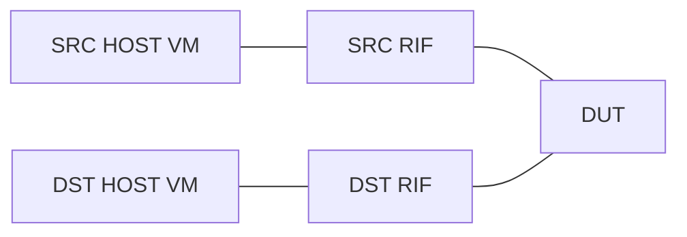
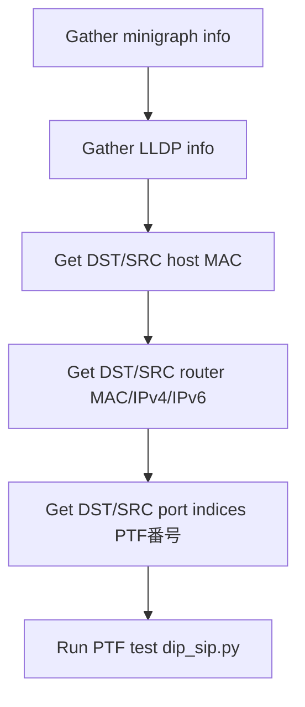

!!! warning "裏取りステータス: HLD-only"
    このページは公式 HLD のみを根拠にしている。`sonic-mgmt` の `ansible/roles/test/files/ptftests/dip_sip.py` / `tasks/dip_sip.yml` / `vars/testcases.yml` の現存と本 HLD 記載内容との一致は未裏取り。

# DIP=SIP PTF 検証テスト

## 概要

「DIP（destination IP）と SIP（source IP）が同じ」L3 パケットを SONiC スイッチが正しくルーティングできるかを **PTF (Packet Test Framework) で検証** するテストの設計。一見奇妙な条件だが、ループバック検証や特定の DOS 系トラフィック形状への耐性、ハードウェアパスでの ACL / RPF が誤作動しないかを担保する目的で必要となる[^1]。

このページは機能 HLD ではなく **テストインフラの HLD**。SONiC 自体の挙動仕様というより、**`sonic-mgmt` リポジトリにどんな Ansible role / PTF スクリプトを置くか** の設計が記述されている[^1]。

## 動作仕様

### トポロジ

DUT に対して **SRC RIF / DST RIF** の 2 つの router interface を立て、それぞれの先に Source / Destination ホスト VM をぶら下げる単純な構成[^1]:



RIF は **PORT または LAG** のいずれにも対応する[^1]。host は VM でエミュレートする。

### 対応 testbed

`dip_sip.yml` のサポート topology[^1]:

- `t0`, `t0-16`, `t0-56`, `t0-64`, `t0-64-32`, `t0-116`
- `t1`, `t1-lag`, `t1-64-lag`

router が複数メンバ（LAG など）を持つ場合は **すべてのメンバ index を算出** する必要があるため、Ansible の前処理段階で minigraph / LLDP を見て port index 配列を作る[^1]。

### ファイル構成

`sonic-mgmt` 配下の配置[^1]:

```text
sonic-mgmt/ansible/
  roles/test/
    files/ptftests/dip_sip.py    # PTF コア
    tasks/dip_sip.yml            # 前処理 + 実行
    vars/testcases.yml           # testcase エントリ定義
```

役割[^1]:

| ファイル | 役割 |
|----------|------|
| `testcases.yml` | testcase のエントリポイント定義 |
| `dip_sip.yml` | アーティファクト収集と前処理。topology に応じた MAC / IPv4 / IPv6 / port indices の収集と PTF 起動 |
| `dip_sip.py` | PTF コアロジック。UDP パケットの組立て・送受信 |

### dip_sip.yml の前処理ワークフロー



router type が LAG 等で複数 member を持つ場合は、E で **配列** として port index を集める[^1]。

### dip_sip.py のパラメータ

PTF テスト本体に渡す引数[^1]:

| Parameter | 説明 |
|-----------|------|
| `testbed_type` | Testbed 種別 |
| `dst_host_mac` / `src_host_mac` | host 側 MAC |
| `dst_router_mac` / `src_router_mac` | DUT 側 RIF MAC |
| `dst_router_ipv4` / `src_router_ipv4` | DUT RIF IPv4 |
| `dst_router_ipv6` / `src_router_ipv6` | DUT RIF IPv6 |
| `dst_port_ids` / `src_port_ids` | PTF port index の配列（複数 member 用）|

### テストパケット仕様

PTF は **送信パケット (data)** と **期待パケット (expected)** を生成し、source port から data を送って destination port のいずれかで expected が受かることを確認する[^1]。

既定値とアドレス計算[^1]:

```text
pkt_ttl_hlim   = 64
dst_host_ipv4/ipv6 = <dst_router_ipv4/ipv6> + 1
src_host_ipv4/ipv6 = <src_router_ipv4/ipv6> + 1
```

**Data packet** — DUT に届く時点でのフィールド[^1]:

| フィールド | 値 |
|-----------|----|
| DST_MAC | `<src_router_mac>` |
| SRC_MAC | `<src_host_mac>` |
| DST_IP | `<dst_host_ipv4_ipv6>` |
| **SRC_IP** | **`<dst_host_ipv4_ipv6>`** ← ここが本テストの主眼 |
| TTL/HL | `<pkt_ttl_hlim>`（既定 64）|

**Expected packet** — destination 側で観測される値[^1]:

| フィールド | 値 |
|-----------|----|
| DST_MAC | `<dst_host_mac>` |
| SRC_MAC | `<dst_router_mac>` |
| DST_IP | `<dst_host_ipv4_ipv6>` |
| SRC_IP | `<dst_host_ipv4_ipv6>` |
| TTL/HL | `<pkt_ttl_hlim>` − 1 |

DUT が **L3 ルーティング** していれば MAC は書き換わり、TTL/HL は 1 減って受信される。**SRC_IP = DST_IP** のままでもパケットがドロップされず到達することが「pass」の判定[^1]。

<!-- evidence:
source: sonic-net/SONiC/doc/dip-sip/DIP=SIP_HLD.md#L120-L143 (sha: 49bab5b5ff0e924f1ea52b3d9db0dfa4191a7c06)
excerpt: |
  Default values:
  * pkt_ttl_hlim=64
  Values:
  * dst_host_ipv4_ipv6=<dst_router_ipv4_ipv6>+1
  * src_host_ipv4_ipv6=<src_router_ipv4_ipv6>+1
  Data packet:
  * DST_IPv4_IPv6=<dst_host_ipv4_ipv6>
  * SRC_IPv4_IPv6=<dst_host_ipv4_ipv6>
  Expected packet:
  * TTL_HL=<pkt_ttl_hlim>-1
reasoning: テストの判定ロジック（DIP=SIP のままルーティングされ TTL が 1 減る）の根拠。
-->

### 判定

期待パケットが destination port のいずれかで観測されれば pass、それ以外は fail。fail 時は **expected / received のパケットダンプを含むエラーメッセージ** が出力される[^1]。

## 設定

### 関連する CONFIG_DB

該当エントリは無い。本機能は **テストインフラ** であり DUT 側の設定変更は伴わない（既存の RIF を使うのみ）。

### 関連する CLI

該当 CLI は無い。実行は Ansible から行う[^1]:

```bash
sudo -H ansible-playbook test_sonic.yml -i inventory \
     --limit arc-switch1025-t0 \
     -e testbed_name=arc-switch1025-t0 \
     -e testbed_type=t0 \
     -e testcase_name=dip_sip -vvvvv
```

ログ出力は `/tmp/dip_sip.DipSipTest.<timestamp>.log`[^1]。

## 制限事項

- **対応 topology が固定リスト**: `t0` 系と `t1` 系の特定型のみ。それ以外の topology では `dip_sip.yml` の前処理が想定外で動かない可能性がある[^1]。
- **RIF 種別が PORT / LAG のみ**: VLAN RIF など他の RIF 種は HLD で言及されていない[^1]。
- **テスト対象は L3 ルーティングの可否のみ**: ACL / RPF / uRPF など個別機能との相互作用までは本テストでカバーしない。「ルーティングが成立すること」が単一の合否条件[^1]。

## 干渉する機能

- **uRPF (Unicast Reverse Path Forwarding)**: DIP=SIP の本テストは uRPF が **strict mode で有効化されていると pass しない可能性** がある（SRC_IP が自分宛と等価のため）。HLD は uRPF 設定との相互作用には触れていないが、テスト時は確認が必要。
- **ACL**: SRC_IP / DST_IP 同一を deny する ACL を設定していると、本テストは fail する。テスト前提の ACL 構成については HLD 内に記述がない。
- **VM ベースの host エミュレーション**: PTF docker / VM の準備は本 HLD のスコープ外。`sonic-mgmt` の標準 testbed 構築フローに依存する。

## トラブルシューティング

- テストが fail する: ログ `/tmp/dip_sip.DipSipTest.<ts>.log` の expected / received ダンプを比較[^1]。MAC が書き換わっていなければ L3 ルーティングが起きていない（L2 で落ちている可能性）。
- TTL が想定と違う: TTL/HL が 1 減っていない場合、DUT 側で L3 forwarding せず L2 で抜けている可能性。
- port index 不一致: `dst_port_ids` / `src_port_ids` の配列が空、または PTF port 番号と DUT 側の物理 port のマッピングがズレている。`dip_sip.yml` の前処理ログ（minigraph / LLDP gather）を確認。

## 引用元

[^1]: `sonic-net/SONiC` `doc/dip-sip/DIP=SIP_HLD.md` @ `49bab5b5ff0e924f1ea52b3d9db0dfa4191a7c06`
