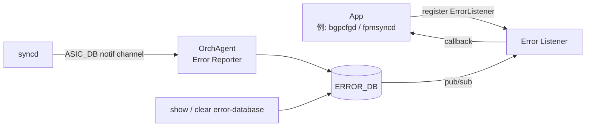

# Error Handling Framework 概念

このページは [Error Handling Framework（概要ハブ）](error-handling-framework-in-sonic.md) の派生で、**設計思想と概念** に絞る。CLI / ERROR_DB 確認は [error-handling-framework-in-sonic-operations.md](error-handling-framework-in-sonic-operations.md)、producer/consumer 内部実装は [error-handling-framework-in-sonic-internals.md](error-handling-framework-in-sonic-internals.md)、制限事項と乖離は [error-handling-framework-in-sonic-limitations.md](error-handling-framework-in-sonic-limitations.md) を参照。

## 1. 旧挙動と問題意識

従来 [syncd](../reference/glossary.md#term-syncd) は [SAI](../reference/glossary.md#term-sai) CREATE/SET 失敗を一律 fatal 扱いし [orchagent](../reference/glossary.md#term-orchagent) に shutdown を要求していた[^1]。これは [BGP](../reference/glossary.md#term-bgp) が出した route のうち 1 本だけが [ASIC](../reference/glossary.md#term-asic) リソース不足で reject されたケースでも全体を巻き込んで再起動するという、運用上著しく粗い挙動だった。

## 2. 設計の責務境界

本 framework の責務は **「SAI 失敗を app に伝える経路」** までで、retry / rollback / withdraw はあくまで app 側の責務[^1]。framework は次の 2 点だけを保証する:

1. **SAI 型 → ERROR_DB 型への翻訳** （OrchAgent が一手に担う）
2. **single notification channel での順序保証**

これにより、BGP は `ROUTE_TABLE` 失敗を受け取って announce 済み route を withdraw するなど、リカバリを app 側で実施できる。

## 3. データフロー全体像

- `OrchAgent` が **唯一の ERROR_DB producer**。SAI 失敗を受け、SAI 型 → ERROR_DB 型へ翻訳して書き込み + publish[^1]
- app は `ErrorListener` で table 名 / opcode (CREATE/DELETE/UPDATE) / 通知種別 (failure / success / both) を指定して register

## 4. 対象 table

初版で対応するのは `ROUTE_TABLE` と `NEIGH_TABLE`（BGP ユースケース駆動）[^1]。他 table は後付け拡張可能な設計。

## 5. Error code の抽象化

app は SAI 直接呼出しをしないため、SWSS 共通ライブラリで **SWSS error code を定義し SAI error code にマップ** する[^1]。下表は [HLD](../reference/glossary.md#term-hld) で定義された基本セット 8 種だが、実装の `sonic-swss-common/common/status_code_util.h L11-L25` enum には追加 7 種（`SWSS_RC_DEADLINE_EXCEEDED` / `SWSS_RC_PERMISSION_DENIED` / `SWSS_RC_INTERNAL` / `SWSS_RC_UNIMPLEMENTED` / `SWSS_RC_NOT_EXECUTED` / `SWSS_RC_FAILED_PRECONDITION` / `SWSS_RC_UNKNOWN`）も追加されており、合計 15 種が定義されている。詳細は limitations ページの「3. 行番号付きエビデンス」を参照。

| SWSS code | SAI status |
|-----------|-----------|
| `SWSS_RC_SUCCESS` | `SAI_STATUS_SUCCESS` |
| `SWSS_RC_INVALID_PARAM` | `SAI_STATUS_INVALID_PARAMETER` |
| `SWSS_RC_UNAVAIL` | `SAI_STATUS_NOT_SUPPORTED` |
| `SWSS_RC_NOT_FOUND` | `SAI_STATUS_ITEM_NOT_FOUND` |
| `SWSS_RC_NO_MEMORY` | `SAI_STATUS_NO_MEMORY` |
| `SWSS_RC_EXISTS` | `SAI_STATUS_ITEM_ALREADY_EXISTS` |
| `SWSS_RC_FULL` | `SAI_STATUS_TABLE_FULL` |
| `SWSS_RC_IN_USE` | `SAI_STATUS_OBJECT_IN_USE` |

この抽象化により app は SAI ヘッダに依存せず、`status_code_util.h` のみで失敗を分類できる。

## 6. positive ack の扱い

正常完了系は **デフォルトでは ERROR_DB に書かない**（メモリ節約）が、`ErrorListener` register 時に `ERR_NOTIFY_POSITIVE_ACK` を指定すれば通知だけ受け取れる[^1]。これにより app は「failure 通知だけ拾う」「成功も含めて全てを拾う」を選択できる。

## 関連ページ

- [Error Handling Framework（概要ハブ）](error-handling-framework-in-sonic.md)
- [error-handling-framework-in-sonic-operations.md](error-handling-framework-in-sonic-operations.md)
- [error-handling-framework-in-sonic-internals.md](error-handling-framework-in-sonic-internals.md)
- [error-handling-framework-in-sonic-limitations.md](error-handling-framework-in-sonic-limitations.md)

<!-- phase-boundary -->
## 実装フェーズ境界

!!! info "Phase 別の実装済 / 未実装 サマリ"
    本ページは `monitor: partially_implemented` で、HLD で示された一連の機能
    が **段階的に取り込まれている** 状態を扱う。フェーズ毎の実装境界を
    1 枚の表に集約する (詳細は本ページ上部の `diff` admonition および
    [discrepancy-index](../reference/verification/discrepancy-index.md) を参照)。

    | Phase | 範囲 (機能 / 段階) | 実装済 (master 取り込み済) | 未実装 (HLD 提案のみ) |
    |---|---|---|---|
    | Phase 1 — 基本機能 | HLD §概要 / §設計の中核ユースケース | 部分取り込み済 — `SWSS_RC_*` enum (`status_code_util.h`) のみ取り込み済み。ERROR_DB / ErrorListener / ErrorReporter / CLI は未実装（[制限事項](error-handling-framework-in-sonic-limitations.md) 参照） | ERROR_DB / ErrorListener / ErrorReporter / `show error-database` CLI — 未実装 |
    | Phase 2 — 拡張機能 | HLD §拡張 / §追加要件 / §周辺統合 | — | 未実装 / 未マージ — HLD §未対応箇所、本ページ「制限事項」および `diff` admonition の差分側に列挙 |
    | Phase 3 — 将来拡張 | HLD §Future Work / §将来課題 | — | 未実装 — HLD 提案段階。対応 PR は確認されていない (last_verified 時点) |

    凡例: 「実装済」=現行 master で動作確認できる範囲 / 「未実装」=HLD には記載があるが対応 PR が未マージまたは設計のみで code が存在しない範囲。
<!-- /phase-boundary -->

## 実装との乖離

`monitor: partially_implemented` — 部分実装 — HLD の中核は実装済みだが、フィールド / API / 制約のいくつかが上流に未取り込み、または挙動が緩和されている。 本ページは split-child のため、差分の主要根拠 / 影響 / 回避策は親ページ [Error Handling Framework 概念 親ページ](error-handling-framework-in-sonic.md) の同セクション（`## 実装との乖離` または `!!! diff` ブロック）を参照のこと。

## 引用元

[^1]: `sonic-net/SONiC` `doc/error-handling/error_handling_design_spec.md` @ `49bab5b5ff0e924f1ea52b3d9db0dfa4191a7c06`

<!-- next-action -->
## このページを読んだ後の次アクション

!!! tip "読み手向け"
    - **本機能を実運用で使う場合**: 取り込み済の部分のみ運用可能。欠落部分の利用は不可なので本文「実装との乖離」を確認した上で適用範囲を限定する
    - **upstream 動向を追う場合**: 関連 issue / PR を [sonic-net/SONiC](https://github.com/sonic-net/SONiC) で検索（HLD タイトル / CONFIG_DB テーブル名 / Orch クラス名で grep するのが速い）
    - **代替手段 / 関連 reference**: frontmatter `related` に列挙された関連テーブル / CLI / YANG、および [Reference 索引](../reference/index.md) を参照

!!! note "本ドキュメントの追跡"
    - monitor: `partially_implemented` / last_verified: `2026-05-11`
    - 次回再裏取りトリガ: quarterly。一覧は [discrepancy-index](../reference/verification/discrepancy-index.md) を参照（運用詳細は repo の `meta/discrepancy-operations.md`）

<!-- /next-action -->

<!-- glossary-links-injected: 167700005048 -->
